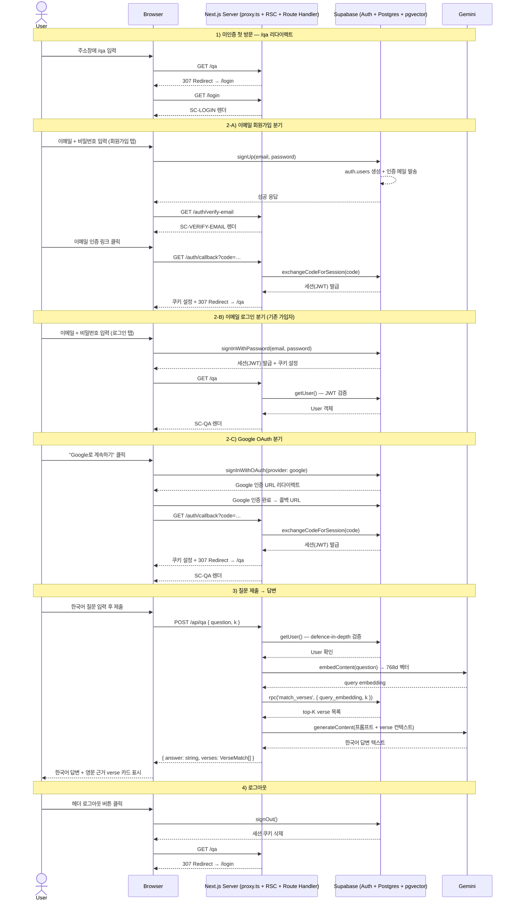
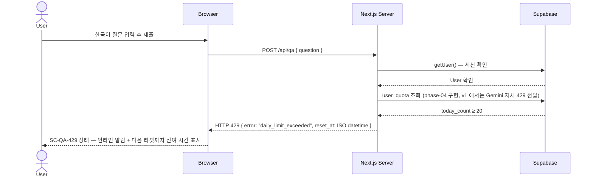
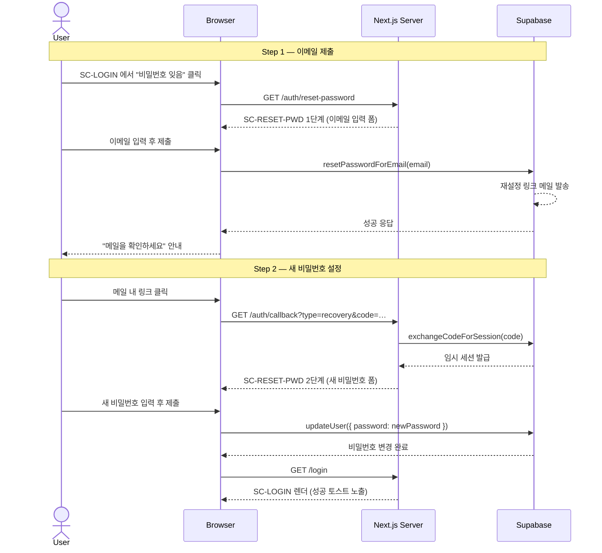
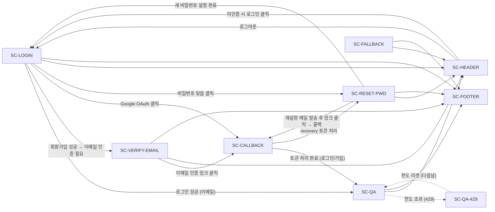

# logos-rag · v1 Design PRD

> **목적**: Open Design (오픈소스 AI 디자인 생성 도구) 가 화면 초안을 그릴 수 있는 수준의 명세서. 초안은 Figma 로 옮겨 정제한다.

| 항목 | 값 |
|---|---|
| **버전** | v1 (phase-03 + phase-04 quota UI 까지) |
| **작성일** | 2026-05-20 |
| **1차 독자** | 본인 + Open Design → Figma 정제 |
| **베이스라인** | shadcn/ui (Radix + Tailwind) · Next.js 16 App Router |
| **페르소나 우선순위** | a (포트폴리오 데모) > b (신앙인 일반) > c (신학생/연구자) |
| **JTBD** | "한국어로 던진 질문에 대해 영문 성경의 의미상 유사한 구절들을 근거로 한 한국어 답변을 받는다 — 신학적 권위가 아니라 *검색 + 요약 도구* 로서." |
| **화면 수** | 9 (SC-LOGIN / SC-CALLBACK / SC-VERIFY-EMAIL / SC-RESET-PWD / SC-QA / SC-QA-429 / SC-HEADER / SC-FOOTER / SC-FALLBACK) |

### 목차

1. [Product Context](#1-product-context)
2. [Target User & Job-to-be-Done](#2-target-user--job-to-be-done)
3. [User Flow](#3-user-flow)
4. [Screen Inventory](#4-screen-inventory)
5. [Per-Screen Spec](#5-per-screen-spec)
6. [Cross-cutting UX Rules](#6-cross-cutting-ux-rules)
7. [Visual Direction](#7-visual-direction)
8. [Non-goals / Out of Scope](#8-non-goals--out-of-scope)
9. [Acceptance Criteria](#9-acceptance-criteria--디자인-검수-체크리스트)
10. [부록 · 남은 결정 항목 (Aggregated Open Questions)](#부록--남은-결정-항목-aggregated-open-questions)

---

## 1. Product Context

logos-rag 는 "성경 구절을 어떻게 찾을까?"라는 오래된 탐색 문제를 의미 검색으로 재정의한 풀스택 RAG 포트폴리오다. 사용자가 한국어로 질문을 던지면 시스템은 WEB(World English Bible) 31,102개 verse 전체를 대상으로 의미상 가장 가까운 구절을 코사인 유사도로 찾고, 그 결과를 컨텍스트로 삼아 Gemini Flash 가 한국어 답변을 생성한다. 핵심은 한국어 질문과 영문 성경 텍스트 사이의 언어 장벽을 임베딩 공간에서 허물어—번역 없이—크로스링궐 검색을 가능하게 한다는 점이다.

v1 의 가치 제안은 단순하다. "신학적 권위를 주장하지 않는 검색 + 요약 도구." 스택은 Next.js 16 App Router · Supabase(Postgres + pgvector + Auth) · Gemini 임베딩 + Flash · Vercel 로 구성된다. 이 PRD 가 다루는 범위는 v1 유저 페이싱 UI 전체다: phase-03 의 인증·질문 입력·답변 렌더링 화면, 그리고 phase-04 의 일일 한도 UI 까지.

---

## 2. Target User & Job-to-be-Done

### 2.1 Primary Persona — 포트폴리오 데모 리뷰어

면접관·기술 리뷰어·채용 담당자가 링크를 받고 브라우저를 열었을 때가 이 페르소나의 진입 시점이다. 그들의 관심은 제품 자체보다 "이 개발자가 풀스택 RAG 를 어디까지 혼자 만들었는가"에 있다. 기대치는 두 가지다: 로딩 없이 빠르게 UI 가 뜨는가, 그리고 질문 입력 → AI 답변 흐름이 데모처럼 매끄럽게 돌아가는가.

디자인이 5초 안에 전달해야 할 신호: "이것은 성경 텍스트를 대상으로 한 AI 검색 + 답변 도구다." 그 이상의 설명을 읽히면 실패다. 히어로 영역 또는 플레이스홀더 텍스트 한 줄로 제품의 성격과 입력 방식을 동시에 전달해야 한다.

### 2.2 Secondary Persona — 신앙인 일반

큐티·묵상·예배 준비 중 떠오른 질문을 들고 들어오는 사용자다. 어떤 구절을 검색해야 할지 모르는 상태에서 한국어 구어체로 던지는 경우가 많다. "하나님이 세상을 사랑하신다는 구절 있나요?" 같은 형태.

디자인이 거부감을 주지 않으려면 세 가지를 지켜야 한다. 첫째, 답변 톤이 정중해야 한다—"검색 결과"가 아니라 근거 있는 설명처럼 읽혀야 한다. 둘째, verse 인용 표기(book chapter:verse + 영문 텍스트)가 정확하고 가독성 있게 표시되어야 한다. 셋째, "AI 생성이며 신학적 권위를 갖지 않습니다"라는 면책 표기가 자연스럽게 자리를 잡아 신뢰를 오히려 높여야 한다.

### 2.3 Tertiary Persona — 신학생 / 연구자

특정 주제어나 개념을 가지고 영문 원문을 비교하고 싶은 사용자다. 한국어 신학 용어를 입력해 WEB 영문 원문과 의미적으로 얼마나 가까운 구절이 나오는지 확인하려는 목적으로 사용한다.

이 페르소나가 필요한 정보는 두 가지다: verse 카드의 영문 텍스트 원문, 그리고 유사도 점수(또는 근거 verse 의 순위). 정보 위계 힌트: verse 카드에서 `book chapter:verse` 라벨을 시각적으로 두드러지게 처리하고, 유사도 점수를 카드 내부에 보조 정보로 노출하는 방식이 이 페르소나에게 가장 실용적이다.

### 2.4 Job-to-be-Done

> "한국어로 던진 질문에 대해 영문 성경의 의미상 유사한 구절들을 근거로 한 한국어 답변을 받는다 — 신학적 권위가 아니라 *검색 + 요약 도구* 로서."

왜 한국어로 질문하는가? 한국어 사용자가 자신의 언어로 자연스럽게 질문할 수 있어야 하기 때문이다. 번역의 부담을 도구가 흡수한다. 왜 영문 성경인가? WEB 는 100% 퍼블릭 도메인이고, 31,102개 verse 가 768차원 임베딩으로 적재되어 의미 검색의 데이터 기반이 이미 갖춰져 있다. 영문 원문 그대로 근거로 인용함으로써 출처 투명성을 확보한다. 왜 LLM 답변인가? 코사인 검색 결과는 verse 리스트일 뿐이다. 검색된 구절들을 연결하고 질문의 맥락에 맞게 설명하는 단계가 있어야 사용자가 실제로 읽을 수 있는 답변이 된다. Gemini Flash 는 그 조합·요약 레이어를 담당한다.

### 2.5 디자인 우선순위

디자인 위계는 a(포트폴리오 데모 리뷰어) 에 최적화하되, b(신앙인 일반)와 c(신학생/연구자)가 거부감을 갖지 않도록 설계한다. 구체적으로 이 위계는 다음과 같이 화면에 반영된다.

페이지 첫 진입(a 최적화): 과도한 온보딩이나 설명 없이 질문 입력창이 바로 중앙에 위치해야 한다. 플레이스홀더 텍스트 한 줄이 제품의 성격을 설명하고, 즉시 입력을 유도한다. 로딩 인디케이터와 에러 메시지는 명확하고 간결하게 처리해 데모 중 당황스러운 침묵이 없어야 한다.

답변 렌더링(b·c 포용): 한국어 답변 본문을 상단에, 영문 근거 verse 카드 목록을 하단에 배치한다. b 페르소나는 답변 본문만 읽고 만족할 수 있어야 하고, c 페르소나는 verse 카드에서 원문과 라벨(book chapter:verse)을 바로 확인할 수 있어야 한다. 톤은 차분·미니멀·텍스트 위주(shadcn/ui 베이스라인, Tailwind). 종교적 감수성을 고려해 과도한 색상 강조나 장식적 요소는 배제한다.

---

## 3. User Flow

### 3.1 메인 시나리오 — 미인증 첫 방문에서 답변까지

미인증 유저가 `logos-rag.vercel.app`(또는 로컬 `localhost:3000`)에 처음 접근하면, Next.js proxy(proxy.ts)가 `/qa` 경로를 보호 경로로 인식해 `/login`으로 307 리다이렉트한다. 유저는 SC-LOGIN 화면에서 이메일/비밀번호 회원가입 또는 Google OAuth 로그인을 선택한다. 이메일 가입 경로는 가입 직후 SC-VERIFY-EMAIL 화면으로 이동해 "메일함 확인" 안내를 받고, 이메일 링크 클릭 시 SC-CALLBACK을 거쳐 세션이 확립된다. Google OAuth 경로는 Supabase가 제공하는 OAuth 흐름 이후 SC-CALLBACK에서 동일하게 세션을 처리하고 `/qa`로 리다이렉트된다.

로그인에 성공한 유저는 SC-QA 화면에서 한국어 질문을 입력하고 제출한다. 클라이언트는 `POST /api/qa` 요청을 보내고, Next.js 서버는 세션 검증 → 질문 임베딩(Gemini) → cosine 유사 verse 검색(Supabase pgvector) → 프롬프트 조립 → Gemini Flash 한국어 답변 생성 순서로 처리한 뒤 `{ answer, verses[] }`를 반환한다. 클라이언트는 한국어 답변 본문과 영문 근거 verse 카드 목록을 SC-QA에 인라인으로 표시한다. 유저가 당일 질문 한도(20회, phase-04 구현 예정)를 초과하면 `/api/qa`가 429를 반환하고 SC-QA가 SC-QA-429 상태로 전환되어 잔여 시간을 안내한다. 비밀번호를 잊은 경우 SC-LOGIN에서 "비밀번호 잊음" 링크를 눌러 SC-RESET-PWD로 진입하는 분기가 별도로 존재한다.

### 3.2 Flow Diagram (Mermaid sequence)

#### 메인 플로우 — 첫 방문부터 답변까지

#### 분기 — 일일 한도 초과 (SC-QA-429)

#### 분기 — 비밀번호 재설정 (SC-RESET-PWD)

### 3.3 진입 매트릭스 — 어떤 상태로 어떤 URL 진입 시 무엇이 보이나

| 진입 URL | 인증 상태 | 결과 | 비고 |
|---|---|---|---|
| `/` | * | `/qa` 로 리다이렉트 | 루트는 별도 화면 없음 |
| `/qa` | 미인증 | `/login` 으로 307 redirect | proxy.ts 보호 매처 |
| `/qa` | 인증 | SC-QA 렌더 | 질문 폼 + 빈 답변 영역 |
| `/qa` (한도 초과 상태) | 인증 | SC-QA의 429 상태 (SC-QA-429) | `/api/qa` 429 응답 수신 후 인라인 전환 |
| `/login` | 미인증 | SC-LOGIN 렌더 | 로그인/회원가입 탭 |
| `/login` | 인증 | `/qa` 로 리다이렉트 | 이미 로그인된 상태 |
| `/auth/callback` | * (콜백 처리 중) | SC-CALLBACK 로딩 → 토큰 교환 완료 후 `/qa` 리다이렉트 | OAuth 및 매직링크 공통 처리 |
| `/auth/callback` (recovery) | * (비밀번호 재설정 토큰) | SC-RESET-PWD 2단계 (새 비밀번호 폼) | `type=recovery` 쿼리 파라미터로 구분 |
| `/auth/verify-email` | 미인증 | SC-VERIFY-EMAIL 렌더 | 회원가입 직후 진입 |
| `/auth/verify-email` | 인증 | `/qa` 로 리다이렉트 | 이미 인증된 상태 |
| `/auth/reset-password` | * | SC-RESET-PWD 1단계 (이메일 입력 폼) | 인증 여부 무관하게 접근 허용 |
| 존재하지 않는 경로 | * | SC-FALLBACK (404) | Next.js `not-found.tsx` |
| 서버 오류 발생 시 | * | SC-FALLBACK (500) | Next.js `error.tsx` |

---

## 4. Screen Inventory

### 4.1 화면 목록

| 화면 ID | 이름 | 경로 | 인증 필요 | 주 컴포넌트 (한 줄) |
|---|---|---|---|---|
| SC-LOGIN | 로그인 + 회원가입 (탭) | `/login` | X | 탭 전환 + 이메일/비밀번호 폼 + Google OAuth 버튼 |
| SC-CALLBACK | OAuth/매직링크 콜백 로딩 | `/auth/callback` | - | 스피너 + "인증 처리 중입니다" 안내 메시지 |
| SC-VERIFY-EMAIL | 이메일 인증 안내 | `/auth/verify-email` | X | 안내 카드 + 이메일 재전송 버튼 |
| SC-RESET-PWD | 비밀번호 재설정 | `/auth/reset-password` | X | 이메일 입력 폼 (1단계) → 새 비밀번호 폼 (2단계) 2-step |
| SC-QA | QA 메인 | `/qa` | O | textarea + 제출 버튼 + 답변 카드 + verse 카드 리스트 |
| SC-QA-429 | 일일 한도 초과 상태 | `/qa` sub-state | O | SC-QA 내 인라인 알림 배너 + 리셋까지 잔여 시간 표시 |
| SC-HEADER | 전역 헤더 | 모든 페이지 | - | 로고 + 잔여 한도 배지 + 유저 이메일 + 로그아웃 버튼 (미인증 시: 로그인 링크) |
| SC-FOOTER | 전역 푸터/면책 | 모든 페이지 | - | AI 생성 답변 면책 한 줄 + GitHub 링크 |
| SC-FALLBACK | 404 / 500 | 폴백 | - | 에러 메시지 + "홈으로" 버튼 |

### 4.2 화면 간 관계도 (Mermaid graph)

---

## 5. Per-Screen Spec

> 본 섹션은 디자인 도구(Open Design)가 화면 초안을 그릴 수 있을 정도의 구체성을 목표로 작성한다.
> 컴포넌트 어휘는 shadcn/ui 기준. 한국어 카피는 따옴표 안에 실제 문장으로 표기.
> 상태는 `default / loading / error.* / success.* / disabled / empty` 패턴으로 명시.

### 5.1 SC-LOGIN — 로그인 + 회원가입 (탭)

- **경로**: `/login`
- **인증 필요**: 아니오 (이미 인증된 사용자가 접근하면 `/qa` 로 307 redirect)
- **진입 조건**:
  - 미로그인 사용자가 `/qa` 직접 접근 → proxy.ts 가 307 redirect
  - 전역 헤더의 "로그인" 버튼 클릭
  - SC-RESET-PWD 에서 완료 후 "로그인 화면으로" 링크
- **핵심 목적**: 5초 안에 "어떻게 로그인/가입하지"가 명확해지고, 1분 안에 가입을 완료할 수 있어야 한다.

**레이아웃 의도**

뷰포트 수직 중앙 정렬. 배경은 앱 기본 배경(화이트/다크 모드 대응). 중앙에 `Card` 1개 (max-w-md, 패딩 넉넉하게 p-8). 카드 상단에 로고 워드마크 "logos-rag" + 한 줄 태그라인(선택). 그 아래 `Tabs` 2개("로그인" / "회원가입"). Google OAuth `Button`은 탭과 무관하게 Tabs 상단에 배치. Google 버튼 아래 `Separator`("또는 이메일로"). 그 아래 탭별 이메일/비밀번호 폼.

**컴포넌트** (shadcn/ui 어휘)

- `Card` (max-w-md, mx-auto, my-auto, 수직 중앙, rounded-xl, shadow-sm)
  - 카드 상단: 로고 텍스트 "logos-rag" (font-bold, text-xl) + 태그라인 "성경 의미 검색 · AI 답변" (text-sm text-muted-foreground)
- `Tabs` (defaultValue="login", values: `"login"` | `"signup"`)
  - `TabsList` + `TabsTrigger` × 2 ("로그인" / "회원가입")
- Google OAuth `Button` (variant=outline, full-width, 좌측에 Google 'G' 아이콘 SVG)
- `Separator` (텍스트 "또는 이메일로" 를 중앙에 가로 배치)
- 로그인 탭 (`TabsContent value="login"`):
  - `Label` + `Input` (type=email, id=email, placeholder="you@example.com")
  - `Label` + `Input` (type=password, id=password, placeholder="비밀번호")
  - 작은 텍스트 링크: "비밀번호를 잊으셨나요?" → `/auth/reset-password`
  - `Button` (type=submit, full-width, "로그인")
- 회원가입 탭 (`TabsContent value="signup"`):
  - `Label` + `Input` (type=email, id=signup-email, placeholder="you@example.com")
  - `Label` + `Input` (type=password, id=signup-password, placeholder="8자 이상")
  - `Label` + `Input` (type=password, id=signup-confirm, placeholder="비밀번호 확인")
  - `Checkbox` + `Label` (약관 동의 텍스트, 이용약관·개인정보방침 링크 포함)
  - `Button` (type=submit, full-width, "계정 만들기")
- `Alert` (폼 에러 시 폼 상단에 슬라이드인, variant=destructive 또는 default)

**한국어 Copy 드래프트**

- 로고 태그라인: "성경 의미 검색 · AI 답변"
- Tabs 라벨: "로그인" / "회원가입"
- Google 버튼: "Google 계정으로 계속하기"
- Separator 텍스트: "또는 이메일로"
- 이메일 Label: "이메일"
- 비밀번호 Label: "비밀번호"
- 비밀번호 확인 Label: "비밀번호 확인"
- 비밀번호 분실 링크: "비밀번호를 잊으셨나요?"
- 로그인 submit: "로그인"
- 회원가입 submit: "계정 만들기"
- 약관 체크박스: "이용약관 및 개인정보 처리방침에 동의합니다"
  - "이용약관" 과 "개인정보 처리방침" 은 각각 밑줄 링크 (현재는 더미 `#`)
- 에러(잘못된 자격증명): "이메일 또는 비밀번호가 올바르지 않습니다."
- 에러(미인증 이메일): "이메일 인증이 완료되지 않았습니다. 메일함을 확인해주세요."
- 에러(중복 이메일): "이미 가입된 이메일입니다. 로그인 탭에서 로그인해주세요."
- 에러(네트워크): "일시적인 오류가 발생했습니다. 잠시 후 다시 시도해주세요."
- 에러(이메일 형식): "유효한 이메일 주소를 입력해주세요."
- 에러(비밀번호 길이): "비밀번호는 8자 이상이어야 합니다."
- 에러(비밀번호 불일치): "비밀번호가 일치하지 않습니다."
- 에러(약관 미동의): "이용약관에 동의해주세요."

**상태**

- `default` — 탭 기본 표시, 폼 비어있음, 버튼 활성
- `loading` — submit 또는 Google 버튼 클릭 직후. `Button` 내부 `Loader2` 스피너 + 텍스트 그대로 유지, `disabled=true`. 폼 전체 pointer-events-none.
- `error.invalid-credentials` — 로그인 탭. 폼 상단 `Alert`(destructive): "이메일 또는 비밀번호가 올바르지 않습니다."
- `error.email-not-verified` — 로그인 탭. `Alert`(default, 아이콘=MailWarning): "이메일 인증이 완료되지 않았습니다. 메일함을 확인해주세요." + 인라인 버튼 "인증 메일 재전송" → SC-VERIFY-EMAIL 로 router.push
- `error.email-already-registered` — 회원가입 탭. `Alert`(default): "이미 가입된 이메일입니다." + 인라인 버튼 "로그인 탭으로 이동" → `setActiveTab("login")`
- `error.email-format` — 이메일 Input 아래 인라인 `p.text-destructive`: "유효한 이메일 주소를 입력해주세요."
- `error.password-too-short` — 비밀번호 Input 아래 인라인 메시지
- `error.password-mismatch` — 비밀번호 확인 Input 아래 인라인 메시지
- `error.terms-required` — Checkbox 옆 인라인 메시지: "이용약관에 동의해주세요."
- `error.network` — `Alert`(destructive): "일시적인 오류가 발생했습니다. 잠시 후 다시 시도해주세요."
- `success.signup` — 회원가입 성공 즉시 SC-VERIFY-EMAIL 로 `router.push('/auth/verify-email?email=...')`

**Edge Cases**

- 이메일 형식 클라이언트 검증 (blur 또는 submit 시)
- 비밀번호 8자 이상 클라이언트 검증 (회원가입 탭)
- 비밀번호 확인 불일치 클라이언트 검증 (회원가입 탭)
- Google OAuth 팝업을 닫거나 취소하면 SC-LOGIN 으로 복귀 (에러 없이 default 상태)
- 로딩 중 탭 전환 불가 (탭 비활성화)
- 이미 로그인된 상태로 `/login` 방문 시 즉시 `/qa` 로 redirect (서버 컴포넌트 또는 클라이언트 useEffect)

### 5.2 SC-CALLBACK — OAuth/매직링크 콜백 로딩

- **경로**: `/auth/callback` (Route Handler, 브라우저 렌더링 없이 서버측 처리 후 redirect)
- **인증 필요**: 아니오 (콜백 자체가 인증 완료 과정)
- **진입 조건**:
  - Google OAuth 흐름: Supabase → Google 로그인 → Supabase 콜백 URL → `/auth/callback?code=...`
  - 이메일 매직링크 또는 이메일 확인 링크 클릭 → `/auth/callback?token_hash=...&type=email`
- **핵심 목적**: 수초 안에 코드/토큰을 교환하고 세션 쿠키를 설정한 뒤 `/qa` 로 넘어가는 것. 사용자는 이 화면을 거의 의식하지 못해야 한다.

**레이아웃 의도**

Route Handler(`app/auth/callback/route.ts`)가 서버에서 처리 후 redirect 하므로 사용자에게 실제로 보이는 HTML 은 최소화. 단, 처리 지연(예: 네트워크 느림)이나 에러 시를 대비해 `app/auth/callback/page.tsx` 를 fallback 로딩 화면으로 제공한다. 뷰포트 수직 중앙. 로고 + 로딩 스피너 + 한 줄 메시지.

**컴포넌트** (shadcn/ui 어휘)

- 배경: 앱 기본 배경
- 중앙 컨테이너 (flex-col, items-center, gap-4)
  - 로고 워드마크 "logos-rag" (text-lg, font-semibold)
  - `Loader2` 아이콘 (animate-spin, w-6 h-6, text-muted-foreground)
  - `p` 로딩 메시지 (text-sm, text-muted-foreground)
- 에러 상태 시:
  - `Alert` (variant=destructive, 아이콘=AlertCircle) + 에러 메시지
  - `Button` (variant=outline, "로그인 화면으로 돌아가기") → `/login`

**한국어 Copy 드래프트**

- 로딩 메시지(default): "로그인 처리 중입니다..."
- 에러(코드 만료): "인증 링크가 만료되었습니다. 다시 시도해주세요."
- 에러(코드 무효): "유효하지 않은 인증 요청입니다."
- 에러(일반): "인증 처리 중 오류가 발생했습니다."
- 에러 공통 CTA: "로그인 화면으로 돌아가기"

**상태**

- `default` (= `loading`) — 스피너 + "로그인 처리 중입니다..." Route Handler 정상 동작 시 사용자는 이 상태를 0~1초 목격
- `error.code-expired` — `Alert`(destructive): "인증 링크가 만료되었습니다. 다시 시도해주세요." + CTA
- `error.code-invalid` — `Alert`(destructive): "유효하지 않은 인증 요청입니다." + CTA
- `error.network` — `Alert`(destructive): "인증 처리 중 오류가 발생했습니다." + CTA
- `success` — Route Handler 가 즉시 `/qa` 로 redirect, 이 상태는 사용자에게 보이지 않음

**Edge Cases**

- Route Handler 없이 page.tsx 만 방문(URL 직접 입력): 로딩 화면 표시 → 쿼리 파라미터 없으면 즉시 `/login` redirect
- `code` 파라미터와 `token_hash` 파라미터가 동시에 있는 경우: `code` 우선 처리 (Supabase 권장)
- 콜백 처리 중 세션 쿠키 설정 실패 (서드파티 쿠키 차단): 에러 상태 → 안내 메시지 ("브라우저의 쿠키 설정을 확인해주세요")
- 이미 로그인된 상태로 `/auth/callback` 에 도달하면 `/qa` 로 바로 redirect

### 5.3 SC-VERIFY-EMAIL — 이메일 인증 안내

- **경로**: `/auth/verify-email`
- **인증 필요**: 아니오
- **진입 조건**:
  - SC-LOGIN 회원가입 성공 직후 `router.push('/auth/verify-email?email=...')`
  - SC-LOGIN 의 `error.email-not-verified` 상태에서 "인증 메일 재전송" 클릭
- **핵심 목적**: 사용자가 메일함을 확인하도록 명확히 안내하고, 인증 메일을 못 받은 경우 재전송 수단을 제공한다.

**레이아웃 의도**

뷰포트 수직 중앙. `Card` (max-w-md, mx-auto). 카드 상단에 메일 아이콘(MailCheck, w-12 h-12, text-primary). 제목 + 설명 텍스트. 재전송 버튼 (60초 쿨다운). 하단에 "다른 이메일로 가입" 링크.

**컴포넌트** (shadcn/ui 어휘)

- `Card`
  - `MailCheck` 아이콘 (w-12 h-12, mx-auto, text-primary, mb-4)
  - `CardTitle` ("이메일을 확인해주세요")
  - `CardDescription` (이메일 주소 강조 + 안내 문장)
  - `Button` (full-width, "인증 메일 재전송") — 쿨다운 60초, 비활성 시 카운트다운 표시
  - `Separator`
  - `p.text-sm` + 링크 ("다른 이메일로 가입하기" → `/login?tab=signup`)
  - `p.text-sm` + 링크 ("이미 로그인 화면으로" → `/login`)
- 재전송 성공 시: `Toast` (variant=default, "인증 메일을 재전송했습니다.")
- 재전송 실패 시: `Toast` (variant=destructive, 에러 메시지)

**한국어 Copy 드래프트**

- 카드 제목: "이메일을 확인해주세요"
- 카드 설명: "`[이메일 주소]`로 인증 메일을 보냈습니다. 메일함을 확인하고 인증 링크를 클릭해주세요."
- 부가 설명: "메일이 보이지 않으면 스팸 폴더를 확인해보세요."
- 재전송 버튼 (활성): "인증 메일 재전송"
- 재전송 버튼 (쿨다운 중): "재전송 가능 (43초)" (초 단위 카운트다운)
- 재전송 Toast 성공: "인증 메일을 재전송했습니다. 메일함을 확인해주세요."
- 재전송 Toast 실패: "메일 재전송에 실패했습니다. 잠시 후 다시 시도해주세요."
- 구분선 아래 링크1: "다른 이메일로 가입하기"
- 구분선 아래 링크2: "로그인 화면으로"

**상태**

- `default` — 이메일 표시 + 재전송 버튼 활성
- `loading.resend` — 재전송 버튼 내 스피너 + `disabled=true`
- `success.resend` — Toast(default) + 버튼 60초 쿨다운 재시작
- `error.resend` — Toast(destructive) + 버튼 활성 유지
- `cooldown` — 버튼 `disabled=true`, 라벨 "재전송 가능 (N초)", 초 단위 카운트다운

**Edge Cases**

- URL 에 `?email=` 파라미터가 없으면 이메일 표시 부분은 "등록하신 이메일" 로 대체
- 쿨다운 도중 페이지 새로고침 → 쿨다운 초기화 (localStorage 저장은 v1 이후)
- 이미 인증 완료된 상태로 이 페이지 방문 → `/qa` redirect (Supabase getUser 로 확인)

### 5.4 SC-RESET-PWD — 비밀번호 재설정 (2 step)

- **경로**: `/auth/reset-password`
- **인증 필요**: 아니오 (Step 1). Step 2 는 이메일 링크의 토큰을 가진 URL 로만 진입 가능.
- **진입 조건**:
  - SC-LOGIN 의 "비밀번호를 잊으셨나요?" 링크 클릭 → Step 1
  - 이메일 속 재설정 링크 클릭 → `/auth/callback?type=recovery&...` → `/auth/reset-password?step=2` (또는 Supabase 가 hash fragment 사용)
- **핵심 목적**: 이메일을 입력하면 재설정 링크를 받고, 링크에서 새 비밀번호를 설정해 로그인할 수 있어야 한다.

**레이아웃 의도**

뷰포트 수직 중앙. `Card` (max-w-md). Step 1 과 Step 2 를 같은 경로에서 URL 파라미터 또는 상태로 분기. 각 Step 은 `Card` 안에 제목 + 입력 폼 + 버튼.

**Step 1: 이메일 입력**

컴포넌트:
- `CardTitle` ("비밀번호 재설정")
- `CardDescription` ("가입한 이메일 주소를 입력하면 재설정 링크를 보내드립니다.")
- `Label` + `Input` (type=email, placeholder="you@example.com")
- `Button` (full-width, "재설정 링크 보내기")
- 하단 링크: "로그인 화면으로" → `/login`
- 제출 성공 시 카드 전체가 완료 뷰로 교체 (폼 숨김):
  - `MailCheck` 아이콘 + "재설정 링크를 이메일로 보냈습니다." + 60초 재전송 버튼

**Step 2: 새 비밀번호 입력** (이메일 링크 클릭 후 도달)

컴포넌트:
- `CardTitle` ("새 비밀번호 설정")
- `Label` + `Input` (type=password, placeholder="새 비밀번호 (8자 이상)")
- `Label` + `Input` (type=password, placeholder="비밀번호 확인")
- `Button` (full-width, "비밀번호 변경")
- 변경 성공 시: `Toast`(default, "비밀번호가 변경되었습니다.") + `/login` 으로 `router.push`
- 토큰 검증 실패 상태: 폼 대신 `Alert`(destructive) + CTA "로그인 화면으로"

**한국어 Copy 드래프트**

- Step 1 제목: "비밀번호 재설정"
- Step 1 설명: "가입한 이메일 주소를 입력하면 재설정 링크를 보내드립니다."
- Step 1 이메일 Label: "이메일"
- Step 1 submit: "재설정 링크 보내기"
- Step 1 완료 메시지: "재설정 링크를 이메일로 보냈습니다. 메일함을 확인해주세요."
- Step 1 부가: "메일이 보이지 않으면 스팸 폴더를 확인해보세요."
- Step 1 재전송 버튼 (쿨다운): "재전송 가능 (N초)"
- Step 2 제목: "새 비밀번호 설정"
- Step 2 새 비밀번호 Label: "새 비밀번호"
- Step 2 비밀번호 확인 Label: "비밀번호 확인"
- Step 2 submit: "비밀번호 변경"
- Step 2 성공 Toast: "비밀번호가 변경되었습니다. 새 비밀번호로 로그인해주세요."
- Step 2 에러(토큰 만료): "재설정 링크가 만료되었습니다. 다시 요청해주세요."
- Step 2 에러(토큰 무효): "유효하지 않은 재설정 링크입니다."
- Step 2 에러(불일치): "비밀번호가 일치하지 않습니다."
- Step 2 에러(짧은 비번): "비밀번호는 8자 이상이어야 합니다."
- 공통 CTA: "로그인 화면으로"

**상태**

- `step1.default` — 이메일 입력 폼 활성
- `step1.loading` — 버튼 스피너 + `disabled`, 폼 `pointer-events-none`
- `step1.success` — 폼 숨김, 완료 뷰(MailCheck 아이콘 + 메시지 + 재전송 버튼)
- `step1.error.network` — `Alert`(destructive) 폼 상단
- `step1.cooldown` — 재전송 버튼 카운트다운
- `step2.default` — 새 비밀번호 입력 폼 활성
- `step2.loading` — 버튼 스피너 + `disabled`
- `step2.success` — Toast 표시 + `/login` redirect
- `step2.error.token-expired` — 폼 숨김, `Alert`(destructive) + "다시 요청하기" → Step 1 초기화
- `step2.error.token-invalid` — 폼 숨김, `Alert`(destructive) + CTA "로그인 화면으로"
- `step2.error.password-mismatch` — 비밀번호 확인 Input 아래 인라인 에러
- `step2.error.password-too-short` — 비밀번호 Input 아래 인라인 에러
- `step2.error.network` — `Alert`(destructive) 폼 상단

**Edge Cases**

- Step 2 URL 을 토큰 없이 직접 방문 → `step2.error.token-invalid` 상태 표시
- Supabase 재설정 링크 만료 기간(기본 1시간) — 안내 문구에 명시 여부(부록 Open Questions)
- 비밀번호 변경 성공 후 이전에 활성화된 세션이 있으면 Supabase 가 자동 무효화 — UI 에서 별도 처리 불필요

### 5.5 SC-QA — QA 메인 (가장 중요)

- **경로**: `/qa`
- **인증 필요**: 예 (미인증 시 proxy.ts 가 `/login` 으로 307 redirect)
- **진입 조건**:
  - 로그인 성공 후 자동 redirect
  - 헤더 로고 클릭 (로그인 상태)
  - 직접 URL 접근 (로그인 상태)
- **핵심 목적**: 사용자가 한국어로 질문을 입력하고 5~15초 내에 한국어 AI 답변 + 근거 영문 verse 카드 5건을 받는다. 포트폴리오 리뷰어에게는 "AI 성경 검색 도구"임을 한눈에 전달한다.

**레이아웃 의도**

전체 레이아웃: 상단 `SC-HEADER` → 중앙 메인 컨텐츠 영역 (max-w-2xl, mx-auto, px-4) → 하단 `SC-FOOTER`.

메인 영역 구성 (위에서 아래):
1. 페이지 타이틀 블록 — "성경에서 답을 찾아보세요" (h1, text-2xl, font-semibold) + 부제 (text-sm, text-muted-foreground)
2. 질문 입력 블록 — `Textarea` (자동 확장) + 하단 바 (글자수 + 제출 `Button`)
3. 답변 영역 — 질문 제출 전은 empty, 로딩 중은 Skeleton, 완료 시 답변 `Card` + verse 카드 목록

SPA 패턴: 페이지 이동 없이 동일 URL 에서 답변 영역만 업데이트. **이전 답변은 새 질문 제출 시 덮어쓴다** (최근 1건만 표시, 히스토리 없음). 사용자가 과거 답변을 보고 싶으면 새로 질문해야 한다. (히스토리 스크롤은 v1.5 이후)

타이포그래피 대비:
- 한국어 UI/답변: Pretendard 또는 시스템 sans-serif (기본 Next.js 설정 따름)
- 영문 verse 본문: `font-serif` (Tailwind) — Source Serif 4 또는 Georgia fallback

**컴포넌트** (shadcn/ui 어휘)

질문 입력 블록:
- `Textarea` (id=question, rows=3~auto, max-rows=10, resize=none, placeholder="한국어로 자유롭게 질문해주세요 (예: 하나님이 세상을 만든 이야기 알려줘)")
- 입력 바 하단 flex row:
  - 좌측: `span.text-sm.text-muted-foreground` 글자수 표시 (예: "47 / 500")
  - 우측: `Button` (type=submit, "질문하기", 아이콘 `Send` 우측)
- Cmd/Ctrl+Enter 키보드 단축키로 제출 (hint 텍스트: "⌘+Enter 로 제출")
- 500자 초과 시 글자수 텍스트 `text-destructive`, 버튼 `disabled`

답변 영역 — empty state (질문 전):
- 중앙 정렬 아이콘 (`BookOpen`, w-10 h-10, text-muted-foreground/40) + 텍스트 "질문을 입력하면 성경 구절을 찾아 답변드립니다."

답변 영역 — loading state:
- `Skeleton` 3줄 (답변 본문 대리) — 높이 h-4, 너비 가변 (100%, 90%, 75%), gap-2, animate-pulse
- 로딩 라벨: `p.text-sm.text-muted-foreground` + `Loader2` 아이콘 (animate-spin, w-4) "답변 생성 중... (5~15초 소요)"
- verse 영역 Skeleton: `Skeleton` × 5 (각 h-16)

답변 영역 — success state:
- `Card` (답변 카드)
  - `CardHeader`: 질문 텍스트 재표시 (text-sm, text-muted-foreground, italic, "Q: [질문내용]")
  - `CardContent`: 답변 본문 (한국어, `prose prose-sm` 스타일, font-sans, whitespace-pre-wrap)
- "근거 구절" 섹션 제목 (`h3`, text-sm, font-semibold, text-muted-foreground, "근거 구절 · 5건")
- verse 카드 목록 (5개, `ul` or `div.space-y-2`):
  - 각 verse 카드: `Card` (variant=outline 또는 소형 박스, p-3)
    - 상단 바: `Badge` (variant=secondary, "[Book Ch:V]" 예: "Genesis 1:1") + (선택) 유사도 점수 `span.text-xs.text-muted-foreground` (예: "0.87")
    - 본문: `p.text-sm.font-serif.leading-relaxed` "In the beginning God created the heavens and the earth."
    - 유사도 점수는 개발 모드 또는 URL 파라미터 `?debug=1` 일 때만 노출 (기본 숨김)

답변 영역 — error states:
- `Alert` (variant=destructive, 아이콘=AlertCircle) + 에러 메시지 + (필요 시) "다시 시도" 버튼

잔여 한도 표시:
- SC-HEADER 우측의 `Badge`("N / 20") 를 단일 표시 위치로 사용
- SC-QA 본문 내에는 잔여 한도를 중복 표시하지 않음
- 예외: 잔여가 0인 경우(SC-QA-429 상태) 질문 블록 위에 `Alert` 배너로 추가 표시

**한국어 Copy 드래프트**

- 페이지 h1: "성경에서 답을 찾아보세요"
- 페이지 부제: "한국어로 질문하면 AI가 성경 구절을 찾아 답변드립니다."
- Textarea placeholder: "한국어로 자유롭게 질문해주세요 (예: 하나님이 세상을 만든 이야기 알려줘)"
- 글자수 힌트: "⌘+Enter 로 제출"
- Submit 버튼: "질문하기"
- Empty state: "질문을 입력하면 성경 구절을 찾아 답변드립니다."
- Loading 라벨: "답변 생성 중... (5~15초 소요)"
- 근거 섹션 제목: "근거 구절 · 5건"
- 답변 카드 Q 라벨: "Q:"
- 에러(Gemini 429): "AI 서비스가 일시적으로 혼잡합니다. 잠시 후 다시 시도해주세요."
- 에러(결과 없음): "관련 성경 구절을 찾지 못했습니다. 질문을 다르게 표현해보세요."
- 에러(일반): "답변 생성 중 오류가 발생했습니다. 잠시 후 다시 시도해주세요."
- 에러(네트워크): "네트워크 연결을 확인해주세요."
- 에러 공통 CTA: "다시 시도"
- 빈 입력 가드 (버튼 비활성 + 툴팁): "질문을 입력해주세요."

**상태**

- `default` (= `empty`) — Textarea 비어있음, Submit 버튼 `disabled`, 답변 영역 empty state 아이콘 표시
- `typing` — Textarea 에 텍스트 있음, Submit 버튼 활성, 글자수 업데이트
- `typing.over-limit` — 500자 초과, 글자수 `text-destructive`, Submit 버튼 `disabled`
- `submitting` — `useMutation` isPending. Textarea + 버튼 `disabled`. 답변 영역 Skeleton + 로딩 라벨. 이전 답변 영역 페이드아웃 후 Skeleton.
- `success` — 답변 카드 + verse 카드 5건 표시. Textarea 는 내용 유지 (사용자가 수정해 재질문 가능).
- `error.gemini-429` — `Alert`(destructive): "AI 서비스가 일시적으로 혼잡합니다..." + "다시 시도" 버튼
- `error.gemini-other` — `Alert`(destructive): "답변 생성 중 오류가 발생했습니다..." + "다시 시도" 버튼
- `error.no-results` — `Alert`(default, 아이콘=Search): "관련 성경 구절을 찾지 못했습니다..."
- `error.network` — `Alert`(destructive): "네트워크 연결을 확인해주세요." + "다시 시도" 버튼
- `error.401` — Toast(destructive): "세션이 만료되었습니다." + `/login` redirect (useEffect)
- `disabled.quota-exceeded` — SC-QA-429 상태 (5.6 참조)

**Edge Cases**

- Textarea 에 줄바꿈 다수 입력 시 max-rows=10 이후 스크롤 (overflow-y-auto)
- 제출 중 브라우저 탭 닫기 → 미완료 상태로 종료 (별도 처리 없음)
- 응답 15초 초과 시 클라이언트 timeout + `error.gemini-other` 상태 표시 (TanStack Query timeout 설정)
- verse 카드의 영문 텍스트가 매우 길 경우 (`line-clamp-4` 로 제한, 마우스 오버 시 전체 표시 — 선택)
- 이미 submitting 상태에서 Cmd+Enter 재시도 → 무시 (버튼 disabled 이므로 자동 방어)
- 모바일: Textarea 포커스 시 소프트 키보드 올라옴 → 레이아웃 스크롤 가능하도록 min-h-screen 없이 처리

### 5.6 SC-QA-429 — 일일 한도 초과 상태

- **경로**: `/qa` (SC-QA 의 sub-state)
- **인증 필요**: 예
- **진입 조건**:
  - 오늘의 20회 한도를 모두 소진한 상태에서 `/qa` 접근
  - SC-QA 에서 질문 제출 결과가 HTTP 429 인 경우
- **핵심 목적**: 사용자가 한도 초과를 명확히 인지하고, 언제 초기화되는지 알 수 있어야 한다. 좌절감을 최소화하되 무단 사용은 막는다.

**레이아웃 의도**

SC-QA 레이아웃 그대로 유지. 질문 입력 블록 위에 `Alert` 배너가 추가된다. Textarea 와 Submit 버튼은 `disabled`. 답변 영역은 empty state(아이콘 + 안내 메시지). 헤더 Badge 는 "0 / 20" + 배지 색상 변경(primary → destructive variant).

**컴포넌트** (shadcn/ui 어휘)

- SC-HEADER 의 `Badge`: variant=destructive, 텍스트 "0 / 20"
- 질문 블록 위 `Alert` 배너 (variant=default, border-amber-300 또는 amber 계열, 아이콘=Clock):
  - `AlertTitle`: "오늘의 사용량을 모두 소진했습니다"
  - `AlertDescription`: 안내 문장 + 초기화 시각
- `Textarea` — `disabled=true`, `bg-muted` 색상
- `Button` (Submit) — `disabled=true`, `cursor-not-allowed`
- 답변 영역: empty state 아이콘 + 초기화 안내 문구

**한국어 Copy 드래프트**

- Alert 제목: "오늘의 사용량을 모두 소진했습니다"
- Alert 설명: "하루 20회 한도를 모두 사용했습니다. 한국 시각 자정(00:00 KST)에 초기화됩니다."
- 부가 문구: "내일 다시 질문해주세요. 더 많은 기능은 추후 업데이트될 예정입니다."
- 헤더 Badge: "0 / 20"
- 답변 영역 빈 상태: "오늘은 더 이상 질문할 수 없습니다. 자정 이후 다시 시도해주세요."
- Textarea placeholder (disabled 상태): "오늘 사용 가능한 질문 횟수를 모두 사용했습니다."

**상태**

- `quota-exceeded` — Alert 배너 노출, Textarea disabled, Submit 버튼 disabled, 헤더 Badge destructive
- (SC-QA 의 다른 상태는 모두 이 sub-state 에서 비활성화됨)

**Edge Cases**

- 한도 초과 상태에서 자정을 넘긴 경우 → 페이지 새로고침 시 SC-QA 기본 상태로 복귀 (서버에서 quota 재확인)
- 429 응답이 Gemini Flash 자체 한도(서비스 429)인지, 앱 일일 한도(user_quota 429)인지 구분 — phase-03 에서는 두 경우 모두 "잠시 후 다시 시도" 로 통일, phase-04 에서 user_quota 구현 시 메시지 분기
- 현재 phase-03 에서 user_quota 테이블은 미구현 (phase-04 예정). 따라서 SC-QA-429 는 Gemini API 429 에러 응답을 받은 경우의 임시 UI로만 동작하며, 정확한 20회 카운트는 phase-04 이후.

### 5.7 SC-HEADER — 전역 헤더

- **경로**: 모든 페이지에 `app/layout.tsx` 에서 렌더링
- **인증 필요**: 헤더 자체는 없음. 인증 상태에 따라 내용 분기.
- **핵심 목적**: 어느 페이지에 있든 앱 정체성(로고)이 보이고, 인증 상태와 잔여 한도를 즉시 확인할 수 있어야 한다.

**레이아웃 의도**

전체 너비, 얇은 하단 border (`border-b`). 내부 `max-w-2xl mx-auto` 컨테이너. 좌우 flex row, items-center. 좌측: 로고 링크. 우측: 인증 상태별 컨트롤. 높이: h-14. sticky top-0, z-50, bg-background/95, backdrop-blur-sm.

**컴포넌트** (shadcn/ui 어휘)

공통:
- `header` 요소 (sticky, border-b, bg-background/95, backdrop-blur)
- 내부 `div` (max-w-2xl, mx-auto, px-4, h-14, flex, items-center, justify-between)

좌측 — 로고:
- `Link` href="/qa" (로그인 상태) 또는 href="/" (미로그인 시 — 현재 `/qa` 가 보호 경로이므로 미로그인이면 `href="/login"` 가능)
  - 워드마크 텍스트 "logos-rag" (font-bold, text-lg, tracking-tight)
  - (선택) 태그라인 "성경 AI 검색" (text-xs, text-muted-foreground, hidden sm:block)

우측 — 미인증 상태:
- `Button` (variant=default 또는 outline, size=sm, "로그인") → `/login`

우측 — 인증 상태:
- `Badge` (variant=secondary, 잔여 한도 "18 / 20")
  - 한도 0 이면 variant=destructive ("0 / 20")
  - 모바일(sm 미만): Badge 대신 숫자만 + `Flame` 또는 `Zap` 아이콘 (작은 크기)
- `DropdownMenu`:
  - `DropdownMenuTrigger`: `Button`(variant=ghost, size=icon) + `User` 아이콘 (또는 이니셜 `Avatar`)
  - `DropdownMenuContent`:
    - `DropdownMenuLabel`: 사용자 이메일 (text-sm, text-muted-foreground, non-interactive)
    - `DropdownMenuSeparator`
    - `DropdownMenuItem`: "로그아웃" (아이콘 `LogOut`) → Supabase signOut + `/login` redirect

**한국어 Copy 드래프트**

- 로고 워드마크: "logos-rag"
- 로고 태그라인 (데스크톱): "성경 AI 검색"
- 미인증 버튼: "로그인"
- 잔여 한도 Badge: "[N] / 20"
- DropdownMenu 이메일: 사용자 이메일 표시 (예: "user@example.com")
- DropdownMenuItem: "로그아웃"
- 로그아웃 완료 Toast: "로그아웃했습니다."

**상태**

- `unauthenticated` — 로고 + "로그인" 버튼만 표시
- `authenticated.normal` — 로고 + Badge("N / 20", secondary) + DropdownMenu
- `authenticated.quota-near` — Badge 색상 경고 변경 기준 (예: 잔여 3 이하 → variant=warning 또는 amber 커스텀). 부록 Open Questions.
- `authenticated.quota-zero` — Badge variant=destructive ("0 / 20")
- `loading.signout` — DropdownMenu 아이템 클릭 후 서버 signOut 중: 버튼 스피너, DropdownMenu 닫힘

**Edge Cases**

- 잔여 한도 데이터가 아직 로드되지 않은 경우: Badge 를 `Skeleton` (w-12 h-5) 으로 표시
- 헤더가 sc-login, sc-callback, sc-verify-email, sc-reset-pwd 에서도 렌더링되는지 — 인증 관련 페이지에서는 헤더를 숨기거나 로고만 표시하는 심플 헤더로 변형하는 것이 UX 상 더 깔끔함. 부록 Open Questions.
- 모바일 (< 640px): 태그라인 숨김, Badge 아이콘+숫자 최소화, DropdownMenu 유지

### 5.8 SC-FOOTER — 전역 푸터 / 면책

- **경로**: 모든 페이지에 `app/layout.tsx` 에서 렌더링
- **인증 필요**: 없음
- **핵심 목적**: AI 답변의 신학적 권위 없음을 면책하고, GitHub 링크와 버전을 표기한다. 시각적으로 최소화.

**레이아웃 의도**

전체 너비. 내부 max-w-2xl mx-auto. 단일 행 또는 2행 (모바일 줄바꿈). 텍스트는 text-xs, text-muted-foreground. 상단 border-t. 패딩 py-4. flex row wrap, items-center, justify-between (또는 justify-center gap-x-4).

**컴포넌트** (shadcn/ui 어휘)

- `footer` 요소 (border-t, py-4)
- 내부 flex row (max-w-2xl, mx-auto, px-4, flex-wrap, gap-x-4, gap-y-1, items-center, justify-between)
  - 좌측/중앙: `p.text-xs.text-muted-foreground` — 면책 문구
  - 우측: `a.text-xs.text-muted-foreground.hover:underline` GitHub 링크 + `span` 버전 표기

**한국어 Copy 드래프트**

- 면책 문구: "이 답변은 AI가 생성하며 신학적 권위를 갖지 않습니다."
- GitHub 링크 텍스트: "GitHub"
- 버전 표기: "v1"
- 전체 1줄 예시: "이 답변은 AI가 생성하며 신학적 권위를 갖지 않습니다. · GitHub · v1"

**상태**

- `default` — 항상 동일 (상태 변화 없음)

### 5.9 SC-FALLBACK — 404 / 500

- **경로**: Next.js App Router `app/not-found.tsx` (404), `app/error.tsx` (500/런타임 에러)
- **인증 필요**: 없음
- **진입 조건**:
  - 404: 존재하지 않는 경로 접근
  - 500: 서버 컴포넌트 런타임 에러, API Route 미처리 예외
- **핵심 목적**: 길을 잃은 사용자가 빠르게 앱으로 복귀할 수 있도록 명확한 안내와 CTA를 제공한다.

**레이아웃 의도**

뷰포트 수직 중앙 정렬. 상단 SC-HEADER, 하단 SC-FOOTER 포함. 중앙 컨테이너 (max-w-sm, text-center). 큰 에러 코드 숫자 + 짧은 메시지 + CTA 버튼.

**컴포넌트** (shadcn/ui 어휘)

- 중앙 `div` (flex-col, items-center, gap-4, text-center, py-20)
  - `p.text-8xl.font-bold.text-muted-foreground/20` — 큰 숫자 ("404" 또는 "500")
  - `h1.text-xl.font-semibold` — 에러 제목
  - `p.text-sm.text-muted-foreground` — 부가 메시지
  - `Button` (variant=default, "홈으로") → `/qa` (로그인 상태) 또는 `/login` (미로그인)
  - (500 전용) `p.text-xs.text-muted-foreground` — 오류 ID (선택, 부록 Open Questions)
  - (500 전용) `Button` (variant=outline, "새로고침") — `window.location.reload()`

**한국어 Copy 드래프트**

- 404 큰 숫자: "404"
- 404 제목: "페이지를 찾을 수 없습니다"
- 404 메시지: "요청하신 페이지가 존재하지 않거나 이동되었습니다."
- 404 CTA: "홈으로"
- 500 큰 숫자: "500"
- 500 제목: "서버 오류가 발생했습니다"
- 500 메시지: "잠시 후 다시 시도해주세요."
- 500 CTA 1: "새로고침"
- 500 CTA 2: "홈으로"
- (선택) 오류 ID 라벨: "오류 ID:"

**상태**

- `not-found` (404) — 숫자 "404" + 제목 + 메시지 + "홈으로" 버튼
- `server-error` (500) — 숫자 "500" + 제목 + 메시지 + "새로고침" 버튼 + "홈으로" 버튼
- (500의 경우) `server-error.with-debug` — 오류 ID 추가 표시 (개발 환경 또는 `?debug=1` 시)

**Edge Cases**

- 미로그인 상태에서 404/500 발생 → "홈으로" 버튼이 `/login` 으로 연결
- `app/error.tsx` 는 Client Component 필수 (`"use client"` + `reset` prop 수신) — "새로고침" 버튼이 `reset()` 호출로 처리
- 전역 헤더가 에러 상태에서 렌더링되지 않을 경우(상위 layout 에러) → 최소 헤더 포함 fallback UI

---

## 6. Cross-cutting UX Rules

화면별 §5 와 별개로, **모든 화면에 동일하게 적용되는 규칙**.

### 6.1 면책 표기 (Disclaimer)

- 모든 페이지의 footer (SC-FOOTER) 에 한 줄 고정 노출.
- 답변 영역 (SC-QA) 의 답변 카드 하단에 추가 표기.
- 정확한 문구: "이 답변은 AI 가 생성하며 신학적 권위를 갖지 않습니다."
- 톤: 회색 작은 텍스트, 강조 없음 — 신뢰는 답변 자체로.

### 6.2 로딩 톤

- API 응답 5~15초 — 사용자가 "멈춤" 으로 오인하지 않도록 능동적 상태 표시.
- 답변 생성 중: Skeleton (답변 카드 자리표) + 진행 상태 텍스트 ("답변 생성 중... 5~15초 소요").
- Skeleton 이 너무 일찍 사라지지 않도록 최소 노출 시간 300ms.
- Spinner 만 단독 사용은 금지 — 항상 텍스트 동반.

### 6.3 에러 톤

- 모든 에러는 한국어. 기술 jargon 금지.
- 4xx / 5xx 매핑:

| 상태 | 사용자 문구 | UI |
|---|---|---|
| 401 (미인증) | "로그인이 필요합니다" | Alert + "로그인" 버튼 |
| 429 (한도 초과) | "오늘의 사용량(20회)을 모두 사용했습니다. 자정에 초기화됩니다." | Banner (Alert variant=warning) |
| 400 (입력 오류) | "질문을 입력해주세요" 또는 "질문이 너무 깁니다 (최대 500자)" | Input 아래 inline 메시지 |
| 5xx | "일시적인 오류가 발생했습니다. 잠시 후 다시 시도해주세요." | Alert variant=destructive |
| network | "네트워크 연결을 확인해주세요" | Toast |

### 6.4 한국어/영어 혼용 규칙

- UI chrome (버튼, 메뉴, 헤더, 안내 메시지) = 한국어.
- verse 본문 = 영문 (WEB 원문 그대로).
- verse 라벨 = 영문 표기 (`Genesis 1:1` 등) — 줄임형은 표 1 회 노출 정도.
- 답변 본문 = 한국어 (Gemini Flash 가 생성).
- 답변 안의 verse 인용 = 영문 텍스트 인용 + 한국어 부연. 예: "Genesis 1:1 은 'In the beginning God created the heavens and the earth' 로, 천지 창조의 시작을 말합니다."

### 6.5 verse 인용 표기 컨벤션

- 카드 라벨 포맷: `Book Chapter:Verse` (공백 1 개, 콜론, verse). 예: `Genesis 1:1`.
- 책 이름은 WEB 원문 그대로 (한글 번역명 X — phase-01 결정과 일치). 한국어 책 이름 매핑은 v2 이후.
- 다중 verse 인용 시: 콤마 구분 (`Genesis 1:1, 1:2`) 또는 대시 (`Genesis 1:1-2`). UI 에선 카드 분리 표시 권장.

### 6.6 키보드 / 단축키

- 질문 textarea: `Cmd+Enter` (mac) / `Ctrl+Enter` (win) 으로 제출.
- 로그인 폼: `Enter` 로 submit.
- `Esc` 로 모달/드롭다운 닫기 (shadcn 기본).

### 6.7 접근성 (Accessibility)

- 모든 입력에 라벨 (visible 또는 aria-label).
- 색만으로 정보 전달 금지 (한도 배지에 숫자 + 색).
- focus ring 유지 (shadcn 기본 활용).
- alt 텍스트 — 로고 이미지에 "logos-rag".

### 6.8 다크 모드

- 시스템 prefers-color-scheme 따름.
- 헤더에 토글 옵션 (부록 Open Questions — v1 포함 여부).
- shadcn/ui 의 light/dark 토큰 그대로.

### 6.9 반응형

- 모바일 우선 (a, b 페르소나 모두 모바일 가능성 큼).
- 브레이크포인트: shadcn 기본 (sm 640 / md 768 / lg 1024).
- SC-QA 의 verse 카드는 모바일에선 세로 스택, 데스크탑에선 grid 2 column 옵션.

### 6.10 카피 톤 가이드

- 평어. 격식 ↔ 가벼움 사이 중간.
- "당신" "여러분" 같은 호칭 회피 — 익명 톤.
- 종교적 단어 (하나님, 하느님 등) 표기는 답변 안에선 Gemini 의 출력 그대로, UI 카피에는 등장 X.

---

## 7. Visual Direction

> 본 PRD 는 Open Design 같은 AI 디자인 도구가 자율적으로 시각 결정을 내릴 수 있도록 베이스라인과 톤 키워드만 제시한다. 색·여백·타이포 디테일은 도구의 기본값을 신뢰한 뒤 Figma 정제 단계에서 조정한다.

### 7.1 컴포넌트 베이스라인

- **shadcn/ui (Radix Primitives + Tailwind CSS)** — 본 PRD 의 모든 화면은 shadcn/ui 어휘로 그린다. Open Design 이 shadcn 을 1st-class output target 으로 지원하므로 초안 품질이 가장 안정적.
- 별도 디자인 시스템 (Material, Chakra, Mantine 등) 혼용 금지.
- 아이콘: `lucide-react` (shadcn 기본).

### 7.2 톤 키워드

차분 · 미니멀 · 텍스트 위주 · 한국어 가독성 우선.

- 장식적 요소(그라데이션 배경, 일러스트, 이모지 헤더) 배제.
- 강조는 색 면적이 아닌 타이포 위계와 여백으로.
- "AI 답변 데모" 의 톤은 살리되 "성경 도구" 의 차분함을 유지.

### 7.3 컬러

- shadcn/ui 기본 토큰 (`background` / `foreground` / `muted` / `muted-foreground` / `border` / `primary` / `destructive`) 그대로 사용.
- accent 색을 추가로 도입하지 않는다 (v1 한정).
- 다크 모드는 shadcn 의 `dark:` 변종 토큰 그대로.

### 7.4 타이포그래피

- **한국어 본문 · UI** — Pretendard (가능 시) 또는 시스템 sans-serif (`-apple-system, "Apple SD Gothic Neo", "Segoe UI", sans-serif`).
- **영문 verse 본문** — `font-serif` (Tailwind) — Source Serif 4 또는 Georgia fallback. 한국어 본문 sans 와 시각 대비를 만드는 게 목적.
- **verse 라벨 (Genesis 1:1)** — `font-mono` 또는 `font-sans` 중 디자인 도구 판단. line-height 1.6 이상.
- 모든 본문 line-height 최소 1.6, 한국어 문장은 1.7 권장.

### 7.5 레이아웃 / 그리드

- 단일 컬럼 중심. `max-w-2xl` (672px) 을 메인 컨텐츠 폭 기준으로.
- 헤더/푸터도 동일한 컨테이너 폭 안에 컨트롤 정렬.
- SC-QA 의 verse 카드 영역만 데스크탑에서 2-column grid 옵션 (모바일은 항상 세로 스택).

### 7.6 모션

- 최소화. Skeleton + `animate-pulse`, `Loader2` 의 `animate-spin`, 답변 영역의 fade-in 정도.
- 화면 전환 애니메이션 별도 구현 안 함 (Next.js 기본 + shadcn 기본).

### 7.7 다크 모드

- v1 의 기본 동작: 시스템 `prefers-color-scheme` 따라 자동 전환.
- 헤더 토글 버튼은 v1 포함 여부 미정 (부록 Open Questions).

### 7.8 Open Design 도구 입력 시 가이드

이 PRD 를 Open Design 에 던질 때 함께 명시할 옵션:

- "Design system: shadcn/ui"
- "Tone: calm · minimal · text-first"
- "Korean-first UI, English verse body in serif"
- "Single-column max-w-2xl"
- "Avoid: gradient backgrounds, decorative illustrations, emoji headers, accent colors"

---

## 8. Non-goals / Out of Scope

이 PRD 가 **다루지 않는** 것 — 디자인 도구가 임의로 욕심내지 않도록.

- **v1.5 SSO 분리** — 현재 v1 은 단일 Next.js 앱 안에 Auth 포함. 인증 포털(`auth.example.com`)과 RAG 앱(`logos.example.com`)을 분리해 같은 Supabase Auth를 공유하는 구조는 v1 이후 과제. v1 디자인이 해결할 문제가 아님.
- **v2 엔티티 카드** — 인물(야곱, 아브라함), 장소(베델, 예루살렘), 사건(출애굽) 등을 LLM 으로 구조화 추출해 별도 카드로 표시하는 기능은 v2. v1 답변 영역에는 verse 카드만 존재.
- **v3 관계 그래프** — 엔티티 간 관계를 react-flow·vis.js 등으로 시각화하는 기능은 v3 과제.
- **검색 히스토리 / 즐겨찾기** — v1 은 한 번 질문하면 한 번 답변하는 stateless 흐름. 질문이나 답변을 DB 에 영구 저장하거나 재열람하는 기능 없음.
- **답변 공유 / 영구 링크 (`/qa/[id]`)** — 답변에 고유 URL 을 부여하거나 외부 공유하는 기능은 v1 범위 외.
- **다국어 UI** — v1 은 한국어 UI 단일 언어. 영문 or 일문 UI 전환 등은 다루지 않음.
- **한글 책 이름 번역** — verse 라벨은 영문 WEB 원문 표기 (Genesis, Exodus 등) 유지. 한국어 대응 이름(창세기, 출애굽기 등) 매핑 기능은 v2 이후.
- **결제 / 유료 플랜** — v1 은 무료 일일 한도 20회만 운영. 구독·결제 UI 없음.
- **모바일 앱 (네이티브)** — iOS/Android 네이티브 앱은 v1 대상 외. 웹 반응형 only.
- **관리자 도구 / 분석 대시보드** — 유저 통계, 질문 로그 열람, 한도 조정 UI 등 운영 도구 없음.
- **유사도 점수의 사용자 노출 강제** — 각 verse 의 cosine similarity 수치는 default 숨김. 검수자·연구자 페르소나(c) 를 위한 토글 옵션은 검토 가능하나 강제 노출은 v1 비목표 (포트폴리오 리뷰어 페르소나 a 가 노이즈로 느낄 수 있음).
- **shadcn/ui 외 디자인 시스템 혼용** — 일관성을 위해 shadcn/ui 어휘(Button, Input, Card, Alert, Skeleton, Badge 등) 안에서만 디자인. 별도 디자인 시스템 혼용 금지.

---

## 9. Acceptance Criteria — 디자인 검수 체크리스트

이 PRD 로부터 나온 디자인(초안 → Figma 정제)이 다음을 모두 만족해야 v1 디자인 합격.

### 9.1 화면 커버리지
- [ ] 9 화면 ID (SC-LOGIN, SC-CALLBACK, SC-VERIFY-EMAIL, SC-RESET-PWD, SC-QA, SC-QA-429, SC-HEADER, SC-FOOTER, SC-FALLBACK) 각각에 대응하는 화면이 존재한다.
- [ ] 각 화면이 §5 에서 정의한 상태 (default / loading / error.* / success.* 등)를 모두 별도 프레임으로 시각화한다.

### 9.2 페르소나 a 검증
- [ ] SC-QA 를 처음 방문한 사람이 5초 이내에 "AI 로 성경 구절 검색·답변을 받는 도구" 임을 인지할 수 있다 (질문 입력란 + 답변 자리표 + 면책 한 줄이 스크롤 없이 한 화면에 보임).
- [ ] 포트폴리오 리뷰어가 UI 를 따라가기만 해도 회원가입 → 로그인 → 첫 질문 → 답변 확인 흐름을 1분 이내에 완료할 수 있을 만큼 단계가 명확하다.

### 9.3 페르소나 b 검증
- [ ] UI 카피(버튼, 안내 문구, 헤더, 에러 메시지)에 신앙 표현이나 종교적 단어가 등장하지 않아 종교 무관 사용자도 거부감 없이 접근 가능하다.
- [ ] 답변 카드 + verse 카드의 정보 밀도와 여백이, 신앙인이 묵상 자료로 활용할 만한 수준으로 가독성을 확보한다.

### 9.4 페르소나 c 검증
- [ ] verse 카드의 영문 텍스트가 serif font 에 적정 line-height(최소 1.6 이상)로 설정되어 긴 구절도 편안하게 읽힌다.
- [ ] verse 카드에 유사도 점수(cosine similarity)를 노출하는 토글 옵션이 존재하고, 기본값은 숨김(off) 상태다.

### 9.5 기술/현실성
- [ ] 답변 로딩 화면에서 Skeleton UI + "답변 생성 중... 5~15초 소요" 텍스트가 함께 표시되어, 15초 대기 상황이 멈춤으로 오인되지 않는다.
- [ ] §6.3 에러 매핑 표의 5가지 케이스(401 / 429 / 400 / 5xx / network)가 각각 지정된 UI 컴포넌트(Alert / Banner / inline / Alert destructive / Toast)로 시각화된다.
- [ ] 헤더(SC-HEADER) 의 일일 한도 표기(예: "오늘 20회 중 N회 사용")와 SC-QA-429 의 메시지가 동일한 수치 기준(20회/일, 자정 초기화)을 표기하며 일관된다.

### 9.6 컴포넌트 일관성
- [ ] 화면에 등장하는 모든 UI 요소가 shadcn/ui 컴포넌트 어휘(Button, Input, Textarea, Card, Tabs, Alert, Skeleton, Badge, DropdownMenu, Toast 등) 안에 있다. 별도 커스텀 라이브러리 혼용 없음.
- [ ] 다크 모드 토큰(foreground / background / muted / muted-foreground / border 등)이 라이트 모드 대응 토큰과 쌍으로 일관 적용된다.

### 9.7 접근성
- [ ] 모든 입력 필드에 visible 라벨 또는 `aria-label` 이 존재한다 (라벨 없는 placeholder 만 사용한 필드 없음).
- [ ] 색상만으로 정보를 전달하는 요소가 없다 — 일일 한도 배지는 색 + 숫자/텍스트 병기.
- [ ] 모든 인터랙티브 요소에 focus ring 이 시각적으로 보인다 (shadcn 기본 제공 ring 미삭제 확인).

### 9.8 면책 표기
- [ ] SC-FOOTER 에 "이 답변은 AI 가 생성하며 신학적 권위를 갖지 않습니다." 문구가 한 줄 고정 노출된다.
- [ ] SC-QA 의 답변 카드 하단에 동일 문구가 추가 노출된다.

### 9.9 반응형
- [ ] 375px 폭(iPhone SE 기준) 에서 9개 화면 모두 가로 스크롤 없이 정상 렌더링된다.
- [ ] SC-QA 에서 verse 카드 영역이 모바일(375~639px)에서는 세로 스택, 데스크탑(1024px 이상)에서는 grid 2-column 레이아웃으로 전환된다.

### 9.10 카피 품질
- [ ] UI 카피 전체가 §6.10 톤 가이드를 만족한다 — 평어, 호칭 없음, UI 카피에 종교적 표현 없음.
- [ ] 모든 verse 라벨이 §6.5 컨벤션을 만족한다 — `Book Chapter:Verse` 형식, 책 이름과 챕터 사이 공백 1개, 챕터와 verse 사이 콜론(공백 없음).

---

## 부록 · 남은 결정 항목 (Aggregated Open Questions)

§5 화면별 Open Questions 를 통합. PRD 채택 시점에는 잠정 default 로 진행 가능하나, **디자인 정제 / 구현 단계에서 명시적 결정 권장**.

### A. v1 포함 여부 결정 필요

| # | 항목 | 잠정 default | 결정 시 영향 |
|---|---|---|---|
| A-1 | 다크 모드 토글 버튼을 SC-HEADER 에 노출 | **off** — 시스템 `prefers-color-scheme` 만 따름 | 헤더 우측 컴포넌트 1 개 추가 |
| A-2 | 답변 히스토리 (최근 3건 접힘) | **off** — 1 회 질문 = 1 회 답변, 덮어쓰기 | SC-QA 답변 영역 구조 변경 |
| A-3 | 응답 스트리밍 (Gemini SSE) | **off** — 전체 응답 한 번에 표시 | SC-QA loading state 가 progressive 로 변경 |
| A-4 | 이용약관 · 개인정보 처리방침 페이지 실제 작성 | **off** — 더미 `#` 링크 | 페이지 2 개 추가 (디자인은 minimal 가능) |
| A-5 | 모바일에서 SC-QA 의 sticky 질문 입력 바 | **off** — 일반 inline 입력 | SC-QA 모바일 레이아웃 변경 |
| A-6 | 500 에러 페이지에 오류 ID 노출 | **off** — 메시지만 표시 | SC-FALLBACK 의 500 상태 컴포넌트 |
| A-7 | Sentry 같은 에러 추적 서비스 연동 | **off** — phase-04 이후 검토 | (디자인 영향 없음) |

### B. 디자인 정제 단계에서 결정

| # | 항목 | 메모 |
|---|---|---|
| B-1 | 인증 페이지(SC-LOGIN, SC-CALLBACK, SC-VERIFY-EMAIL, SC-RESET-PWD) 에서 헤더/푸터를 표시할지, 숨길지, 미니멀 변형으로 갈지 | UX 상 인증 페이지는 minimal 헤더(로고만) + 푸터(면책만) 권장 |
| B-2 | 잔여 한도 경고 색상 임계값 (예: 3 이하부터 amber) | shadcn 기본 토큰만으로 표현 가능한지 검토 |
| B-3 | verse 유사도 점수 노출 트리거 (`?debug=1` URL 파라미터 vs 설정 토글) | URL 파라미터가 가볍지만 토글이 페르소나 c 에게 친화적 |
| B-4 | 비밀번호 재설정 링크 만료 안내 명시 여부 (Supabase 기본 1시간) | 보안 vs UX 트레이드오프 |
| B-5 | 가입하지 않은 이메일에 비밀번호 재설정 요청 시 "메일 보냈습니다" 통일 vs "가입 정보 없음" 노출 | **통일 권장** (이메일 존재 여부 노출 방지) |
| B-6 | 인증 메일 / 재설정 메일 도메인별 딥링크 ("Gmail 열기" 등) | 부가 가치는 있으나 v1 범위 외 권장 |
| B-7 | 인증 쿨다운 (60초) 을 `localStorage` 에 저장해 새로고침 후에도 유지 | 구현 부담 작으면 yes |
| B-8 | 답변 영역 verse 카드 클릭 시 펼침/접힘 인터랙션 | v1.5 이후 권장 |

### C. 외부 의존 / 본인 결정 필요

| # | 항목 | 메모 |
|---|---|---|
| C-1 | GitHub 링크의 실제 URL (현재 README 기준 `github.com/pgaey/logos-rag`) | 본인 확인 후 SC-FOOTER 에 반영 |
| C-2 | Google 외 추가 OAuth provider (GitHub, Apple 등) 활성화 시점 | phase-03 backlog 결정 |
| C-3 | 로그인 실패 연속 잠금 정책 (Supabase 기본 / 커스텀) | Supabase Dashboard 설정 |
| C-4 | "오늘의 사용량" 카운트 — phase-04 user_quota 테이블 구현 이전까지 헤더 Badge 의 실제 데이터 소스 | phase-03 에서는 클라이언트 추정 (mutation 카운트) 또는 항상 "20 / 20" 표시 등 임시 처리 |

> 위 항목들은 디자인 초안 생성 자체를 막지 않는다. 잠정 default 로 Open Design 에 던지고, Figma 정제 단계에서 본 표를 참조하여 명시적 결정 후 반영하는 것을 권장.
