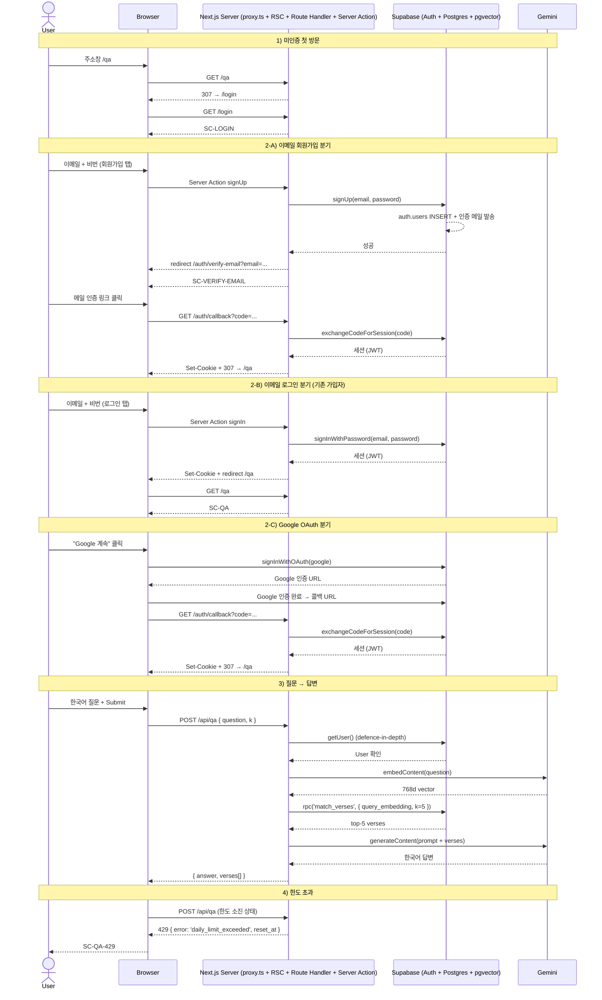
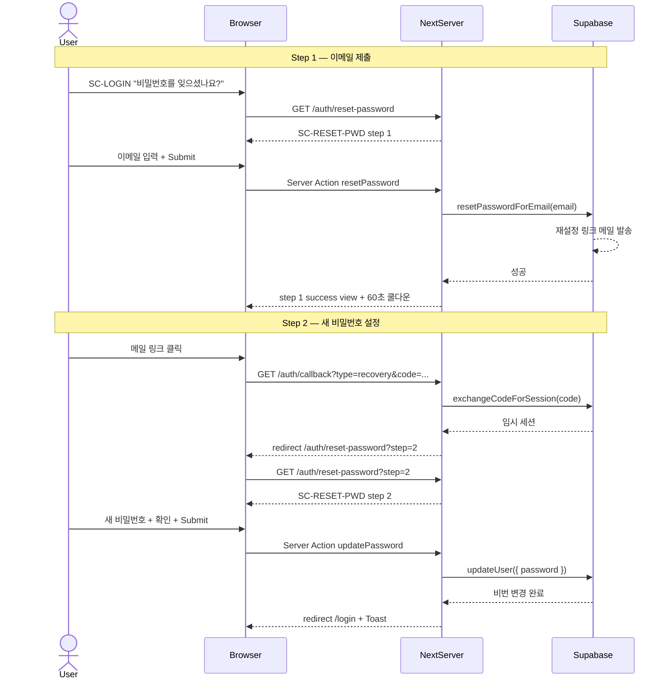
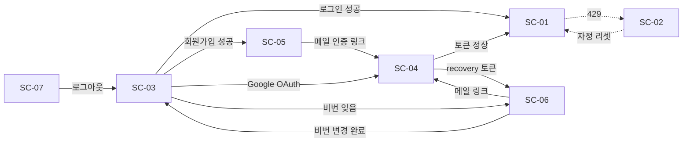

# logos-rag · v1 Paper PRD

화면설계서 & PRD

## 💡 문서 메타

| 항목 | 값 |
|---|---|
| **버전** | v1.0 (paper.design 타겟 초안) |
| **작성일** | 2026-05-27 |
| **작성자** | 본인 (1인 풀스택) |
| **검토자** | 본인 |
| **릴리즈 목표** | 2026 Q3 (포트폴리오 공개) |
| **개발 기간** | phase-03 (auth UI) + phase-04 (quota UI) |
| **산출물** | 화면설계서 + PRD + API 명세 + DB 스키마 인터페이스 + DESIGN.md 인터페이스 |
| **기준 문서** | `docs/v1-design-prd.md` (1067줄 · Open Design 타겟 · 보존), `docs/phase-03-arch.html`, `docs/architecture-handover.html` |
| **1차 소비자** | 본 세션의 Claude Code (paper.design MCP 클라이언트) |
| **2차 소비자** | 본인 (PRD 검수 + Next.js 마이그레이션 판단) |

⚠️ 본 문서는 개인 포트폴리오 PRD 다. 외부 공개는 GitHub 저장소를 통해 의도적으로 이루어지나, 본 PRD 의 카피 / 화면 ID / 상태값 정의 / API 응답 스키마는 v1 릴리즈 전까지 변경될 수 있다.

---

## 목차

0. [본 문서의 전제](#0-본-문서의-전제)
1. [프로젝트 개요](#1-프로젝트-개요)
2. [v1 범위](#2-v1-범위)
3. [시스템 구조](#3-시스템-구조)
4. [사용자 Role 정의](#4-사용자-role-정의)
5. [전체 데이터 흐름](#5-전체-데이터-흐름)
6. [화면 목록](#6-화면-목록)
7. [화면별 PRD (SC-01 ~ SC-09)](#7-화면별-prd)
8. [전체 API 구조](#8-전체-api-구조)
9. [전체 상태값 정의](#9-전체-상태값-정의)
10. [전체 데이터 스키마](#10-전체-데이터-스키마)
11. [DESIGN.md 인터페이스](#11-designmd-인터페이스)
12. [paper.design 워크플로 + Next.js 마이그레이션](#12-paperdesign-워크플로--nextjs-마이그레이션)
13. [예외 처리 정책](#13-예외-처리-정책)
14. [부록 · Open Questions](#14-부록--open-questions)

---

## 0. 본 문서의 전제

### 🎯 6개 명제

1. **paper.design 은 PRD 를 직접 받지 않는다.** Claude Code 가 MCP 로 paper 캔버스를 조작한다. 따라서 본 PRD 는 paper 입력이 아니라 "paper 를 조작하는 에이전트의 단일 컨텍스트 문서" 다.
2. **디자인-개발 정합성은 PRD 의 촘촘함에서 나온다.** PRD 가 빈틈이 있으면 그 빈틈은 디자인 단계 또는 코드 단계에서 누군가의 *추측* 으로 메워진다. 추측이 양쪽에서 다르게 일어나면 마이그레이션 시 충돌한다.
3. **DESIGN.md (getdesign.md 산출물) 는 시각 시스템을 담당한다.** 컬러 토큰 / 타이포 / 간격 / 모션 / 반응형 규칙. 본 PRD 는 시각 디테일 (실제 hex / px / ms) 을 의도적으로 비운다.
4. **shadcn/ui 어휘는 PRD 와 DESIGN.md 의 공통 인터페이스다.** `Button` / `Card` / `Tabs` / `Alert` / `Input` / `Textarea` / `Badge` / `DropdownMenu` / `Skeleton` / `Toast` 등의 컴포넌트 이름이 두 문서의 접점이다.
5. **화면별 11블록 일관 형식은 정합성을 위한 강제 구조다.** 디자인 사이드와 코드 사이드가 항상 같은 항목을 같은 위치에서 찾을 수 있어야, paper 작업물과 Next.js 구현물이 어긋나지 않는다.
6. **Open Questions 는 PRD 채택을 막지 않는다.** 잠정 default 로 진행하되, 결정 시점이 오면 [§14](#14-부록--open-questions) 표로 돌아와 명시한다.

### 본 문서의 위치

본 문서는 logos-rag v1 (phase-03 + phase-04) 의 화면설계서 겸 PRD 다.

- 기능 소개 / 비전 / 마케팅 문서가 아니다.
- "어떤 화면에 어떤 컴포넌트가 어떤 상태로 어떤 카피와 함께 있어야 하는가" 를 화면 단위로 명세한다.
- Full Vision (v1.5 SSO 분리 · v2 엔티티 카드 · v3 관계 그래프 등) 은 본 문서 범위에서 제외한다 ([§2.3](#23-out-of-scope)).

### 본 PRD 의 단일 목표

> **paper.design 에서 만든 디자인과 Next.js 16 App Router 에서 구현된 코드가 마이그레이션 시점에 충돌 없이 맞물리도록 한다.**

이 목표를 위해 본 PRD 는 *시각 디테일을 비워두고*, *카피·상태·구조·검증·이벤트를 빈틈없이 채운다*. 시각 디테일은 DESIGN.md 가 따로 담당하므로 양쪽이 직교한다.

---

## 1. 프로젝트 개요

### 1.1 프로젝트 정의

| 항목 | 내용 |
|---|---|
| **프로젝트명** | logos-rag · v1 (phase-03 auth UI + phase-04 quota UI) |
| **1차 릴리즈 목표** | 9 화면 (SC-01 ~ SC-09) UI 완성 + Next.js 16 App Router 배포 |
| **릴리즈 시기** | 2026 Q3 (포트폴리오 공개) |
| **개발 기간** | phase-03 (현재 진행 중) + phase-04 (예정) |
| **타겟 사용자** | 페르소나 a · b · c (§1.3 참조) |
| **현재 단계** | phase-03 auth UI 진행 중 (브랜치 `spec-03-02-auth-ui-pages`) |

### 🎯 핵심 가치

> **한국어로 던진 질문에 대해 영문 성경의 의미상 유사한 구절들을 근거로 한 한국어 답변을 받는다 — 신학적 권위가 아니라 *검색 + 요약 도구* 로서.**

logos-rag 는 "성경 구절을 어떻게 찾을까?" 라는 탐색 문제를 의미 검색으로 재정의한 풀스택 RAG 포트폴리오다.

- 한국어 질문 → Gemini 임베딩 → Supabase pgvector cosine 검색 → top-K verse → Gemini Flash 한국어 답변
- WEB(World English Bible) 31,102 verse 전체 임베딩 인덱스 (phase-01 완료)
- v1 가치 제안: "신학적 권위를 주장하지 않는 검색 + 요약 도구"

### 1.2 운영 모델

본 MVP 는 단일 Next.js 16 앱 안에 Auth + RAG 를 함께 둔다. 인증 포털 (`auth.example.com`) 과 RAG 앱 (`logos.example.com`) 분리는 v1.5 이후 과제다.

⚠️ v1 에서 답변은 stateless 다. 질문이나 답변을 DB 에 영구 저장하지 않으며, 답변 영역은 "최근 1건" 만 표시한다. 히스토리 / 즐겨찾기 / 공유 링크는 모두 [§2.3](#23-out-of-scope) Out-of-scope.

### 1.3 페르소나 정의

본 PRD 는 세 페르소나를 a > b > c 순으로 우선순위에 둔다.

| 페르소나 | 역할 | v1 에서의 기대 |
|---|---|---|
| **a · 포트폴리오 데모 리뷰어** | 면접관 · 기술 리뷰어 · 채용 담당자 | 5초 안에 "AI 성경 검색·답변 도구" 임을 인지 · 1분 안에 가입 → 질문 → 답변 흐름을 완료 |
| **b · 신앙인 일반** | 큐티/묵상/예배 준비 중 떠오른 질문을 들고 온 사용자 | 정중한 답변 톤 + 가독성 있는 verse 인용 + 자연스러운 면책 표기로 거부감 없이 사용 |
| **c · 신학생 / 연구자** | 특정 주제어로 영문 원문을 비교하려는 사용자 | verse 카드에서 영문 원문 + 라벨 (`Book Chapter:Verse`) 확인 · 유사도 점수는 토글로 노출 (default 숨김) |

### 💡 페르소나 위계가 화면에 반영되는 방식

- **첫 진입 (a 최적화)**: 온보딩 / 설명 없이 질문 입력창이 바로 중앙. placeholder 한 줄로 제품 성격 + 입력 방식 동시 전달.
- **답변 렌더링 (b·c 포용)**: 상단 한국어 답변 본문, 하단 영문 근거 verse 카드 5건. b 는 답변만 읽어도 만족, c 는 verse 카드에서 원문·라벨 확인.
- **톤**: 차분 · 미니멀 · 텍스트 위주. 종교적 감수성을 고려해 과도한 색 강조 / 장식 배제.

---

## 2. v1 범위

### 2.1 In-scope · 핵심 사용자 화면 (P0)

| ID | 화면명 | 우선순위 | 핵심 |
|---|---|---|---|
| SC-01 | SC-QA · QA 메인 | P0 | 한국어 질문 → 답변 + verse 5건. 포트폴리오 데모 핵심 |
| SC-02 | SC-QA-429 · 일일 한도 초과 | P0 | SC-QA 의 sub-state. 한도 초과 배너 + disabled 입력 |
| SC-03 | SC-LOGIN · 로그인 / 회원가입 | P0 | Tabs + 이메일·비번 폼 + Google OAuth |
| SC-04 | SC-CALLBACK · OAuth/매직링크 콜백 | P0 | Loader + 토큰 교환 + redirect |
| SC-05 | SC-VERIFY-EMAIL · 이메일 인증 안내 | P0 | 안내 카드 + 60초 쿨다운 재전송 |
| SC-06 | SC-RESET-PWD · 비밀번호 재설정 (2-step) | P0 | 이메일 입력 → 새 비밀번호 |

### 2.2 In-scope · 공통 / 시스템 화면 (P0~P1)

| ID | 화면명 | 우선순위 | 핵심 |
|---|---|---|---|
| SC-07 | SC-HEADER · 전역 헤더 | P0 | 로고 + 잔여 한도 Badge + DropdownMenu (인증 상태별 분기) |
| SC-08 | SC-FOOTER · 전역 푸터 | P0 | 면책 + GitHub + 버전 (1행) |
| SC-09 | SC-FALLBACK · 404 / 500 | P1 | 큰 숫자 + 카피 + 홈 버튼 |

### 2.3 Out-of-scope

| 기능 | 제외 이유 | 처리 방향 |
|---|---|---|
| 답변 히스토리 / 즐겨찾기 | v1 stateless 흐름 | v1.5 |
| 답변 공유 / 영구 링크 (`/qa/[id]`) | DB 영구 저장 안 함 | v1.5 |
| 다국어 UI (영문 / 일문 등) | v1 한국어 단일 | v2 |
| 한글 책 이름 번역 (창세기 / 출애굽기) | WEB 영문 원문 유지 | v2 |
| 결제 / 유료 플랜 | v1 무료 일일 20회 | Phase out |
| 모바일 네이티브 앱 | 웹 반응형 only | Phase out |
| 관리자 / 분석 대시보드 | 1인 운영 / 통계 도구 불필요 | Phase out |
| 유사도 점수 강제 노출 | default 숨김 | 토글 옵션 (페르소나 c) |
| v1.5 SSO 분리 (인증 포털 + RAG 앱 도메인 분리) | v1 단일 앱 | v1.5 |
| v2 엔티티 카드 (인물·장소·사건 별도 카드) | LLM 구조화 추출 미구현 | v2 |
| v3 관계 그래프 (react-flow / vis.js) | UX 우선순위 낮음 | v3 |
| AI 응답 스트리밍 (SSE) | 일괄 표시로 충분 | v1.5 검토 |
| 다크 모드 토글 버튼 | 시스템 prefers-color-scheme | v1.5 검토 |
| shadcn/ui 외 디자인 시스템 혼용 | 일관성 | 영구 비목표 |

### 2.4 v1 개발 일정 (현재 phase-03 기준)

| 주차 | 단계 | 주요 작업 |
|---|---|---|
| (완료) | phase-01 | Supabase + WEB embedding + cosine 검증 |
| (완료) | phase-02 | 프롬프트 / search CLI / `/api/qa` Route Handler |
| **(진행 중)** | phase-03 · spec-03-02 | auth UI (SC-03 / SC-04 / SC-05 / SC-06) + SC-07 인증 분기 |
| (예정) | phase-03 · 후속 spec | SC-01 / SC-02 / SC-08 / SC-09 |
| (예정) | phase-04 | SC-02 한도 카운트 실측 (user_quota 테이블) |
| (예정) | paper / design | 본 PRD 기반 paper.design 디자인 작업 → Next.js 마이그레이션 |

---

## 3. 시스템 구조

### 3.1 컴포넌트 구성

| Layer | 컴포넌트 | 역할 |
|---|---|---|
| **Client** | Next.js 16 App Router (RSC + Client Component) | 9 화면 렌더링 · 폼 / Submit · 답변 표시 |
| **Edge / Server** | Next.js proxy.ts | 보호 경로 `/qa` 인증 검사 · 미인증 시 `/login` 307 |
| **Server** | Next.js Route Handler (`app/api/qa/route.ts`) | 세션 검증 · 질문 임베딩 · pgvector 검색 · LLM 호출 · 응답 |
| **Server** | Next.js Route Handler (`app/auth/callback/route.ts`) | OAuth / 매직링크 / recovery 토큰 교환 후 redirect |
| **Server** | Server Action (`app/login/_actions.ts` 등) | 이메일 / 비밀번호 로그인 · 회원가입 · 재전송 · 비번 재설정 |
| **Auth** | Supabase Auth | 이메일·비번 + Google OAuth · 세션 (JWT) · 쿠키 관리 |
| **DB** | Supabase Postgres + pgvector | `verses` 테이블 (31,102 row · 768d embedding) · `user_quota` (phase-04) |
| **External** | Google AI Studio (Gemini) | text-embedding-004 (768d) + Gemini Flash (한국어 답변 생성) |
| **Hosting** | Vercel | Next.js 16 배포 · Edge / Serverless 자동 분기 |

### 3.2 데이터 흐름 다이어그램

```
[ Browser (페르소나 a/b/c) ]
        │
        │ HTTPS
        ▼
[ Vercel Edge / Serverless ]
        │
        ├─ proxy.ts (보호 경로 검사)
        │     │
        │     └─ /qa 미인증 → 307 /login
        │
        ├─ RSC / Page (app/.../page.tsx)
        │     └─ Supabase getUser() · 세션 검사 · UI 분기
        │
        ├─ Server Action (Form / Submit)
        │     └─ Supabase signUp / signIn / resetPasswordForEmail / updateUser
        │
        └─ Route Handler /api/qa
              │
              ├─ 1) Supabase getUser() · 세션 확인
              ├─ 2) Gemini embedContent (질문 → 768d vector)
              ├─ 3) Supabase rpc('match_verses', { query_embedding, k=5 })
              ├─ 4) Gemini generateContent (프롬프트 + verse 컨텍스트)
              └─ 5) Response { answer, verses[] }

[ Supabase ]
   ├─ auth.users (Supabase Auth 관리)
   ├─ public.verses (31,102 row · vector(768))
   └─ public.user_quota (phase-04 예정)

[ Google AI Studio ]
   ├─ models/text-embedding-004
   └─ models/gemini-2.0-flash (또는 후속 모델)
```

### 3.3 기술 제약

| 항목 | 내용 | 검증 시점 |
|---|---|---|
| 응답 latency | 5~15초 (embed → match → generate 합산) | phase-02 측정 완료 |
| LLM rate limit | Gemini 무료 quota — RPM / RPD 한도 | 일일 한도 UI (SC-02) 로 대응 |
| 인증 | 이메일 + 비밀번호 + Google OAuth (Supabase) | phase-03 진행 중 |
| 보안 | TLS 1.3 (Vercel 자동) · 세션 쿠키 httpOnly + Secure | phase-03 |
| 동시 접속 | 페르소나 a 데모 시점 동시 1~5명 가정 | 일반 트래픽 가정 |
| 멀티테넌트 | 없음 (단일 인스턴스 · 사용자별 quota 만 분리) | phase-04 |
| 브라우저 | 최신 Chrome / Safari / Edge / Firefox (서드파티 쿠키 차단 환경 주의) | phase-03 QA |
| 다국어 | 한국어 UI 단일 (영문 verse 본문 / 라벨 예외) | 영구 결정 |

---

## 4. 사용자 Role 정의

### 4.1 Role 매트릭스

| Role ID | Role 명 | 설명 |
|---|---|---|
| **ANONYMOUS** | 미인증 사용자 | `/login` / `/auth/callback` / `/auth/verify-email` / `/auth/reset-password` 접근 가능. `/qa` 접근 시 307 redirect. |
| **AUTHENTICATED** | 인증된 사용자 | Supabase 세션 보유. `/qa` 접근 가능 · 질문 / 답변 흐름 이용 · 일일 한도 (20회 / 일) 적용 |
| **SUPABASE_SERVICE** | 서버측 service role | `match_verses` RPC 호출 · `user_quota` 갱신. 사람 사용자 아님. |

⚠️ v1 은 ADMIN / DIRECTOR 같은 운영자 Role 없음. 통계 / 운영 대시보드는 [§2.3](#23-out-of-scope) Out-of-scope. 본인 (개발자) 은 Supabase Dashboard 를 통해 직접 DB 접근.

### 4.2 화면 × Role 접근 권한

| 화면 ID | 화면명 | ANONYMOUS | AUTHENTICATED |
|---|---|---|---|
| SC-01 | SC-QA | — (`/login` 307) | Full |
| SC-02 | SC-QA-429 | — | Full (한도 소진 시 자동 진입) |
| SC-03 | SC-LOGIN | Full | — (`/qa` 307) |
| SC-04 | SC-CALLBACK | Full (콜백 자체가 인증 전환 과정) | Full → 즉시 `/qa` redirect |
| SC-05 | SC-VERIFY-EMAIL | Full | — (`/qa` 307) |
| SC-06 | SC-RESET-PWD | Full | Full (자기 비밀번호 재설정 시) |
| SC-07 | SC-HEADER | 미인증 분기 | 인증 분기 (Badge / DropdownMenu) |
| SC-08 | SC-FOOTER | Full | Full |
| SC-09 | SC-FALLBACK | Full | Full |

### 4.3 권한 검사 규칙

1. 모든 보호 경로 (`/qa`) 는 `proxy.ts` 가 Supabase 세션 쿠키를 검사한 뒤 통과 / redirect 결정.
2. Route Handler (`/api/qa`) 는 defence-in-depth 로 `supabase.auth.getUser()` 를 재검증 (proxy 통과 = 세션 유효 보장이 아니므로).
3. 모든 Server Action 은 호출 직전 `supabase.auth.getUser()` 로 사용자 확인.
4. 클라이언트 useEffect 의 redirect 는 단독 사용 금지 (UX 보조용 only).

---

## 5. 전체 데이터 흐름

### 5.1 사용자 진입 → 답변 라이프사이클

```
[1] 진입 (Entry)
    └─ /qa 직접 · /login 진입 · /auth/callback 콜백 등

[2] 인증 검증 (Authenticate)
    └─ proxy.ts · RSC · Route Handler · Server Action 4 지점 모두 검사

[3] 입력 (Input)
    ├─ 폼 입력 (이메일 / 비밀번호 / 질문 textarea)
    └─ 버튼 클릭 / 키보드 단축키 (Cmd+Enter)

[4] 검증 (Validate)
    ├─ 클라이언트 — 형식 / 길이 / 일치
    └─ 서버 — Role / 비즈니스 규칙 / 세션

[5] 처리 (Process)
    ├─ Supabase Auth — signUp / signIn / resetPasswordForEmail / updateUser
    ├─ Gemini — embedContent / generateContent
    └─ Supabase pgvector — match_verses RPC

[6] 응답 (Respond)
    ├─ 성공 — UI 상태 전환 (success.*)
    ├─ 실패 — UI 에러 상태 (error.*) + 카피 노출
    └─ 비동기 결과 — Skeleton → 답변 카드 렌더링

[7] 후속 액션 (Follow-up)
    └─ redirect / Toast / 답변 표시
```

### 5.2 인증 시퀀스 (Mermaid)



### 5.3 비밀번호 재설정 시퀀스



### 5.4 진입 매트릭스

| 진입 URL | ANONYMOUS | AUTHENTICATED | 비고 |
|---|---|---|---|
| `/` | `/qa` 307 → `/login` 307 | `/qa` 307 → SC-QA | 루트는 별도 화면 없음 |
| `/qa` | `/login` 307 | SC-QA | proxy.ts 보호 매처 |
| `/qa` (한도 소진) | — | SC-QA-429 | `/api/qa` 429 후 인라인 전환 |
| `/login` | SC-LOGIN | `/qa` 307 | 인증 시 자동 복귀 |
| `/login?tab=signup` | SC-LOGIN (signup 탭 활성) | `/qa` 307 | URL 쿼리로 초기 탭 결정 |
| `/auth/callback?code=...` | SC-CALLBACK → 토큰 교환 → `/qa` | (이미 인증) → `/qa` 307 | OAuth + 매직링크 공통 |
| `/auth/callback?type=recovery&code=...` | 토큰 교환 → SC-RESET-PWD step 2 | 동일 | recovery 분기 |
| `/auth/verify-email` | SC-VERIFY-EMAIL | `/qa` 307 | 회원가입 직후 진입 |
| `/auth/reset-password` | SC-RESET-PWD step 1 | 동일 (자기 비번 재설정) | 인증 무관 |
| `/auth/reset-password?step=2` | SC-RESET-PWD step 2 (임시 세션) | 동일 | recovery 토큰 보유 시만 정상 |
| 없는 경로 | SC-FALLBACK (404) | 동일 | Next.js `not-found.tsx` |
| 서버 오류 | SC-FALLBACK (500) | 동일 | Next.js `error.tsx` |

---

## 6. 화면 목록

### 6.1 화면 ID 네이밍 규칙

- 화면 ID 형식: `SC-NN` (Screen + 우선순위 기반 일련번호)
- SC-01 ~ SC-06 = 사용자 화면 (운영 흐름)
- SC-07 ~ SC-09 = 공통 / 시스템 화면 (전역 / 폴백)

### 6.2 전체 화면 인덱스

| ID | 화면명 | 분류 | 우선순위 | 경로 | 인증 |
|---|---|---|---|---|---|
| **SC-01** | QA 메인 | 운영 화면 | P0 | `/qa` | O |
| **SC-02** | QA · 일일 한도 초과 | 운영 화면 (sub-state) | P0 | `/qa` | O |
| **SC-03** | 로그인 / 회원가입 | 인증 화면 | P0 | `/login` | X |
| **SC-04** | OAuth/매직링크 콜백 | 인증 화면 | P0 | `/auth/callback` | - |
| **SC-05** | 이메일 인증 안내 | 인증 화면 | P0 | `/auth/verify-email` | X |
| **SC-06** | 비밀번호 재설정 (2-step) | 인증 화면 | P0 | `/auth/reset-password` | X |
| **SC-07** | 전역 헤더 | 공통 컴포넌트 | P0 | 모든 페이지 | - |
| **SC-08** | 전역 푸터 | 공통 컴포넌트 | P0 | 모든 페이지 | - |
| **SC-09** | 404 / 500 폴백 | 시스템 화면 | P1 | 폴백 | - |

### 6.3 화면 관계도



### 6.4 화면별 작성 형식 (11블록)

모든 화면 PRD 는 동일한 11블록 형식을 따른다. 디자인 사이드와 코드 사이드가 항상 같은 블록 번호에서 같은 항목을 찾을 수 있도록 한다.

1. **화면 목적**
2. **접근 권한**
3. **핵심 기능**
4. **화면 구성** (컴포넌트 어휘 = shadcn/ui)
5. **사용자 액션**
6. **상태값 정의**
7. **Input 정의** (입력 주체 / 입력 방식 / 입력 데이터 / Validation / 실패 처리 / Trigger·이벤트)
8. **저장 데이터**
9. **조회 데이터**
10. **API 명세**
11. **데이터 스키마 (JSON)**

(보너스) 12. **연동 정보**

---

## 7. 화면별 PRD

---

### 화면 SC-01 · QA 메인

#### 1. 화면 목적

사용자가 한국어로 질문을 입력하고 5~15초 내에 한국어 AI 답변 + 영문 근거 verse 카드 5건을 받는다. 본 MVP 의 핵심 데모 화면이다.

🎯 5초 안에 "AI 성경 검색·답변 도구" 임을 페르소나 a 가 인지하도록 한다. 디자인 위계 (a > b > c) 는 본 화면에서 가장 강하게 작동한다.

#### 2. 접근 권한

| Role | 권한 수준 | 허용 액션 |
|---|---|---|
| ANONYMOUS | — | `/login` 307 redirect |
| AUTHENTICATED | Full | 질문 입력 · 제출 · 답변 조회 · 일일 한도 차감 |

#### 3. 핵심 기능

- 한국어 질문 입력 (Textarea · 최대 500자)
- Cmd / Ctrl + Enter 키보드 단축키 제출
- 5~15초 비동기 답변 생성 (embed → match → generate)
- Skeleton 로딩 + "답변 생성 중... (5~15초 소요)" 라벨 동시 표시
- 답변 카드 렌더링 (한국어 답변 본문 + verse 카드 5건 + 면책 한 줄)
- verse 카드 영문 본문 (`font-serif`) + 라벨 `Book Chapter:Verse` (`Badge`)
- 유사도 점수 노출 (default 숨김 · `?debug=1` 또는 토글 시)
- 답변 영역은 **최근 1건만 표시 · 새 질문 제출 시 덮어쓰기** (히스토리 v1.5)
- 에러 5종 (429 / 결과 없음 / 일반 / 네트워크 / 401) 각각 별도 UI
- 모바일 (375px ~) 정상 렌더링 · verse 카드 세로 스택 → 데스크탑 grid 2-col

#### 4. 화면 구성

전체: SC-07 헤더 → 메인 컨텐츠 (max-w-2xl, mx-auto, px-4) → SC-08 푸터.

메인 영역 (위에서 아래):

| 영역 | 컴포넌트 | 설명 |
|---|---|---|
| 페이지 타이틀 블록 | `h1` + 부제 `p` | "성경에서 답을 찾아보세요" + 부제 |
| 질문 입력 블록 | `Textarea` + 하단 바 | 자동 확장 (rows=3~10) + 글자수 + Submit `Button` |
| 키보드 힌트 | `p.text-xs.muted` | "⌘+Enter 로 제출" |
| 답변 영역 — empty | 아이콘 + 안내 텍스트 | `BookOpen` (muted) + "질문을 입력하면..." |
| 답변 영역 — loading | `Skeleton` × 3줄 + 라벨 | "답변 생성 중... (5~15초 소요)" + `Loader2` |
| 답변 영역 — success | 답변 `Card` + 근거 섹션 + verse `Card` × 5 | 답변 본문 + 면책 한 줄 + verse 라벨/본문 |
| 답변 영역 — error | `Alert`(destructive) | 에러 카피 + "다시 시도" `Button` (필요 시) |

verse 카드 1개:

| 영역 | 컴포넌트 | 설명 |
|---|---|---|
| 상단 | `Badge`(secondary) + (선택) 유사도 `span` | "Genesis 1:1" / "0.87" |
| 본문 | `p.font-serif.leading-relaxed` | "In the beginning God created..." |

#### 5. 사용자 액션

1. 페이지 진입 → empty state 표시
2. Textarea 클릭 / 포커스 → typing 상태
3. 한국어 질문 타이핑 → 글자수 카운트 실시간 갱신
4. 500자 초과 시 → `typing.over-limit` 상태 (글자수 destructive · Submit disabled)
5. Submit 클릭 또는 Cmd/Ctrl + Enter → `submitting` 상태
6. 5~15초 대기 → `success` 또는 `error.*` 상태
7. 새 질문 작성 → 이전 답변 덮어쓰기 (`submitting` 재시작)
8. 에러 시 "다시 시도" 클릭 → 재제출
9. 401 에러 시 → Toast + `/login` redirect (자동)
10. 한도 소진 (429) → SC-02 sub-state 전환

#### 6. 상태값 정의

| 상태 키 | 값 | 설명 |
|---|---|---|
| `qa.state` | `empty` | Textarea 비어있음 · Submit `disabled` |
| `qa.state` | `typing` | 텍스트 있음 · Submit 활성 |
| `qa.state` | `typing.over-limit` | 500자 초과 · 글자수 destructive · Submit `disabled` |
| `qa.state` | `submitting` | useMutation isPending · Textarea + 버튼 disabled · Skeleton 표시 |
| `qa.state` | `success` | 답변 카드 + verse 5건 표시 · Textarea 유지 |
| `qa.state` | `error.gemini-429` | "AI 서비스 혼잡" + 다시 시도 (Gemini self 429) |
| `qa.state` | `error.gemini-other` | "답변 생성 오류" + 다시 시도 (Gemini 기타 에러) |
| `qa.state` | `error.no-results` | "관련 구절을 찾지 못했습니다" (검색 결과 0) |
| `qa.state` | `error.network` | "네트워크 연결을 확인해주세요" + 다시 시도 |
| `qa.state` | `error.401` | Toast + `/login` redirect (세션 만료) |
| `qa.state` | `disabled.quota-exceeded` | SC-02 로 전환 (별도 화면 참조) |
| `verses[].show_similarity` | `true \| false` | 유사도 점수 노출 여부 (default false) |

#### 7. Input 정의

##### 7.1 입력 주체

| 주체 | 입력 패턴 |
|---|---|
| AUTHENTICATED | 한국어 질문 (Textarea) + Submit |
| (자동) Cmd/Ctrl + Enter | 키보드 단축키로 동일 Submit 트리거 |

##### 7.2 입력 방식

| 입력 종류 | 방식 | 동기 / 비동기 |
|---|---|---|
| 질문 제출 | 수동 (Submit 버튼) | 비동기 (5~15초) |
| 질문 제출 | 수동 (Cmd / Ctrl + Enter) | 비동기 |
| 답변 영역 표시 | 자동 (응답 수신 시) | — |
| 새 질문 작성 | 수동 (이전 답변 위에 덮어쓰기) | 비동기 |
| 다시 시도 | 수동 (에러 상태 CTA) | 비동기 |

##### 7.3 입력 데이터

```http
POST /api/qa
Content-Type: application/json
Cookie: sb-access-token=...; sb-refresh-token=...

{
  "question": "하나님이 세상을 만든 이야기 알려줘",
  "k": 5
}
```

| 필드 | 필수 | 타입 | 설명 |
|---|---|---|---|
| `question` | ✅ | string | 한국어 질문 · 1~500자 |
| `k` | 선택 | integer | top-K verse 개수 · default 5 · 범위 1~10 |

##### 7.4 Validation

| 단계 | 규칙 | 실패 시 응답 |
|---|---|---|
| 클라이언트 — 빈 입력 | `question.trim().length > 0` | Submit `disabled` (서버 호출 안 함) |
| 클라이언트 — 길이 | `question.length <= 500` | `typing.over-limit` 상태 · Submit `disabled` |
| 서버 — 세션 | Supabase `getUser()` 성공 | 401 `{ error: 'unauthorized' }` |
| 서버 — Role | AUTHENTICATED | 401 |
| 서버 — 길이 재검증 | `question.length <= 500` | 400 `{ error: 'validation_error', field: 'question' }` |
| 서버 — `k` 범위 | `1 <= k <= 10` | 400 |
| 서버 — 일일 한도 | 한도 미초과 (phase-04: `user_quota.today_count < 20`) | 429 `{ error: 'daily_limit_exceeded', reset_at }` |
| 서버 — Gemini 호출 | embed / generate 성공 | 502 `{ error: 'llm_error' }` 또는 429 (Gemini self) |
| 서버 — pgvector | RPC `match_verses` 성공 | 500 `{ error: 'db_error' }` |
| 서버 — 결과 0 | top-K verse 0 건 | 200 `{ answer: '관련 구절을 찾지 못했습니다', verses: [] }` 또는 422 (정책 선택 — §14 D-2) |

##### 7.5 입력 실패 처리

| 실패 유형 | 처리 |
|---|---|
| 빈 입력 클릭 | Submit `disabled` 이므로 호출되지 않음 (방어) |
| 500자 초과 | `typing.over-limit` 상태 · Submit `disabled` |
| 네트워크 끊김 | TanStack Query / fetch reject → `error.network` 상태 · Toast |
| Timeout (15초+) | 클라이언트 abort · `error.gemini-other` 상태 |
| 401 | Toast(destructive, "세션이 만료되었습니다") + `router.push('/login')` |
| 429 (자체) | SC-02 sub-state 전환 |
| 429 (Gemini) | `error.gemini-429` 상태 · "다시 시도" CTA |
| 500 / 502 | `error.gemini-other` 상태 |
| 결과 0 | `error.no-results` 상태 |
| Submitting 중 재제출 | Submit `disabled` 로 자동 방어 (재제출 무시) |

##### 7.6 Trigger / 이벤트 발생

| 본 입력 저장 → | 자동 발생하는 후속 이벤트 |
|---|---|
| `/api/qa` 200 응답 | (phase-04) `user_quota.today_count++` · 헤더 Badge 갱신 |
| `/api/qa` 429 응답 | SC-02 sub-state 전환 · 헤더 Badge "0 / 20" + destructive |
| Submit 시작 | 답변 영역 fade-out → Skeleton fade-in (300ms 최소) |
| 답변 수신 | Skeleton fade-out → 답변 카드 fade-in |
| 401 응답 | Toast 표시 → 500ms 후 `/login` redirect |

#### 8. 저장 데이터

v1 stateless 흐름. 본 화면에서 직접 저장하는 데이터 없음.

(phase-04 예정) `/api/qa` 200 시 `user_quota.today_count++`.

#### 9. 조회 데이터

- 현재 사용자 세션 (Supabase `getUser()`)
- (phase-04) 잔여 일일 한도 — 헤더 Badge 표시용

#### 10. API 명세

| Method | Endpoint | 설명 |
|---|---|---|
| POST | `/api/qa` | 질문 → 답변 + verse 5건 (5~15초) |
| (phase-04) GET | `/api/quota` | 잔여 일일 한도 조회 (`{ remaining, total, reset_at }`) |

#### 11. 데이터 스키마

**Request** — POST /api/qa

```json
{
  "question": "string (1~500자)",
  "k": 5
}
```

**Response — 200**

```json
{
  "ok": true,
  "data": {
    "answer": "string (한국어 답변 본문)",
    "verses": [
      {
        "verse_id": "uuid",
        "book": "Genesis",
        "chapter": 1,
        "verse_number": 1,
        "label": "Genesis 1:1",
        "text": "In the beginning God created the heavens and the earth.",
        "similarity": 0.87
      }
    ]
  },
  "meta": {
    "model_embedding": "text-embedding-004",
    "model_generation": "gemini-2.0-flash",
    "latency_ms": 8245
  }
}
```

**Response — 429 (한도 초과)**

```json
{
  "ok": false,
  "error": {
    "code": "daily_limit_exceeded",
    "message": "오늘의 사용량을 모두 사용했습니다.",
    "reset_at": "2026-05-28T00:00:00+09:00"
  }
}
```

**Response — 4xx / 5xx (기타)**

```json
{
  "ok": false,
  "error": {
    "code": "unauthorized | validation_error | llm_error | db_error | network_error",
    "message": "string (한국어 사용자 카피)",
    "field": "string | null"
  }
}
```

#### 12. 연동 정보

| 항목 | 처리 |
|---|---|
| 임베딩 | Gemini text-embedding-004 (768d) |
| 검색 | Supabase `match_verses(query_embedding, k)` RPC |
| 답변 생성 | Gemini Flash (`gemini-2.0-flash` 또는 후속) |
| 세션 검증 | Supabase `getUser()` (Route Handler 진입 시 defence-in-depth) |
| 한도 카운트 (phase-04) | `user_quota` 테이블 UPSERT |
| 헤더 연동 | SC-07 Badge 잔여 한도 갱신 |

---

### 화면 SC-02 · QA · 일일 한도 초과

#### 1. 화면 목적

당일 20회 한도를 모두 소진한 상태에서 사용자가 한도 초과를 명확히 인지하고, 한도 초기화 시각(자정 KST)을 알도록 한다. SC-01 의 sub-state 이며 별도 URL 이 아니다.

🎯 좌절감 최소화. 무단 사용 차단. "내일 자정에 초기화" 라는 회복 시점을 명확히 알린다.

⚠️ phase-03 에서는 `user_quota` 테이블 미구현. 본 화면은 Gemini API 429 응답의 임시 UI 로만 동작. 정확한 20회 카운트는 phase-04 이후.

#### 2. 접근 권한

| Role | 권한 수준 | 허용 액션 |
|---|---|---|
| ANONYMOUS | — | (`/qa` 자체가 보호 경로) |
| AUTHENTICATED | Full (한도 소진 시 자동 진입) | 조회만 가능 · 입력 차단 |

#### 3. 핵심 기능

- 한도 초과 상태 명시 (`Alert` 배너 + 헤더 Badge destructive)
- Textarea + Submit `disabled`
- 답변 영역 empty state + 초기화 안내 카피
- 한국 시각 자정 (KST 00:00) 초기화 시각 명시
- 새로고침 / 자정 경과 시 → SC-01 default 복귀 (서버 quota 재확인)

#### 4. 화면 구성

SC-01 레이아웃 유지. 차이점:

| 영역 | 컴포넌트 | 변경 사항 |
|---|---|---|
| SC-07 헤더 | `Badge` | variant=destructive · "0 / 20" |
| 질문 블록 위 | `Alert`(default, amber border, Clock 아이콘) | 한도 초과 배너 (신규) |
| 질문 입력 | `Textarea` | `disabled=true` · `bg-muted` · placeholder 교체 |
| Submit | `Button` | `disabled=true` · `cursor-not-allowed` |
| 답변 영역 | empty 아이콘 + 카피 | 초기화 안내 카피로 교체 |

#### 5. 사용자 액션

1. SC-01 에서 한도 소진 → 자동 SC-02 전환
2. 페이지 새로고침 → 서버 quota 재확인 → 자정 경과 시 SC-01 복귀
3. 헤더 Badge / Alert 클릭 → (선택) 잔여 한도 상세 모달 (v1 비목표)

#### 6. 상태값 정의

| 상태 키 | 값 | 설명 |
|---|---|---|
| `quota.state` | `exceeded` | 한도 소진 (`today_count >= 20`) |
| `quota.reset_at` | ISO8601 | 다음 자정 (KST) |
| `header.badge.variant` | `destructive` | "0 / 20" |
| (SC-01 의 다른 상태는 모두 본 sub-state 에서 비활성화) | | |

#### 7. Input 정의

본 화면은 입력 없음 (모든 입력 disabled). Trigger 만 정의.

##### 7.6 Trigger / 이벤트 발생

| Trigger | 자동 발생하는 후속 이벤트 |
|---|---|
| `/api/qa` 429 응답 수신 | SC-01 → SC-02 인라인 전환 (페이지 이동 없음) |
| 페이지 새로고침 + 자정 경과 | 서버 quota 재확인 후 SC-01 default 복귀 |
| (phase-04) 자정 KST 도달 | `user_quota.today_count` 0 리셋 (DB 트리거 또는 배치) |

#### 8. 저장 데이터

본 화면에서 직접 저장하는 데이터 없음.

#### 9. 조회 데이터

- 현재 사용자의 일일 한도 상태 (`user_quota` — phase-04)
- `reset_at` ISO datetime

#### 10. API 명세

본 화면 전용 API 없음. SC-01 의 `/api/qa` 429 응답이 본 화면 진입 트리거.

(phase-04) GET `/api/quota` — 잔여 한도 + reset_at 조회.

#### 11. 데이터 스키마

**429 응답 (SC-01 §11 동일)**

```json
{
  "ok": false,
  "error": {
    "code": "daily_limit_exceeded",
    "message": "오늘의 사용량을 모두 사용했습니다.",
    "reset_at": "2026-05-28T00:00:00+09:00"
  }
}
```

#### 12. 연동 정보

| 항목 | 처리 |
|---|---|
| 한도 카운트 (phase-04) | `user_quota` 테이블 |
| 자정 리셋 (phase-04) | DB cron / Vercel cron / 클라이언트 재조회 셋 중 선택 (§14 D-3) |
| 헤더 연동 | SC-07 Badge variant=destructive |

#### 한국어 카피 — SC-02 전용

| 위치 | 카피 |
|---|---|
| Alert 제목 | "오늘의 사용량을 모두 소진했습니다" |
| Alert 설명 | "하루 20회 한도를 모두 사용했습니다. 한국 시각 자정(00:00 KST)에 초기화됩니다." |
| 부가 문구 | "내일 다시 질문해주세요. 더 많은 기능은 추후 업데이트될 예정입니다." |
| 헤더 Badge | "0 / 20" |
| 답변 영역 empty | "오늘은 더 이상 질문할 수 없습니다. 자정 이후 다시 시도해주세요." |
| Textarea placeholder | "오늘 사용 가능한 질문 횟수를 모두 사용했습니다." |

---

### 화면 SC-03 · 로그인 / 회원가입

#### 1. 화면 목적

미인증 사용자가 5초 안에 가입 / 로그인 방법을 인지하고, 1분 안에 가입 → `/qa` 진입을 완료할 수 있도록 한다. v1 인증 진입 단일 경로.

🎯 페르소나 a (포트폴리오 데모 리뷰어) 가 가장 먼저 마주하는 화면 중 하나. UI 가 막힘없이 흐르는지가 데모의 첫인상을 결정한다.

#### 2. 접근 권한

| Role | 권한 수준 | 허용 액션 |
|---|---|---|
| ANONYMOUS | Full | 탭 전환 · 폼 입력 · OAuth · 재설정 진입 |
| AUTHENTICATED | — | `/qa` 307 redirect (이미 로그인) |

#### 3. 핵심 기능

- `Tabs` 2개 — "로그인" / "회원가입"
- Google OAuth `Button` (탭과 무관 · Tabs 위 배치)
- `Separator` "또는 이메일로"
- 이메일 / 비밀번호 폼 (탭별)
- 회원가입 탭: 비밀번호 확인 + 약관 동의 `Checkbox`
- "비밀번호를 잊으셨나요?" 링크 → SC-06 step 1
- 클라이언트 검증 (blur / submit 시점 · 이메일 / 길이 / 일치 / 약관)
- 서버 응답 에러 (잘못된 자격증명 / 미인증 이메일 / 중복 이메일 / 네트워크)
- 로딩 중 탭 전환 차단
- URL `?tab=signup` 으로 초기 탭 결정

#### 4. 화면 구성

전체: SC-07 미니멀 헤더 (로고만) → 뷰포트 수직 중앙 → SC-08 푸터 (면책만).

중앙 영역:

| 영역 | 컴포넌트 | 설명 |
|---|---|---|
| 카드 | `Card` (max-w-md, mx-auto, p-8, rounded-xl) | 로그인 / 회원가입 컨테이너 |
| 상단 | 워드마크 "logos-rag" + 태그라인 | `font-bold text-xl` + `text-sm text-muted-foreground` |
| Google OAuth | `Button`(variant=outline, full-width, Google G 아이콘) | "Google 계정으로 계속하기" |
| 구분선 | `Separator` (텍스트 중앙) | "또는 이메일로" |
| 탭 헤더 | `Tabs` `TabsList` `TabsTrigger` × 2 | "로그인" / "회원가입" |
| 로그인 탭 | `TabsContent value="login"` | 이메일 / 비번 / "비번 잊음" 링크 / Submit |
| 회원가입 탭 | `TabsContent value="signup"` | 이메일 / 비번 / 비번 확인 / 약관 / Submit |
| 에러 영역 | `Alert` (폼 상단) | variant=destructive 또는 default |
| 인라인 에러 | `p.text-destructive` | Input 아래 |

로그인 탭 내부:

```
Label "이메일"          Input type=email   placeholder "you@example.com"
Label "비밀번호"        Input type=password placeholder "비밀번호"
                       Link "비밀번호를 잊으셨나요?" → /auth/reset-password
Button (full-width)    "로그인"
```

회원가입 탭 내부:

```
Label "이메일"          Input type=email   placeholder "you@example.com"
Label "비밀번호"        Input type=password placeholder "8자 이상"
Label "비밀번호 확인"   Input type=password placeholder "비밀번호 확인"
Checkbox + Label       "이용약관 및 개인정보 처리방침에 동의합니다"
Button (full-width)    "계정 만들기"
```

#### 5. 사용자 액션

1. 페이지 진입 → URL `?tab=` 에 따라 초기 탭 활성화 (default `login`)
2. Google `Button` 클릭 → `signInWithOAuth(google)` → Google 인증 URL redirect
3. 탭 전환 (로그인 ↔ 회원가입)
4. 이메일 Input 타이핑 + blur → 형식 검증
5. 비밀번호 Input 타이핑 + blur → 길이 검증 (회원가입 탭 만)
6. 비밀번호 확인 Input 타이핑 + blur → 일치 검증
7. 약관 Checkbox 클릭 (회원가입 탭)
8. "비밀번호를 잊으셨나요?" 링크 클릭 → SC-06 step 1
9. Submit 버튼 클릭 또는 Enter 키
10. 로딩 중 다른 액션 차단 (탭 / Submit / Google 모두 disabled)
11. 성공 시 → 로그인: `/qa` redirect · 회원가입: `/auth/verify-email?email=...` redirect
12. 에러 시 → `Alert` 상단 표시 · 또는 인라인 에러

#### 6. 상태값 정의

| 상태 키 | 값 | 설명 |
|---|---|---|
| `auth.tab` | `login \| signup` | 활성 탭 (URL `?tab=` 동기화) |
| `auth.state` | `default` | 폼 비어있음 · 모든 버튼 활성 |
| `auth.state` | `loading.email` | 이메일 Submit 중 (탭별 분기) |
| `auth.state` | `loading.google` | Google OAuth 중 |
| `auth.state` | `error.invalid-credentials` | 401 (로그인 탭) "이메일 또는 비번 오류" |
| `auth.state` | `error.email-not-verified` | 로그인 탭 · 미인증 이메일 + "재전송" CTA |
| `auth.state` | `error.email-already-registered` | 회원가입 탭 · 409 + "로그인 탭으로" CTA |
| `auth.state` | `error.network` | 네트워크 오류 |
| `auth.state` | `success.signup` | 회원가입 성공 → `/auth/verify-email` redirect |
| `auth.state` | `success.login` | 로그인 성공 → `/qa` redirect |
| `field.email.error` | `format \| null` | 인라인 에러 |
| `field.password.error` | `too-short \| null` | 인라인 에러 (회원가입) |
| `field.confirm.error` | `mismatch \| null` | 인라인 에러 (회원가입) |
| `field.terms.error` | `required \| null` | 인라인 에러 (회원가입) |

#### 7. Input 정의

##### 7.1 입력 주체

| 주체 | 입력 패턴 |
|---|---|
| ANONYMOUS | 이메일 / 비번 입력 · Submit (로그인) |
| ANONYMOUS | 이메일 / 비번 / 비번 확인 / 약관 동의 · Submit (회원가입) |
| ANONYMOUS | Google OAuth 버튼 클릭 |

##### 7.2 입력 방식

| 입력 종류 | 방식 | 동기 / 비동기 |
|---|---|---|
| 로그인 Submit | 수동 (버튼 또는 Enter) | 비동기 (Server Action) |
| 회원가입 Submit | 수동 (버튼 또는 Enter) | 비동기 (Server Action) |
| Google OAuth | 수동 (버튼 클릭) | 동기 (외부 redirect) |
| 탭 전환 | 수동 (TabsTrigger 클릭) | 동기 (URL 갱신) |
| 비번 잊음 링크 | 수동 | 동기 (페이지 이동) |

##### 7.3 입력 데이터

**로그인 — Server Action `signIn`**

```typescript
{
  email: string,    // 이메일
  password: string  // 비밀번호
}
```

**회원가입 — Server Action `signUp`**

```typescript
{
  email: string,
  password: string,
  confirmPassword: string,
  agreedToTerms: boolean
}
```

**Google OAuth — Client SDK 직접 호출**

```typescript
supabase.auth.signInWithOAuth({
  provider: 'google',
  options: { redirectTo: '<origin>/auth/callback' }
})
```

##### 7.4 Validation

| 단계 | 규칙 | 실패 시 응답 |
|---|---|---|
| 클라이언트 — 이메일 형식 | RFC 5322 (또는 zod `.email()`) | 인라인 `field.email.error = 'format'` |
| 클라이언트 — 비번 길이 (회원가입) | `password.length >= 8` | 인라인 `field.password.error = 'too-short'` |
| 클라이언트 — 비번 일치 (회원가입) | `password === confirmPassword` | 인라인 `field.confirm.error = 'mismatch'` |
| 클라이언트 — 약관 (회원가입) | `agreedToTerms === true` | 인라인 `field.terms.error = 'required'` |
| 서버 — Supabase signIn | 자격증명 일치 | `error.invalid-credentials` |
| 서버 — Supabase signIn | 이메일 인증 완료 | `error.email-not-verified` + 재전송 CTA |
| 서버 — Supabase signUp | 이메일 중복 | `error.email-already-registered` + 탭 이동 CTA |
| 서버 — 네트워크 | 응답 수신 | `error.network` |
| 서버 — 이미 로그인 | 세션 없음 | 진입 시 `/qa` redirect (RSC layer) |

##### 7.5 입력 실패 처리

| 실패 유형 | 처리 |
|---|---|
| 이메일 형식 오류 | Input 아래 `p.text-destructive` "유효한 이메일 주소를 입력해주세요." |
| 비번 짧음 | Input 아래 인라인 "비밀번호는 8자 이상이어야 합니다." |
| 비번 불일치 | Input 아래 인라인 "비밀번호가 일치하지 않습니다." |
| 약관 미동의 | Checkbox 옆 인라인 "이용약관에 동의해주세요." |
| 잘못된 자격증명 | `Alert`(destructive) 상단 · 폼 유지 |
| 미인증 이메일 | `Alert`(default, MailWarning) + 인라인 `Button` "인증 메일 재전송" → SC-05 |
| 중복 이메일 | `Alert`(default) + 인라인 `Button` "로그인 탭으로 이동" → `setActiveTab('login')` |
| 네트워크 오류 | `Alert`(destructive) "일시적인 오류가 발생했습니다. 잠시 후 다시 시도해주세요." |
| Google OAuth 팝업 취소 | default 복귀 (에러 표시 없음) |
| 로딩 중 탭 전환 | 탭 disabled (방어) |

##### 7.6 Trigger / 이벤트 발생

| 본 입력 저장 → | 자동 발생하는 후속 이벤트 |
|---|---|
| signUp 성공 | Supabase auth.users INSERT + 인증 메일 발송 → `/auth/verify-email?email=...` redirect |
| signIn 성공 | Supabase 세션 쿠키 Set-Cookie → `/qa` redirect (Server Action) |
| Google OAuth 시작 | Google 인증 URL 외부 redirect → 콜백 SC-04 → 세션 발급 → `/qa` |
| 비번 잊음 클릭 | `/auth/reset-password` 페이지 이동 (SC-06 step 1) |
| 미인증 이메일 + 재전송 클릭 | `/auth/verify-email?email=...` redirect (SC-05) |
| 중복 이메일 + 로그인 탭 이동 클릭 | `setActiveTab('login')` · 이메일 값 유지 |

#### 8. 저장 데이터

본 화면에서 직접 DB 에 INSERT 하는 데이터 없음. Supabase Auth 가 `auth.users` 와 세션을 관리.

#### 9. 조회 데이터

- 현재 세션 (Server Component 진입 시 — 인증 상태면 `/qa` redirect)
- URL `?tab=` 쿼리

#### 10. API 명세

본 화면의 모든 인증 호출은 Server Action 또는 Supabase Client SDK 를 통한다. 별도 Route Handler 없음.

| 인터페이스 | 설명 |
|---|---|
| Server Action `signIn(email, password)` | Supabase `signInWithPassword` 래핑 |
| Server Action `signUp(email, password)` | Supabase `signUp` 래핑 |
| Client SDK `signInWithOAuth(google)` | Supabase OAuth 흐름 시작 (외부 redirect) |

#### 11. 데이터 스키마

**Server Action `signIn` Input**

```typescript
{
  email: string,
  password: string
}
```

**Server Action `signIn` Output**

```typescript
{
  ok: true,
  redirectTo: '/qa'
} | {
  ok: false,
  error: {
    code: 'invalid_credentials' | 'email_not_verified' | 'network_error',
    message: string  // 한국어 카피
  }
}
```

**Server Action `signUp` Output**

```typescript
{
  ok: true,
  redirectTo: '/auth/verify-email?email=user@example.com'
} | {
  ok: false,
  error: {
    code: 'email_already_registered' | 'validation_error' | 'network_error',
    message: string,
    field?: 'email' | 'password' | 'confirmPassword' | 'terms'
  }
}
```

#### 12. 연동 정보

| 항목 | 처리 |
|---|---|
| Supabase Auth | `signInWithPassword` / `signUp` / `signInWithOAuth` |
| Google OAuth | Supabase Dashboard 에서 Provider 활성화 + redirect URL 등록 |
| 이메일 인증 메일 | Supabase 기본 SMTP (Resend / Postmark 등 교체는 v1.5) |
| SC-04 연동 | OAuth / 매직링크 콜백 |
| SC-05 연동 | 회원가입 성공 후 redirect · 미인증 이메일 시 재전송 |
| SC-06 연동 | 비번 잊음 링크 |
| SC-07 연동 | 인증 페이지에서 미니멀 헤더 (로고만) — §14 B-1 |

#### 한국어 카피 — SC-03 전용

| 위치 | 카피 |
|---|---|
| 로고 태그라인 | "성경 의미 검색 · AI 답변" |
| Tabs | "로그인" / "회원가입" |
| Google 버튼 | "Google 계정으로 계속하기" |
| 구분선 | "또는 이메일로" |
| Label · 이메일 | "이메일" |
| Label · 비밀번호 | "비밀번호" |
| Label · 비밀번호 확인 | "비밀번호 확인" |
| placeholder · 이메일 | "you@example.com" |
| placeholder · 비번 (로그인) | "비밀번호" |
| placeholder · 비번 (회원가입) | "8자 이상" |
| placeholder · 비번 확인 | "비밀번호 확인" |
| 비번 잊음 링크 | "비밀번호를 잊으셨나요?" |
| 로그인 Submit | "로그인" |
| 회원가입 Submit | "계정 만들기" |
| 약관 Checkbox | "이용약관 및 개인정보 처리방침에 동의합니다" |
| 에러 · 잘못된 자격증명 | "이메일 또는 비밀번호가 올바르지 않습니다." |
| 에러 · 미인증 이메일 | "이메일 인증이 완료되지 않았습니다. 메일함을 확인해주세요." |
| 에러 · 미인증 이메일 CTA | "인증 메일 재전송" |
| 에러 · 중복 이메일 | "이미 가입된 이메일입니다. 로그인 탭에서 로그인해주세요." |
| 에러 · 중복 이메일 CTA | "로그인 탭으로 이동" |
| 에러 · 네트워크 | "일시적인 오류가 발생했습니다. 잠시 후 다시 시도해주세요." |
| 에러 · 이메일 형식 | "유효한 이메일 주소를 입력해주세요." |
| 에러 · 비번 짧음 | "비밀번호는 8자 이상이어야 합니다." |
| 에러 · 비번 불일치 | "비밀번호가 일치하지 않습니다." |
| 에러 · 약관 미동의 | "이용약관에 동의해주세요." |

---

### 화면 SC-04 · OAuth / 매직링크 콜백

#### 1. 화면 목적

OAuth (Google) 또는 매직링크 / 이메일 인증 / 비번 재설정 링크에서 도달한 사용자의 토큰을 서버측에서 교환하고, 세션 쿠키 설정 후 `/qa` 또는 SC-06 step 2 로 redirect 한다.

🎯 사용자 노출 0~1초. 정상 흐름에서는 거의 보이지 않는 화면. 그러나 에러 / 지연 시 폴백 UI 가 필요하다.

#### 2. 접근 권한

| Role | 권한 수준 | 허용 액션 |
|---|---|---|
| * | Full | 콜백 자체가 인증 전환 과정 |

#### 3. 핵심 기능

- Route Handler (`app/auth/callback/route.ts`) 가 서버측 토큰 교환 + Set-Cookie + 307 redirect
- 폴백 UI (`app/auth/callback/page.tsx`) — Route Handler 가 지연되거나 page 가 단독 진입된 경우만 노출
- `?type=recovery` 분기 → SC-06 step 2 redirect
- 에러 3종 (만료 / 무효 / 네트워크) UI

#### 4. 화면 구성

전체: SC-07 미니멀 헤더 (로고만) → 뷰포트 중앙 → SC-08 푸터 (면책만).

중앙 영역:

| 영역 | 컴포넌트 | 설명 |
|---|---|---|
| 컨테이너 | `div` (flex-col, items-center, gap-4) | 수직 정렬 |
| 워드마크 | `p` "logos-rag" | text-lg, font-semibold |
| 로딩 인디케이터 | `Loader2` (animate-spin, w-6, muted) | 회전 스피너 |
| 로딩 메시지 | `p.text-sm.muted` | "로그인 처리 중입니다..." |
| 에러 영역 | `Alert`(destructive, AlertCircle) + `Button` | 에러 카피 + "로그인 화면으로 돌아가기" |

#### 5. 사용자 액션

본 화면은 자동 처리 화면. 사용자 액션 거의 없음.

1. URL 진입 (외부 redirect 결과)
2. (에러 시) "로그인 화면으로 돌아가기" 클릭 → `/login` redirect

#### 6. 상태값 정의

| 상태 키 | 값 | 설명 |
|---|---|---|
| `callback.state` | `loading` (= default) | 토큰 교환 중 · 사용자 노출 0~1초 |
| `callback.state` | `success` | redirect 즉시 (사용자 안 보임) |
| `callback.state` | `error.code-expired` | "인증 링크가 만료되었습니다" |
| `callback.state` | `error.code-invalid` | "유효하지 않은 인증 요청입니다" |
| `callback.state` | `error.network` | "인증 처리 중 오류가 발생했습니다" |
| `callback.params` | `{ code, type, error, error_description }` | URL 쿼리 파싱 결과 |

#### 7. Input 정의

##### 7.1 입력 주체

| 주체 | 입력 패턴 |
|---|---|
| 외부 redirect | URL 쿼리 (`?code=` 또는 `?token_hash=` + `?type=`) |

##### 7.2 입력 방식

| 입력 종류 | 방식 | 동기 / 비동기 |
|---|---|---|
| 토큰 교환 | 자동 (Route Handler 서버측 처리) | 동기 (사용자 단일 GET 요청) |
| Set-Cookie | 자동 | 동기 |
| 307 redirect | 자동 | 동기 |

##### 7.3 입력 데이터

```
GET /auth/callback?code=<authcode>&type=<email|recovery|magiclink>

(또는 hash fragment 사용 시)
GET /auth/callback#access_token=...&refresh_token=...&type=...
```

| 필드 | 필수 | 타입 | 설명 |
|---|---|---|---|
| `code` | 조건부 | string | Supabase 가 반환한 auth code |
| `token_hash` | 조건부 | string | 매직링크 / 이메일 인증 토큰 |
| `type` | 선택 | `email \| recovery \| magiclink` | 분기 결정 |
| `error` | 선택 | string | Supabase 에러 (Google 거부 등) |
| `error_description` | 선택 | string | 사람 읽을 수 있는 에러 메시지 |

##### 7.4 Validation

| 단계 | 규칙 | 실패 시 응답 |
|---|---|---|
| 파라미터 존재 | `code` 또는 `token_hash` 중 하나 이상 | 폴백 UI · `error.code-invalid` |
| Supabase 토큰 교환 | `exchangeCodeForSession(code)` 성공 | `error.code-expired` 또는 `error.code-invalid` |
| 세션 쿠키 Set-Cookie | 성공 | 정상 redirect |
| 쿠키 차단 환경 | (감지 시) | 에러 안내 + "브라우저의 쿠키 설정을 확인해주세요" |
| 이미 인증 상태 | (감지 시) | `/qa` redirect (토큰 무시) |

##### 7.5 입력 실패 처리

| 실패 유형 | 처리 |
|---|---|
| 파라미터 없음 | `/login` redirect (즉시) |
| 토큰 만료 | `error.code-expired` UI + "로그인 화면으로" CTA |
| 토큰 무효 | `error.code-invalid` UI + CTA |
| 네트워크 / Supabase 에러 | `error.network` UI + CTA |
| Google 거부 / 취소 | `?error=access_denied` → `/login` redirect (에러 표시 없이) |
| 쿠키 차단 | `error.network` UI + 추가 안내 ("브라우저의 쿠키 설정을 확인해주세요") |

##### 7.6 Trigger / 이벤트 발생

| 본 입력 저장 → | 자동 발생하는 후속 이벤트 |
|---|---|
| `exchangeCodeForSession` 성공 | Set-Cookie (`sb-access-token`, `sb-refresh-token`) + 307 `/qa` |
| `type=recovery` 분기 | 임시 세션 발급 + 307 `/auth/reset-password?step=2` |
| 에러 발생 | 폴백 UI 노출 (page.tsx) · Route Handler 가 redirect 안 함 |
| Google OAuth 시작 → 콜백 도달 | SC-03 → SC-04 → SC-01 흐름 완성 |

#### 8. 저장 데이터

- Supabase 세션 쿠키 (Set-Cookie 자동)

#### 9. 조회 데이터

- URL 쿼리 / hash fragment 파싱 결과
- Supabase `exchangeCodeForSession` 응답

#### 10. API 명세

| 인터페이스 | 설명 |
|---|---|
| GET `/auth/callback` (Route Handler) | 토큰 교환 + Set-Cookie + 307 redirect |
| GET `/auth/callback` (page.tsx) | Route Handler 단독 처리 실패 시 폴백 UI |

#### 11. 데이터 스키마

본 화면은 별도 응답 스키마 없음. Set-Cookie + 307 Location 헤더로만 동작.

폴백 UI 의 클라이언트 상태:

```typescript
{
  state: 'loading' | 'error.code-expired' | 'error.code-invalid' | 'error.network',
  params: {
    code: string | null,
    token_hash: string | null,
    type: 'email' | 'recovery' | 'magiclink' | null,
    error: string | null,
    error_description: string | null
  }
}
```

#### 12. 연동 정보

| 항목 | 처리 |
|---|---|
| Supabase Auth | `exchangeCodeForSession` |
| Google OAuth | SC-03 에서 시작 · 본 화면이 콜백 종점 |
| 이메일 인증 링크 | SC-05 에서 발송된 메일의 링크가 본 화면으로 |
| 비번 재설정 링크 | SC-06 step 1 에서 발송된 메일의 링크가 본 화면으로 (`type=recovery`) |
| SC-06 연동 | `type=recovery` 시 step 2 redirect |

#### 한국어 카피 — SC-04 전용

| 위치 | 카피 |
|---|---|
| 로딩 메시지 | "로그인 처리 중입니다..." |
| 에러 · 만료 | "인증 링크가 만료되었습니다. 다시 시도해주세요." |
| 에러 · 무효 | "유효하지 않은 인증 요청입니다." |
| 에러 · 네트워크 | "인증 처리 중 오류가 발생했습니다." |
| 에러 · 쿠키 차단 안내 | "브라우저의 쿠키 설정을 확인해주세요." |
| CTA | "로그인 화면으로 돌아가기" |

---

### 화면 SC-05 · 이메일 인증 안내

#### 1. 화면 목적

회원가입 직후 (또는 SC-03 의 미인증 이메일 에러 시) 사용자가 메일함을 확인하도록 명확히 안내하고, 인증 메일을 못 받은 경우 재전송 수단 (60초 쿨다운) 을 제공한다.

🎯 회원가입 → 인증 메일 클릭 → 자동 `/qa` 흐름이 끊기지 않도록 사용자가 "다음 액션이 메일함 확인" 임을 명확히 인지하도록 한다.

#### 2. 접근 권한

| Role | 권한 수준 | 허용 액션 |
|---|---|---|
| ANONYMOUS | Full | 안내 조회 · 재전송 |
| AUTHENTICATED | — | `/qa` 307 redirect (이미 인증 완료) |

#### 3. 핵심 기능

- 회원가입 직후 자동 진입 (`?email=...` 쿼리로 이메일 전달)
- 메일 아이콘 + 제목 + 설명 (이메일 강조 표시)
- 재전송 `Button` (60초 쿨다운 카운트다운)
- "다른 이메일로 가입하기" 링크 → `/login?tab=signup`
- "로그인 화면으로" 링크 → `/login`
- 재전송 성공 / 실패 `Toast`
- 스팸 폴더 안내

#### 4. 화면 구성

전체: SC-07 미니멀 헤더 → 뷰포트 중앙 → SC-08 푸터.

중앙 영역:

| 영역 | 컴포넌트 | 설명 |
|---|---|---|
| 카드 | `Card` (max-w-md, mx-auto) | 안내 컨테이너 |
| 아이콘 | `MailCheck` (w-12, h-12, text-primary, mb-4) | 메일 확인 아이콘 |
| 제목 | `CardTitle` | "이메일을 확인해주세요" |
| 설명 | `CardDescription` | 이메일 주소 강조 + 안내 문장 |
| 부가 | `p.text-sm.muted` | 스팸 폴더 안내 |
| 재전송 | `Button` (full-width) | "인증 메일 재전송" + 쿨다운 라벨 |
| 구분선 | `Separator` | |
| 보조 링크 | `p.text-sm` + 링크 × 2 | "다른 이메일로 가입하기" / "로그인 화면으로" |

#### 5. 사용자 액션

1. 회원가입 직후 자동 진입
2. 메일함 확인 (외부 동작 · 본 앱 외부)
3. 메일 링크 클릭 → SC-04 → `/qa` (성공 경로 · 본 앱 외부에서 발생)
4. 메일 미수신 시 "인증 메일 재전송" 클릭 → 60초 쿨다운 시작
5. "다른 이메일로 가입하기" 클릭 → `/login?tab=signup`
6. "로그인 화면으로" 클릭 → `/login`
7. 쿨다운 중 새로고침 → 쿨다운 초기화 (v1 한정)

#### 6. 상태값 정의

| 상태 키 | 값 | 설명 |
|---|---|---|
| `verify.state` | `default` | 재전송 버튼 활성 |
| `verify.state` | `loading.resend` | 재전송 호출 중 |
| `verify.state` | `success.resend` | Toast(default) + 쿨다운 60초 재시작 |
| `verify.state` | `error.resend` | Toast(destructive) |
| `verify.state` | `cooldown` | 버튼 disabled · 카운트다운 라벨 ("재전송 가능 (N초)") |
| `verify.email` | string | URL `?email=` 또는 "등록하신 이메일" |
| `verify.cooldown_seconds` | 0~60 | 남은 쿨다운 초 |

#### 7. Input 정의

##### 7.1 입력 주체

| 주체 | 입력 패턴 |
|---|---|
| ANONYMOUS | "인증 메일 재전송" 버튼 클릭 |
| ANONYMOUS | 보조 링크 클릭 (외부 페이지 이동) |

##### 7.2 입력 방식

| 입력 종류 | 방식 | 동기 / 비동기 |
|---|---|---|
| 재전송 | 수동 (버튼 클릭) | 비동기 (Server Action 또는 Supabase Client SDK) |

##### 7.3 입력 데이터

**Server Action `resendVerification`**

```typescript
{
  email: string  // URL ?email= 또는 사용자 입력
}
```

##### 7.4 Validation

| 단계 | 규칙 | 실패 시 응답 |
|---|---|---|
| 클라이언트 — 쿨다운 | `cooldown_seconds === 0` | 버튼 disabled (방어) |
| 클라이언트 — 이메일 존재 | URL `?email=` 또는 fallback 안내 | 안내 카피 변형 |
| 서버 — Supabase resend | 성공 | `success.resend` |
| 서버 — Supabase resend | 실패 | `error.resend` |

⚠️ Supabase 기본 동작상 이메일이 가입되어 있지 않거나 이미 인증된 경우에도 응답 보안상 동일하게 "메일 발송됨"이 노출될 수 있다. 본 PRD 는 통일 응답을 따른다 (§14 B-5 와 일관).

##### 7.5 입력 실패 처리

| 실패 유형 | 처리 |
|---|---|
| 쿨다운 중 클릭 | 버튼 disabled (호출 안 됨) |
| 네트워크 오류 | `Toast`(destructive) "메일 재전송에 실패했습니다. 잠시 후 다시 시도해주세요." |
| Supabase 에러 | 동일 Toast |
| 이미 인증된 상태로 진입 | `/qa` redirect (RSC layer) |

##### 7.6 Trigger / 이벤트 발생

| 본 입력 저장 → | 자동 발생하는 후속 이벤트 |
|---|---|
| 재전송 성공 | Toast(default, "인증 메일을 재전송했습니다. 메일함을 확인해주세요.") + 쿨다운 60초 재시작 |
| 재전송 실패 | Toast(destructive) + 버튼 활성 유지 (즉시 재시도 가능) |
| 쿨다운 0초 도달 | 버튼 활성화 + 라벨 "인증 메일 재전송" 복귀 |
| 페이지 새로고침 | 쿨다운 초기화 (v1) · localStorage 저장은 v1.5 (§14 B-7) |
| 메일 링크 클릭 (외부) | SC-04 콜백 → 세션 발급 → `/qa` redirect |

#### 8. 저장 데이터

본 화면에서 직접 저장하는 데이터 없음. Supabase 가 인증 메일 발송 로그를 관리.

#### 9. 조회 데이터

- URL `?email=` 쿼리

#### 10. API 명세

| 인터페이스 | 설명 |
|---|---|
| Server Action `resendVerification(email)` | Supabase `resend({ type: 'signup', email })` 래핑 |

#### 11. 데이터 스키마

**Server Action `resendVerification` Output**

```typescript
{
  ok: true
} | {
  ok: false,
  error: {
    code: 'network_error' | 'unknown_error',
    message: string
  }
}
```

#### 12. 연동 정보

| 항목 | 처리 |
|---|---|
| Supabase Auth | `resend({ type: 'signup', email })` |
| 이메일 발송 | Supabase 기본 SMTP |
| SC-03 진입 | 회원가입 성공 → 본 화면 |
| SC-04 진입 | 메일 링크 클릭 → SC-04 → `/qa` |

#### 한국어 카피 — SC-05 전용

| 위치 | 카피 |
|---|---|
| 제목 | "이메일을 확인해주세요" |
| 설명 (이메일 있음) | "`[이메일 주소]`로 인증 메일을 보냈습니다. 메일함을 확인하고 인증 링크를 클릭해주세요." |
| 설명 (이메일 없음) | "등록하신 이메일로 인증 메일을 보냈습니다. 메일함을 확인하고 인증 링크를 클릭해주세요." |
| 부가 | "메일이 보이지 않으면 스팸 폴더를 확인해보세요." |
| 재전송 버튼 (활성) | "인증 메일 재전송" |
| 재전송 버튼 (쿨다운) | "재전송 가능 (N초)" |
| Toast · 성공 | "인증 메일을 재전송했습니다. 메일함을 확인해주세요." |
| Toast · 실패 | "메일 재전송에 실패했습니다. 잠시 후 다시 시도해주세요." |
| 보조 링크 1 | "다른 이메일로 가입하기" |
| 보조 링크 2 | "로그인 화면으로" |

---

### 화면 SC-06 · 비밀번호 재설정 (2-step)

#### 1. 화면 목적

비밀번호를 잊은 사용자가 이메일로 재설정 링크를 받고, 메일 링크 클릭 후 새 비밀번호를 설정해 로그인 화면으로 복귀한다. 동일 경로 (`/auth/reset-password`) 에서 2-step 으로 분기.

🎯 보안 정책상 이메일 존재 여부를 노출하지 않으면서 (§14 B-5), 사용자가 다음 액션을 분명히 알 수 있도록 단계별 안내가 명확해야 한다.

#### 2. 접근 권한

| Role | 권한 수준 | 허용 액션 |
|---|---|---|
| ANONYMOUS | Full | step 1 입력 · step 2 새 비번 설정 (recovery 토큰 보유 시) |
| AUTHENTICATED | Full | 자기 비번 재설정 가능 |

#### 3. 핵심 기능

- Step 1 — 이메일 입력 폼 + 재설정 링크 발송
- Step 1 성공 → 카드 전체 완료 뷰 교체 (폼 숨김) + 60초 쿨다운 재전송 버튼
- Step 2 — 새 비밀번호 입력 (메일 링크 → SC-04 → 본 화면 step 2 redirect)
- Step 2 클라이언트 검증 (길이 / 일치)
- Step 2 성공 → `/login` redirect + Toast
- 토큰 만료 / 무효 시 에러 UI + CTA

#### 4. 화면 구성

전체: SC-07 미니멀 헤더 → 뷰포트 중앙 → SC-08 푸터.

**Step 1 — 이메일 입력**

| 영역 | 컴포넌트 | 설명 |
|---|---|---|
| 카드 | `Card` (max-w-md) | |
| 제목 | `CardTitle` | "비밀번호 재설정" |
| 설명 | `CardDescription` | 안내 문장 |
| 폼 | `Label` + `Input`(email) | 이메일 입력 |
| Submit | `Button` (full-width) | "재설정 링크 보내기" |
| 보조 링크 | `p.text-sm` + 링크 | "로그인 화면으로" → `/login` |

**Step 1 완료 뷰** (성공 시 카드 교체)

| 영역 | 컴포넌트 | 설명 |
|---|---|---|
| 아이콘 | `MailCheck` (w-12, h-12, text-primary) | |
| 메시지 | `p` | "재설정 링크를 이메일로 보냈습니다." |
| 부가 | `p.text-sm.muted` | 스팸 폴더 안내 |
| 재전송 | `Button` (60초 쿨다운) | "재전송 가능 (N초)" |

**Step 2 — 새 비밀번호 입력**

| 영역 | 컴포넌트 | 설명 |
|---|---|---|
| 카드 | `Card` (max-w-md) | |
| 제목 | `CardTitle` | "새 비밀번호 설정" |
| 폼 1 | `Label` + `Input`(password) | "새 비밀번호 (8자 이상)" |
| 폼 2 | `Label` + `Input`(password) | "비밀번호 확인" |
| Submit | `Button` (full-width) | "비밀번호 변경" |

**Step 2 토큰 실패 뷰**

| 영역 | 컴포넌트 | 설명 |
|---|---|---|
| `Alert` (destructive) | 에러 카피 | "재설정 링크가 만료되었습니다" 등 |
| CTA | `Button` | "로그인 화면으로" |

#### 5. 사용자 액션

**Step 1**

1. SC-03 "비밀번호를 잊으셨나요?" 링크 → 본 화면 진입
2. 이메일 Input 입력
3. Submit 클릭
4. 성공 시 카드 전체가 완료 뷰로 교체
5. 메일함 확인 (외부)
6. 메일 미수신 시 "재전송 가능" 버튼 클릭 (60초 쿨다운)

**Step 2** (메일 링크 → SC-04 → 본 화면 redirect)

7. 새 비번 Input 입력 + 비번 확인 입력
8. Submit 클릭
9. 성공 시 `/login` redirect + Toast "비밀번호가 변경되었습니다"
10. 토큰 만료 / 무효 시 → 에러 뷰 + "로그인 화면으로" CTA

#### 6. 상태값 정의

| 상태 키 | 값 | 설명 |
|---|---|---|
| `reset.step` | `1 \| 2` | URL 또는 상태 |
| `reset.state` | `step1.default` | 이메일 입력 폼 활성 |
| `reset.state` | `step1.loading` | 재설정 링크 발송 중 |
| `reset.state` | `step1.success` | 완료 뷰 (폼 숨김) |
| `reset.state` | `step1.error.network` | `Alert`(destructive) |
| `reset.state` | `step1.cooldown` | 재전송 버튼 카운트다운 |
| `reset.state` | `step2.default` | 새 비번 폼 활성 |
| `reset.state` | `step2.loading` | 비번 변경 중 |
| `reset.state` | `step2.success` | Toast + `/login` redirect |
| `reset.state` | `step2.error.token-expired` | 토큰 만료 |
| `reset.state` | `step2.error.token-invalid` | 토큰 무효 |
| `reset.state` | `step2.error.password-mismatch` | 비번 불일치 (인라인) |
| `reset.state` | `step2.error.password-too-short` | 비번 8자 미만 (인라인) |
| `reset.state` | `step2.error.network` | `Alert`(destructive) |
| `reset.cooldown_seconds` | 0~60 | 남은 쿨다운 초 |

#### 7. Input 정의

##### 7.1 입력 주체

| 주체 | 입력 패턴 |
|---|---|
| ANONYMOUS / AUTHENTICATED | Step 1: 이메일 입력 · Submit |
| ANONYMOUS / AUTHENTICATED | Step 2: 새 비번 + 확인 · Submit (recovery 토큰 보유 시) |

##### 7.2 입력 방식

| 입력 종류 | 방식 | 동기 / 비동기 |
|---|---|---|
| Step 1 Submit | 수동 (버튼 또는 Enter) | 비동기 (Server Action) |
| Step 1 재전송 | 수동 | 비동기 |
| Step 2 Submit | 수동 | 비동기 |

##### 7.3 입력 데이터

**Step 1 — Server Action `requestPasswordReset`**

```typescript
{
  email: string
}
```

**Step 2 — Server Action `updatePassword`** (recovery 임시 세션 보유 시)

```typescript
{
  newPassword: string,        // 8자 이상
  confirmPassword: string
}
```

##### 7.4 Validation

**Step 1**

| 단계 | 규칙 | 실패 시 응답 |
|---|---|---|
| 클라이언트 — 이메일 형식 | RFC 5322 | 인라인 에러 |
| 서버 — Supabase resetPasswordForEmail | 성공 | `step1.success` (이메일 존재 여부 무관 통일 응답) |
| 서버 — 네트워크 | 응답 수신 | `step1.error.network` |

**Step 2**

| 단계 | 규칙 | 실패 시 응답 |
|---|---|---|
| 클라이언트 — 비번 길이 | `newPassword.length >= 8` | `step2.error.password-too-short` (인라인) |
| 클라이언트 — 비번 일치 | `newPassword === confirmPassword` | `step2.error.password-mismatch` (인라인) |
| 서버 — recovery 세션 존재 | Supabase getUser() 성공 (임시 세션) | `step2.error.token-invalid` |
| 서버 — 토큰 만료 | 세션 미만료 | `step2.error.token-expired` |
| 서버 — Supabase updateUser | 성공 | `step2.success` |
| 서버 — 네트워크 | 응답 수신 | `step2.error.network` |

##### 7.5 입력 실패 처리

| 실패 유형 | 처리 |
|---|---|
| Step 1 이메일 형식 오류 | 인라인 에러 |
| Step 1 네트워크 오류 | `Alert`(destructive) |
| Step 2 비번 짧음 | 인라인 에러 |
| Step 2 비번 불일치 | 인라인 에러 |
| Step 2 토큰 만료 | 폼 숨김 + `Alert`(destructive) "재설정 링크가 만료되었습니다. 다시 요청해주세요." + "로그인 화면으로" CTA |
| Step 2 토큰 무효 | 동일 패턴 + 카피만 변경 |
| Step 2 토큰 없이 직접 진입 | `step2.error.token-invalid` 표시 |

##### 7.6 Trigger / 이벤트 발생

| 본 입력 저장 → | 자동 발생하는 후속 이벤트 |
|---|---|
| Step 1 Submit 성공 | Supabase 재설정 링크 메일 발송 → 카드 전체 완료 뷰 교체 |
| Step 1 재전송 성공 | 쿨다운 60초 재시작 |
| Step 2 Submit 성공 | Supabase 비번 갱신 → 기존 세션 모두 무효화 (자동) → `/login` redirect + Toast |
| Step 2 토큰 만료 / 무효 | 폼 숨김 + 에러 뷰 |
| 메일 링크 클릭 | SC-04 콜백 → recovery 임시 세션 발급 → `/auth/reset-password?step=2` redirect |

#### 8. 저장 데이터

본 화면에서 직접 저장하는 데이터 없음. Supabase 가 사용자 비번 해시를 갱신.

#### 9. 조회 데이터

- URL `?step=` 쿼리 (또는 hash fragment)
- Supabase 임시 세션 (step 2)

#### 10. API 명세

| 인터페이스 | 설명 |
|---|---|
| Server Action `requestPasswordReset(email)` | Supabase `resetPasswordForEmail` 래핑 |
| Server Action `updatePassword(newPassword)` | Supabase `updateUser({ password })` 래핑 |

#### 11. 데이터 스키마

**Step 1 Output**

```typescript
{
  ok: true
} | {
  ok: false,
  error: { code: 'network_error', message: string }
}
```

**Step 2 Output**

```typescript
{
  ok: true,
  redirectTo: '/login'
} | {
  ok: false,
  error: {
    code: 'token_expired' | 'token_invalid' | 'validation_error' | 'network_error',
    message: string,
    field?: 'newPassword' | 'confirmPassword'
  }
}
```

#### 12. 연동 정보

| 항목 | 처리 |
|---|---|
| Supabase Auth | `resetPasswordForEmail` / `updateUser` |
| 이메일 발송 | Supabase 기본 SMTP |
| SC-04 연동 | `type=recovery` 콜백 → step 2 redirect |
| SC-03 진입 | "비밀번호 잊음" 링크 |
| 재설정 링크 만료 | Supabase 기본 1시간 (§14 B-4) |

#### 한국어 카피 — SC-06 전용

| 위치 | 카피 |
|---|---|
| Step 1 제목 | "비밀번호 재설정" |
| Step 1 설명 | "가입한 이메일 주소를 입력하면 재설정 링크를 보내드립니다." |
| Step 1 Label | "이메일" |
| Step 1 placeholder | "you@example.com" |
| Step 1 Submit | "재설정 링크 보내기" |
| Step 1 완료 메시지 | "재설정 링크를 이메일로 보냈습니다. 메일함을 확인해주세요." |
| Step 1 부가 | "메일이 보이지 않으면 스팸 폴더를 확인해보세요." |
| Step 1 재전송 (쿨다운) | "재전송 가능 (N초)" |
| Step 2 제목 | "새 비밀번호 설정" |
| Step 2 Label · 새 비번 | "새 비밀번호" |
| Step 2 placeholder · 새 비번 | "새 비밀번호 (8자 이상)" |
| Step 2 Label · 확인 | "비밀번호 확인" |
| Step 2 placeholder · 확인 | "비밀번호 확인" |
| Step 2 Submit | "비밀번호 변경" |
| Step 2 성공 Toast | "비밀번호가 변경되었습니다. 새 비밀번호로 로그인해주세요." |
| Step 2 에러 · 만료 | "재설정 링크가 만료되었습니다. 다시 요청해주세요." |
| Step 2 에러 · 무효 | "유효하지 않은 재설정 링크입니다." |
| Step 2 에러 · 불일치 | "비밀번호가 일치하지 않습니다." |
| Step 2 에러 · 짧음 | "비밀번호는 8자 이상이어야 합니다." |
| 공통 CTA | "로그인 화면으로" |

---

### 화면 SC-07 · 전역 헤더

#### 1. 화면 목적

어느 페이지에 있든 앱 정체성 (로고) 이 보이고, 인증 상태와 잔여 일일 한도를 즉시 확인할 수 있도록 한다. 인증 페이지에서는 미니멀 헤더로 변형.

🎯 페르소나 a 가 5초 안에 앱 정체성을 인지하는 데 보조 역할. 일일 한도는 인증 사용자의 행동을 정렬한다.

#### 2. 접근 권한

| Role | 권한 수준 | 표시 내용 |
|---|---|---|
| ANONYMOUS | 미인증 변형 | 로고 + "로그인" 버튼 |
| AUTHENTICATED | 인증 변형 | 로고 + Badge 잔여 한도 + DropdownMenu (이메일 + 로그아웃) |
| 인증 페이지 (SC-03 ~ SC-06) | 미니멀 | 로고만 (§14 B-1) |

#### 3. 핵심 기능

- 로고 워드마크 "logos-rag" + 태그라인 "성경 AI 검색" (hidden sm:block)
- 인증 상태별 우측 분기 (미인증 / 인증 / 인증 페이지)
- 잔여 한도 Badge (variant secondary / destructive)
- DropdownMenu (이메일 표시 + 로그아웃)
- sticky top-0 · backdrop-blur · border-b
- 한도 0 시 Badge variant destructive
- 한도 로딩 중 Skeleton

#### 4. 화면 구성

| 영역 | 컴포넌트 | 설명 |
|---|---|---|
| 컨테이너 | `header` (sticky top-0, z-50, h-14, border-b, bg-background/95, backdrop-blur) | |
| 내부 | `div` (max-w-2xl, mx-auto, px-4, flex, items-center, justify-between) | |
| 좌측 | `Link` → 워드마크 + 태그라인 | "logos-rag" + "성경 AI 검색" |
| 우측 — 미인증 | `Button`(variant=default, size=sm) | "로그인" → `/login` |
| 우측 — 인증 | `Badge`(secondary or destructive) | "N / 20" |
| 우측 — 인증 | `DropdownMenu` | Trigger + Content |
| DropdownMenu Trigger | `Button`(ghost, icon) + `User` 아이콘 | |
| DropdownMenu Content | 이메일 라벨 + `Separator` + `DropdownMenuItem` | "user@example.com" / "로그아웃" |

#### 5. 사용자 액션

1. 로고 클릭 → 인증: `/qa` · 미인증: `/login`
2. (미인증) "로그인" 버튼 클릭 → `/login`
3. (인증) DropdownMenu Trigger 클릭 → Content 열림
4. (인증) "로그아웃" 클릭 → `signOut` + `/login` redirect + Toast
5. (인증) Badge 클릭 → (선택) 잔여 한도 상세 (v1 비목표)

#### 6. 상태값 정의

| 상태 키 | 값 | 설명 |
|---|---|---|
| `header.variant` | `unauthenticated` | 로고 + "로그인" 버튼 |
| `header.variant` | `authenticated.normal` | 로고 + Badge(secondary) + DropdownMenu |
| `header.variant` | `authenticated.quota-near` | Badge variant=warning (잔여 3 이하 · §14 B-2) |
| `header.variant` | `authenticated.quota-zero` | Badge variant=destructive "0 / 20" |
| `header.variant` | `loading.signout` | DropdownMenu 닫힘 + 버튼 스피너 |
| `header.variant` | `minimal` | 인증 페이지 (SC-03 ~ SC-06) · 로고만 |
| `quota.remaining` | 0~20 | 잔여 한도 (phase-04 user_quota 또는 클라이언트 추정) |
| `quota.loading` | `true \| false` | Badge Skeleton 표시 여부 |

#### 7. Input 정의

##### 7.1 입력 주체

| 주체 | 입력 패턴 |
|---|---|
| ANONYMOUS | "로그인" 버튼 클릭 |
| AUTHENTICATED | DropdownMenu 열기 / "로그아웃" 클릭 |

##### 7.2 입력 방식

| 입력 종류 | 방식 | 동기 / 비동기 |
|---|---|---|
| 로그인 진입 | 수동 (버튼 클릭) | 동기 (페이지 이동) |
| 로그아웃 | 수동 (DropdownMenuItem) | 비동기 (Server Action 또는 Client SDK) |

##### 7.3 입력 데이터

**Server Action `signOut`** — 입력 없음

##### 7.4 Validation

| 단계 | 규칙 | 실패 시 응답 |
|---|---|---|
| 서버 — 세션 존재 | Supabase getUser() 성공 | 미세션 시 즉시 `/login` |
| 서버 — signOut | 성공 | 정상 redirect |
| 서버 — signOut 실패 | (드물게) 네트워크 | Toast(destructive) 후 클라이언트 강제 쿠키 삭제 시도 |

##### 7.5 입력 실패 처리

| 실패 유형 | 처리 |
|---|---|
| signOut 네트워크 오류 | Toast(destructive) · 사용자에게 새로고침 안내 |
| Badge 데이터 로딩 실패 | Badge `Skeleton` 유지 (방어) |

##### 7.6 Trigger / 이벤트 발생

| 본 입력 저장 → | 자동 발생하는 후속 이벤트 |
|---|---|
| signOut 성공 | Supabase 세션 쿠키 삭제 + `/login` redirect + Toast "로그아웃했습니다." |
| `/api/qa` 200 응답 (phase-04) | Badge 숫자 N-1 갱신 |
| `/api/qa` 429 응답 (phase-04) | Badge variant=destructive · 텍스트 "0 / 20" |
| 자정 KST 경과 (phase-04) | Badge 리셋 (페이지 새로고침 또는 SSE) |

#### 8. 저장 데이터

본 화면에서 직접 저장하는 데이터 없음.

#### 9. 조회 데이터

- 현재 사용자 세션 (Supabase getUser)
- (phase-04) `user_quota` — 잔여 한도

#### 10. API 명세

| 인터페이스 | 설명 |
|---|---|
| Server Action `signOut` | Supabase `signOut` 래핑 |
| (phase-04) GET `/api/quota` | 잔여 한도 조회 |

#### 11. 데이터 스키마

**(phase-04) GET /api/quota Response**

```json
{
  "ok": true,
  "data": {
    "remaining": 17,
    "total": 20,
    "reset_at": "2026-05-28T00:00:00+09:00"
  }
}
```

#### 12. 연동 정보

| 항목 | 처리 |
|---|---|
| 모든 페이지 layout | `app/layout.tsx` 에서 본 컴포넌트 렌더링 |
| 인증 페이지 미니멀 | SC-03 / SC-04 / SC-05 / SC-06 에서 variant=minimal (§14 B-1) |
| Supabase Auth | 세션 조회 + signOut |
| SC-01 / SC-02 연동 | Badge 잔여 한도 표시 + variant 분기 |

#### 한국어 카피 — SC-07 전용

| 위치 | 카피 |
|---|---|
| 워드마크 | "logos-rag" |
| 태그라인 | "성경 AI 검색" |
| 미인증 버튼 | "로그인" |
| Badge | "N / 20" |
| DropdownMenu 이메일 라벨 | (사용자 실제 이메일) |
| DropdownMenu 로그아웃 | "로그아웃" |
| Toast · 로그아웃 | "로그아웃했습니다." |

---

### 화면 SC-08 · 전역 푸터

#### 1. 화면 목적

AI 답변의 신학적 권위 없음을 면책하고, GitHub 링크와 버전을 표기한다. 시각 최소화.

#### 2. 접근 권한

| Role | 권한 수준 |
|---|---|
| * | Full (조회만) |

#### 3. 핵심 기능

- 면책 한 줄 고정 노출 ("이 답변은 AI가 생성하며 신학적 권위를 갖지 않습니다.")
- GitHub 링크
- 버전 표기 ("v1")
- 모바일 줄바꿈 대응

#### 4. 화면 구성

| 영역 | 컴포넌트 | 설명 |
|---|---|---|
| 컨테이너 | `footer` (border-t, py-4) | |
| 내부 | `div` (max-w-2xl, mx-auto, px-4, flex flex-wrap items-center justify-between gap-x-4 gap-y-1) | |
| 면책 | `p.text-xs.muted` | "이 답변은 AI가 생성하며..." |
| GitHub | `a.text-xs.muted.hover:underline` | "GitHub" → `github.com/...` |
| 버전 | `span.text-xs.muted` | "v1" |

#### 5. 사용자 액션

1. GitHub 링크 클릭 → 외부 페이지 새 탭

#### 6. 상태값 정의

| 상태 키 | 값 | 설명 |
|---|---|---|
| `footer.state` | `default` | 항상 동일 |

#### 7. Input 정의

입력 없음. Trigger 도 없음.

#### 8. 저장 데이터

없음.

#### 9. 조회 데이터

없음 (정적).

#### 10. API 명세

없음.

#### 11. 데이터 스키마

```typescript
// 빌드 타임 상수
{
  disclaimer: "이 답변은 AI가 생성하며 신학적 권위를 갖지 않습니다.",
  githubUrl: "https://github.com/<owner>/logos-rag",  // §14 C-1
  version: "v1"
}
```

#### 12. 연동 정보

| 항목 | 처리 |
|---|---|
| 모든 페이지 layout | `app/layout.tsx` 에서 본 컴포넌트 렌더링 |
| GitHub URL | 환경 변수 또는 빌드 상수 (§14 C-1) |

#### 한국어 카피 — SC-08 전용

| 위치 | 카피 |
|---|---|
| 면책 | "이 답변은 AI가 생성하며 신학적 권위를 갖지 않습니다." |
| GitHub | "GitHub" |
| 버전 | "v1" |
| 단일 행 예시 | "이 답변은 AI가 생성하며 신학적 권위를 갖지 않습니다. · GitHub · v1" |

---

### 화면 SC-09 · 404 / 500 폴백

#### 1. 화면 목적

길을 잃은 사용자가 빠르게 앱으로 복귀할 수 있도록 명확한 안내와 CTA 를 제공한다.

#### 2. 접근 권한

| Role | 권한 수준 |
|---|---|
| * | Full |

#### 3. 핵심 기능

- 404 — 존재하지 않는 경로 (`app/not-found.tsx`)
- 500 — 서버 / 런타임 에러 (`app/error.tsx`, Client Component 필수)
- 큰 숫자 표시 (404 / 500)
- 짧은 메시지 + CTA "홈으로" (인증: `/qa` · 미인증: `/login`)
- 500 추가 CTA "새로고침" (`reset()` 호출)
- (선택) 오류 ID 표시 (`?debug=1` 또는 개발 환경 · §14 A-6)

#### 4. 화면 구성

| 영역 | 컴포넌트 | 설명 |
|---|---|---|
| 컨테이너 | `div` (flex-col, items-center, gap-4, text-center, py-20, max-w-sm, mx-auto) | |
| 큰 숫자 | `p.text-8xl.font-bold.muted-foreground/20` | "404" 또는 "500" |
| 제목 | `h1.text-xl.font-semibold` | 에러 제목 |
| 메시지 | `p.text-sm.muted` | 부가 메시지 |
| CTA 1 | `Button` (variant=default) | "홈으로" → `/qa` 또는 `/login` |
| (500) CTA 2 | `Button` (variant=outline) | "새로고침" → `reset()` |
| (선택) 오류 ID | `p.text-xs.muted` | "오류 ID: ..." |

#### 5. 사용자 액션

1. 존재하지 않는 경로 진입 → SC-09 404
2. 서버 / 런타임 에러 발생 → SC-09 500
3. "홈으로" 클릭 → 인증: `/qa` · 미인증: `/login`
4. (500) "새로고침" 클릭 → `reset()` 호출

#### 6. 상태값 정의

| 상태 키 | 값 | 설명 |
|---|---|---|
| `fallback.state` | `not-found` | 404 |
| `fallback.state` | `server-error` | 500 |
| `fallback.state` | `server-error.with-debug` | 500 + 오류 ID 노출 |
| `auth.status` | `authenticated \| unauthenticated` | "홈으로" CTA 분기 |

#### 7. Input 정의

##### 7.1 입력 주체

| 주체 | 입력 패턴 |
|---|---|
| * | "홈으로" 또는 "새로고침" 클릭 |

##### 7.6 Trigger / 이벤트 발생

| Trigger | 자동 발생하는 후속 이벤트 |
|---|---|
| `app/not-found.tsx` 진입 | SC-09 404 표시 |
| `app/error.tsx` 진입 | SC-09 500 표시 · `error` / `reset` prop 수신 |
| "홈으로" 클릭 | `router.push('/qa' \| '/login')` |
| (500) "새로고침" 클릭 | `reset()` 호출 → 같은 페이지 재시도 |

#### 8. 저장 데이터

없음.

#### 9. 조회 데이터

- 현재 사용자 세션 (인증 분기용)
- 500 의 `error.digest` (Next.js Error Boundary)

#### 10. API 명세

없음.

#### 11. 데이터 스키마

```typescript
// 500 에러 prop
{
  error: Error & { digest?: string },
  reset: () => void
}
```

#### 12. 연동 정보

| 항목 | 처리 |
|---|---|
| Next.js App Router | `app/not-found.tsx` / `app/error.tsx` |
| 500 Error Boundary | Client Component 필수 (`"use client"`) |
| Sentry 등 추적 | v1 미적용 (§14 A-7) |

#### 한국어 카피 — SC-09 전용

| 위치 | 카피 |
|---|---|
| 404 제목 | "페이지를 찾을 수 없습니다" |
| 404 메시지 | "요청하신 페이지가 존재하지 않거나 이동되었습니다." |
| 500 제목 | "서버 오류가 발생했습니다" |
| 500 메시지 | "잠시 후 다시 시도해주세요." |
| CTA · 홈으로 | "홈으로" |
| CTA · 새로고침 | "새로고침" |
| (선택) 오류 ID 라벨 | "오류 ID:" |

---

## 8. 전체 API 구조

### 8.1 인증 API (Server Action 위주)

| Server Action / Client SDK | 입력 | 출력 | 사용 화면 |
|---|---|---|---|
| `signIn(email, password)` | `{ email, password }` | `{ ok, redirectTo }` 또는 에러 | SC-03 |
| `signUp(email, password)` | `{ email, password }` | `{ ok, redirectTo: '/auth/verify-email?email=...' }` 또는 에러 | SC-03 |
| `signInWithOAuth({ provider: 'google' })` | — | 외부 redirect | SC-03 |
| `resendVerification(email)` | `{ email }` | `{ ok }` 또는 에러 | SC-05 |
| `requestPasswordReset(email)` | `{ email }` | `{ ok }` 또는 에러 | SC-06 step 1 |
| `updatePassword(newPassword)` | `{ newPassword, confirmPassword }` | `{ ok, redirectTo: '/login' }` 또는 에러 | SC-06 step 2 |
| `signOut()` | — | `{ ok }` 또는 에러 | SC-07 |

### 8.2 Route Handler

| Method | Endpoint | 입력 | 출력 | 사용 화면 |
|---|---|---|---|---|
| GET | `/auth/callback` | URL `?code` / `?token_hash` / `?type` | 307 redirect | SC-04 |
| POST | `/api/qa` | `{ question, k }` | `{ answer, verses[] }` 또는 에러 | SC-01 |
| (phase-04) GET | `/api/quota` | — | `{ remaining, total, reset_at }` | SC-07 |

### 8.3 공통 응답 포맷

성공 응답 (200):

```json
{
  "ok": true,
  "data": { ... },
  "meta": { ... }
}
```

실패 응답 (4xx / 5xx):

```json
{
  "ok": false,
  "error": {
    "code": "string (snake_case)",
    "message": "string (한국어 사용자 카피)",
    "field": "string | null"
  }
}
```

### 8.4 에러 코드 표준

| code | HTTP | 사용자 카피 | 사용 위치 |
|---|---|---|---|
| `unauthorized` | 401 | "로그인이 필요합니다" | 보호 경로 / `/api/qa` |
| `forbidden` | 403 | "접근 권한이 없습니다" | (현재 v1 미사용) |
| `validation_error` | 400 | "입력값을 확인해주세요" | SC-01 / SC-03 / SC-06 |
| `invalid_credentials` | 401 | "이메일 또는 비밀번호가 올바르지 않습니다" | SC-03 |
| `email_not_verified` | 403 | "이메일 인증이 완료되지 않았습니다" | SC-03 |
| `email_already_registered` | 409 | "이미 가입된 이메일입니다" | SC-03 |
| `token_expired` | 401 | "링크가 만료되었습니다" | SC-04 / SC-06 |
| `token_invalid` | 401 | "유효하지 않은 링크입니다" | SC-04 / SC-06 |
| `daily_limit_exceeded` | 429 | "오늘의 사용량을 모두 사용했습니다" | SC-01 / SC-02 |
| `llm_error` | 502 | "답변 생성 중 오류가 발생했습니다" | SC-01 |
| `db_error` | 500 | "일시적인 오류가 발생했습니다" | SC-01 |
| `network_error` | (클라이언트) | "네트워크 연결을 확인해주세요" | 모든 화면 |
| `not_found` | 404 | "찾을 수 없습니다" | SC-09 |

---

## 9. 전체 상태값 정의

### 9.1 인증 상태 (전역)

| 키 | 값 |
|---|---|
| `auth.status` | `loading \| anonymous \| authenticated` |
| `auth.user` | `User \| null` |
| `auth.session` | `Session \| null` |

### 9.2 화면별 상태 (참조)

각 화면의 §6 상태값 정의 섹션 참조. 9 화면 × 평균 5~10 상태 = 약 50~70 상태값.

### 9.3 한도 상태 (phase-04)

| 키 | 값 |
|---|---|
| `quota.remaining` | `0 ~ 20` |
| `quota.total` | `20` (default) |
| `quota.reset_at` | `ISO8601` |
| `quota.state` | `normal \| near \| exceeded` |

### 9.4 글로벌 UI 상태

| 키 | 값 |
|---|---|
| `theme` | `light \| dark \| system` (default `system`) |
| `toast.queue` | `Toast[]` |
| `dialog.open` | `boolean` |

---

## 10. 전체 데이터 스키마

### 10.1 Supabase 테이블

**auth.users** (Supabase Auth 관리 — 본 PRD 가 직접 정의하지 않음)

```sql
-- Supabase 가 자동 관리. 본 PRD 는 다음 필드만 참조:
{
  id: uuid,
  email: string,
  email_confirmed_at: timestamp | null,
  created_at: timestamp
}
```

**public.verses** (phase-01 완료)

```sql
CREATE TABLE public.verses (
  verse_id    uuid PRIMARY KEY DEFAULT gen_random_uuid(),
  book        text NOT NULL,           -- "Genesis"
  chapter     integer NOT NULL,        -- 1
  verse_number integer NOT NULL,       -- 1
  label       text NOT NULL,           -- "Genesis 1:1"
  text        text NOT NULL,           -- "In the beginning..."
  embedding   vector(768) NOT NULL,    -- pgvector
  created_at  timestamptz DEFAULT now()
);

CREATE INDEX ON public.verses USING ivfflat (embedding vector_cosine_ops);
```

**public.user_quota** (phase-04 예정)

```sql
CREATE TABLE public.user_quota (
  user_id      uuid PRIMARY KEY REFERENCES auth.users(id) ON DELETE CASCADE,
  today_count  integer NOT NULL DEFAULT 0,
  today_date   date NOT NULL DEFAULT (now() AT TIME ZONE 'Asia/Seoul')::date,
  total_count  bigint NOT NULL DEFAULT 0,
  updated_at   timestamptz DEFAULT now()
);
```

### 10.2 RPC 함수

**match_verses** (phase-01 완료)

```sql
CREATE OR REPLACE FUNCTION public.match_verses(
  query_embedding vector(768),
  match_count integer DEFAULT 5
)
RETURNS TABLE (
  verse_id uuid,
  book text,
  chapter integer,
  verse_number integer,
  label text,
  text text,
  similarity float
) ...
```

### 10.3 API 응답 스키마 (전체)

각 화면의 §11 데이터 스키마 섹션 참조.

---

## 11. DESIGN.md 인터페이스

### 11.1 PRD 와 DESIGN.md 의 책임 분리

| 영역 | 본 PRD | DESIGN.md (getdesign.md) |
|---|---|---|
| 화면 인벤토리 / 진입 매트릭스 | ✅ | — |
| 페르소나 / JTBD | ✅ | — |
| 화면별 컴포넌트 구조 (shadcn/ui 어휘) | ✅ | — |
| 상태 매트릭스 | ✅ | — |
| 한국어 카피 (정확한 문자열) | ✅ | — |
| Validation / Trigger | ✅ | — |
| API 응답 스키마 | ✅ | — |
| 컬러 토큰 이름 (`primary` / `muted` 등) | 토큰 이름만 | 실제 hex / HSL |
| 타이포 (font-family / size / weight) | `sans` / `font-serif` 정도 | 폰트명 / 크기 스케일 / 행간 |
| 간격 / 패딩 / margin | `p-3` / `gap-4` 정도 (Tailwind 약식) | 실제 px / rem 토큰 |
| Border / shadow / radius | 토큰 이름만 | 실제 수치 |
| Motion (`animate-pulse` 등) | 이름만 | duration / easing |
| 반응형 break points | 토큰만 | 실제 값 (sm 640 / md 768 / lg 1024) |
| 아이콘 라이브러리 | `lucide-react` 명시 | — |
| Agent prompt guide | — | ✅ (getdesign 산출물 마지막 섹션) |

### 11.2 충돌 시 우선순위

| 충돌 | 우선 |
|---|---|
| 카피 / 컴포넌트 구조 / 상태 | **PRD** |
| 색 / 폰트 / 간격 / 모션 | **DESIGN.md** |

### 11.3 DESIGN.md 부재 시 default

shadcn/ui 기본 토큰 (`background` / `foreground` / `muted` / `border` / `primary` / `destructive`) 그대로 사용. accent 색 도입 금지.

### 11.4 getdesign 명령

```bash
npx getdesign@latest add <vendor>
```

vendor 후보 (톤 키워드 "calm · minimal · text-first" 와 매칭):

| vendor | 매칭도 | 비고 |
|---|---|---|
| apple | ★★★ | 사용자 예시로 본 그 시스템. 차분·미니멀·여백·서체 위주. 가장 적합 |
| ibm | ★★ | 차분·기능적·텍스트 위주. 비즈니스 톤 강함 |
| opencode | ★★ | 다크 모드 친화 |
| airbnb | ★ | 톤은 맞으나 사진 / 컬러가 강해 RAG 데모에 과함 |

§14 C-5 에서 최종 결정. v1 default 권장: **apple**.

---

## 12. paper.design 워크플로 + Next.js 마이그레이션

### 12.1 워크플로

```
[1] PRD 확정 (이 문서)
        │
[2] DESIGN.md 확보
    └─ npx getdesign@latest add apple  → 프로젝트 루트에 DESIGN.md
        │
[3] paper.design 캔버스 열기 (사용자)
        │
[4] Claude Code 세션 (이 세션) 가 paper MCP 호출
    ├─ Input: 본 PRD + DESIGN.md
    └─ Output: paper 캔버스에 화면별 프레임 생성
        │
[5] 화면별 작업 순서 (P0 → ... → P5)
    ├─ P0: SC-07 / SC-08 (공통 골격)
    ├─ P1: SC-01 (포트폴리오 데모 핵심)
    ├─ P2: SC-02 (한도 sub-state)
    ├─ P3: SC-03 (인증 진입)
    ├─ P4: SC-05 / SC-06 (인증 보조)
    └─ P5: SC-04 / SC-09 (시스템 화면)
        │
[6] paper 캔버스 검수 (사용자)
        │
[7] paper export → React + Tailwind 코드
        │
[8] Next.js 16 App Router 로 마이그레이션 (다음 절)
```

### 12.2 화면별 작업 우선순위 (paper Working Order)

| 우선순위 | 화면 | 이유 |
|---|---|---|
| **P0** | SC-07 / SC-08 | 모든 페이지 공통. 컬러 / 타이포 / 컴포넌트 기준 확정 |
| **P1** | SC-01 | 포트폴리오 데모 핵심. a 페르소나 5초 / 1분 기준 검증 |
| **P2** | SC-02 | SC-01 프레임 복제 + 한도 배너 + disabled 변형 |
| **P3** | SC-03 | 미인증 첫 화면. 탭 / OAuth / 폼 에러 다수 |
| **P4** | SC-05 / SC-06 | 인증 보조. 쿨다운 / 2-step 등 분기 多 |
| **P5** | SC-04 / SC-09 | 사용자 노출 짧음. 같은 레이아웃에 카피만 변형 |

### 12.3 Next.js 16 App Router 마이그레이션

paper export 는 정적 React + Tailwind 컴포넌트. Next.js 16 으로 옮길 때:

**방식 A — 시각만 교체 (권장)**
- 라우팅 / Server Action / proxy.ts / Supabase 세션 → 기존 코드 유지
- paper export 의 JSX + Tailwind → 컴포넌트 표현부만 교체
- 안정적, 인증 로직 깨질 위험 없음

**방식 B — 화면 전체 대체**
- paper export 페이지 단위 그대로 입수, 기존 페이지 파일 교체
- Server Action / Route Handler / proxy 만 별도 정리
- 디자인이 크게 달라질 때 적합

선택은 화면별로 다르게 가능.

### 12.4 paper export → Next.js 변환 체크리스트

| paper 출력 패턴 | Next.js 16 변환 |
|---|---|
| `useState` / `useEffect` 포함 | Client Component (`"use client"` 상단 명시) |
| 데이터 fetch 없음, 순수 표현 | Server Component default |
| `<form>` + `onSubmit` | Server Action (`'use server'`) 로 이전 |
| `fetch('/api/...')` 직접 호출 | Route Handler 또는 Server Action |
| 라우팅 (react-router 등) | `app/` 디렉터리 + `page.tsx` / `layout.tsx` |
| 404 / 에러 | `app/not-found.tsx` / `app/error.tsx` (후자는 Client Component 필수) |
| 인증 보호 경로 | `proxy.ts` 매처 (기존 구조 유지) |
| 다크 모드 | `next-themes` 또는 system prefers-color-scheme |

### 12.5 컴포넌트 디렉터리 매핑

```
paper-export/components/ui/*           → components/ui/* (shadcn/ui)
paper-export/components/auth/*         → app/(auth)/_components/* 또는 components/auth/*
paper-export/components/qa/*           → app/(qa)/_components/* 또는 components/qa/*
paper-export/pages/login.tsx           → app/login/page.tsx
paper-export/pages/qa.tsx              → app/qa/page.tsx
paper-export/pages/verify-email.tsx    → app/auth/verify-email/page.tsx
paper-export/pages/reset-password.tsx  → app/auth/reset-password/page.tsx
paper-export/styles/globals.css        → app/globals.css (Tailwind 디렉티브 보존)
```

### 12.6 잠재적 충돌 지점

| 영역 | 충돌 | 해결 |
|---|---|---|
| Tailwind 버전 | paper v3 vs repo v4 | `@theme` / `darkMode` 설정 재정렬 |
| shadcn/ui 컴포넌트 정의 | paper 재구현 vs repo `components/ui/*` | repo 정의 우선 · paper wrapper 만 흡수 |
| Font 로드 | paper `<link>` vs Next.js `next/font` | `next/font/google` 또는 local font 재선언 |
| 이미지 | paper `` vs `next/image` | `next/image` 로 교체 (성능) |
| 추가 의존성 (framer-motion 등) | paper 가 출력 | v1 default: 추가 의존성 도입 안 함 · 제거 또는 다운그레이드 |
| Server / Client 경계 | paper 가 모두 client 가정 | RSC 가능한 곳은 client 분리 |

### 12.7 에이전트 작업 규칙 (paper 세션)

본 PRD 를 받은 에이전트가 paper MCP 를 호출할 때 지킬 규칙:

1. **한 번에 한 화면씩** 그린다.
2. **시각 결정은 PRD 가 아니라 DESIGN.md 를 본다.** PRD 가 색 / 폰트 / 간격 수치를 비워둔 것은 의도.
3. **상태별 별도 프레임을 만든다.** §6 상태값 정의에 등장한 모든 값은 paper 캔버스에서 분리된 프레임.
4. **카피는 PRD 의 한국어 문자열을 그대로 박는다.** Lorem ipsum / placeholder 금지.
5. **shadcn/ui 어휘 안에서만 컴포넌트를 고른다.** 별도 시스템 혼용 금지.
6. **paper export 형식은 React + Tailwind.** CSS 모듈 / styled-components 사용 안 함.

---

## 13. 예외 처리 정책

### 13.1 에러 → UI 매핑

| HTTP / 에러 코드 | 카피 (한국어) | UI 컴포넌트 | 위치 |
|---|---|---|---|
| 401 (`unauthorized`) | "로그인이 필요합니다" | Toast(destructive) + `/login` redirect | 모든 화면 (자동) |
| 401 (`invalid_credentials`) | "이메일 또는 비밀번호가 올바르지 않습니다" | `Alert`(destructive) 상단 | SC-03 |
| 403 (`email_not_verified`) | "이메일 인증이 완료되지 않았습니다" | `Alert`(default, MailWarning) + 재전송 CTA | SC-03 |
| 409 (`email_already_registered`) | "이미 가입된 이메일입니다" | `Alert`(default) + 탭 이동 CTA | SC-03 |
| 429 (`daily_limit_exceeded`) | "오늘의 사용량을 모두 사용했습니다" | `Alert`(default, amber, Clock) 배너 | SC-02 |
| 429 (Gemini self) | "AI 서비스가 일시적으로 혼잡합니다" | `Alert`(destructive) + 다시 시도 | SC-01 |
| 400 (`validation_error`) | 필드별 카피 | 인라인 `p.text-destructive` | SC-03 / SC-06 |
| 422 / no-results | "관련 성경 구절을 찾지 못했습니다" | `Alert`(default, Search) | SC-01 |
| 500 / 502 / 503 | "일시적인 오류가 발생했습니다" | `Alert`(destructive) + 다시 시도 | SC-01 / 모든 화면 |
| network | "네트워크 연결을 확인해주세요" | Toast(destructive) | 모든 화면 |
| 404 (페이지) | "페이지를 찾을 수 없습니다" | SC-09 404 |
| 500 (페이지) | "서버 오류가 발생했습니다" | SC-09 500 |

### 13.2 동시성 / 멱등성

| 시나리오 | 정책 |
|---|---|
| Submit 중 재제출 (SC-01 / SC-03 / SC-05 / SC-06) | Submit 버튼 disabled 로 방어 (클라이언트 가드) |
| `/api/qa` 동일 질문 연속 호출 | 멱등 보장 안 함 (각 호출은 quota 차감) |
| OAuth 콜백 중복 호출 | Supabase 가 idempotent 처리 |
| 재전송 60초 쿨다운 (SC-05 / SC-06) | 클라이언트 카운트다운 + 버튼 disabled |

### 13.3 보안 정책

| 항목 | 정책 |
|---|---|
| 인증 검증 위치 | proxy.ts + RSC + Route Handler + Server Action 모두 |
| 세션 쿠키 | httpOnly + Secure (Supabase 기본) |
| 이메일 존재 여부 노출 | 통일 응답 (§14 B-5) · "메일 보냈습니다" 만 노출 |
| Google OAuth redirect URL | Supabase Dashboard 에서 화이트리스트 |
| 비번 강도 | 최소 8자 (v1) · 추가 정책은 Supabase Dashboard 설정 |
| 비번 재설정 링크 만료 | Supabase 기본 1시간 (§14 B-4) |
| 일일 한도 | 20회 / 일 (KST 자정 리셋) |
| Rate limit (per IP / per user) | (선택) Vercel 또는 Supabase 기본 정책 (§14 C-3) |

### 13.4 로그 정책 (v1)

| 영역 | 로그 |
|---|---|
| Vercel 자동 로그 | 모든 Route Handler / Server Action 호출 |
| Supabase 자동 로그 | Auth 호출 + DB 쿼리 |
| 본인 운영 로그 | Vercel Dashboard / Supabase Dashboard 에서 직접 확인 |
| Sentry 등 외부 추적 | v1 미도입 · §14 A-7 |

---

## 14. 부록 · Open Questions

§7 화면별 PRD 의 Open Questions 를 통합. PRD 채택 시점에는 잠정 default 로 진행 가능하나, 디자인 정제 / 구현 단계에서 명시적 결정 권장.

### A. v1 포함 여부 결정 필요

| # | 항목 | 잠정 default | 결정 시 영향 |
|---|---|---|---|
| A-1 | 다크 모드 토글 버튼을 SC-07 헤더에 노출 | off (시스템 따름) | 헤더 우측 컴포넌트 1 추가 |
| A-2 | 답변 히스토리 (최근 3건 접힘) | off (덮어쓰기) | SC-01 답변 영역 구조 변경 |
| A-3 | 응답 스트리밍 (Gemini SSE) | off (일괄 표시) | SC-01 loading state 가 progressive |
| A-4 | 이용약관 / 개인정보 처리방침 실제 페이지 | off (더미 `#`) | 페이지 2 추가 |
| A-5 | 모바일 SC-01 sticky 입력 바 | off (inline) | 모바일 레이아웃 변경 |
| A-6 | SC-09 500 페이지 오류 ID 노출 | off | 500 컴포넌트 한 줄 추가 |
| A-7 | Sentry 등 에러 추적 연동 | off (phase-04 검토) | 디자인 영향 없음 |
| A-8 | SC-01 verse 카드 유사도 점수 토글 UI | off (default 숨김 · `?debug=1` only) | verse 카드 우측 상단 토글 |

### B. 디자인 정제 단계에서 결정

| # | 항목 | 메모 |
|---|---|---|
| B-1 | 인증 페이지 (SC-03 ~ SC-06) 에서 헤더 / 푸터 표시 여부 | **미니멀 헤더 (로고만) + 면책 푸터 권장** |
| B-2 | 잔여 한도 경고 색상 임계값 | 3 이하 amber 검토 |
| B-3 | 유사도 점수 노출 트리거 (`?debug=1` vs 토글) | 토글이 페르소나 c 친화 |
| B-4 | 비번 재설정 링크 만료 안내 (Supabase 기본 1시간) | 보안 vs UX 트레이드오프 |
| B-5 | 미가입 이메일 재설정 시 "메일 보냄" 통일 vs 노출 | **통일 권장** (이메일 존재 여부 노출 방지) |
| B-6 | 메일 도메인별 딥링크 ("Gmail 열기" 등) | v1 범위 외 권장 |
| B-7 | 재전송 쿨다운 `localStorage` 저장 (새로고침 후에도 유지) | 구현 부담 작으면 yes |
| B-8 | SC-01 verse 카드 클릭 시 펼침 / 접힘 인터랙션 | v1.5 이후 |

### C. 외부 의존 / 본인 결정 필요

| # | 항목 | 메모 |
|---|---|---|
| C-1 | SC-08 GitHub 링크 실제 URL | README 기준 `github.com/<owner>/logos-rag` 확인 |
| C-2 | Google 외 OAuth provider (GitHub / Apple 등) | phase-03 backlog |
| C-3 | 로그인 실패 연속 잠금 정책 | Supabase Dashboard |
| C-4 | phase-03 한도 카운트 임시 처리 (`user_quota` 미구현) | 클라이언트 추정 / 항상 "20 / 20" / Gemini 429 패스스루 중 선택 |
| C-5 | DESIGN.md 출처 (어느 디자인 시스템 베이스) | `npx getdesign@latest add <vendor>` 의 vendor — **apple 권장** (§11.4) |
| C-6 | 자정 리셋 메커니즘 (phase-04) | DB cron / Vercel cron / 클라이언트 재조회 중 선택 |

### D. paper.design / 마이그레이션 운영 결정

| # | 항목 | 메모 |
|---|---|---|
| D-1 | paper 작업 세션 분할 (화면당 vs 한 번에 9 화면) | 화면당 별도 권장 (컨텍스트 부담 / 검수 용이) |
| D-2 | paper export 형식 (React + Tailwind 고정) | §12.7 규칙대로 고정 |
| D-3 | 방식 A (시각만 교체) vs 방식 B (화면 전체 대체) 화면별 결정 | §12.3 참조 · 화면별 선택 가능 |
| D-4 | DESIGN.md 가 paper 캔버스에 자동 로드되는 방식 | getdesign SKILL.md (Claude Code 안에서 동작) 또는 수동 첨부 |
| D-5 | paper export 코드를 PR 단위로 받을지 / 전체 일괄 받을지 | 화면당 1 PR 권장 (코드 리뷰 / 회귀 추적 용이) |

> 위 항목들은 paper 작업 시작을 막지 않는다. 잠정 default 로 진행하고, paper 정제 단계에서 본 표를 참조해 명시적 결정 후 반영 권장.

---

## 부록 · 변경 이력

| 버전 | 일자 | 변경 |
|---|---|---|
| v1.0 (현재) | 2026-05-27 | NEXT Academy 스타일 적용 + 화면별 11블록 일관 형식 + paper.design 워크플로 + DESIGN.md 인터페이스 + Next.js 마이그레이션 노트 |
| (선행) | 2026-05-20 | `docs/v1-design-prd.md` 작성 (Open Design 타겟 · 1067줄 · 보존) |

---

> **본 PRD 의 마지막 약속**
>
> 디자인 사이드 (paper.design 캔버스) 와 코드 사이드 (Next.js 16 App Router) 가 같은 항목을 같은 위치에서 찾을 수 있도록, 본 문서의 11블록 형식과 한국어 카피, 상태값 정의, API 응답 스키마는 v1 릴리즈 전까지 단일 진실 원천 (Single Source of Truth) 으로 유지된다.
