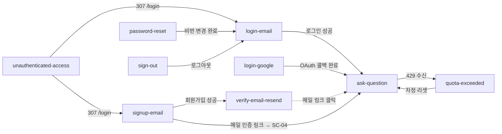

# 00. 전체 Flow 개요

## 1. Goal

logos-rag v1 의 모든 사용자 여정을 한눈에 조망하고, 각 flow 문서로의 진입점 매트릭스와 flow 간 연결 관계를 제공한다.

---

## 2. Flow 목록

| #  | 파일명                     | 요약                                      | 주요 화면 ID            |
|----|----------------------------|-------------------------------------------|-------------------------|
| 01 | `signup-email.md`          | 이메일 회원가입 → 인증 메일 → 세션 확립 → /qa | SC-03 → SC-05 → SC-04 → SC-01 |
| 02 | `login-email.md`           | 이메일 로그인 → /qa                        | SC-03 → SC-01           |
| 03 | `login-google.md`          | Google OAuth → 콜백 → /qa                 | SC-03 → SC-04 → SC-01   |
| 04 | `password-reset.md`        | 비밀번호 잊음 → 매직링크 → 새 비번 설정   | SC-03 → SC-06 → SC-04 → SC-06 → SC-03 |
| 05 | `verify-email-resend.md`   | SC-05 에서 60초 쿨다운 재전송             | SC-05                   |
| 06 | `ask-question.md`          | 질문 입력 → POST /api/qa → 답변 렌더링    | SC-01 (SC-02 분기)       |
| 07 | `quota-exceeded.md`        | 429 → SC-02 전환 → 자정 reset             | SC-01 → SC-02           |
| 08 | `sign-out.md`              | 헤더 드롭다운 로그아웃 → /login           | SC-07 → SC-03           |
| 09 | `unauthenticated-access.md`| 미인증 /qa 직접 접근 → proxy.ts 307       | SC-01 차단 → SC-03      |

---

## 3. 진입점 매트릭스

| 진입 URL                              | ANONYMOUS                          | AUTHENTICATED                          | 담당 flow                      |
|---------------------------------------|------------------------------------|----------------------------------------|--------------------------------|
| `/`                                   | `/qa` → `/login` 307               | `/qa` 307 → SC-01                      | unauthenticated-access          |
| `/qa`                                 | `/login` 307 (proxy.ts)            | SC-01 렌더                             | unauthenticated-access / ask-question |
| `/qa` (한도 초과)                     | —                                  | SC-02 sub-state                        | quota-exceeded                  |
| `/login`                              | SC-03 (login 탭 default)           | `/qa` 307                              | login-email / login-google      |
| `/login?tab=signup`                   | SC-03 (signup 탭 활성)             | `/qa` 307                              | signup-email                    |
| `/auth/callback?code=...`             | SC-04 → 토큰 교환 → `/qa`         | `/qa` 307                              | signup-email / login-google     |
| `/auth/callback?type=recovery&code=...` | SC-04 → SC-06 step 2            | 동일                                   | password-reset                  |
| `/auth/verify-email`                  | SC-05                              | `/qa` 307                              | signup-email / verify-email-resend |
| `/auth/reset-password`                | SC-06 step 1                       | SC-06 step 1 (자기 비번 재설정)        | password-reset                  |
| `/auth/reset-password?step=2`         | SC-06 step 2 (recovery 토큰 필요)  | 동일                                   | password-reset                  |
| 없는 경로                             | SC-09 (404)                        | SC-09 (404)                            | —                               |
| 서버 오류                             | SC-09 (500)                        | SC-09 (500)                            | —                               |

---

## 4. Flow 간 연결 그래프

---

## 5. 공통 인증 상태 참조

| 상태 ID   | 설명                                        |
|-----------|---------------------------------------------|
| ANONYMOUS | Supabase 세션 없음. `/qa` 접근 차단         |
| AUTHENTICATED | Supabase 세션 보유 (JWT 쿠키). `/qa` 접근 가능 |
| RECOVERY  | `type=recovery` 임시 세션 (비밀번호 재설정 전용) |

---

## 6. 공통 인증 레이어 (모든 flow 에 적용)

- **proxy.ts** (Edge): `/qa` 경로 보호. 세션 쿠키 없으면 307 `/login`.
- **Route Handler** (`/api/qa`): defence-in-depth `getUser()` 재검증.
- **Server Action** (`app/login/_actions.ts` 등): 각 액션 진입 시 `getUser()` 확인.
- **RSC layer** (page.tsx): 화면별 인증 상태에 따라 redirect 처리.

---

## 7. 쿠키 / 세션 흐름 요약

| 이벤트                            | 쿠키 변화                                           |
|-----------------------------------|-----------------------------------------------------|
| `signInWithPassword` 성공         | `sb-access-token`, `sb-refresh-token` Set-Cookie    |
| `exchangeCodeForSession` 성공     | 동일 Set-Cookie                                     |
| `signOut` 성공                    | 위 두 쿠키 삭제                                     |
| access-token 만료 (기본 1시간)    | Supabase SSR 미들웨어가 refresh-token 으로 자동 갱신 |
| refresh-token 만료                | 세션 삭제 → 다음 `/qa` 접근 시 proxy.ts 307         |
