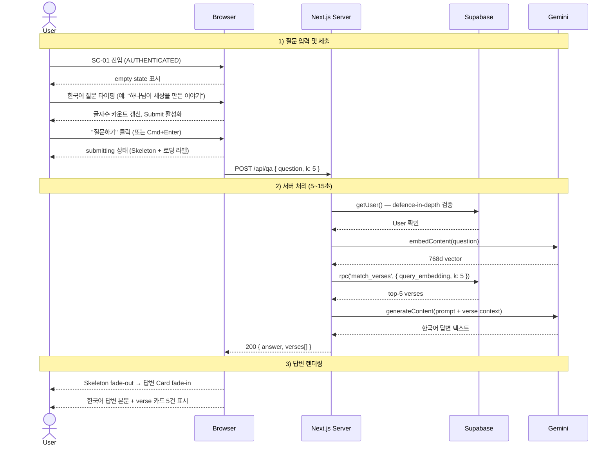

# ask-question — 질문 입력 → 답변 렌더링 Flow

## 1. Goal

AUTHENTICATED 사용자가 SC-01 에서 한국어 질문을 입력하고, POST /api/qa 를 통해 5~15초 내에 한국어 답변 본문 + 영문 근거 verse 카드 5건을 받아 렌더링한다.

---

## 2. Persona

- **페르소나 a** (포트폴리오 데모 리뷰어) — 데모용으로 흐름이 막힘없이 동작하는지 확인
- **페르소나 b** (신앙인 일반) — 한국어 구어체 질문 → 한국어 답변 + verse 인용 확인
- **페르소나 c** (신학생/연구자) — verse 카드의 영문 원문 + 라벨 확인

---

## 3. Entry points

| 진입 경로                              | 설명                                     |
|----------------------------------------|------------------------------------------|
| SC-01 (직접 접근, AUTHENTICATED)       | proxy.ts 통과 후 SC-01 `empty` 상태      |
| 인증 완료 후 자동 redirect (모든 인증 flow) | 세션 확립 → `/qa` 307 → SC-01         |

---

## 4. Preconditions

- 인증 상태: **AUTHENTICATED** (Supabase 세션 쿠키 유효)
- 한도 상태: `quota.state ≠ exceeded` (일일 한도 미소진)
- Textarea 에 1~500자 입력 완료

---

## 5. Happy path

| Step | 화면 ID | 사용자 액션                                       | 시스템 응답                                                     | 다음 화면 |
|------|---------|---------------------------------------------------|-----------------------------------------------------------------|-----------|
| 1    | SC-01   | SC-01 진입                                        | `qa.state = empty`. Textarea 비어있음. Submit disabled.         | SC-01     |
| 2    | SC-01   | Textarea 클릭 → 한국어 질문 타이핑                | `qa.state = typing`. 글자수 실시간 갱신. Submit 활성.           | SC-01     |
| 3    | SC-01   | "질문하기" 버튼 클릭 (또는 Cmd/Ctrl + Enter)      | `qa.state = submitting`. Textarea + 버튼 disabled. 이전 답변 영역 fade-out → Skeleton fade-in. | SC-01 |
| 4    | SC-01   | (대기 5~15초)                                     | `POST /api/qa { question, k: 5 }` 전송                          | SC-01     |
| 5    | —       | (서버 처리)                                       | Route Handler: `getUser()` 세션 검증                            | —         |
| 6    | —       | (서버 처리)                                       | Gemini `embedContent(question)` → 768d vector                   | —         |
| 7    | —       | (서버 처리)                                       | Supabase `rpc('match_verses', { query_embedding, k: 5 })` → top-5 verses | —  |
| 8    | —       | (서버 처리)                                       | Gemini `generateContent(prompt + verse context)` → 한국어 답변  | —         |
| 9    | SC-01   | (자동)                                            | 200 응답 `{ answer, verses[] }` 수신 → `qa.state = success`. Skeleton fade-out → 답변 Card fade-in. | SC-01 |
| 10   | SC-01   | 답변 Card + verse 카드 5건 확인                   | 한국어 답변 본문 + 영문 verse 카드 렌더링 완료                  | SC-01     |

---

## 6. Edge cases

| 케이스                              | 분기 처리                                                                                    |
|-------------------------------------|----------------------------------------------------------------------------------------------|
| 빈 입력 Submit 시도                 | Submit disabled 이므로 호출 없음 (자동 방어).                                                |
| 500자 초과 입력                     | `qa.state = typing.over-limit`. 글자수 `text-destructive`. Submit disabled.                  |
| submitting 중 Cmd+Enter 재시도      | Submit disabled → 무시.                                                                      |
| 응답 timeout (15초 초과)            | 클라이언트 abort → `qa.state = error.gemini-other`. Alert(destructive) "답변 생성 중 오류가 발생했습니다." + "다시 시도" 버튼. |
| 네트워크 끊김                       | fetch reject → `qa.state = error.network`. Alert(destructive) "네트워크 연결을 확인해주세요." + "다시 시도" 버튼. |
| 401 (세션 만료)                     | `qa.state = error.401`. Toast(destructive, "세션이 만료되었습니다.") + 500ms 후 `router.push('/login')`. |
| 429 자체 한도 초과                  | `qa.state = disabled.quota-exceeded` → `quota-exceeded` flow 전환 (SC-02 sub-state).         |
| 429 Gemini self 한도 초과           | `qa.state = error.gemini-429`. Alert(destructive) "AI 서비스가 일시적으로 혼잡합니다." + "다시 시도". |
| 500 / 502 (LLM 오류)                | `qa.state = error.gemini-other`. Alert(destructive) + "다시 시도".                           |
| 검색 결과 0건                       | `qa.state = error.no-results`. Alert(default, Search 아이콘) "관련 성경 구절을 찾지 못했습니다. 질문을 다르게 표현해보세요." |
| "다시 시도" 클릭                    | 동일 question 으로 `submitting` 재시작.                                                      |
| 새 질문 작성 (success 상태)          | 이전 답변 영역 덮어쓰기. `submitting` 재시작.                                                |
| Textarea 줄바꿈 다수 (max-rows=10)  | rows=10 이후 overflow-y-auto 스크롤.                                                         |
| 모바일 소프트 키보드 올라옴          | min-h-screen 없이 레이아웃 스크롤 가능.                                                      |
| verse 카드 텍스트 매우 긴 경우       | `line-clamp-4` 로 제한. 마우스 오버 시 전체 표시 (선택).                                    |
| `?debug=1` URL 파라미터 존재        | verse 카드 유사도 점수 `span.text-xs` 노출 활성화.                                           |
| 제출 중 브라우저 탭 닫기            | 미완료 상태로 종료 (별도 처리 없음).                                                         |

---

## 7. State transitions

| 전환                              | `qa.state`                    | 답변 영역 표시                      |
|-----------------------------------|-------------------------------|-------------------------------------|
| SC-01 진입                        | `empty`                       | BookOpen 아이콘 + 안내 텍스트       |
| Textarea 타이핑 시작              | `typing`                      | empty 유지                          |
| 500자 초과                        | `typing.over-limit`           | empty 유지                          |
| Submit 클릭 / Cmd+Enter           | `submitting`                  | Skeleton × 3 + 로딩 라벨           |
| 200 응답 수신                     | `success`                     | 답변 Card + verse 카드 5건          |
| 429 (자체) 수신                   | `disabled.quota-exceeded`     | SC-02 sub-state (quota-exceeded flow) |
| 429 (Gemini) 수신                 | `error.gemini-429`            | Alert(destructive) + "다시 시도"    |
| 네트워크 오류                     | `error.network`               | Alert(destructive) + "다시 시도"    |
| 401 수신                          | `error.401`                   | Toast + redirect /login             |
| 500/502 수신                      | `error.gemini-other`          | Alert(destructive) + "다시 시도"    |
| 결과 0건                          | `error.no-results`            | Alert(default)                      |
| timeout                           | `error.gemini-other`          | Alert(destructive) + "다시 시도"    |

---

## 8. API calls

| 인터페이스                    | 설명                                                                    |
|-------------------------------|-------------------------------------------------------------------------|
| POST `/api/qa`                | `app/api/qa/route.ts`. 질문 → embed → match_verses → generate → 응답   |
| (phase-04) GET `/api/quota`   | 잔여 일일 한도 조회. SC-07 Badge 갱신용.                                |

**POST /api/qa Request:**
```json
{ "question": "string (1~500자)", "k": 5 }
```

**POST /api/qa Response 200:**
```json
{
  "ok": true,
  "data": {
    "answer": "string (한국어 답변)",
    "verses": [{ "verse_id": "uuid", "book": "Genesis", "chapter": 1, "verse_number": 1, "label": "Genesis 1:1", "text": "...", "similarity": 0.87 }]
  }
}
```

---

## 9. Cookies / session 변화

| 시점                       | 쿠키 변화                                            |
|----------------------------|------------------------------------------------------|
| POST /api/qa 호출 시        | 기존 쿠키 유지 (세션 재검증만)                       |
| 401 응답 (세션 만료)        | 쿠키 만료됨. 재로그인 후 새 쿠키 발급.               |
| 정상 응답                  | 쿠키 변화 없음. (phase-04) `user_quota.today_count++` |

---

## 10. Postconditions

- `qa.state = success`: 답변 Card + verse 5건 렌더링 완료
- Textarea 는 질문 텍스트 유지 (수정해 재질문 가능)
- (phase-04) `user_quota.today_count` 1 증가
- SC-07 헤더 Badge 잔여 한도 갱신

---

## 11. Mermaid sequence diagram



---

## 12. Acceptance criteria

- [ ] SC-01 진입 시 `empty` 상태로 Textarea 비어있고 Submit 이 disabled 된다
- [ ] 한국어 질문 입력 시 `typing` 상태 전환과 글자수 카운트가 실시간 갱신된다
- [ ] 500자 초과 시 글자수 `text-destructive` + Submit disabled 가 된다
- [ ] Submit 클릭 후 Skeleton 3줄 + "답변 생성 중... (5~15초 소요)" 로딩 라벨이 표시된다
- [ ] 200 응답 수신 시 한국어 답변 본문 Card + 영문 verse 카드 5건이 렌더링된다
- [ ] verse 카드 본문이 `font-serif` 로 표시되고 `Badge` 에 `Book Chapter:Verse` 라벨이 있다
- [ ] 새 질문 제출 시 이전 답변이 덮어쓰인다 (히스토리 없음)
- [ ] 429 (자체 한도) 응답 시 SC-02 sub-state 로 전환된다
- [ ] 401 응답 시 Toast(destructive) + 500ms 후 `/login` redirect 된다
- [ ] 네트워크 끊김 시 Alert(destructive) + "다시 시도" 버튼이 표시된다
- [ ] Cmd/Ctrl + Enter 단축키로 Submit 이 트리거된다
