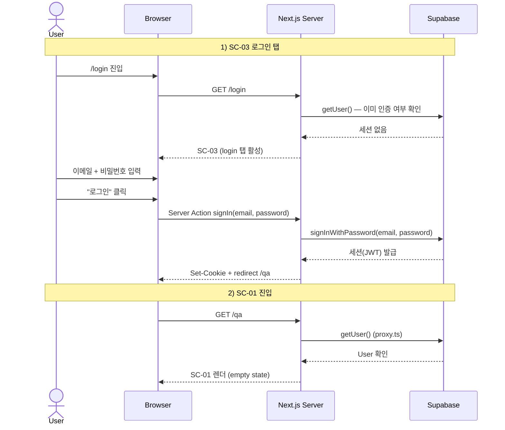

# login-email — 이메일 로그인 Flow

## 1. Goal

기존 가입자가 이메일·비밀번호로 로그인해 세션을 확립하고 SC-01(/qa)에 진입한다.

---

## 2. Persona

**페르소나 a** (재방문 포트폴리오 리뷰어), **페르소나 b** (신앙인 일반), **페르소나 c** (신학생) — 이미 계정이 있는 모든 이메일 가입자.

---

## 3. Entry points

| 진입 경로                              | 설명                                        |
|----------------------------------------|---------------------------------------------|
| `/login`                               | 기본 진입. login 탭 default 활성            |
| `/qa` 직접 접근 (ANONYMOUS) → 307      | proxy.ts → `/login` redirect 후 로그인      |
| SC-05 "로그인 화면으로" 링크           | 이메일 인증 안내에서 복귀                   |
| SC-06 Step 2 완료 후 redirect          | 비밀번호 재설정 완료 → `/login` redirect    |

---

## 4. Preconditions

- 인증 상태: ANONYMOUS
- 해당 이메일로 가입된 계정 존재
- 이메일 인증 완료 상태 (미완료 시 별도 에러 분기)
- 한도 상태: 해당 없음

---

## 5. Happy path

| Step | 화면 ID | 사용자 액션                               | 시스템 응답                                              | 다음 화면 |
|------|---------|-------------------------------------------|----------------------------------------------------------|-----------|
| 1    | SC-03   | `/login` 진입                             | login 탭 활성 상태의 SC-03 렌더                          | SC-03     |
| 2    | SC-03   | 이메일 입력 (blur)                        | 이메일 형식 클라이언트 검증 통과                         | SC-03     |
| 3    | SC-03   | 비밀번호 입력                             | 입력 완료                                                | SC-03     |
| 4    | SC-03   | "로그인" 클릭 (또는 Enter)                | `auth.state = loading.email`, 폼·버튼 disabled           | SC-03     |
| 5    | SC-03   | (대기)                                    | Server Action `signIn` → Supabase `signInWithPassword(email, password)` | SC-03 |
| 6    | —       | (자동)                                    | Supabase: 세션(JWT) 발급                                 | —         |
| 7    | —       | (자동)                                    | Server Action: Set-Cookie (`sb-access-token`, `sb-refresh-token`) + redirect `/qa` | SC-01 |
| 8    | SC-01   | 진입                                      | proxy.ts 통과 (세션 유효) → SC-01 렌더                   | SC-01     |

---

## 6. Edge cases

| 케이스                          | 분기 처리                                                                         |
|---------------------------------|-----------------------------------------------------------------------------------|
| 이메일 형식 오류                | `field.email.error = 'format'` 인라인. Submit 차단.                               |
| 잘못된 자격증명                 | `auth.state = error.invalid-credentials`. Alert(destructive) 표시. 폼 유지.      |
| 미인증 이메일 (가입 후 미확인)  | `auth.state = error.email-not-verified`. Alert(default, MailWarning) + "인증 메일 재전송" CTA → `/auth/verify-email?email=...` |
| 네트워크 오류                   | `auth.state = error.network`. Alert(destructive) 표시.                           |
| 이미 인증된 상태로 `/login` 진입 | RSC layer: `/qa` 307 redirect.                                                   |
| 로딩 중 탭 전환 시도            | 탭 disabled (방어).                                                               |
| Google OAuth 팝업 취소         | SC-03 default 복귀. 에러 표시 없음.                                               |
| 비밀번호를 잊은 경우            | "비밀번호를 잊으셨나요?" 링크 → `password-reset` flow 진입.                       |
| 연속 로그인 실패                | Supabase 기본 잠금 정책 적용 (Supabase Dashboard 설정).                           |

---

## 7. State transitions

| 전환                               | 인증 상태           | 화면 상태                          |
|------------------------------------|---------------------|------------------------------------|
| SC-03 진입                         | ANONYMOUS           | `auth.state = default`, `auth.tab = login` |
| 이메일 blur 검증 통과              | ANONYMOUS           | `field.email.error = null`         |
| "로그인" 클릭                      | ANONYMOUS           | `auth.state = loading.email`       |
| signIn 성공 → redirect             | AUTHENTICATED       | `auth.state = success.login` → navigate |
| SC-01 진입                         | AUTHENTICATED       | `qa.state = empty`                 |
| signIn 실패 (자격증명)             | ANONYMOUS           | `auth.state = error.invalid-credentials` |
| signIn 실패 (미인증 이메일)        | ANONYMOUS           | `auth.state = error.email-not-verified` |

---

## 8. API calls

| 인터페이스                                | 설명                                         |
|-------------------------------------------|----------------------------------------------|
| Server Action `signIn(email, password)`   | `app/login/_actions.ts` → Supabase `signInWithPassword` |

---

## 9. Cookies / session 변화

| 시점                              | 쿠키 변화                                                    |
|-----------------------------------|--------------------------------------------------------------|
| signIn 성공 (Server Action)       | `sb-access-token`, `sb-refresh-token` Set-Cookie             |
| SC-01 진입 이후                   | 위 쿠키 유지. access-token 만료 시 refresh-token 으로 자동 갱신. |

---

## 10. Postconditions

- 사용자 인증 상태: **AUTHENTICATED**
- Supabase 세션 쿠키 활성
- 현재 화면: SC-01 (`qa.state = empty`)

---

## 11. Mermaid sequence diagram

---

## 12. Acceptance criteria

- [ ] `/login` 진입 시 login 탭이 기본 활성 상태로 렌더된다
- [ ] 이메일 형식 오류 시 인라인 에러가 표시되고 Submit 이 차단된다
- [ ] 잘못된 자격증명 시 Alert(destructive) "이메일 또는 비밀번호가 올바르지 않습니다." 가 표시된다
- [ ] 미인증 이메일 로그인 시 Alert(default, MailWarning) + "인증 메일 재전송" CTA 가 표시된다
- [ ] signIn 성공 후 Set-Cookie 와 함께 `/qa` 로 redirect 된다
- [ ] SC-01 에서 질문 입력이 가능한 `empty` 상태가 된다
- [ ] 이미 로그인된 상태로 `/login` 방문 시 `/qa` 로 즉시 redirect 된다
- [ ] 로딩 중 탭 전환이 차단된다 (탭 disabled)
