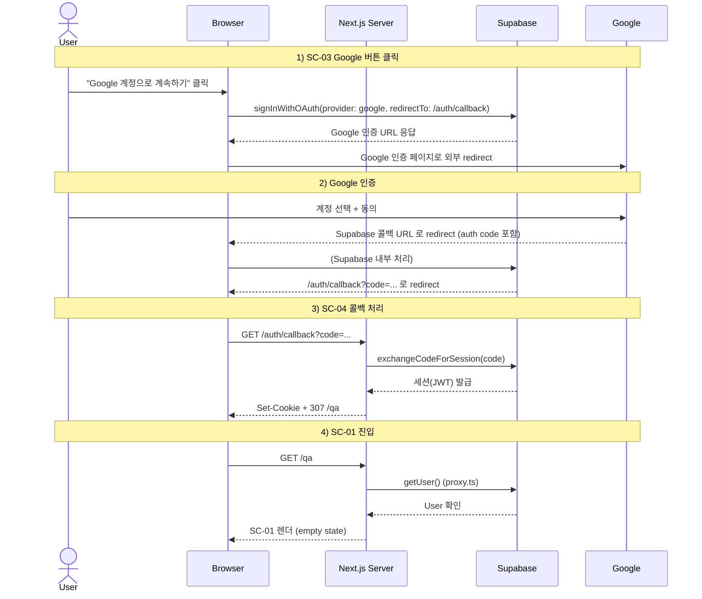

# login-google — Google OAuth 로그인 Flow

## 1. Goal

미인증 사용자가 Google 계정으로 OAuth 인증을 완료하고, SC-04 콜백에서 세션을 확립해 SC-01(/qa)에 진입한다.

---

## 2. Persona

주로 **페르소나 a** (포트폴리오 데모 리뷰어) — 이메일·비밀번호 가입 없이 빠르게 진입하려는 사용자.

---

## 3. Entry points

| 진입 경로                              | 설명                                          |
|----------------------------------------|-----------------------------------------------|
| SC-03 (login 탭 또는 signup 탭)        | "Google 계정으로 계속하기" 버튼 클릭          |
| `/login?tab=signup` (회원가입 탭)      | 탭과 무관하게 Google 버튼은 Tabs 상단 고정    |

---

## 4. Preconditions

- 인증 상태: ANONYMOUS
- Supabase Dashboard 에서 Google OAuth Provider 활성화 + redirect URL 등록 완료
- 사용자 기기에 Google 계정 접근 가능 환경

---

## 5. Happy path

| Step | 화면 ID | 사용자 액션                                   | 시스템 응답                                              | 다음 화면 |
|------|---------|-----------------------------------------------|----------------------------------------------------------|-----------|
| 1    | SC-03   | `/login` 진입                                 | SC-03 렌더                                               | SC-03     |
| 2    | SC-03   | "Google 계정으로 계속하기" 클릭               | `auth.state = loading.google`, 버튼 disabled             | SC-03     |
| 3    | —       | (자동)                                        | Supabase Client SDK `signInWithOAuth({ provider: 'google', redirectTo: '<origin>/auth/callback' })` | — |
| 4    | —       | (자동)                                        | Supabase: Google 인증 URL 생성 + 브라우저 외부 redirect  | (Google 인증) |
| 5    | (Google) | Google 계정 선택 / 동의                       | Google: Supabase 로 인증 코드 발급 + redirect 완료       | SC-04     |
| 6    | SC-04   | (자동)                                        | 브라우저: GET `/auth/callback?code=...` 도착             | SC-04     |
| 7    | SC-04   | (자동)                                        | Route Handler `exchangeCodeForSession(code)` 호출        | SC-04     |
| 8    | —       | (자동)                                        | Supabase: 세션(JWT) 발급 → Set-Cookie (`sb-access-token`, `sb-refresh-token`) | — |
| 9    | —       | (자동)                                        | Route Handler: 307 redirect → `/qa`                     | SC-01     |
| 10   | SC-01   | 진입                                          | proxy.ts 통과 (세션 유효) → SC-01 렌더                   | SC-01     |

---

## 6. Edge cases

| 케이스                            | 분기 처리                                                                       |
|-----------------------------------|---------------------------------------------------------------------------------|
| Google 팝업 / 화면에서 취소       | `?error=access_denied` 쿼리 포함 콜백 → Route Handler 가 `/login` redirect. SC-03 default 복귀. 에러 표시 없음. |
| SC-04 도달 시 code 파라미터 없음  | Route Handler 즉시 `/login` redirect. 또는 SC-04 page.tsx `error.code-invalid` 표시. |
| 인증 코드 만료                    | SC-04 폴백 UI `error.code-expired`. "로그인 화면으로 돌아가기" CTA.             |
| Supabase 응답 오류 (네트워크)     | SC-04 `error.network` UI.                                                       |
| 서드파티 쿠키 차단 환경           | Set-Cookie 실패 → SC-04 `error.network` UI + "브라우저의 쿠키 설정을 확인해주세요" 추가 안내. |
| 이미 인증된 상태로 `/auth/callback` 도달 | Route Handler: `/qa` 즉시 redirect.                                     |
| Google 계정 최초 가입 vs 재로그인  | Supabase 가 자동 처리 (`auth.users` INSERT 또는 재사용). UI 분기 없음.           |
| Google 로그인 중 새 탭에서 동일 흐름 | 두 번째 탭에서 이미 세션이 생기면 두 번째 탭 SC-01 즉시 진입. 첫 탭은 콜백 도달 후 정상 흐름. |

---

## 7. State transitions

| 전환                                     | 인증 상태               | 화면 상태                            |
|------------------------------------------|-------------------------|--------------------------------------|
| SC-03 진입                               | ANONYMOUS               | `auth.state = default`               |
| Google 버튼 클릭                         | ANONYMOUS               | `auth.state = loading.google`        |
| Google 인증 외부 redirect 시작           | ANONYMOUS               | (외부 페이지, 앱 상태 없음)           |
| Google 취소 → 콜백 error redirect        | ANONYMOUS               | SC-03 `auth.state = default` 복귀    |
| SC-04 도착 (코드 포함)                   | ANONYMOUS → 처리 중     | `callback.state = loading`           |
| `exchangeCodeForSession` 성공            | AUTHENTICATED           | `callback.state = success` → 307 /qa |
| SC-01 진입                               | AUTHENTICATED           | `qa.state = empty`                   |

---

## 8. API calls

| 인터페이스                                              | 설명                                          |
|---------------------------------------------------------|-----------------------------------------------|
| Supabase Client SDK `signInWithOAuth({ provider: 'google', ... })` | SC-03 클라이언트에서 직접 호출. 외부 redirect 시작. |
| GET `/auth/callback?code=...` (Route Handler)           | `app/auth/callback/route.ts` → `exchangeCodeForSession` |

---

## 9. Cookies / session 변화

| 시점                                    | 쿠키 변화                                              |
|-----------------------------------------|--------------------------------------------------------|
| SC-03 → signInWithOAuth 호출            | 없음 (외부 redirect 시작)                              |
| SC-04 `exchangeCodeForSession` 성공     | `sb-access-token`, `sb-refresh-token` Set-Cookie       |
| SC-01 진입 이후                         | 위 쿠키 유지. 만료 시 자동 갱신.                       |

---

## 10. Postconditions

- 사용자 인증 상태: **AUTHENTICATED**
- Supabase `auth.users` 에 Google 계정 레코드 존재 (신규 또는 기존)
- Supabase 세션 쿠키 활성
- 현재 화면: SC-01 (`qa.state = empty`)

---

## 11. Mermaid sequence diagram

---

## 12. Acceptance criteria

- [ ] SC-03 에서 "Google 계정으로 계속하기" 버튼 클릭 시 `loading.google` 상태로 전환되고 버튼이 disabled 된다
- [ ] Google 인증 후 `/auth/callback?code=...` 에 도달하면 Route Handler 가 토큰 교환 및 Set-Cookie 를 처리한다
- [ ] 처리 후 307 redirect 로 SC-01 에 진입한다
- [ ] Google 인증 취소 시 SC-03 default 상태로 복귀하며 에러 메시지가 노출되지 않는다
- [ ] 인증 코드 만료 시 SC-04 폴백 UI 에 `error.code-expired` 와 CTA 가 표시된다
- [ ] 이미 인증된 상태로 `/auth/callback` 에 도달하면 `/qa` 로 즉시 redirect 된다
