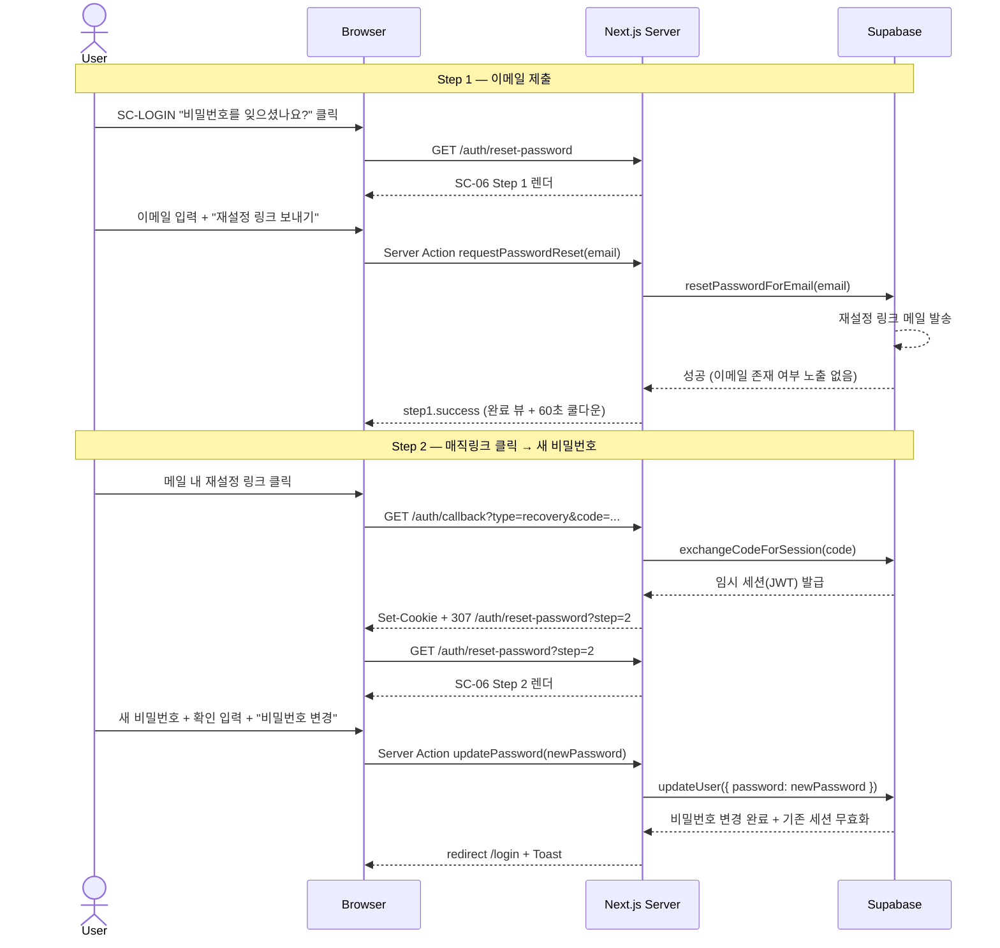

# password-reset — 비밀번호 재설정 Flow

## 1. Goal

비밀번호를 잊은 사용자가 SC-03 에서 "비밀번호를 잊으셨나요?" 링크를 통해 SC-06 에 진입하고, 재설정 메일 → 매직링크 클릭 → SC-04 recovery 콜백 → 새 비밀번호 입력 → 세션 확립 → SC-03 로그인 복귀까지의 전체 흐름을 완료한다.

---

## 2. Persona

**페르소나 a / b / c** 모두 — 이메일·비밀번호로 가입한 사용자가 비밀번호를 잊은 경우.

---

## 3. Entry points

| 진입 경로                                       | 설명                                          |
|-------------------------------------------------|-----------------------------------------------|
| SC-03 (login 탭) "비밀번호를 잊으셨나요?" 링크 | Step 1 진입. `/auth/reset-password` 로 이동   |
| `/auth/reset-password` 직접 접근                | Step 1 진입 (인증 여부 무관)                  |
| `/auth/callback?type=recovery&code=...`         | 메일 링크 클릭 후 SC-04 → Step 2 redirect     |
| `/auth/reset-password?step=2`                   | SC-04 recovery 처리 완료 후 redirect 목적지    |

---

## 4. Preconditions

- 인증 상태: ANONYMOUS (Step 1) 또는 RECOVERY 임시 세션 (Step 2)
- Step 2 는 recovery 토큰을 보유한 임시 세션이 없으면 `error.token-invalid` 표시

---

## 5. Happy path

### Step 1 — 이메일 제출

| Step | 화면 ID | 사용자 액션                                   | 시스템 응답                                                | 다음 화면 |
|------|---------|-----------------------------------------------|------------------------------------------------------------|-----------|
| 1    | SC-03   | "비밀번호를 잊으셨나요?" 링크 클릭           | `/auth/reset-password` 로 페이지 이동                     | SC-06     |
| 2    | SC-06   | `/auth/reset-password` 진입                   | SC-06 Step 1 렌더 (`step1.default`)                        | SC-06     |
| 3    | SC-06   | 이메일 입력 (blur)                            | 이메일 형식 클라이언트 검증                                | SC-06     |
| 4    | SC-06   | "재설정 링크 보내기" 클릭                     | `reset.state = step1.loading`, 버튼 disabled               | SC-06     |
| 5    | SC-06   | (대기)                                        | Server Action `requestPasswordReset(email)` → Supabase `resetPasswordForEmail(email)` | SC-06 |
| 6    | SC-06   | (자동)                                        | Supabase: 재설정 링크 메일 발송 (이메일 존재 여부 노출 없이 통일 응답) | — |
| 7    | SC-06   | (자동)                                        | Server Action 성공 → `reset.state = step1.success`. 카드가 완료 뷰로 교체. 재전송 버튼 60초 쿨다운 시작. | SC-06 |

### Step 2 — 새 비밀번호 설정

| Step | 화면 ID | 사용자 액션                                   | 시스템 응답                                                | 다음 화면 |
|------|---------|-----------------------------------------------|------------------------------------------------------------|-----------|
| 8    | (이메일) | 메일 내 재설정 링크 클릭                     | GET `/auth/callback?type=recovery&code=...`                | SC-04     |
| 9    | SC-04   | (자동)                                        | Route Handler `exchangeCodeForSession(code)` → recovery 임시 세션 발급 | SC-04 |
| 10   | —       | (자동)                                        | Route Handler: 307 redirect → `/auth/reset-password?step=2` | SC-06  |
| 11   | SC-06   | `/auth/reset-password?step=2` 진입            | SC-06 Step 2 렌더 (`step2.default`)                        | SC-06     |
| 12   | SC-06   | 새 비밀번호 입력 (8자+, blur)                 | 길이 검증 통과                                             | SC-06     |
| 13   | SC-06   | 비밀번호 확인 입력 (blur)                     | 일치 검증 통과                                             | SC-06     |
| 14   | SC-06   | "비밀번호 변경" 클릭                          | `reset.state = step2.loading`                              | SC-06     |
| 15   | SC-06   | (대기)                                        | Server Action `updatePassword(newPassword)` → Supabase `updateUser({ password })` | SC-06 |
| 16   | —       | (자동)                                        | Supabase: 비밀번호 해시 갱신 + 기존 세션 모두 무효화       | —         |
| 17   | SC-03   | (자동)                                        | Server Action: redirect `/login` + Toast(default, "비밀번호가 변경되었습니다. 새 비밀번호로 로그인해주세요.") | SC-03 |

---

## 6. Edge cases

| 케이스                                      | 분기 처리                                                                              |
|---------------------------------------------|----------------------------------------------------------------------------------------|
| Step 1 이메일 형식 오류                      | `field.email.error = 'format'` 인라인. Submit 차단.                                    |
| Step 1 네트워크 오류                         | `reset.state = step1.error.network`. Alert(destructive) 표시.                          |
| 가입되지 않은 이메일 입력 (Step 1)           | Supabase 통일 응답 — 이메일 존재 여부 노출 안 함. `step1.success` 로 진행.             |
| Step 1 완료 후 재전송 (쿨다운 중)            | 재전송 버튼 disabled + 카운트다운 라벨 ("재전송 가능 (N초)").                          |
| Step 1 완료 후 재전송 (쿨다운 종료)          | 버튼 활성화 → 클릭 시 다시 `requestPasswordReset` 호출 + 60초 쿨다운 재시작.           |
| Step 2 URL 직접 방문 (recovery 토큰 없음)    | RSC layer 또는 Server Action: `step2.error.token-invalid` UI. "로그인 화면으로" CTA.   |
| Step 2 recovery 토큰 만료 (Supabase 기본 1시간) | Server Action: `step2.error.token-expired` UI. "다시 요청하기" → Step 1 초기화 CTA. |
| Step 2 비밀번호 8자 미만                     | `reset.state = step2.error.password-too-short` 인라인.                                 |
| Step 2 비밀번호 불일치                       | `reset.state = step2.error.password-mismatch` 인라인.                                  |
| Step 2 네트워크 오류                         | `reset.state = step2.error.network`. Alert(destructive) 표시.                          |
| 비밀번호 변경 성공 후 기존 세션              | Supabase 가 자동 무효화. UI 에서 별도 처리 불필요.                                     |
| 쿨다운 중 페이지 새로고침 (Step 1 완료 뷰)   | 쿨다운 초기화 (v1). SC-06 Step 1 default 로 복귀.                                      |

---

## 7. State transitions

| 전환                                      | 인증 상태             | 화면 상태                                  |
|-------------------------------------------|-----------------------|--------------------------------------------|
| SC-03 "비밀번호 잊음" 링크 클릭           | ANONYMOUS             | navigate to SC-06                          |
| SC-06 Step 1 진입                         | ANONYMOUS             | `reset.state = step1.default`              |
| "재설정 링크 보내기" 클릭                 | ANONYMOUS             | `reset.state = step1.loading`              |
| requestPasswordReset 성공                 | ANONYMOUS             | `reset.state = step1.success` + 쿨다운 60초 |
| 재전송 버튼 쿨다운                        | ANONYMOUS             | `reset.state = step1.cooldown`             |
| SC-04 recovery 콜백 도착                  | ANONYMOUS → RECOVERY  | `callback.state = loading`                 |
| `exchangeCodeForSession(recovery)` 성공   | RECOVERY (임시 세션)  | 307 `/auth/reset-password?step=2`          |
| SC-06 Step 2 진입                         | RECOVERY              | `reset.state = step2.default`              |
| "비밀번호 변경" 클릭                      | RECOVERY              | `reset.state = step2.loading`              |
| updatePassword 성공                       | ANONYMOUS (세션 무효) | `reset.state = step2.success` → redirect `/login` |
| SC-03 복귀                                | ANONYMOUS             | SC-03 `auth.state = default` + Toast       |

---

## 8. API calls

| 인터페이스                                              | 설명                                                    |
|---------------------------------------------------------|---------------------------------------------------------|
| Server Action `requestPasswordReset(email)`             | `app/login/_actions.ts` → Supabase `resetPasswordForEmail` |
| GET `/auth/callback?type=recovery&code=...` (Route Handler) | `app/auth/callback/route.ts` → `exchangeCodeForSession` (recovery 분기) |
| Server Action `updatePassword(newPassword)`             | `app/login/_actions.ts` → Supabase `updateUser({ password })` |

---

## 9. Cookies / session 변화

| 시점                                          | 쿠키 변화                                               |
|-----------------------------------------------|---------------------------------------------------------|
| Step 1 submit 성공                            | 없음 (메일 발송만)                                      |
| SC-04 `exchangeCodeForSession(recovery)` 성공 | RECOVERY 임시 세션 쿠키 Set-Cookie                      |
| `updatePassword` 성공                         | 기존 세션 쿠키 무효화. 사용자는 재로그인 필요.           |
| SC-03 redirect 이후                           | 세션 없음 (ANONYMOUS). 새 로그인으로 세션 재확립 필요.   |

---

## 10. Postconditions

- 비밀번호: 새 비밀번호로 변경 완료
- 인증 상태: **ANONYMOUS** (기존 세션 모두 무효화)
- 현재 화면: SC-03 (login 탭) + Toast "비밀번호가 변경되었습니다."
- 사용자는 새 비밀번호로 `login-email` flow 를 통해 재로그인 필요

---

## 11. Mermaid sequence diagram

---

## 12. Acceptance criteria

- [ ] SC-03 "비밀번호를 잊으셨나요?" 링크 클릭 시 `/auth/reset-password` (SC-06 Step 1) 로 이동한다
- [ ] 이메일 형식 오류 시 인라인 에러와 Submit 차단이 동작한다
- [ ] Step 1 submit 성공 시 카드 전체가 완료 뷰로 교체되고 60초 쿨다운 재전송 버튼이 표시된다
- [ ] 가입되지 않은 이메일 입력 시에도 `step1.success` 로 처리되어 이메일 존재 여부가 노출되지 않는다
- [ ] `/auth/callback?type=recovery&code=...` 도달 시 Route Handler 가 recovery 임시 세션을 발급하고 SC-06 Step 2 로 redirect 한다
- [ ] Step 2 에서 비밀번호 8자 미만 / 불일치 시 인라인 에러가 표시된다
- [ ] `updatePassword` 성공 시 `/login` 으로 redirect 되고 Toast "비밀번호가 변경되었습니다." 가 표시된다
- [ ] recovery 토큰 만료 시 `step2.error.token-expired` UI 와 "다시 요청하기" CTA 가 표시된다
- [ ] Step 2 URL 을 recovery 토큰 없이 직접 방문 시 `step2.error.token-invalid` 가 표시된다
