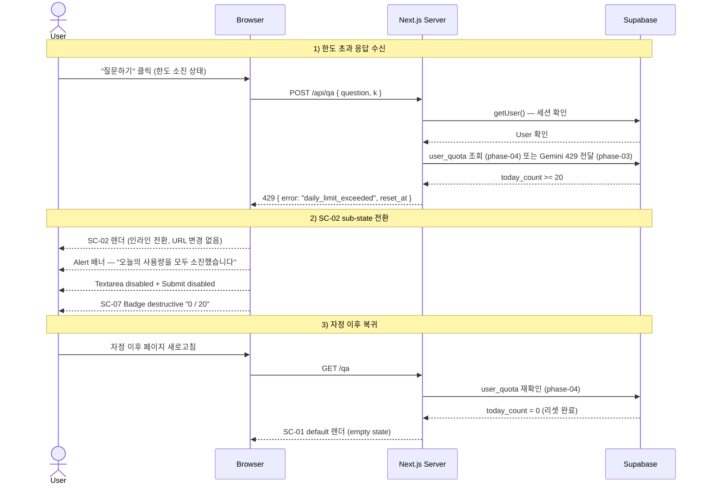

# quota-exceeded — 일일 한도 초과 Flow

## 1. Goal

AUTHENTICATED 사용자가 `/api/qa` 에서 429 응답을 받으면 SC-01 이 SC-02 sub-state 로 전환되고, 한도 초과 사실과 자정 KST 초기화 시각을 명확히 인지한 뒤 내일 이후 SC-01 으로 복귀한다.

---

## 2. Persona

**페르소나 b / c** (적극적 이용자) — 하루 질문 한도 20회를 모두 소진한 경우.

---

## 3. Entry points

| 진입 경로                                        | 설명                                                       |
|--------------------------------------------------|------------------------------------------------------------|
| `ask-question` flow 에서 429 응답 수신           | SC-01 `qa.state = submitting` → SC-02 인라인 전환 (URL 변경 없음) |
| SC-01 진입 시 이미 한도 초과 상태                | 서버에서 quota 확인 → SC-02 sub-state 즉시 렌더 (phase-04) |

---

## 4. Preconditions

- 인증 상태: AUTHENTICATED
- 한도 상태: `user_quota.today_count >= 20` (phase-04) 또는 Gemini API 429 응답 수신 (phase-03 임시)
- 현재 화면: SC-01 (또는 SC-01 초기 진입)

---

## 5. Happy path

| Step | 화면 ID     | 사용자 액션                       | 시스템 응답                                                           | 다음 화면 |
|------|-------------|-----------------------------------|-----------------------------------------------------------------------|-----------|
| 1    | SC-01       | "질문하기" 클릭 (한도 소진 상태)  | `POST /api/qa` 전송 → `submitting` 상태                               | SC-01     |
| 2    | —           | (대기)                            | `/api/qa` 429 `{ error: 'daily_limit_exceeded', reset_at }` 응답     | —         |
| 3    | SC-02       | (자동)                            | `qa.state = disabled.quota-exceeded` 전환. SC-02 sub-state 렌더.     | SC-02     |
| 4    | SC-02       | Alert 배너 확인                   | "오늘의 사용량을 모두 소진했습니다" + KST 자정 초기화 안내           | SC-02     |
| 5    | SC-02       | (다음 날 자정 이후) 페이지 새로고침 | 서버 quota 재확인 → `today_count = 0` → SC-01 default 복귀          | SC-01     |

---

## 6. Edge cases

| 케이스                                      | 분기 처리                                                                          |
|---------------------------------------------|------------------------------------------------------------------------------------|
| SC-02 상태에서 Textarea 입력 시도           | Textarea disabled 이므로 입력 불가. `cursor-not-allowed`.                          |
| SC-02 상태에서 Submit 클릭 시도             | Button disabled 이므로 클릭 불가.                                                  |
| SC-02 상태에서 자정 전 새로고침             | 서버 quota 재확인 결과 `today_count >= 20` → SC-02 sub-state 유지.                 |
| SC-02 상태에서 자정 이후 새로고침           | 서버 quota 재확인 결과 `today_count = 0` (DB reset 완료) → SC-01 default 복귀.     |
| Gemini self 429 vs 앱 자체 429 구분         | **phase-03**: 두 경우 모두 한도 초과로 처리 (구분 없음). **phase-04**: user_quota 구현 후 메시지 분기. |
| SC-07 헤더 Badge destructive                | 429 수신 시 Badge variant=destructive, 텍스트 "0 / 20" 표시.                       |
| 자정 이후 SC-01 로 복귀했으나 quota 미리셋  | phase-04 DB cron / Vercel cron 또는 클라이언트 재조회 중 하나로 해결. (§14 D-3 참조) |
| 미인증 상태에서 `/qa` 접근                  | proxy.ts 307 → `/login`. SC-02 미진입 (SC-02 는 AUTHENTICATED 전용).               |

---

## 7. State transitions

| 전환                                      | `qa.state`                     | `quota.state`  | `header.badge.variant` |
|-------------------------------------------|--------------------------------|----------------|------------------------|
| SC-01 `submitting` 중                     | `submitting`                   | —              | secondary              |
| 429 응답 수신 (자체 한도)                 | `disabled.quota-exceeded`      | `exceeded`     | destructive            |
| SC-02 sub-state 활성                      | `disabled.quota-exceeded`      | `exceeded`     | destructive ("0 / 20") |
| 자정 전 새로고침                          | `disabled.quota-exceeded` 유지 | `exceeded`     | destructive            |
| 자정 이후 새로고침 (quota reset)          | `empty`                        | —              | secondary              |

---

## 8. API calls

| 인터페이스                      | 설명                                                                       |
|---------------------------------|----------------------------------------------------------------------------|
| POST `/api/qa` (trigger)        | 429 응답이 이 flow 의 진입 트리거. `{ error: 'daily_limit_exceeded', reset_at }` |
| (phase-04) GET `/api/quota`     | 잔여 한도 + reset_at 조회. SC-07 Badge 갱신 + SC-02 카운트다운 표시용.     |

**429 Response schema:**
```json
{
  "ok": false,
  "error": {
    "code": "daily_limit_exceeded",
    "message": "오늘의 사용량을 모두 사용했습니다.",
    "reset_at": "2026-05-28T00:00:00+09:00"
  }
}
```

---

## 9. Cookies / session 변화

| 시점          | 쿠키 변화                              |
|---------------|----------------------------------------|
| 429 수신      | 없음 (세션 유지)                       |
| 새로고침      | 없음 (세션 유지, quota 만 재확인)      |

---

## 10. Postconditions

**SC-02 sub-state 활성 중**:
- 인증 상태: AUTHENTICATED (세션 유지)
- 한도 상태: `quota.state = exceeded`
- 화면: SC-02 (SC-01 과 동일 URL `/qa`, sub-state)

**자정 이후 새로고침 완료**:
- 인증 상태: AUTHENTICATED
- 한도 상태: reset (`today_count = 0`)
- 화면: SC-01 `qa.state = empty`

---

## 11. Mermaid sequence diagram



---

## 12. Acceptance criteria

- [ ] POST /api/qa 에서 429 응답 수신 시 SC-01 이 SC-02 sub-state 로 인라인 전환된다 (URL 변경 없음)
- [ ] SC-02 sub-state 에서 질문 입력 블록 위에 Alert 배너가 표시된다
  - AlertTitle: "오늘의 사용량을 모두 소진했습니다"
  - AlertDescription: "하루 20회 한도를 모두 사용했습니다. 한국 시각 자정(00:00 KST)에 초기화됩니다."
- [ ] Textarea 와 Submit 버튼이 disabled 상태가 된다
- [ ] SC-07 헤더 Badge 가 variant=destructive, "0 / 20" 으로 변경된다
- [ ] 답변 영역이 empty 아이콘 + "오늘은 더 이상 질문할 수 없습니다. 자정 이후 다시 시도해주세요." 로 표시된다
- [ ] SC-02 상태에서 Textarea 입력 및 Submit 클릭이 불가하다
- [ ] 자정 이후 새로고침 시 서버 quota 재확인 후 SC-01 `empty` 상태로 복귀한다
- [ ] SC-02 상태에서도 SC-07 헤더의 로그아웃 / 드롭다운이 정상 동작한다
