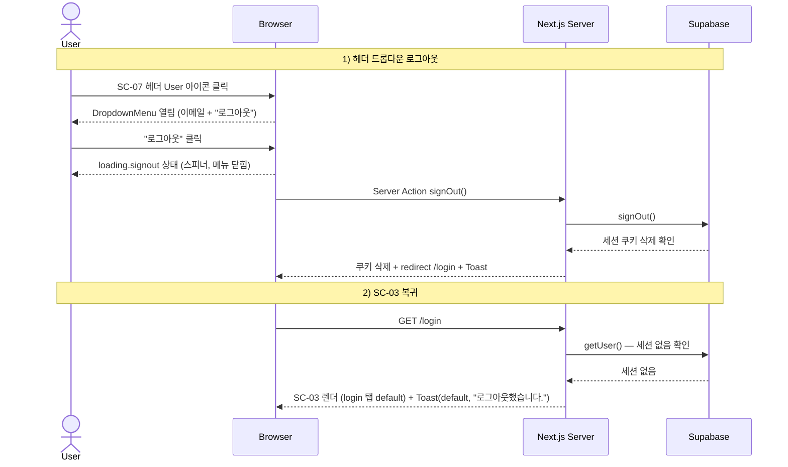

# sign-out — 로그아웃 Flow

## 1. Goal

AUTHENTICATED 사용자가 SC-07(전역 헤더) DropdownMenu 에서 "로그아웃" 을 클릭해 Supabase 세션을 종료하고 SC-03(/login) 으로 이동한다.

---

## 2. Persona

**페르소나 a / b / c** 모두 — 세션을 명시적으로 종료하려는 사용자.

---

## 3. Entry points

| 진입 경로                                | 설명                                             |
|------------------------------------------|--------------------------------------------------|
| SC-07 헤더 → DropdownMenu → "로그아웃"  | 모든 인증 페이지(SC-01 등)에서 헤더 로그아웃    |

---

## 4. Preconditions

- 인증 상태: **AUTHENTICATED** (Supabase 세션 쿠키 유효)
- SC-07 헤더가 `authenticated` variant 로 렌더링 중

---

## 5. Happy path

| Step | 화면 ID | 사용자 액션                                    | 시스템 응답                                                      | 다음 화면 |
|------|---------|------------------------------------------------|------------------------------------------------------------------|-----------|
| 1    | SC-07   | User 아이콘 버튼 클릭 → DropdownMenu 열림      | DropdownMenu Content 표시 (이메일 라벨 + Separator + "로그아웃") | SC-07     |
| 2    | SC-07   | "로그아웃" DropdownMenuItem 클릭               | `header.variant = loading.signout`. DropdownMenu 닫힘. 버튼 스피너. | SC-07  |
| 3    | —       | (대기)                                         | Server Action `signOut` → Supabase `signOut()`                   | —         |
| 4    | —       | (자동)                                         | Supabase: 세션 쿠키 삭제 (`sb-access-token`, `sb-refresh-token` 제거) | —    |
| 5    | SC-03   | (자동)                                         | Server Action: redirect `/login` + Toast(default, "로그아웃했습니다.") | SC-03 |

---

## 6. Edge cases

| 케이스                                   | 분기 처리                                                                       |
|------------------------------------------|---------------------------------------------------------------------------------|
| 로그아웃 중 네트워크 오류                | `signOut` 실패 → Toast(destructive, "로그아웃 중 오류가 발생했습니다.") + 버튼 복귀. 사용자가 재시도 가능. |
| 로그아웃 중 새 탭에서 동일 세션 사용     | Supabase 세션 무효화 후 다른 탭에서 `/qa` 요청 시 proxy.ts 307 → `/login`.     |
| DropdownMenu 열린 상태에서 Esc 클릭      | shadcn/ui 기본: DropdownMenu 닫힘. 로그아웃 호출 안 됨.                        |
| DropdownMenu 외부 영역 클릭              | DropdownMenu 닫힘 (shadcn/ui 기본 dismiss).                                     |
| 로그아웃 후 브라우저 뒤로가기 시도       | `/qa` 등 보호 경로 → proxy.ts 307 → `/login` (세션 없으므로 자동 차단).         |
| SC-02 (한도 초과) 상태에서 로그아웃      | 동일 흐름. 세션 종료 후 `/login` redirect.                                      |
| 인증 페이지 (SC-03 등) 에서 로그아웃    | SC-07 minimal variant 에서는 DropdownMenu 자체가 없음. 로그아웃 버튼 미노출.    |

---

## 7. State transitions

| 전환                                  | 인증 상태             | SC-07 헤더 상태                          |
|---------------------------------------|-----------------------|------------------------------------------|
| DropdownMenu Trigger 클릭             | AUTHENTICATED         | `header.variant = authenticated.normal` |
| "로그아웃" 클릭                       | AUTHENTICATED         | `header.variant = loading.signout`       |
| signOut 성공 → redirect               | ANONYMOUS             | (SC-03 로 이동, 헤더 `unauthenticated` 변형) |
| signOut 실패                          | AUTHENTICATED         | `header.variant = authenticated.normal` 복귀 |

---

## 8. API calls

| 인터페이스                  | 설명                                                               |
|-----------------------------|--------------------------------------------------------------------|
| Server Action `signOut()`   | `app/login/_actions.ts` → Supabase `signOut()`. 입력 없음. |

---

## 9. Cookies / session 변화

| 시점                    | 쿠키 변화                                                     |
|-------------------------|---------------------------------------------------------------|
| signOut 호출 전         | `sb-access-token`, `sb-refresh-token` 활성                    |
| signOut 성공 후         | 위 두 쿠키 삭제. 이후 모든 보호 경로 접근 차단.               |

---

## 10. Postconditions

- 사용자 인증 상태: **ANONYMOUS**
- 세션 쿠키 없음
- 현재 화면: SC-03 (`auth.state = default`, login 탭 기본 활성)
- Toast(default): "로그아웃했습니다."

---

## 11. Mermaid sequence diagram

---

## 12. Acceptance criteria

- [ ] SC-07 헤더 User 아이콘 클릭 시 DropdownMenu 가 열리고 사용자 이메일과 "로그아웃" 항목이 표시된다
- [ ] "로그아웃" 클릭 시 `loading.signout` 상태 전환 (스피너) + DropdownMenu 닫힘이 동작한다
- [ ] signOut 성공 후 세션 쿠키가 삭제되고 `/login` 으로 redirect 된다
- [ ] SC-03 에 Toast(default, "로그아웃했습니다.") 가 표시된다
- [ ] 로그아웃 후 브라우저 뒤로가기로 `/qa` 접근 시 proxy.ts 가 `/login` 으로 307 redirect 한다
- [ ] 로그아웃 오류 시 Toast(destructive) 가 표시되고 버튼이 복귀한다
- [ ] Esc 키 또는 외부 클릭으로 DropdownMenu 가 닫히며 로그아웃 액션이 발생하지 않는다
