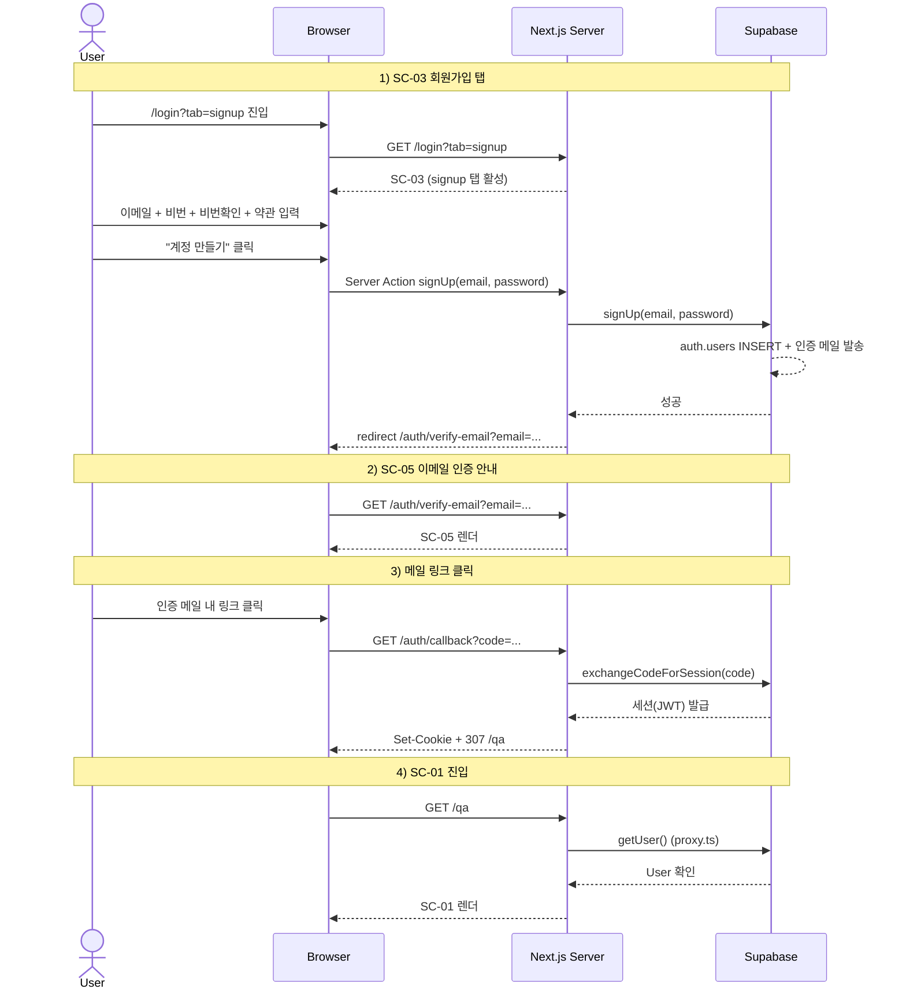

# signup-email — 이메일 회원가입 Flow

## 1. Goal

미인증 사용자가 이메일·비밀번호로 계정을 만들고, 인증 메일을 클릭해 세션을 확립한 뒤 SC-01(/qa)에 진입한다.

---

## 2. Persona

주로 **페르소나 a** (포트폴리오 데모 리뷰어) — 링크를 받고 처음 접근하는 사용자. 1분 안에 가입 → 질문 흐름을 완료하는 것이 핵심.

---

## 3. Entry points

| 진입 경로                              | 설명                                      |
|----------------------------------------|-------------------------------------------|
| `/login?tab=signup`                    | URL 쿼리로 회원가입 탭 직접 활성          |
| `/login` (default) → 탭 수동 전환     | login 탭에서 회원가입 탭으로 사용자가 전환 |
| `/qa` 직접 접근 (ANONYMOUS) → 307      | proxy.ts 가 `/login` 으로 redirect 후 회원가입 탭 선택 |

---

## 4. Preconditions

- 인증 상태: ANONYMOUS (Supabase 세션 없음)
- 한도 상태: 해당 없음 (인증 전)
- 해당 이메일로 가입된 계정이 없어야 함

---

## 5. Happy path

| Step | 화면 ID | 사용자 액션                                  | 시스템 응답                                              | 다음 화면 |
|------|---------|----------------------------------------------|----------------------------------------------------------|-----------|
| 1    | SC-03   | `/login?tab=signup` 진입                     | 회원가입 탭 활성 상태의 SC-03 렌더                       | SC-03     |
| 2    | SC-03   | 이메일 입력 (blur)                           | 이메일 형식 클라이언트 검증 통과                         | SC-03     |
| 3    | SC-03   | 비밀번호 입력 8자+ (blur)                    | 길이 검증 통과                                           | SC-03     |
| 4    | SC-03   | 비밀번호 확인 입력 (blur)                    | 일치 검증 통과                                           | SC-03     |
| 5    | SC-03   | 약관 Checkbox 체크                           | `field.terms.error = null`                               | SC-03     |
| 6    | SC-03   | "계정 만들기" 클릭 (또는 Enter)              | `auth.state = loading.email`, 폼·버튼 disabled           | SC-03     |
| 7    | SC-03   | (대기)                                       | Server Action `signUp` → Supabase `signUp(email, password)` 호출 | SC-03 |
| 8    | SC-03   | (대기)                                       | Supabase: `auth.users` INSERT + 인증 메일 발송           | —         |
| 9    | —       | (자동)                                       | Server Action 성공 → `router.push('/auth/verify-email?email=...')` | SC-05 |
| 10   | SC-05   | 메일함 확인 (외부)                           | Supabase 인증 메일 수신                                  | SC-05     |
| 11   | SC-05   | 메일 속 인증 링크 클릭                       | 브라우저가 `/auth/callback?code=...` 로 이동             | SC-04     |
| 12   | SC-04   | (자동)                                       | Route Handler `exchangeCodeForSession(code)` 호출        | SC-04     |
| 13   | SC-04   | (자동)                                       | Supabase: 세션 발급 → Set-Cookie (`sb-access-token`, `sb-refresh-token`) | — |
| 14   | —       | (자동)                                       | Route Handler: 307 redirect → `/qa`                     | SC-01     |
| 15   | SC-01   | 진입                                         | proxy.ts 통과 (세션 유효) → SC-01 렌더                   | SC-01     |

---

## 6. Edge cases

| 케이스                          | 분기 처리                                                                           |
|---------------------------------|-------------------------------------------------------------------------------------|
| 이메일 형식 오류                | `field.email.error = 'format'` 인라인 표시. Submit 차단.                             |
| 비밀번호 8자 미만               | `field.password.error = 'too-short'` 인라인. Submit 차단.                           |
| 비밀번호 불일치                 | `field.confirm.error = 'mismatch'` 인라인. Submit 차단.                             |
| 약관 미동의                     | `field.terms.error = 'required'` 인라인. Submit 차단.                              |
| 이메일 중복 (이미 가입)         | `auth.state = error.email-already-registered`. Alert(default) + "로그인 탭으로 이동" CTA → `setActiveTab('login')` |
| 네트워크 오류                   | `auth.state = error.network`. Alert(destructive) 표시. 재시도 가능.                 |
| 인증 메일 미수신                | SC-05 에서 60초 쿨다운 재전송 버튼. → `verify-email-resend` flow 참조.              |
| 인증 링크 만료 (SC-04 도달 시)  | Route Handler 에러 → SC-04 폴백 UI `error.code-expired`. "로그인 화면으로" CTA.     |
| 인증 링크 무효                  | SC-04 `error.code-invalid` UI.                                                      |
| SC-05 에서 페이지 새로고침      | 쿨다운 초기화 (v1). 이메일 파라미터 유지.                                           |
| 이미 인증된 상태로 `/login` 진입 | RSC layer: `/qa` 307 redirect.                                                      |
| 로딩 중 탭 전환 시도            | 탭 disabled (방어).                                                                 |
| Google OAuth 팝업 취소         | SC-03 default 복귀. 에러 표시 없음.                                                 |

---

## 7. State transitions

| 전환                                   | 인증 상태           | 화면 상태                              |
|----------------------------------------|---------------------|----------------------------------------|
| SC-03 진입                             | ANONYMOUS           | `auth.state = default`, `auth.tab = signup` |
| 폼 입력 중                             | ANONYMOUS           | `auth.state = default` (필드별 검증)   |
| "계정 만들기" 클릭                     | ANONYMOUS           | `auth.state = loading.email`           |
| signUp 성공 → redirect                 | ANONYMOUS           | `auth.state = success.signup` → navigate |
| SC-05 도착                             | ANONYMOUS           | `verify.state = default`               |
| 재전송 클릭                            | ANONYMOUS           | `verify.state = loading.resend`        |
| 재전송 성공                            | ANONYMOUS           | `verify.state = cooldown` (60초)       |
| SC-04 도착 (콜백)                      | ANONYMOUS → 처리 중 | `callback.state = loading`             |
| `exchangeCodeForSession` 성공          | AUTHENTICATED       | `callback.state = success` → 307 /qa  |
| SC-01 진입                             | AUTHENTICATED       | SC-01 `qa.state = empty`               |

---

## 8. API calls

| 인터페이스                                  | 설명                                        |
|---------------------------------------------|---------------------------------------------|
| Server Action `signUp(email, password)`     | `app/login/_actions.ts` → Supabase `signUp` |
| GET `/auth/callback?code=...` (Route Handler) | `app/auth/callback/route.ts` → `exchangeCodeForSession` |

---

## 9. Cookies / session 변화

| 시점                              | 쿠키 변화                                               |
|-----------------------------------|---------------------------------------------------------|
| SC-03 → signUp 호출              | 없음 (인증 메일 발송만)                                 |
| SC-04 `exchangeCodeForSession` 성공 | `sb-access-token`, `sb-refresh-token` Set-Cookie       |
| SC-01 진입 이후                   | 위 쿠키 유지. access-token 만료 시 자동 갱신.           |

---

## 10. Postconditions

- 사용자 인증 상태: **AUTHENTICATED**
- `auth.users` 에 새 레코드 생성 + 이메일 인증 완료
- Supabase 세션 쿠키 활성
- 현재 화면: SC-01 (`qa.state = empty`)

---

## 11. Mermaid sequence diagram

---

## 12. Acceptance criteria

- [ ] `/login?tab=signup` 진입 시 회원가입 탭이 기본 활성 상태로 렌더된다
- [ ] 이메일 형식 오류 / 비밀번호 짧음 / 불일치 / 약관 미동의 시 각각 인라인 에러가 표시되고 Submit 이 차단된다
- [ ] 중복 이메일 가입 시 `error.email-already-registered` Alert 과 "로그인 탭으로 이동" CTA 가 노출된다
- [ ] signUp 성공 후 `/auth/verify-email?email=...` 로 자동 redirect 된다
- [ ] SC-05 재전송 버튼이 클릭 후 60초 쿨다운을 가지며 카운트다운 라벨이 표시된다
- [ ] 인증 메일 링크 클릭 후 SC-04 Route Handler 가 토큰 교환 및 Set-Cookie 를 수행하고 `/qa` 로 307 redirect 한다
- [ ] 인증 링크 만료 시 SC-04 폴백 UI 에 `error.code-expired` 상태와 "로그인 화면으로 돌아가기" CTA 가 표시된다
- [ ] 최종적으로 SC-01 (`empty` 상태) 에서 질문 입력이 가능한 상태가 된다
