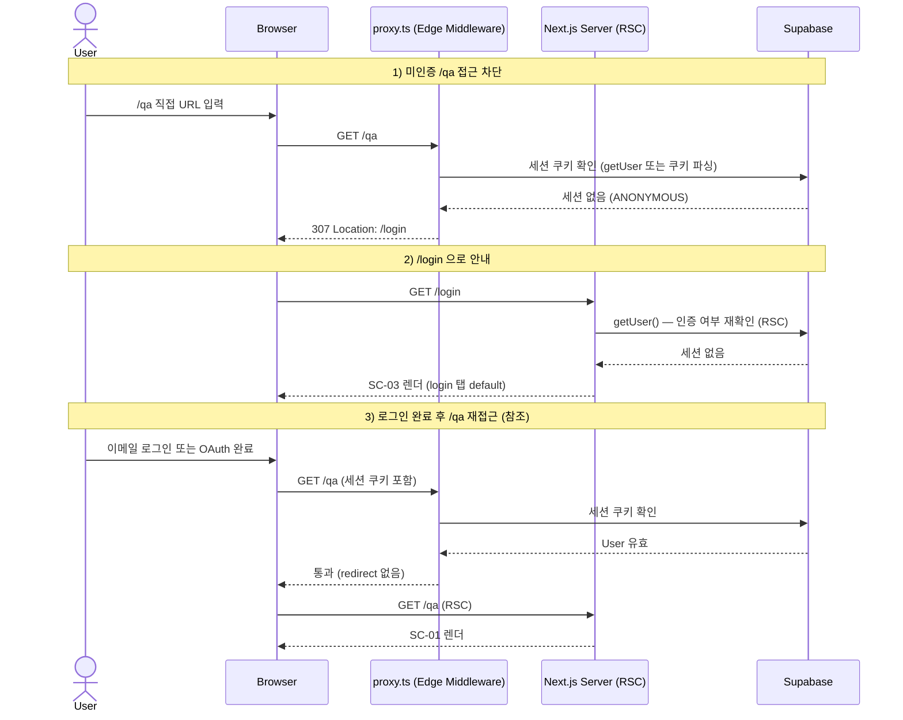

# unauthenticated-access — 미인증 접근 차단 Flow

## 1. Goal

ANONYMOUS 사용자가 보호 경로 `/qa` (또는 루트 `/`) 에 직접 접근하면, Next.js proxy.ts (Edge Middleware) 가 세션 쿠키를 검사해 307 redirect 로 `/login` 으로 안내한다.

---

## 2. Persona

**페르소나 a / b / c** 모두 — 아직 로그인하지 않은 상태에서 URL 을 직접 입력하거나 링크를 클릭하는 모든 사용자.

---

## 3. Entry points

| 진입 경로                | 설명                                                            |
|--------------------------|-----------------------------------------------------------------|
| `/qa` 직접 URL 입력      | ANONYMOUS 상태. proxy.ts 가 세션 없음을 감지.                   |
| `/` 루트 접근            | 루트 redirect → `/qa` → proxy.ts → `/login` (두 번 redirect)   |
| 북마크된 `/qa` 링크 클릭 | 세션 만료 후 재방문 포함                                        |
| 공유받은 `/qa` URL 클릭  | 수신자가 미인증 상태인 경우                                     |

---

## 4. Preconditions

- 인증 상태: **ANONYMOUS** (Supabase 세션 쿠키 없음 또는 만료)
- 접근 시도 경로: `/qa` 또는 보호 매처에 해당하는 경로

---

## 5. Happy path

| Step | 화면 ID | 사용자 액션                             | 시스템 응답                                                     | 다음 화면 |
|------|---------|------------------------------------------|-----------------------------------------------------------------|-----------|
| 1    | —       | `/qa` URL 입력 및 접근                   | 브라우저 GET `/qa`                                              | —         |
| 2    | —       | (자동)                                   | proxy.ts (Edge): 세션 쿠키 확인 → 없음 → 307 Location: `/login` | —        |
| 3    | SC-03   | (자동 redirect)                          | 브라우저 GET `/login`                                           | SC-03     |
| 4    | SC-03   | SC-03 진입                               | RSC layer `getUser()` → ANONYMOUS → SC-03 렌더                  | SC-03     |
| 5    | SC-03   | 로그인 또는 회원가입 진행                | `login-email` / `signup-email` / `login-google` flow 로 전환    | SC-01     |

---

## 6. Edge cases

| 케이스                                   | 분기 처리                                                                            |
|------------------------------------------|--------------------------------------------------------------------------------------|
| 루트 `/` 접근 (ANONYMOUS)               | 루트 redirect → `/qa` → proxy.ts 307 → `/login`. 총 2회 redirect.                  |
| 세션 만료된 상태에서 `/qa` 재방문        | 브라우저 세션 쿠키 존재하나 Supabase access-token 만료 + refresh-token 만료 → proxy.ts 세션 검사 실패 → 307 `/login`. |
| access-token 만료 + refresh-token 유효   | Supabase SSR 미들웨어가 자동 갱신 → proxy.ts 세션 유효 판정 → SC-01 정상 렌더.       |
| `/qa/[anything]` 하위 경로 직접 접근     | proxy.ts 보호 매처가 `/qa` 하위 전체를 커버 → 동일하게 307 `/login`.                |
| AUTHENTICATED 상태에서 `/login` 직접 접근 | RSC layer: `getUser()` 성공 → `/qa` 307 redirect.                                   |
| proxy.ts Edge 오류 (예외 throw)          | 기본적으로 Next.js 500 → SC-09 FALLBACK 렌더.                                       |
| 동시 탭: Tab A 로그아웃 후 Tab B 에서 `/qa` 접근 | Tab B: 세션 쿠키 삭제된 상태 → proxy.ts 307 → `/login`.                   |
| 쿠키 차단 브라우저                       | 세션 쿠키 설정 불가 → 로그인해도 항상 proxy.ts 차단 → `/login` redirect 루프. SC-04 에서 "쿠키 설정 확인" 안내. |

---

## 7. State transitions

| 전환                                    | 인증 상태  | 위치                         |
|-----------------------------------------|------------|------------------------------|
| `/qa` GET 요청 도착 (proxy.ts)          | ANONYMOUS  | proxy.ts Edge (서버)         |
| 세션 쿠키 없음 감지                     | ANONYMOUS  | proxy.ts → 307 응답 생성     |
| `/login` redirect 완료                  | ANONYMOUS  | SC-03 `auth.state = default` |
| 로그인 / 회원가입 완료                  | AUTHENTICATED | SC-01 `qa.state = empty`  |

---

## 8. API calls

| 인터페이스                              | 설명                                                         |
|-----------------------------------------|--------------------------------------------------------------|
| `proxy.ts` (Edge Middleware)            | GET `/qa` 인터셉트 → Supabase 세션 쿠키 검사 → 307 응답     |
| RSC layer `supabase.auth.getUser()`     | SC-03 page.tsx 진입 시 인증 상태 재확인 (이미 인증이면 `/qa` redirect) |

proxy.ts 는 별도 HTTP 엔드포인트가 아니라 Next.js Middleware 로 동작한다.

---

## 9. Cookies / session 변화

| 시점                      | 쿠키 변화                                              |
|---------------------------|--------------------------------------------------------|
| ANONYMOUS 상태 `/qa` 접근 | 변화 없음 (세션 쿠키 없는 상태 유지)                  |
| 307 `/login` redirect      | 변화 없음                                              |
| SC-03 에서 로그인 완료    | `sb-access-token`, `sb-refresh-token` Set-Cookie 발급  |

---

## 10. Postconditions

**차단만 발생한 경우 (SC-03 진입까지)**:
- 인증 상태: ANONYMOUS
- 현재 화면: SC-03 (`auth.state = default`, login 탭 기본 활성)

**로그인 완료 후**:
- 인증 상태: AUTHENTICATED
- 현재 화면: SC-01 (`qa.state = empty`)

---

## 11. Mermaid sequence diagram

---

## 12. Acceptance criteria

- [ ] ANONYMOUS 상태에서 `/qa` 접근 시 proxy.ts 가 307 redirect 를 반환해 `/login` 으로 이동한다
- [ ] `/` 루트 접근 시에도 결국 `/login` 으로 도달한다
- [ ] SC-03 진입 시 login 탭이 default 활성 상태로 렌더된다
- [ ] SC-03 에서 별도 "접근 거부" 메시지가 표시되지 않는다 (무음 redirect)
- [ ] 세션 만료 후 `/qa` 재방문 시 동일하게 307 → `/login` 처리된다
- [ ] refresh-token 이 유효한 경우 Supabase SSR 미들웨어가 자동 갱신해 proxy.ts 가 통과시킨다
- [ ] AUTHENTICATED 상태에서 `/login` 직접 접근 시 `/qa` 로 redirect 된다 (역방향 보호)
- [ ] proxy.ts 는 `/api/*` 등 비보호 경로는 통과시킨다 (정적 파일, API 라우트 제외)
