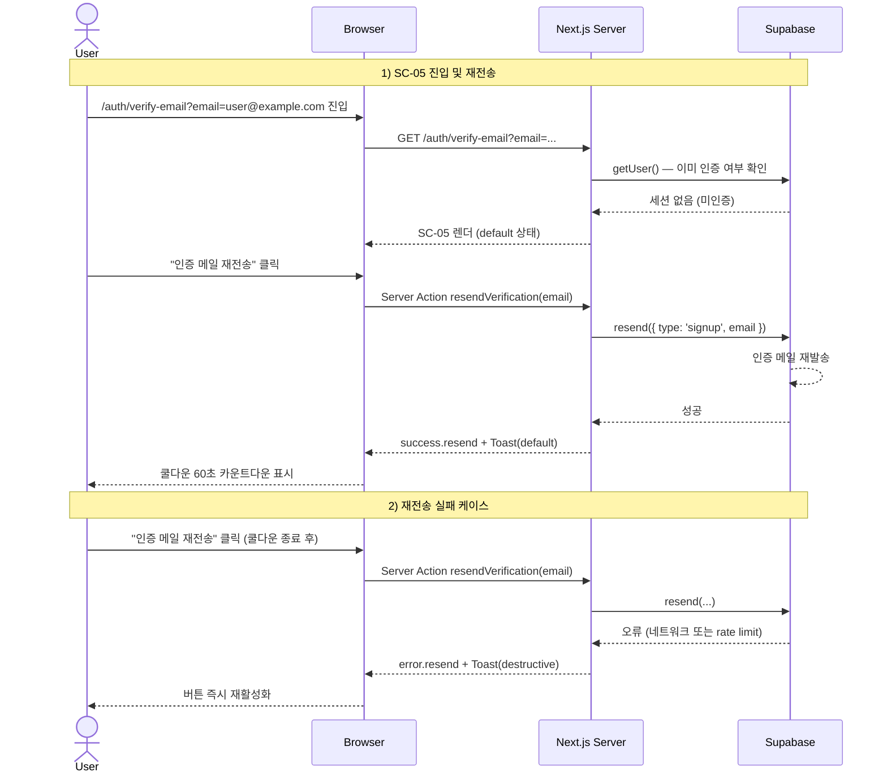

# verify-email-resend — 이메일 인증 재전송 Flow

## 1. Goal

SC-05(SC-VERIFY-EMAIL) 에 머물고 있는 사용자가 인증 메일을 받지 못한 경우, 60초 쿨다운 재전송 버튼을 통해 인증 메일을 다시 받는다.

---

## 2. Persona

**페르소나 a / b / c** — 이메일 회원가입 직후 인증 메일이 수신되지 않거나 스팸 처리된 사용자.

---

## 3. Entry points

| 진입 경로                                            | 설명                                                        |
|------------------------------------------------------|-------------------------------------------------------------|
| SC-03 회원가입 성공 → 자동 redirect                  | `signup-email` flow 에서 `/auth/verify-email?email=...` redirect |
| SC-03 `error.email-not-verified` → "인증 메일 재전송" CTA | 미인증 이메일로 로그인 시도 후 CTA 클릭 → SC-05            |

---

## 4. Preconditions

- 인증 상태: ANONYMOUS
- Supabase `auth.users` 에 해당 이메일 레코드 존재 (가입 완료)
- 이메일 인증 미완료 상태
- URL `?email=` 파라미터: 있으면 이메일 표시에 사용, 없으면 "등록하신 이메일" 텍스트로 대체

---

## 5. Happy path

| Step | 화면 ID | 사용자 액션                                  | 시스템 응답                                                    | 다음 화면 |
|------|---------|----------------------------------------------|----------------------------------------------------------------|-----------|
| 1    | SC-05   | `/auth/verify-email?email=...` 진입          | SC-05 렌더 (`verify.state = default`)                          | SC-05     |
| 2    | SC-05   | "인증 메일 재전송" 버튼 클릭                 | `verify.state = loading.resend`, 버튼 disabled + 스피너        | SC-05     |
| 3    | SC-05   | (대기)                                       | Server Action `resendVerification(email)` → Supabase `resend({ type: 'signup', email })` | SC-05 |
| 4    | SC-05   | (자동)                                       | Supabase: 인증 메일 재발송                                     | —         |
| 5    | SC-05   | (자동)                                       | Server Action 성공 → `verify.state = success.resend`           | SC-05     |
| 6    | SC-05   | (자동)                                       | Toast(default, "인증 메일을 재전송했습니다. 메일함을 확인해주세요.") | SC-05 |
| 7    | SC-05   | (자동)                                       | 쿨다운 60초 재시작. 버튼 라벨 "재전송 가능 (60초)" → 카운트다운. | SC-05 |
| 8    | SC-05   | 메일함 확인 (외부)                           | 인증 메일 수신                                                 | SC-05     |
| 9    | SC-05   | 메일 속 인증 링크 클릭                       | GET `/auth/callback?code=...` → `signup-email` flow Step 12~15 | SC-01   |

---

## 6. Edge cases

| 케이스                              | 분기 처리                                                                           |
|-------------------------------------|-------------------------------------------------------------------------------------|
| 재전송 실패 (네트워크 오류)         | `verify.state = error.resend`. Toast(destructive, "메일 재전송에 실패했습니다. 잠시 후 다시 시도해주세요."). 버튼 즉시 활성 복귀. |
| 재전송 실패 (Supabase 오류)         | 동일 Toast(destructive). 버튼 즉시 활성 복귀.                                       |
| 쿨다운 중 버튼 클릭 시도            | 버튼 disabled (자동 방어). 호출 발생 안 함.                                         |
| 쿨다운 중 페이지 새로고침           | 쿨다운 초기화 (v1). `verify.state = default` 복귀. 버튼 재활성.                     |
| URL `?email=` 파라미터 없음         | 이메일 표시 부분을 "등록하신 이메일" 로 대체. 재전송 로직은 동일.                   |
| 이미 인증 완료된 상태로 SC-05 진입  | RSC layer: `getUser()` 로 인증 확인 → `/qa` 307 redirect.                           |
| "다른 이메일로 가입하기" 클릭       | `/login?tab=signup` 로 이동. `signup-email` flow 재시작.                            |
| "로그인 화면으로" 링크 클릭         | `/login` 으로 이동. `login-email` flow 진입.                                        |
| Supabase 이메일 Rate Limit          | Supabase 가 재전송을 거부할 수 있음 (동일 주소 짧은 시간 내 다수 요청). `error.resend` 처리. |

---

## 7. State transitions

| 전환                              | 인증 상태  | 화면 상태                                           |
|-----------------------------------|------------|-----------------------------------------------------|
| SC-05 진입                        | ANONYMOUS  | `verify.state = default`                            |
| "인증 메일 재전송" 클릭           | ANONYMOUS  | `verify.state = loading.resend`                     |
| resendVerification 성공           | ANONYMOUS  | `verify.state = success.resend` → `verify.state = cooldown` (즉시 전환) |
| 쿨다운 카운트다운 중              | ANONYMOUS  | `verify.state = cooldown`, `verify.cooldown_seconds = N` (60→0) |
| 쿨다운 0초 도달                   | ANONYMOUS  | `verify.state = default`. 버튼 "인증 메일 재전송" 복귀. |
| resendVerification 실패           | ANONYMOUS  | `verify.state = error.resend` → 즉시 `verify.state = default` 복귀 |
| 인증 링크 클릭 (외부)             | ANONYMOUS → 처리 중 | SC-04 → AUTHENTICATED                      |

---

## 8. API calls

| 인터페이스                                      | 설명                                                          |
|-------------------------------------------------|---------------------------------------------------------------|
| Server Action `resendVerification(email)`       | `app/login/_actions.ts` → Supabase `resend({ type: 'signup', email })` |

---

## 9. Cookies / session 변화

| 시점                         | 쿠키 변화                                                 |
|------------------------------|-----------------------------------------------------------|
| SC-05 체류 중                | 변화 없음                                                 |
| resendVerification 성공      | 없음 (인증 메일 재발송만)                                 |
| 인증 링크 클릭 → SC-04 처리  | `sb-access-token`, `sb-refresh-token` Set-Cookie (signup-email flow 참조) |

---

## 10. Postconditions

**재전송만 완료된 경우 (메일 링크 미클릭)**:
- 인증 상태: 여전히 ANONYMOUS
- SC-05 에 머물며 새 인증 메일 대기

**인증 링크 클릭 완료된 경우**:
- 인증 상태: AUTHENTICATED
- 현재 화면: SC-01 (`qa.state = empty`)

---

## 11. Mermaid sequence diagram

---

## 12. Acceptance criteria

- [ ] SC-05 진입 시 `?email=` 파라미터의 이메일 주소가 카드 설명에 표시된다
- [ ] `?email=` 파라미터 없으면 "등록하신 이메일" 텍스트로 대체된다
- [ ] "인증 메일 재전송" 클릭 시 `loading.resend` 상태로 버튼이 disabled + 스피너 표시된다
- [ ] 재전송 성공 시 Toast(default) + 60초 쿨다운 카운트다운이 시작된다
- [ ] 쿨다운 중 버튼이 disabled 상태이며 클릭이 무시된다
- [ ] 60초 쿨다운 종료 후 버튼이 "인증 메일 재전송" 으로 복귀하고 재클릭이 가능하다
- [ ] 재전송 실패 시 Toast(destructive) 가 표시되고 버튼이 즉시 재활성화된다
- [ ] 이미 인증 완료된 상태로 SC-05 방문 시 `/qa` 로 redirect 된다
- [ ] "다른 이메일로 가입하기" 링크가 `/login?tab=signup` 으로 이동한다
- [ ] "로그인 화면으로" 링크가 `/login` 으로 이동한다
