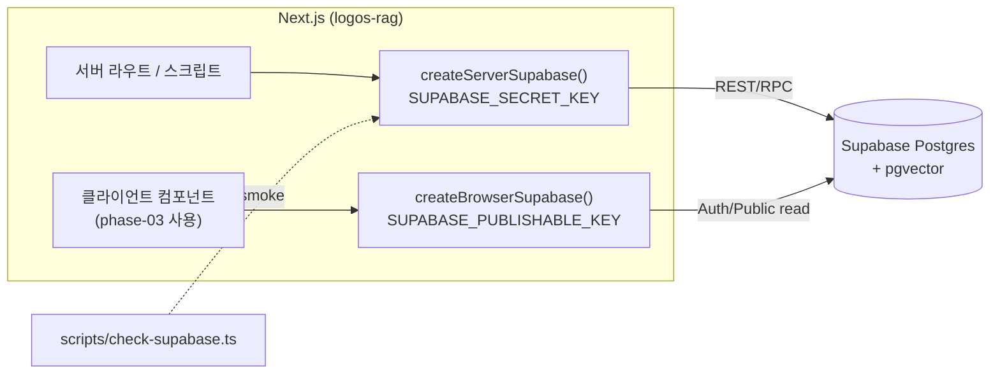

# spec-01-01: Supabase 부트스트랩

## 📋 메타

| 항목 | 값 |
|---|---|
| **Spec ID** | `spec-01-01` |
| **Phase** | `phase-01` |
| **Branch** | `spec-01-01-bootstrap-supabase` |
| **상태** | Planning |
| **타입** | Feature (infrastructure) |
| **Integration Test Required** | yes (실제 Supabase 연결 smoke) |
| **작성일** | 2026-05-16 |
| **소유자** | @pgaey |

## 📋 배경 및 문제 정의

### 현재 상황
Next.js 16 + Tailwind 4 + harness-kit 베이스라인이 `main` 에 커밋되어 있고 `develop` 브랜치도 만들어진 상태입니다. 아직 어떤 외부 시스템과도 연결되어 있지 않습니다 (`@supabase/supabase-js` 미설치, `.env.local` 없음, pgvector extension 미활성).

### 문제점
phase-01 의 후속 spec (`bible-source-fetch` → `verse-schema-migration` → `embedding-batch-script` → `cosine-search-verification`) 들이 모두 Supabase 의 Postgres + pgvector 에 의존합니다. 다음 spec 들이 실제 코드 변경을 시작하기 전에 **연결이 의도대로 동작한다는 사실** 이 검증되어 있어야 적재 스크립트나 마이그레이션 작성 중에 인프라 문제로 시간 낭비를 하지 않습니다.

### 해결 방안 (요약)
서버 전용 클라이언트 / 브라우저 클라이언트 두 팩토리 모듈을 `src/lib/supabase/` 에 만들고, Supabase **신규 API 키 형식** (`sb_publishable_*` / `sb_secret_*`) 을 사용하도록 환경변수를 정의합니다. `scripts/check-supabase.ts` 로컬 검증 스크립트가 ① 연결 ② `pgvector` extension 존재 두 가지를 확인하면 spec 완료입니다.

## 📊 개념도

## 🎯 요구사항

### Functional Requirements
1. `@supabase/supabase-js` 의존성 설치.
2. `src/lib/supabase/server.ts` 가 secret key 로 클라이언트를 생성하는 팩토리 함수 export.
3. `src/lib/supabase/client.ts` 가 publishable key 로 클라이언트를 생성하는 팩토리 함수 export.
4. `.env.example` 가 필요한 4개 환경변수를 placeholder 값으로 정의 (commit 대상).
5. `scripts/check-supabase.ts` 가 (a) `SELECT 1` 성공 (b) `pg_extension` 에서 `vector` 행 존재 두 검증을 콘솔에 출력하고, 둘 다 성공 시 exit 0, 하나라도 실패 시 exit 1.
6. `package.json` 에 `check:supabase` 스크립트 등록 (`tsx scripts/check-supabase.ts`).
7. `README.md` 에 셋업 가이드 (Supabase 프로젝트 생성·키 발급·pgvector 활성화·`.env.local` 채우기) 추가.

### Non-Functional Requirements
1. **Secret key 누출 방지**: `client.ts` 에서 `SUPABASE_SECRET_KEY` 참조 금지. 빌드 시 클라이언트 번들에 포함되지 않도록 `NEXT_PUBLIC_*` prefix 사용하지 않음 (publishable key 는 모듈 내부에서 직접 참조하지 않고 `NEXT_PUBLIC_SUPABASE_URL`, `NEXT_PUBLIC_SUPABASE_PUBLISHABLE_KEY` 두 변수만 클라이언트에 노출).
2. **신규 키 형식만 지원**: `sb_publishable_*` / `sb_secret_*` 사용. legacy `anon` / `service_role` JWT 키 사용 금지 (참조: Supabase 키 마이그레이션, 2026년 말 legacy 제거 예정).
3. **`.env.local` gitignored** 확인 (Next 기본 gitignore 의 `.env*` 룰이 이미 처리).
4. **TypeScript strict** 통과 — 모든 export 에 타입 명시, `any` 사용 금지.
5. 검증 스크립트는 **로컬 전용** (Vercel runtime 에서 실행되지 않음).

## 🚫 Out of Scope

- Supabase Auth 셋업·로그인 UI → phase-03.
- `verses` 테이블·마이그레이션·RLS 정책 → spec-01-03.
- 실제 Bible 데이터 적재 → spec-01-04.
- Vitest 등 테스트 러너 도입 → 별도 spec / icebox 후보 (이번 spec 의 검증은 스크립트로 갈음).
- Supabase CLI 도입 결정 → spec-01-03 에서 결정.
- GitHub `develop`·`main` 브랜치 보호 룰 적용 → 사용자가 GitHub 웹에서 수동 설정 (README 에 안내).
- Generated DB types (`supabase gen types`) → spec-01-03 이후 검토.

## 🔍 Critique 결과 (선택)

(미실행)

## ✅ Definition of Done

- [ ] `pnpm check:supabase` 실행 시 `SELECT 1` PASS + `vector` extension PASS 가 콘솔에 표시되고 exit 0
- [ ] `src/lib/supabase/server.ts`, `src/lib/supabase/client.ts` 가 secret/publishable 키를 올바른 컨텍스트에서만 참조
- [ ] `.env.example` commit, `.env.local` 은 untracked (gitignored)
- [ ] `README.md` 에 셋업 가이드 추가
- [ ] `walkthrough.md` 와 `pr_description.md` ship commit
- [ ] `spec-01-01-bootstrap-supabase` 브랜치 push 완료 (base: `phase-01-data-pipeline` — 첫 spec 이므로 base 브랜치는 develop 에서 분기되어 자동 생성)
- [ ] PR URL 사용자에게 보고
