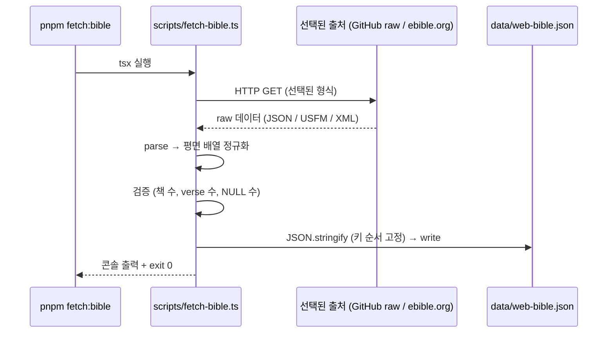

# Implementation Plan: spec-01-02

## 📋 Branch Strategy

- 신규 브랜치: `spec-01-02-bible-source-fetch`
- 시작 지점: **`phase-01-data-pipeline`** (phase base 가 이제 존재 — spec-01-01 머지 후 갱신됨)
- spec PR target = `phase-01-data-pipeline`
- 첫 task 가 spec 브랜치 생성을 수행

## 🛑 사용자 검토 필요 (User Review Required)

> [!IMPORTANT]
> - [ ] 출처 후보 3개 (`gratis-bible/bible` / `wldeh/bible-api` / ebible.org 공식 zip) 중 Task 2 첫 단계에서 후보별 fetch test → 1개 확정. 사용자에게 결과 보고 후 진행
> - [ ] 정규화 후 첫 verse (Genesis 1:1) 와 마지막 verse (Revelation 22:21) 가 의미상 맞는지 사용자 눈으로 한 번 확인

> [!WARNING]
> - [ ] WEB 외 번역본 (NIV, ESV, KJV 등) fetch 금지 — 라이선스 / 선결 결정 위반
> - [ ] `data/web-bible.json` 이 5MB 를 크게 초과하면 (>15MB) 출처/정규화 점검 — git LFS 검토 필요

## 🎯 핵심 전략 (Core Strategy)

### 아키텍처 컨텍스트



### 주요 결정

| 컴포넌트 | 전략 | 이유 |
|:---:|:---|:---|
| **출처 후보 비교** | Task 2 첫 단계에서 3개 fetch test → 1개 선택 | 미리 정해서 spec 에 못박기보다 실제 시도 후 가장 깔끔한 출처 채택. 출처 quality 는 fetch 해봐야 앎 |
| **정규화 형식** | `[{book, chapter, verse, text}, ...]` 평면 배열 | 사용자 선결 결정 — RAG 적재 시 iterate 단순, 디버깅 쉬움 |
| **JSON 직렬화** | `JSON.stringify(arr, null, 2)` (2 space indent, 키 순서 의도적 고정) | 재현성 + git diff 친화적 |
| **검증 위치** | fetch 스크립트 내장 (별도 verify 스크립트 X) | spec 범위 최소. fetch 끝나면 자동으로 책/verse 수 출력 |
| **XML/USFM 파싱 dep** | 출처가 plain JSON 이면 0 dep, USFM/XML 이면 `fast-xml-parser` 1개만 | 외부 의존성 최소화. 출처 확정 후 결정 |
| **재실행 안전** | 매 실행 시 새로 fetch + write (캐시 X) | 단순. 5MB 다운로드는 1초 미만, 캐시 복잡도 불필요 |

## 📂 Proposed Changes

### Fetch 스크립트

#### [NEW] `scripts/fetch-bible.ts`
- 출처 1개 (Task 2 에서 확정) 에서 HTTP fetch
- parse → 정규화 → 검증 → write
- 콘솔 출력 형식:
  ```
  [fetch:bible] fetching from <URL>...
  [fetch:bible] parsed N verses across M books
  [fetch:bible] writing data/web-bible.json (X bytes)
  [fetch:bible] books: 66
  [fetch:bible] verses: 31,103
  [fetch:bible] empty/null text: 0
  [fetch:bible] done.
  ```
- 검증 실패 (책 ≠ 66, NULL > 0 등) 시 `process.exit(1)`

### 데이터 산출물

#### [NEW] `data/web-bible.json`
- 형식: `[{book: string, chapter: number, verse: number, text: string}, ...]`
- 정렬: 정경 표준 순서 (Genesis → ... → Revelation) + chapter → verse
- 키 순서: `book, chapter, verse, text` 고정
- 첫 행: `{"book":"Genesis","chapter":1,"verse":1,"text":"In the beginning..."}`
- 크기: ~3–7MB 예상 (15MB 초과 시 점검)

### 의존성 / package.json

#### [MODIFY] `package.json`
- `scripts`: `"fetch:bible": "tsx scripts/fetch-bible.ts"` 추가
- `dependencies` (or `devDependencies`): 출처 확정 후 결정 — 예) `fast-xml-parser` (USFM/XML 출처 시), 없음 (plain JSON 출처 시)

### 문서

#### [MODIFY] `README.md`
- `## 라이선스` 섹션의 "성경 텍스트" 항목을 구체화: WEB 출처 URL + public domain 명시
- `## 셋업` 섹션에 한 줄: `pnpm fetch:bible` (최초 1회) — 또는 commit 산출물이 있으니 생략 가능
- `## 스크립트` 표에 `pnpm fetch:bible` 추가

## 🧪 검증 계획 (Verification Plan)

### 단위 테스트 (필수)
> 본 spec 도 단위 테스트 러너 미도입. 검증은 fetch 스크립트 자체의 self-check 로 갈음.

### 통합 테스트 (Integration Test Required = yes)
```bash
pnpm fetch:bible
```
**기대 결과**:
- `books: 66`
- `verses: 31,000` 이상 (WEB 기준 31,103 근처)
- `empty/null text: 0`
- exit 0
- `data/web-bible.json` 생성·갱신

### 수동 검증 시나리오
1. **첫·마지막 verse 확인** — `head -1 data/web-bible.json` 또는 `jq '.[0]' data/web-bible.json` → Genesis 1:1 ("In the beginning..."). `jq '.[-1]' data/web-bible.json` → Revelation 22:21 (또는 그에 준함).
2. **알려진 verse 임의 추출** — `jq '.[] | select(.book=="John" and .chapter==3 and .verse==16)' data/web-bible.json` → "For God so loved the world..." (WEB 표현).
3. **재실행 안정성** — `pnpm fetch:bible` 두 번 연속 실행 → `git diff data/web-bible.json` → 0 diff (or 합리적 무의미 변경).

## 🔁 Rollback Plan

- 본 spec 도 신규 파일 추가가 주. 문제 시 PR revert 한 건으로:
  - `scripts/fetch-bible.ts`, `data/web-bible.json`, `package.json` script, README 갱신, (있다면) `fast-xml-parser` 의존성 모두 되돌아감.
- 외부 시스템 영향 없음 (DB 적재 안 함).
- 만약 출처 quality 가 심각하게 나쁘다고 사후 발견되면, 후속 spec-x 로 출처 교체.

## 📦 Deliverables 체크

- [x] task.md 작성 (이 파일과 동시)
- [ ] 사용자 Plan Accept
- [ ] (실행 후) 출처 1개 확정 + 사용자 보고
- [ ] (실행 후) 모든 task 완료
- [ ] (실행 후) walkthrough.md / pr_description.md ship
