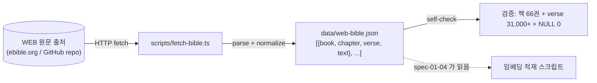

# spec-01-02: WEB 성경 원문 fetch + 정규화

## 📋 메타

| 항목 | 값 |
|---|---|
| **Spec ID** | `spec-01-02` |
| **Phase** | `phase-01` |
| **Branch** | `spec-01-02-bible-source-fetch` |
| **상태** | Planning |
| **타입** | Feature (data ingestion) |
| **Integration Test Required** | yes (fetch 스크립트 실행 + 산출물 무결성 검증) |
| **작성일** | 2026-05-17 |
| **소유자** | @pgaey |

## 📋 배경 및 문제 정의

### 현재 상황
spec-01-01 에서 Supabase 인프라 통로가 셋업되어 `pnpm check:supabase` 가 PASS 합니다. 다음 단계 (spec-01-03 스키마 마이그레이션, spec-01-04 임베딩 적재) 가 진행되려면 **임베딩할 영문 원문 자체** 가 손에 있어야 합니다. 현재 repo 에 성경 텍스트는 한 글자도 없음.

### 문제점
세 후속 spec 이 동일한 데이터 형태 가정에서 작성됩니다:
- spec-01-03: `verses` 테이블 컬럼 정의 시 verse text 의 최대 길이 / 인코딩 추정 필요
- spec-01-04: 31,000+ verse 를 iterate 하며 임베딩 호출 — 정해진 JSON 형식에 의존
- spec-01-05: 평가셋의 정답 verse 가 동일한 (book, chapter, verse) 식별자 체계로 검색 가능해야 함

원본 텍스트와 그 정규화 형식이 한 곳에 commit 되어 있지 않으면 후속 spec 들이 각자 추정한 형태로 작성돼 데이터 형식 충돌이 생깁니다.

### 해결 방안 (요약)
WEB (World English Bible, 100% public domain) 원문을 신뢰 출처에서 받아 `[{book, chapter, verse, text}, ...]` 평면 JSON 배열로 정규화하여 `data/web-bible.json` 으로 commit. fetch + 정규화 로직은 `scripts/fetch-bible.ts` 로 commit 하여 재현 가능.

## 📊 개념도

## 🎯 요구사항

### Functional Requirements
1. **fetch 스크립트 작성** (`scripts/fetch-bible.ts`): HTTP 로 WEB 원문 받아 메모리에 로드.
2. **출처 결정**: 다음 후보 3개 중 1개 선택 — `gratis-bible/bible` (USFX/XML), `wldeh/bible-api` (JSON), ebible.org 공식 zip (USFM 또는 JSON). Task 2 첫 단계에서 후보별 fetch test → 1개 확정 후 walkthrough 에 결정 기록.
3. **정규화**: 원본 포맷이 무엇이든 `[{book: string, chapter: number, verse: number, text: string}, ...]` 평면 배열로 변환.
4. **결정적 직렬화**: 같은 출처면 같은 byte. JSON `stringify` 시 키 순서 고정 (`book, chapter, verse, text` 순).
5. **검증 출력**: 스크립트 종료 전 콘솔에 (a) 책 수 (b) 총 verse 수 (c) NULL/빈 text 수 출력. WEB 기준 책 66, verse ~31,103 (Protestant canon 기준).
6. **산출물 commit**: `data/web-bible.json` (~5MB 예상) 을 git 에 직접 commit.
7. **package.json 스크립트**: `"fetch:bible": "tsx scripts/fetch-bible.ts"`.
8. **README 라이선스 섹션 갱신**: WEB 출처 URL + public domain 명시.

### Non-Functional Requirements
1. **결정성 (deterministic)**: 동일 출처 input → 동일 JSON output. SHA-256 으로 비교 가능.
2. **라이선스 준수**: WEB 는 public domain — 출처 명시면 충분. 다른 번역본 (NIV, ESV 등) 절대 fetch 금지.
3. **외부 의존성 최소**: 가능하면 Node 내장 `fetch` 만 사용 (extra dep 추가하지 않음). XML 파싱 필요한 출처라면 `fast-xml-parser` 정도 1개 허용.
4. **재실행 안전**: 같은 명령 재실행 → 같은 JSON 출력 (혹은 변경분 없음).
5. **에러 명확성**: fetch 실패·파싱 실패·검증 실패 시 어디서 왜 실패했는지 stderr 로 명확히.

## 🚫 Out of Scope

- **KJV·NIV·ESV 등 다른 번역본**: WEB 으로 단일화 (Phase-01 선결 결정).
- **한국어 번역본**: 저작권 보호 (개역개정·새번역 등) — 본 프로젝트 영구 out of scope.
- **DB 적재**: spec-01-04 의 책임.
- **테이블 스키마 설계**: spec-01-03 의 책임.
- **임베딩**: spec-01-04 의 책임.
- **다중 출처 fallback**: 1개 출처 선택 후 그것만 사용. 출처 다운 시 사용자가 인지하고 대응.
- **개별 verse text 정제** (괄호 안 주석 제거 등): WEB 출처가 제공하는 형태 그대로 보존. 임베딩 품질에 영향 시 별도 spec 에서 다룸.
- **Apocrypha 책**: WEB 의 Apocrypha 확장은 무시. Protestant 66권만.

## 🔍 Critique 결과 (선택)

(미실행)

## ✅ Definition of Done

- [ ] `pnpm fetch:bible` 실행 시 콘솔에 책 66 / verse 31,000+ / NULL 0 출력 + exit 0
- [ ] `data/web-bible.json` commit 완료 (파일 크기 합리적 범위, ~3-7MB)
- [ ] JSON 의 첫 verse 가 Genesis 1:1 ("In the beginning..."), 마지막이 Revelation 22:21 (또는 그에 준함) 인지 수동 확인
- [ ] `scripts/fetch-bible.ts` 가 재실행 가능 (같은 출처 + 같은 코드 → 같은 JSON byte)
- [ ] README 라이선스 섹션이 WEB 출처 URL + "public domain" 명시
- [ ] `walkthrough.md` 와 `pr_description.md` ship commit
- [ ] `spec-01-02-bible-source-fetch` 브랜치 push + PR → `phase-01-data-pipeline` 머지 대기
