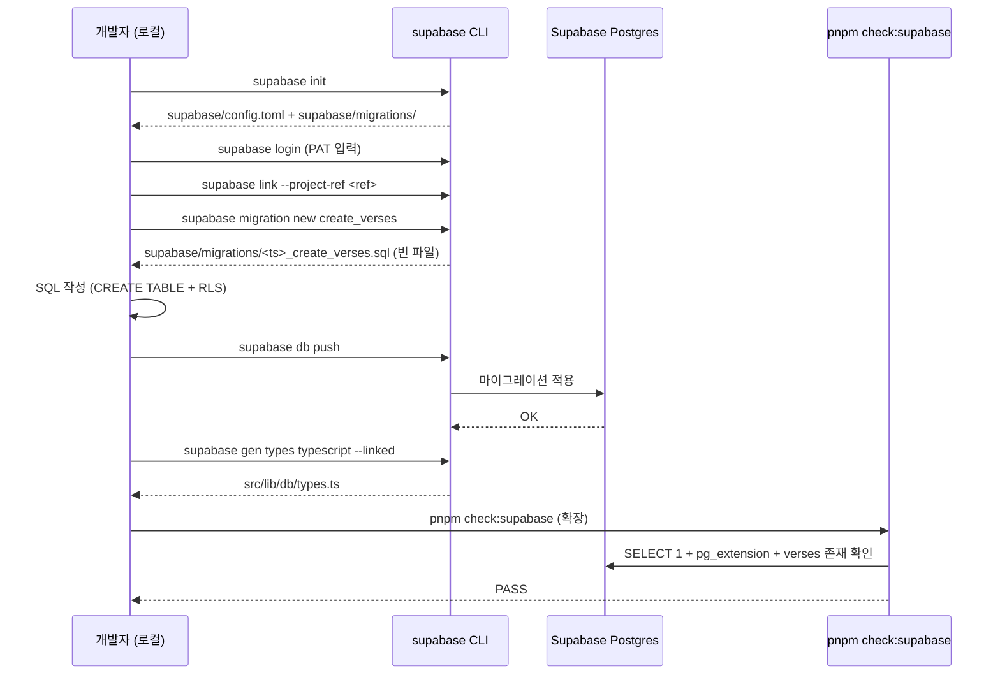

# Implementation Plan: spec-01-03

## 📋 Branch Strategy

- 신규 브랜치: `spec-01-03-verse-schema-migration`
- 시작 지점: `phase-01-data-pipeline` (최신 — spec-01-02 머지 후 fast-forward 됨)
- spec PR target = `phase-01-data-pipeline`
- 첫 task 가 spec 브랜치 생성을 수행

## 🛑 사용자 검토 필요 (User Review Required)

> [!IMPORTANT]
> - [ ] Supabase CLI 설치 (`brew install supabase/tap/supabase`) — Task 2 직전
> - [ ] Supabase Personal Access Token 발급 (Dashboard → Account → Access Tokens) — Task 2 의 `supabase link` 에 필요
> - [ ] `supabase db push` 실행 — Task 4. CLI 가 마이그레이션 SQL 을 remote 에 적용. **이 시점에 remote DB 가 실제로 변경됨**
> - [ ] Dashboard 에서 verses 테이블 생성 시각 확인 (수동, 5초)

> [!WARNING]
> - [ ] `supabase db push` 는 **자동 revert 가 없음**. 잘못된 마이그레이션을 push 했다면 `DROP TABLE verses` 수동 또는 새 reverse migration 작성 필요
> - [ ] Access token 은 `.env.local` 이 아니라 **CLI 가 OS keychain** 에 저장 (`supabase login`). repo 에 절대 commit 금지

## 🎯 핵심 전략 (Core Strategy)

### 아키텍처 컨텍스트



### 주요 결정

| 컴포넌트 | 전략 | 이유 |
|:---:|:---|:---|
| **마이그레이션 도구** | **Supabase CLI** | 표준, 파일 버전관리, 후속 spec 재사용, generated types 무료 |
| **PRIMARY KEY** | `BIGSERIAL` (auto-increment) | (book, chapter, verse) 복합 키 가능하나 BIGSERIAL 이 INSERT 성능·디버깅 친화. UNIQUE constraint 로 중복 차단 |
| **embedding 컬럼 NULL 허용** | `vector(768)` NULL 가능 | 본 spec 은 스키마만, 적재는 spec-01-04. NOT NULL 시 빈 row 생성 불가 |
| **RLS** | ENABLE + 정책 0 | 서버 전용 테이블. anon/publishable key 접근 자동 차단. 최소 권한 원칙 |
| **인덱스** | 없음 | 31k row × 768d brute force ~50ms 예상. spec-01-05 검증 후 부족하면 별도 spec 으로 추가 |
| **generated types** | `supabase gen types typescript --linked` → `src/lib/db/types.ts` | TS 컴파일 단계에서 컬럼명·타입 검증. spec-01-04/05 의 안전망 |
| **check:supabase 확장** | 기존 SELECT 1 + pgvector 에 verses 존재·컬럼 검증 추가 | 별도 check:schema 스크립트보다 단순. 한 명령으로 인프라 전체 점검 |
| **seed.sql** | 빈 파일 commit | placeholder. 실제 시드는 적재 스크립트가 담당 (`scripts/embed-bible.ts` in spec-01-04) |

## 📂 Proposed Changes

### Supabase CLI 산출물

#### [NEW] `supabase/config.toml`
- `supabase init` 자동 생성. project_id 등 메타.
- commit 대상 (재현성).

#### [NEW] `supabase/migrations/<timestamp>_create_verses.sql`
```sql
-- Enable pgvector if not already (idempotent)
CREATE EXTENSION IF NOT EXISTS vector;

CREATE TABLE verses (
  id BIGSERIAL PRIMARY KEY,
  book TEXT NOT NULL,
  chapter INTEGER NOT NULL,
  verse INTEGER NOT NULL,
  text TEXT NOT NULL,
  embedding vector(768),
  CONSTRAINT verses_book_chapter_verse_unique UNIQUE (book, chapter, verse)
);

-- RLS: 서버 전용 — 정책 0개 = anon/publishable 키 접근 차단
ALTER TABLE verses ENABLE ROW LEVEL SECURITY;

COMMENT ON TABLE verses IS 'WEB bible verses with 768-dim embeddings (gemini text-embedding-004)';
COMMENT ON COLUMN verses.embedding IS 'NULL until populated by scripts/embed-bible.ts (spec-01-04)';
```

#### [NEW] `supabase/seed.sql`
- 빈 파일 + 주석 한 줄 (`-- 시드 데이터는 spec-01-04 적재 스크립트가 담당`)

#### [NEW] `supabase/.gitignore` (CLI 자동 생성)
- `.temp/`, `.branches/` 등 임시 디렉토리 무시. 그대로 commit.

### Generated types

#### [NEW] `src/lib/db/types.ts`
- `supabase gen types typescript --linked` 결과물
- `Database` interface 안에 `public.Tables.verses` 정의
- TS strict 통과 필수

### check 스크립트 확장

#### [MODIFY] `scripts/check-supabase.ts`
- 기존: SELECT 1 + pg_extension `vector` 확인
- 추가:
  - `information_schema.tables` 에서 `verses` 존재 확인
  - `information_schema.columns` 에서 `verses` 의 컬럼 (`id, book, chapter, verse, text, embedding`) 6개 모두 존재 확인
- 출력 한 줄 추가: `[check:supabase] verses table ........ PASS / FAIL`

### 문서

#### [MODIFY] `README.md`
- `## 셋업` 섹션:
  - 새 단계 (현재 7번 직전): "Supabase CLI 설치: `brew install supabase/tap/supabase`"
  - 새 단계 (현재 8번 직전): "Supabase 마이그레이션 적용: `supabase login` → `supabase link --project-ref <ref>` → `supabase db push`"
- 환경변수 표는 변경 없음 (CLI 는 OS keychain 사용)

## 🧪 검증 계획 (Verification Plan)

### 단위 테스트 (필수)
> 미도입 유지 (단순 schema/migration 은 통합 smoke 로 갈음)

### 통합 테스트 (Integration Test Required = yes)
```bash
pnpm check:supabase
```
**기대 출력**:
```
[check:supabase] connecting...
[check:supabase] SELECT 1 ............ PASS
[check:supabase] pgvector extension .. PASS
[check:supabase] verses table ........ PASS
[check:supabase] all checks passed.
```

### 수동 검증 시나리오
1. **Dashboard 확인** → Supabase Dashboard → Database → Tables → `verses` 보임. 컬럼 6개 (id, book, chapter, verse, text, embedding) 보임
2. **RLS 확인** → Dashboard 의 verses 테이블 → RLS Enabled = ✓, Policies = 0개
3. **generated types 사용 확인** → `pnpm exec tsc --noEmit` PASS

## 🔁 Rollback Plan

- 코드 변경은 PR revert 1건으로 되돌릴 수 있음 (script 확장, README, types 파일)
- **DB 변경은 자동 rollback X**: revert 시점에 다음 중 하나 수동 실행 필요:
  - `DROP TABLE verses;` (Dashboard SQL Editor 또는 psql)
  - 또는 reverse migration 작성 (`supabase migration new drop_verses` → `DROP TABLE verses;` → `supabase db push`)
- 데이터 영향: 이 시점엔 verses 가 비어있으므로 손실 0

## 📦 Deliverables 체크

- [x] task.md 작성 (이 파일과 동시)
- [ ] 사용자 Plan Accept
- [ ] (실행 후) Supabase CLI 설치·link 완료 보고
- [ ] (실행 후) `supabase db push` 성공 보고
- [ ] (실행 후) 모든 task 완료
- [ ] (실행 후) walkthrough.md / pr_description.md ship
