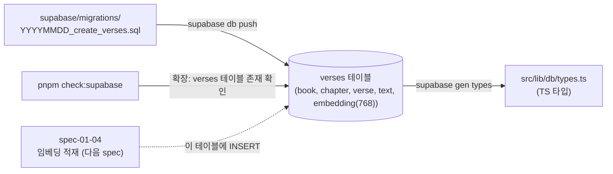

# spec-01-03: verses 테이블 스키마 + Supabase CLI 마이그레이션

## 📋 메타

| 항목 | 값 |
|---|---|
| **Spec ID** | `spec-01-03` |
| **Phase** | `phase-01` |
| **Branch** | `spec-01-03-verse-schema-migration` |
| **상태** | Planning |
| **타입** | Feature (database schema) |
| **Integration Test Required** | yes (`pnpm check:supabase` 확장 — verses 테이블·컬럼 존재 검증) |
| **작성일** | 2026-05-17 |
| **소유자** | @pgaey |

## 📋 배경 및 문제 정의

### 현재 상황
- spec-01-01: Supabase 연결·pgvector extension 활성 검증 통로 셋업 완료
- spec-01-02: WEB 성경 31,102 verse 가 `data/web-bible.json` 으로 정규화 commit 완료
- DB 에는 **아직 어떤 테이블도 없음** — verse 데이터를 담을 그릇이 없는 상태

### 문제점
spec-01-04 (임베딩 적재) 가 진행되려면 verse + 768d embedding 을 받는 테이블이 존재해야 합니다. 그리고 그 테이블 스키마는:
- **버전 관리 가능** 해야 함 (Dashboard 에서 클릭으로 만들면 동료/CI 재현 불가)
- **타입 안전** 해야 함 (TS 코드가 컬럼명·타입 가정 시 컴파일 단계에서 검증)
- **인덱스 전략 보류 가능** 해야 함 (31k row 면 brute force OK, 인덱스는 검증 후 결정)

### 해결 방안 (요약)
Supabase CLI 를 도입하여 `supabase/migrations/<timestamp>_create_verses.sql` 로 `verses` 테이블 생성. RLS 비활성 (서버 전용). 인덱스 없이 시작 (필요 시 후속 spec). `supabase gen types typescript` 로 `src/lib/db/types.ts` 생성하여 TS 컴파일 단계 안전망 확보. `pnpm check:supabase` 에 verses 테이블 존재 검증 한 줄 추가.

## 📊 개념도

## 🎯 요구사항

### Functional Requirements
1. **Supabase CLI 셋업**: `brew install supabase/tap/supabase` 후 `supabase init` + `supabase link --project-ref <ref>`. 결과로 `supabase/` 디렉토리 생성, 일부 commit / 일부 gitignored.
2. **Migration 파일 작성**: `supabase migration new create_verses` → `supabase/migrations/<timestamp>_create_verses.sql` 에 CREATE TABLE SQL 작성. Commit 대상.
3. **테이블 컬럼**:
   - `id BIGSERIAL PRIMARY KEY`
   - `book TEXT NOT NULL`
   - `chapter INTEGER NOT NULL`
   - `verse INTEGER NOT NULL`
   - `text TEXT NOT NULL`
   - `embedding vector(768)` (NULL 허용 — spec-01-04 에서 채움)
   - `UNIQUE (book, chapter, verse)` constraint
4. **RLS**: `ALTER TABLE verses ENABLE ROW LEVEL SECURITY` 후 정책 0개. 즉 secret key 만 접근 가능, anon/publishable key 는 차단.
5. **마이그레이션 적용**: 사용자가 `supabase db push` 로 remote 에 적용. 본 spec 의 검증은 적용 후 가능.
6. **Generated TypeScript types**: `supabase gen types typescript --linked > src/lib/db/types.ts` 실행. 결과 파일 commit.
7. **`pnpm check:supabase` 확장**: 기존 SELECT 1 + pgvector 검증에 (c) `verses` 테이블 존재 + (d) 필수 컬럼 6개 확인 추가.
8. **README 갱신**: 셋업 가이드에 Supabase CLI 설치 + `supabase db push` 단계 + access token 안내. 스크립트 표는 변경 없음.

### Non-Functional Requirements
1. **재현성**: Clone 한 동료가 동일한 명령(`supabase link`, `supabase db push`) 으로 동일한 스키마 재생성 가능.
2. **타입 안전**: `src/lib/db/types.ts` 가 import 가능하고, verses 테이블의 컬럼 타입이 정확히 반영.
3. **롤백 가능**: 마이그레이션 파일이 있으면 `supabase db reset` 또는 수동 `DROP TABLE` 로 rollback 가능 (rollback 자동화는 out of scope).
4. **인덱스 추가는 별도 spec**: 본 spec 은 인덱스 0. 검색 성능 부족 시 spec-x 또는 후속 spec.

## 🚫 Out of Scope

- **데이터 적재** (INSERT 31k verse): spec-01-04 의 책임.
- **pgvector 인덱스** (`ivfflat`, `hnsw`): 31k row 면 brute force 충분. 검증 후 별도 spec.
- **RLS 정책 작성** (specific row-level rules): 사용자 직접 SELECT 가 없는 흐름이라 정책 0개. 향후 사용자 즐겨찾기/북마크 등 기능 추가 시 정책 spec.
- **다른 테이블** (entities, relations, conversations 등): v2/v3 의 영역.
- **자동 마이그레이션 실행** (CI 에서 db push): 보안상 사용자가 수동 실행. CI 통합은 별도 spec.
- **Seed 데이터**: `supabase/seed.sql` 은 빈 파일로 commit (placeholder). 실제 시드는 spec-01-04 의 적재 스크립트가 담당.

## 🔍 Critique 결과 (선택)

(미실행)

## ✅ Definition of Done

- [ ] `supabase/migrations/<timestamp>_create_verses.sql` commit
- [ ] `supabase/config.toml` commit (CLI 설정)
- [ ] `supabase db push` 적용 후 Dashboard 에서 verses 테이블 존재 확인 (수동)
- [ ] `src/lib/db/types.ts` commit (generated types, verses 테이블 타입 포함)
- [ ] `pnpm check:supabase` 가 verses 테이블 + 컬럼 검증 PASS
- [ ] `pnpm exec tsc --noEmit` PASS (generated types import 가능 확인)
- [ ] README 셋업 가이드에 CLI 설치 + `supabase db push` 안내 추가
- [ ] `walkthrough.md` 와 `pr_description.md` ship commit
- [ ] `spec-01-03-verse-schema-migration` 브랜치 push + PR → `phase-01-data-pipeline` 머지 대기
