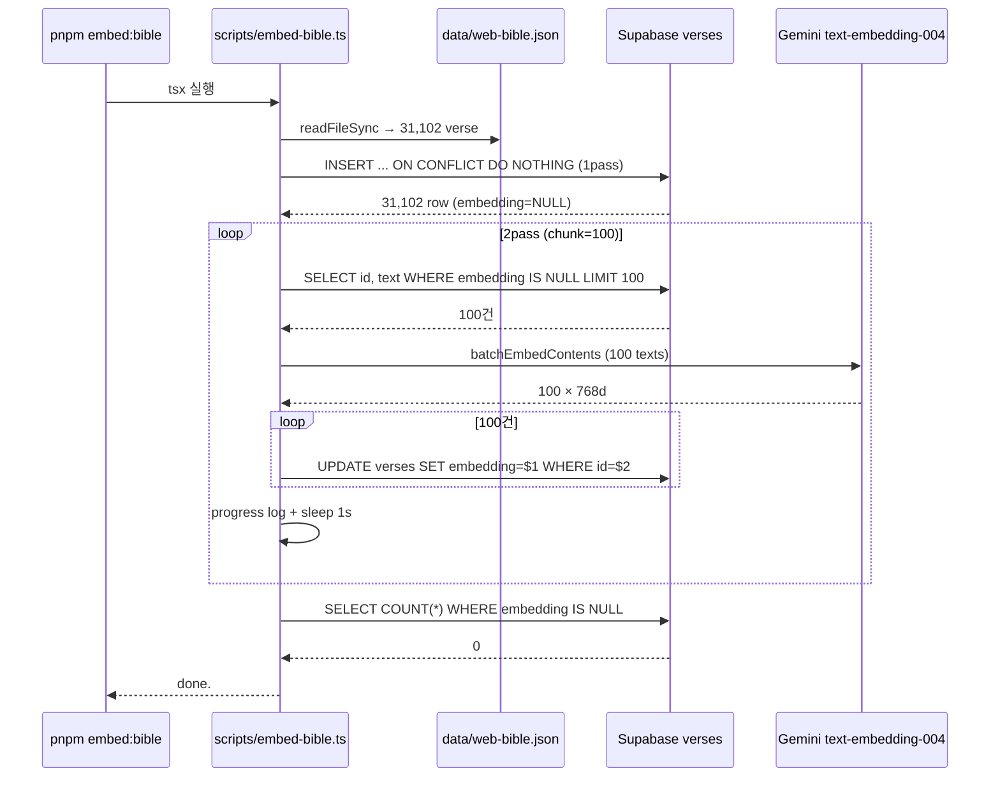

# Implementation Plan: spec-01-04

## 📋 Branch Strategy

- 신규 브랜치: `spec-01-04-embedding-batch-script`
- 시작 지점: `phase-01-data-pipeline` (최신 — spec-01-03 머지 후 fast-forward)
- spec PR target = `phase-01-data-pipeline`
- 첫 task 가 spec 브랜치 생성을 수행

## 🛑 사용자 검토 필요 (User Review Required)

> [!IMPORTANT]
> - [ ] `pnpm embed:bible` 실행 — Task 4. **31,102 verse 의 임베딩이 실제로 적재됨**. 무료 tier 한도 내라도 수십 분 소요 예상
> - [ ] 적재 중 진행률 stdout 로 가시화. 사용자 별도 터미널에서 row count 관찰 가능
> - [ ] 적재 완료 후 사용자가 Supabase Dashboard 에서 verses 31,102 + embedding 채워진 sample 확인

> [!WARNING]
> - [ ] **무료 tier 초과 시 자동 과금 X** (Gemini Developer API 무료 tier 는 한도 초과 시 차단). 단, billing 활성 계정이면 과금 가능 → 사전 Google AI Studio billing 비활성 확인 필요
> - [ ] 적재 중간 실패 → 재실행 안전 (`embedding IS NULL` 만 작업). ON CONFLICT DO NOTHING 으로 1pass 도 재실행 안전

## 🎯 핵심 전략 (Core Strategy)

### 아키텍처 컨텍스트



### 주요 결정

| 컴포넌트 | 전략 | 이유 |
|:---:|:---|:---|
| **API 호출 방식** | `batchEmbedContents` (100건 묶음) | 무료 tier RPM 절약 100배. `@google/genai` SDK 가 native 지원 |
| **SDK** | `@google/genai` (Gen AI 통합 SDK) | Google 공식 신 SDK. 메모리 [[project-logos-rag-phase01]] 와 일치 |
| **INSERT 전략** | 2-pass (1pass: text 만, 2pass: embedding UPDATE) | 책임 분리. 1pass 1초 미만 → 2pass 가 진짜 도전. 중간 실패 시 재시도 단위 명확 |
| **1pass 다건 INSERT** | `INSERT INTO verses (book, chapter, verse, text) VALUES (...) ON CONFLICT (book, chapter, verse) DO NOTHING` | pg parameterized 다건 처리. 1초 미만. ON CONFLICT = 재실행 안전 |
| **2pass UPDATE** | 100건 UPDATE 를 `Promise.all` 병렬 | UPDATE 가벼움. 병렬 100건 ~100ms. 트랜잭션 안 묶음 (부분 성공도 OK — 재실행으로 보완) |
| **재실행 안전성** | DB `embedding IS NULL` skip + ON CONFLICT DO NOTHING | DB 가 진실의 출처. 외부 progress 파일 동기화 부담 없음 |
| **rate limit 대응** | chunk 사이 `EMBED_DELAY_MS ?? 1000` ms sleep | 무료 tier RPM 충분히 여유. env 로 조정 가능 |
| **에러 처리** | chunk 단위 try/catch + 지수 backoff 3회. 3회 실패 시 stderr + skip | 전체 중단보다 부분 진행이 가치. 남은 NULL 은 다음 실행에서 자동 재시도 |
| **로그 형식** | `[embed:bible]` prefix 통일 (기존 스크립트와 일관) | 인지 부담 ↓ |
| **`pnpm check:supabase` 확장** | (e) embedding NULL count 검증 추가, **fail-soft** | 적재 완료 = NULL 0. 적재 전 상태에서도 check 가 PASS 해야 spec-01-04 진행 가능 |

## 📂 Proposed Changes

### Dependencies

#### [MODIFY] `package.json`
- `dependencies`: `@google/genai` (^1.x) 추가
- `scripts`: `"embed:bible": "tsx --env-file=.env.local scripts/embed-bible.ts"` 추가

### 임베딩 스크립트

#### [NEW] `scripts/embed-bible.ts`
- 환경변수 검증 (`SUPABASE_DB_URL`, `GEMINI_API_KEY`)
- pg Client 연결 (Session pooler URI, SSL allow-self-signed)
- **1pass**: `data/web-bible.json` 읽어 다건 INSERT (chunk 1000건씩 — 단일 query 의 파라미터 한계 회피) + ON CONFLICT DO NOTHING
- **2pass**: while loop:
  - `SELECT id, text FROM verses WHERE embedding IS NULL ORDER BY id LIMIT 100`
  - 0건이면 break
  - `genai.models.embedContent({ model, contents: texts })` (batch — API 가 array 받음)
  - 100건 UPDATE 를 `Promise.all`
  - chunk 실패 시 지수 backoff (1s, 2s, 4s) 3회. 3회 실패 시 stderr `chunk skipped` + continue
  - 진행률 stdout: `[embed:bible] N/31102 (X.X%) — chunk took Yms`
  - sleep `EMBED_DELAY_MS`
- **종료 검증**: `SELECT COUNT(*) WHERE embedding IS NULL` = 0 확인. 0 아니면 exit 1 + 남은 수 보고

### check 스크립트 확장

#### [MODIFY] `scripts/check-supabase.ts`
- 기존: SELECT 1 / pgvector / verses table (3 검증)
- 추가: `embedding NULL 수` 출력 (fail-soft)
  - `SELECT COUNT(*) total, COUNT(*) FILTER (WHERE embedding IS NULL) nulls FROM verses`
  - `total = 0` (적재 전): `[check:supabase] embeddings ......... INFO (table empty, run pnpm embed:bible)`
  - `nulls > 0` (적재 중): `INFO (X/Y filled, resume with pnpm embed:bible)`
  - `nulls = 0` (적재 완료): `PASS (Y/Y filled)`
- exit code: 적재 진행 여부와 무관하게 PASS — INFO 는 informational

### 문서

#### [MODIFY] `README.md`
- `## 셋업` 섹션:
  - 새 단계 (현재 `pnpm fetch:bible` 다음): "임베딩 적재: `pnpm embed:bible` (수십 분 소요, 1회만, 중단 시 재실행 안전)"
- `## 스크립트` 표: `pnpm embed:bible` 행 추가

## 🧪 검증 계획 (Verification Plan)

### 단위 테스트 (필수)
> 미도입 유지 (대규모 외부 API 호출 mock 부담 ↑, 통합 smoke 가 더 신뢰)

### 통합 테스트 (Integration Test Required = yes)
```bash
pnpm embed:bible
```
**기대 결과**:
- 1pass: `[embed:bible] inserted 31102 verses (0 already existed)` (재실행 시 `(31102 already existed)`)
- 2pass: 진행률 다수 → 마지막 `[embed:bible] all 31102 verses embedded.`
- 검증: `pnpm check:supabase` 의 embeddings 행이 `PASS (31102/31102 filled)`

### 수동 검증 시나리오
1. **재실행 안전성** → `pnpm embed:bible` 두 번째 실행 → "31102 already existed, 0 NULL embeddings" 즉시 종료 ≤ 2초
2. **Dashboard 확인** → Supabase Dashboard → verses 테이블 → row 31,102 + sample row 의 embedding 컬럼이 채워짐
3. **`pnpm check:supabase`** 가 5단계 PASS 출력

## 🔁 Rollback Plan

- 코드 변경 (script, README, check 확장) 은 PR revert 1건으로 되돌릴 수 있음
- **DB 데이터 영향**: revert 시 verses row 31,102 는 그대로 남음
  - 데이터를 비우려면: `TRUNCATE verses` (Dashboard SQL editor) — 본 spec 의 책임 아님
  - 임베딩만 비우려면: `UPDATE verses SET embedding = NULL` — 본 spec 의 책임 아님
- 데이터 손실: 없음 (verses 는 본 spec 에서만 채워짐)

## 📦 Deliverables 체크

- [x] task.md 작성 (이 파일과 동시)
- [ ] 사용자 Plan Accept
- [ ] (실행 후) 1pass 완료 보고
- [ ] (실행 후) 2pass 완료 보고 (소요 시간 포함)
- [ ] (실행 후) 모든 task 완료
- [ ] (실행 후) walkthrough.md / pr_description.md ship
