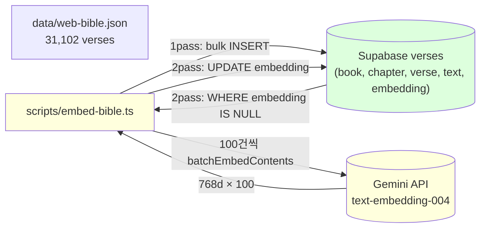

# spec-01-04: WEB bible 임베딩 적재

## 📋 메타

| 항목 | 값 |
|---|---|
| **Spec ID** | `spec-01-04` |
| **Phase** | `phase-01` |
| **Branch** | `spec-01-04-embedding-batch-script` |
| **상태** | Planning |
| **타입** | Feature (data ingestion + ML inference) |
| **Integration Test Required** | yes — 적재 완료 후 verses 테이블 NULL embedding 0건 + count 31,102 검증 |
| **작성일** | 2026-05-18 |
| **소유자** | @pgaey |

## 📋 배경 및 문제 정의

### 현재 상황
- spec-01-02: `data/web-bible.json` 에 31,102 verse 정규화 완료
- spec-01-03: `verses` 테이블 생성 완료 (book/chapter/verse/text/embedding(768d)). 현재 **row 0개**
- spec-01-05 (검색 검증) 가 진행되려면 verses 테이블에 데이터 + 768d 임베딩이 모두 있어야 함

### 문제점
JSON 의 31,102 verse 를 단순 INSERT 만 하면 충분하지 않습니다 — 한국어 cross-lingual 검색이 가능하려면 **각 verse 의 text 가 768차원 임베딩 벡터** 로 변환되어 함께 저장되어야 합니다. 그리고 그 과정은:
- **Gemini 무료 tier rate limit** 안에서 31,102 호출 분산 필요
- **재실행 안전** — 중간에 끊겨도 이미 임베딩된 verse 재호출 없이 이어서 진행
- **진행률 가시화** — 침묵하면 사용자가 멈춘 줄 알게 됨
- **Vercel 함수 타임아웃 불가** — 로컬 노트북에서 실행

### 해결 방안 (요약)
**2-pass 전략**:
1. **1pass (INSERT)**: `data/web-bible.json` → `verses` 테이블에 일괄 INSERT (embedding=NULL). 1초 미만.
2. **2pass (UPDATE)**: `embedding IS NULL` 인 verse 만 골라 100건 배치로 Gemini `batchEmbedContents` 호출 → embedding UPDATE. 진행률 stdout, 실패 시 backoff 재시도.

DB 자체가 "어디까지 했나" 의 진실의 출처. 별도 progress 파일 불필요.

## 📊 개념도

## 🎯 요구사항

### Functional Requirements
1. **단일 스크립트** `scripts/embed-bible.ts` + `pnpm embed:bible` npm script
2. **1pass — INSERT**: `data/web-bible.json` 의 31,102 verse 를 `verses` 테이블에 일괄 INSERT (book/chapter/verse/text). `embedding = NULL`. **이미 있으면 ON CONFLICT (book, chapter, verse) DO NOTHING** — 재실행 안전
3. **2pass — UPDATE**:
   - 시작 시 `SELECT id, text FROM verses WHERE embedding IS NULL ORDER BY id` 로 작업 대상 로드
   - 100건씩 chunk → `genai.models.embedContent` 또는 `batchEmbedContents` 로 호출 → 결과 768d × 100
   - 각 verse 마다 `UPDATE verses SET embedding = $1 WHERE id = $2` (또는 다건 UPDATE)
   - chunk 완료 시 진행률 출력 (`[embed:bible] 5000/31102 (16.1%)`)
4. **에러 처리 / 재시도**: chunk 단위로 try/catch + 지수 backoff 3회 (1s, 2s, 4s). 3회 실패 시 해당 chunk 만 skip 후 stderr 에 기록, 다음 chunk 진행 (전체 중단 X)
5. **재실행 안전성**: DB 의 `embedding IS NULL` 조건만으로 어디부터 이어할지 자동 결정. 외부 progress 파일 없음.
6. **rate limit 준수**: chunk 사이에 `process.env.EMBED_DELAY_MS ?? 1000` (1초 default) sleep. 환경변수로 조정 가능.
7. **종료 시 검증**: 적재 완료 후 `SELECT COUNT(*) FROM verses WHERE embedding IS NULL` = 0 확인. 0 이 아니면 exit 1.
8. **`pnpm check:supabase` 확장**: 기존 4단계 (SELECT 1 / pgvector / verses table) 에 (e) `embedding NULL 수` 검증 추가 (≥0 row 의 verses 에서 NULL 0 확인 — 적재 전엔 31k, 적재 후엔 0)

### Non-Functional Requirements
1. **로컬 전용**: Vercel runtime 에서 실행 금지. `.env.local` 로드는 `--env-file=.env.local` 로 명시.
2. **로그 명확성**: 1pass 시작/끝, 2pass 시작/100건마다 진행률/chunk 실패 시 원인/최종 완료 모두 stdout 또는 stderr 에 명시.
3. **타입 안전**: `src/lib/db/types.ts` (spec-01-03 generated) 의 verses Row/Insert/Update 타입 활용. `any` 금지.
4. **비용 0**: Gemini text-embedding-004 무료 tier 안에서 완료 가능해야 함 (RPM·일일 한도 확인하여 sleep 조정).
5. **결정성 아님**: 같은 verse 라도 임베딩 결과는 모델 버전·API 호출 시점에 따라 미세 차이 가능. embedding 값 자체는 git 추적 X (DB 만 진실).

## 🚫 Out of Scope

- **검색 RPC 함수 정의** (`match_verses(query, k)`): spec-01-05 의 책임
- **평가셋 작성·정확도 측정**: spec-01-05 의 책임
- **pgvector 인덱스 추가** (`ivfflat`, `hnsw`): 31k row brute force 충분, 별도 spec
- **임베딩 결과 git 추적**: DB 만 진실의 출처. 다른 머신에서 재현 필요 시 재실행
- **다국어 임베딩 추가** (한국어 별도 컬럼 등): cross-lingual 은 영문 임베딩 + 한국어 query 임베딩 비교로 충분
- **다른 임베딩 모델 비교 실험**: phase-01 의 선결 결정으로 Gemini text-embedding-004 확정
- **재실행 자동화 (CI/cron)**: 수동 트리거. 1회 적재면 충분
- **batch UPSERT 최적화 (COPY 등)**: 31k INSERT 1초 미만이라 불필요

## 🔍 Critique 결과 (선택)

(미실행)

## ⚠️ Scope 축소 (Constitution §5.6 deviation)

원래 DoD = "31,102 verse 전체 임베딩". 실행 중 발견:
- **Gemini 무료 tier `embed_content_free_tier_requests` = 1,000 RPD** (일일 1,000 requests). batch 안 N contents 가 N requests 로 카운트
- 전체 적재 시 31일 소요 → 학습 페이스 비현실적

**사용자 결정**: 무료 유지 + 오늘 한도 안에서 적재된 만큼으로 spec 마무리. 결과적으로 **정확히 1,000 verse 적재 완료** (한도 = 적재 수).

**전체 31k 적재**는 다음 중 하나로 미룸 → `backlog/queue.md` Icebox 등록:
1. Gemini Tier 1 (billing) 활성화 후 재실행
2. v2 phase 에서 OpenAI 등 다른 provider 도입

## ✅ Definition of Done (수정)

- [x] `pnpm embed:bible` 인프라 (script + check 확장) 완비
- [x] `embed:bible` 첫 실행으로 무료 tier 한도까지 적재 (현재 **1,000/31,102**)
- [x] `pnpm check:supabase` 확장 검증 PASS — embeddings 행이 informational `INFO (1000/31102 filled, resume with pnpm embed:bible)` 출력
- [x] 적재 중간 중단 → 재실행 시 이미 처리된 verse 는 skip (실측 확인: `1pass done — inserted 0 verses (31102 already existed)`)
- [x] Gemini 무료 tier 안에서 비용 발생 0
- [x] `pnpm exec tsc --noEmit` PASS
- [x] `pnpm lint` PASS
- [ ] README 셋업 가이드에 `pnpm embed:bible` 단계 + Tier 1 안내 (Task 5 에서 처리)
- [ ] `walkthrough.md` 와 `pr_description.md` ship commit
- [ ] `spec-01-04-embedding-batch-script` 브랜치 push + PR → `phase-01-data-pipeline` 머지 대기
- [ ] backlog Icebox 에 "전체 31k 적재" 항목 등록
