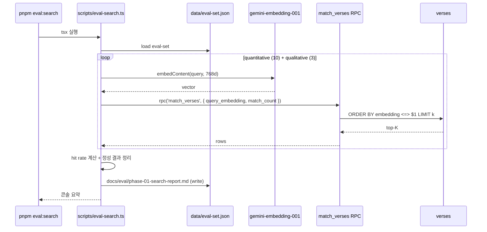

# Implementation Plan: spec-01-05

## 📋 Branch Strategy

- 신규 브랜치: `spec-01-05-cosine-search-verification`
- 시작 지점: `phase-01-data-pipeline` (최신 — spec-01-04 머지 후 fast-forward)
- spec PR target = `phase-01-data-pipeline`
- 첫 task 가 spec 브랜치 생성을 수행

## 🛑 사용자 검토 필요 (User Review Required)

> [!IMPORTANT]
> - [ ] `supabase db push` 실행 — Task 3. match_verses 함수 remote 적용
> - [ ] 평가셋 (10 + 3 query) 의 한국어 표현 검토 — Task 5 (자연스러운가? 정답 verse 와 의미 정합?)
> - [ ] 정성 리포트의 out-of-range 결과 합리성 사람 판단 — Task 7

> [!WARNING]
> - [ ] **정량 정확도 < 60% 발견 시** 즉시 fail X — walkthrough 에 원인 분석 후 사용자 협의. 평가셋 조정·임베딩 모델 재검토·rerank 도입 등 옵션 제시
> - [ ] phase-01.md 통합 테스트 시나리오를 본 spec 안에서 같이 수정 — Constitution §5.6 phase 단위 deviation

## 🎯 핵심 전략 (Core Strategy)

### 아키텍처 컨텍스트



### 주요 결정

| 컴포넌트 | 전략 | 이유 |
|:---:|:---|:---|
| **RPC vs 직접 SQL** | **Postgres RPC** | Supabase JS 친화 (`.rpc()`). generated types 자동. 향후 phase-02/03 의 API route 에서도 재사용 |
| **함수 시그니처** | `match_verses(query_embedding vector(768), match_count int)` | 단순 표준. `match_threshold` 추가는 후속 spec |
| **cosine 연산자** | `<=>` (cosine distance) | pgvector 표준. `1 - distance` = similarity |
| **embedding NULL filter** | `WHERE embedding IS NOT NULL` | 1,000/31,102 부분 적재 상태 대응 |
| **TS wrapper 위치** | `src/lib/search/cosine.ts` | spec-01-04 의 `src/lib/embedding/` 와 동급. phase-02/03 에서 import |
| **평가셋 위치** | `data/eval-set.json` | data/ 표준 (web-bible.json 옆) |
| **평가 결과 위치** | `docs/eval/phase-01-search-report.md` | docs/ 신규 |
| **정량/정성 분리** | quantitative + qualitative_ko 객체 | 사람 판단 정성은 정량 metric 과 섞으면 noise. 리포트 섹션도 분리 |
| **임베딩 비용** | 13 query × embedContent = 13 requests | 무료 tier RPD 1,000 안 무시 가능 (내일 reset 후) |
| **재실행 안전** | 매번 새로 평가 (cache 없음) | 13 query 라 1초 미만. 단순 |
| **check:supabase 확장** | match_verses 함수 존재 검증 추가 (6단계) | 함수 없으면 phase-02 진행 불가 = fail-soft 아님 |

## 📂 Proposed Changes

### Migration

#### [NEW] `supabase/migrations/<ts>_add_match_verses_function.sql`
```sql
CREATE OR REPLACE FUNCTION match_verses(
  query_embedding extensions.vector(768),
  match_count int
)
RETURNS TABLE (
  id bigint,
  book text,
  chapter int,
  verse int,
  text text,
  similarity float
)
LANGUAGE sql
STABLE
AS $$
  SELECT
    v.id,
    v.book,
    v.chapter,
    v.verse,
    v.text,
    1 - (v.embedding <=> query_embedding) AS similarity
  FROM verses v
  WHERE v.embedding IS NOT NULL
  ORDER BY v.embedding <=> query_embedding
  LIMIT match_count;
$$;

COMMENT ON FUNCTION match_verses IS 'Cosine similarity search over verses.embedding';
```

### TypeScript wrapper

#### [NEW] `src/lib/search/cosine.ts`
- export interface VerseMatch (id, book, chapter, verse, text, similarity)
- export `searchVerses(query: string, k = 5): Promise<VerseMatch[]>`
- 내부: GoogleGenAI 로 query → 768d → Supabase JS `.rpc('match_verses', ...)`
- generated `Database['public']['Functions']['match_verses']` 타입 활용 (any 금지)

### 평가셋

#### [NEW] `data/eval-set.json`
```json
{
  "quantitative": {
    "en": [
      { "query": "...", "expected": { "book": "Genesis", "chapter": N, "verse": N } }
    ],
    "ko": [...]
  },
  "qualitative_ko": [
    { "query": "...", "note": "out-of-range" }
  ]
}
```
실제 query 후보 (Task 4 에서 확정):
- en (Genesis 안): "creation of heavens and earth" → Gen 1:1, "Cain killed Abel" → Gen 4:8, "Noah and the flood" → Gen 7, "tower of Babel" → Gen 11, "Abraham almost sacrificed Isaac" → Gen 22
- ko (Genesis 안): "태초에 천지창조" → Gen 1:1, "가인이 아벨을 죽임" → Gen 4:8, "노아의 방주" → Gen 6~9, "야곱의 사다리 꿈" → Gen 28, "아브라함이 이삭을 바치려 함" → Gen 22
- qualitative_ko (out-of-range): "사랑은 오래 참고" (1Cor 13), "여호와는 나의 목자" (Ps 23), "선한 사마리아인" (Lk 10)

### 평가 스크립트

#### [NEW] `scripts/eval-search.ts` + `pnpm eval:search`
- 흐름: eval-set 로드 → quantitative 10 + qualitative 3 → searchVerses → hit rate + 정성 결과
- 결과 마크다운 리포트 (`docs/eval/phase-01-search-report.md`):
  - timestamp
  - quantitative hit rate (EN, KO, 합산)
  - 각 query 별 top-5 표 (PASS/FAIL 표시)
  - qualitative 섹션: query + top-3 결과 dump
  - "사람 판단 필요" 안내
- 콘솔 요약: `[eval:search] EN: 5/5 (100%), KO: 4/5 (80%), 합산: 9/10 (90%)`

### check 스크립트 확장

#### [MODIFY] `scripts/check-supabase.ts`
- 추가: 6번째 = `SELECT 1 FROM pg_proc WHERE proname = 'match_verses' LIMIT 1`
- 출력: `[check:supabase] match_verses fn .... PASS / FAIL`
- FAIL 시 exit 1

### 문서

#### [MODIFY] `README.md`
- `## 셋업` 12번 (`pnpm embed:bible`) 다음, 13번 (`pnpm dev`) 앞에:
  - "검색 평가 (선택): `pnpm eval:search` → docs/eval/phase-01-search-report.md"
- `## 스크립트` 표에 `pnpm eval:search` 추가

#### [MODIFY] `backlog/phase-01.md`
- 통합 테스트 시나리오를 현재 상태 (1,000 verse, Genesis 1~34) 전제로 수정
- 시나리오 1·2 재작성 + 성공 기준 수정
- 결정 기록 표에 본 spec deviation 한 행 추가

#### [NEW] `docs/phase-01-overview.html`
- 사용자 요청 학습 자료. phase-01 전체 (4 완료 + spec-01-05 계획) 를 SVG 다이어그램 + 카드로 시각화
- 자체 완결 HTML 1 파일 (외부 의존 0). 다크 테마. 28KB
- 7 섹션: 전체 흐름 / spec 카드 / 한 verse 변환 / 실행 위치 / 결정 트레일 / spec-01-05 미리보기 / 이후 로드맵
- 3 SVG: 전체 데이터 흐름 / verse 변환 4단계 / spec-01-05 검색 흐름
- spec-01-05 의 docs 산출물로 commit (Task 0 신설)

## 🧪 검증 계획 (Verification Plan)

### 단위 테스트 (필수)
> 미도입 유지

### 통합 테스트 (Integration Test Required = yes)
```bash
pnpm check:supabase    # 6단계 PASS
pnpm eval:search        # 정량 ≥60% + 리포트 생성
```

### 수동 검증 시나리오
1. **TS wrapper 단독 호출 (선택)** — `searchVerses("In the beginning", 3)` → Genesis 1:1 이 top-1
2. **정성 리포트 합리성** — out-of-range 3 query 결과 사람 판단
3. **phase-01.md 갱신 검토** — 통합 테스트 현실 정합

## 🔁 Rollback Plan

- 코드 변경 → PR revert 1건
- DB 변경 (match_verses 함수) → 수동 `DROP FUNCTION` 또는 reverse migration
- 데이터 영향: 없음

## 📦 Deliverables 체크

- [x] task.md 작성 (이 파일과 동시)
- [ ] 사용자 Plan Accept
- [ ] (실행 후) match_verses 함수 적용 + types 재생성 완료
- [ ] (실행 후) 정량 정확도 결과 보고
- [ ] (실행 후) 정성 리포트 사용자 판단
- [ ] (실행 후) phase-01.md 갱신
- [ ] (실행 후) walkthrough.md / pr_description.md ship
