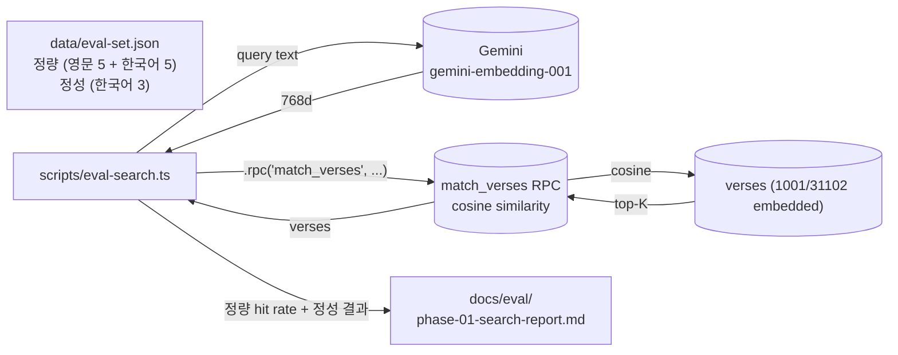

# spec-01-05: cosine 검색 RPC + 평가셋 (Genesis 범위)

## 📋 메타

| 항목 | 값 |
|---|---|
| **Spec ID** | `spec-01-05` |
| **Phase** | `phase-01` |
| **Branch** | `spec-01-05-cosine-search-verification` |
| **상태** | Planning |
| **타입** | Feature (search infra + evaluation) |
| **Integration Test Required** | yes — eval 스크립트 실행 + 정량 기준 통과 + 정성 리포트 생성 |
| **작성일** | 2026-05-18 |
| **소유자** | @pgaey |

## 📋 배경 및 문제 정의

### 현재 상황
- spec-01-04: verses 테이블에 31,102 verse text 적재 + 1,001 embedding 적재 완료
- 적재 범위: **Genesis 1~34장만** (무료 tier RPD 1,000 도달)
- DB 에는 cosine 검색 함수 없음. spec-01-04 의 embedding 컬럼이 검색 API 로 노출 안 됨

### 문제점
phase-01 의 목표 = "검색 인프라가 의도대로 동작하는지 LLM 없이 검증". 현재까지 만든 것은 데이터·스키마·임베딩까지. 검색 자체 (cosine similarity → top-K verse) 는 동작하지 않음. 또:
- Postgres RPC 함수 없이는 phase-02 의 검색 단계가 시작 불가
- TypeScript wrapper 가 없으면 spec-01-04 의 generated types 와 코드 안전망이 끊김
- 평가 메커니즘 (정답 verse 가 top-K 안에 있는지) 이 없으면 임베딩 품질·검색 동작이 ad-hoc 추측

### 해결 방안 (요약)
**3단 구성**:
1. **검색 인프라**: Postgres `match_verses(query_embedding vector, k int)` RPC + `src/lib/search/cosine.ts` TS wrapper
2. **평가셋**: Genesis 1~34 안에서 영문/한국어 정량 평가셋 + 범위 밖 정성 평가셋 (`data/eval-set.json`)
3. **평가 스크립트**: `scripts/eval-search.ts` 가 평가셋 임베딩 → match_verses 호출 → 정량 정확도 + 정성 결과를 마크다운 리포트로 출력 (`docs/eval/phase-01-search-report.md`)

평가 결과 = phase-01 통합 테스트의 증거.

## 📊 개념도



## 🎯 요구사항

### Functional Requirements

#### 1. 검색 인프라
- **Migration**: `supabase migration new add_match_verses_function` → `match_verses(query_embedding extensions.vector(768), match_count int) RETURNS TABLE(id bigint, book text, chapter int, verse int, text text, similarity float)`
- 함수 본문: `1 - (embedding <=> query_embedding)` 으로 cosine similarity 계산, `WHERE embedding IS NOT NULL ORDER BY embedding <=> query_embedding LIMIT match_count`
- `STABLE` + `LANGUAGE sql` 또는 `LANGUAGE plpgsql`
- **`supabase db push`** 적용
- `supabase gen types --linked` 재생성하여 `src/lib/db/types.ts` 갱신 (Functions.match_verses 타입 포함)

#### 2. TypeScript wrapper
- **`src/lib/search/cosine.ts`** — `searchVerses(query: string, k?: number)` async 함수
- 내부: GoogleGenAI 로 query 임베딩 → Supabase JS `client.rpc('match_verses', { query_embedding, match_count })` → typed result
- generated `Database['public']['Functions']['match_verses']` 타입 활용 (any 금지)
- 서버 컴포넌트 / 스크립트에서 사용 가능 (Supabase server client + Gemini key)

#### 3. 평가셋
- **`data/eval-set.json`** 구조:
  ```json
  {
    "quantitative": {
      "en": [{ "query": "creation of heavens and earth", "expected": { "book": "Genesis", "chapter": 1, "verse": 1 } }, ...],
      "ko": [{ "query": "태초에 하나님이 천지를 창조하셨다", "expected": { "book": "Genesis", "chapter": 1, "verse": 1 } }, ...]
    },
    "qualitative_ko": [{ "query": "사랑은 오래 참고", "note": "out-of-range — expect semantically related Genesis verses" }, ...]
  }
  ```
- 정량 영문 5건 + 한국어 5건 — **모두 Genesis 1~34 안에서 정답 verse 존재**
- 정성 한국어 3건 — out-of-range (신약·시편 등), 사람 판단

#### 4. 평가 스크립트
- **`scripts/eval-search.ts`** + `pnpm eval:search`
- 흐름:
  1. `eval-set.json` 로드
  2. quantitative.en + quantitative.ko 각 query 에 대해 `searchVerses(query, 5)` 호출 → top-5 안에 expected 가 있는지 확인 → 정답 hit / total 계산
  3. qualitative_ko 각 query 에 대해 `searchVerses(query, 3)` 호출 → 결과 verse text 와 함께 리포트에 dump
  4. 결과를 `docs/eval/phase-01-search-report.md` 로 저장 (timestamp, hit rate, top-5 결과 표)
- 콘솔: `[eval:search] EN 5/5 (100%), KO 4/5 (80%)` 같은 요약

#### 5. 통합
- `pnpm check:supabase` 에 6번째 검증 추가: `match_verses` 함수 존재 확인 (`pg_proc` 조회)
- README 셋업에 `pnpm eval:search` 단계 추가

### Non-Functional Requirements
1. **로컬 전용** (Vercel 함수 타임아웃 회피, Gemini API key 노출 회피)
2. **타입 안전** — generated types 활용, `any` 금지
3. **재실행 안전** — eval-set 동일하면 결과도 안정적 (단, Gemini 임베딩이 모델 버전에 따라 미세 차이 가능 — hit rate ±5% 변동 허용)
4. **평가 비용** — quantitative 10 query + qualitative 3 query = 13 query embedding 호출. 무료 tier RPD 1,000 안에서 무시 가능

## 🚫 Out of Scope

- **pgvector 인덱스** (`ivfflat`, `hnsw`) 추가 — 1k row brute force ~10ms 충분. 후속 spec.
- **나머지 30k verse 임베딩 적재** — backlog Icebox 의 "전체 31k 적재" 항목 (별도 promote 필요)
- **평가 자동화 CI** — 수동 트리거. CI 통합은 별도 spec.
- **재정렬 (reranking)** — v2/v3 의 RAG 품질 개선.
- **multi-query / query expansion** — v2/v3.
- **검색 API route** (Next.js `/api/search`) — phase-03 의 책임.
- **임베딩 모델 비교 실험** — 선결 결정 (`gemini-embedding-001`) 유지.

## 🔍 Critique 결과 (선택)

(미실행)

## ✅ Definition of Done

- [ ] `match_verses` RPC migration commit + `supabase db push` 적용 + `src/lib/db/types.ts` 갱신
- [ ] `src/lib/search/cosine.ts` (TS wrapper) + tsc PASS
- [ ] `data/eval-set.json` (quantitative 10 + qualitative 3) commit
- [ ] `scripts/eval-search.ts` + `pnpm eval:search` 1회 실행 성공
- [ ] **정량 정확도 ≥ 60%** (Genesis 범위 안 — 영문 + 한국어 합산 hit rate). 단, 모델 변동 ±5% 허용
- [ ] **정성 리포트** 생성 + 사람이 결과 합리성 판단 (out-of-range 3 query 의 결과 가 Genesis 안에서 의미 가까운 verse 인가)
- [ ] `pnpm check:supabase` 6단계 PASS
- [ ] `pnpm exec tsc --noEmit` PASS, `pnpm lint` PASS
- [ ] README 셋업 가이드에 `pnpm eval:search` 단계 추가
- [ ] `walkthrough.md` 와 `pr_description.md` ship commit
- [ ] PR → `phase-01-data-pipeline` 머지 대기
- [ ] **phase-01.md 통합 테스트 시나리오·Done 조건 갱신** (1,000 verse + Genesis 범위 전제로 수정)
