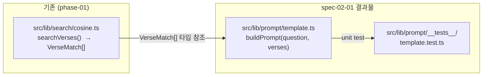

# Implementation Plan: spec-02-01

## 📋 Branch Strategy

- 신규 브랜치: `spec-02-01-prompt-template`
- 시작 지점: `develop` (phase-02 base branch 모드 — 첫 hk-ship 시 `phase-02-search-prompt` 자동 생성)
- 첫 task 가 브랜치 생성을 수행함

## 🛑 사용자 검토 필요 (User Review Required)

> [!IMPORTANT]
> - [ ] **Vitest 최초 도입**: 프로젝트에 처음으로 테스트 프레임워크를 추가함. `pnpm add -D vitest` + `vitest.config.ts` 생성.
> - [ ] **프롬프트 형식 결정**: 시스템 지침은 영문 고정, verse 컨텍스트는 `[Book Ch:V] text` 형식. phase-03 에서 변경이 필요하면 함수 수정으로 대응.

> [!WARNING]
> - [ ] breaking change 없음 — 신규 파일만 추가

## 🎯 핵심 전략 (Core Strategy)

### 아키텍처 컨텍스트



### 주요 결정

| 컴포넌트 | 전략 | 이유 |
|:---:|:---|:---|
| **테스트 프레임워크** | Vitest | Next.js 15+ 프로젝트와 ESM 호환성이 좋고, 설정이 최소화됨. Jest 는 ESM transform 설정 부담 큼 |
| **프롬프트 구조** | 시스템 지침(영문) + Verse 컨텍스트 + 사용자 질문 | Gemini Flash API 는 system instruction 을 별도 필드로 받지만, 단순 문자열 결합으로 먼저 검증 후 phase-03 에서 분리 가능 |
| **verse 형식** | `[Book Ch:V] text` | 인간이 읽기 쉽고, LLM 이 출처를 인식하기 좋은 형식 |

### 📑 ADR 후보

- [x] 없음

## 📂 Proposed Changes

### [테스트 설정]

#### [NEW] `vitest.config.ts`
Vitest 최소 설정. Next.js 의 `@/` path alias 를 resolve 하도록 설정.

```typescript
import { defineConfig } from 'vitest/config'
import path from 'path'

export default defineConfig({
  test: {
    environment: 'node',
  },
  resolve: {
    alias: {
      '@': path.resolve(__dirname, './src'),
    },
  },
})
```

#### [MODIFY] `package.json`
`devDependencies` 에 `vitest` 추가 + `scripts.test` 추가.

```json
"test": "vitest run"
```

### [프롬프트 템플릿]

#### [NEW] `src/lib/prompt/template.ts`
`buildPrompt(question, verses)` 순수 함수.

```typescript
import type { VerseMatch } from '@/lib/search/cosine'

const SYSTEM_INSTRUCTION = `You are a biblical assistant. Answer the user's question in Korean.
Base your answer on the provided Bible verses and cite them in your response using the format [Book Ch:V].
If the provided verses are insufficient, acknowledge it honestly.`

export function buildPrompt(question: string, verses: VerseMatch[]): string {
  const context =
    verses.length === 0
      ? 'No relevant verses found.'
      : verses
          .map((v, i) => `${i + 1}. [${v.book} ${v.chapter}:${v.verse}] ${v.text}`)
          .join('\n')

  return [
    `[System]\n${SYSTEM_INSTRUCTION}`,
    `[Relevant Bible Verses]\n${context}`,
    `[User Question]\n${question}`,
  ].join('\n\n')
}
```

#### [NEW] `src/lib/prompt/__tests__/template.test.ts`
단위 테스트.

```typescript
import { describe, it, expect } from 'vitest'
import { buildPrompt } from '../template'

// 테스트용 VerseMatch mock
const sampleVerses = [
  { id: 1, book: 'Genesis', chapter: 1, verse: 1, text: 'In the beginning God created the heaven and the earth.', similarity: 0.9 },
  { id: 2, book: 'Genesis', chapter: 1, verse: 2, text: 'And the earth was without form, and void...', similarity: 0.85 },
]

describe('buildPrompt', () => {
  it('세 섹션(시스템/컨텍스트/질문)을 모두 포함한다', () => {
    const result = buildPrompt('천지창조에 대해 설명해 주세요', sampleVerses)
    expect(result).toContain('[System]')
    expect(result).toContain('[Relevant Bible Verses]')
    expect(result).toContain('[User Question]')
    expect(result).toContain('천지창조에 대해 설명해 주세요')
  })

  it('verse 를 [Book Ch:V] 형식으로 나열한다', () => {
    const result = buildPrompt('질문', sampleVerses)
    expect(result).toContain('[Genesis 1:1]')
    expect(result).toContain('[Genesis 1:2]')
  })

  it('verses 가 빈 배열이면 No relevant verses found. 를 표시한다', () => {
    const result = buildPrompt('질문', [])
    expect(result).toContain('No relevant verses found.')
  })
})
```

## 🧪 검증 계획 (Verification Plan)

### 단위 테스트 (필수)
```bash
pnpm test
```

### 수동 검증 시나리오
1. `pnpm test` 실행 → 3개 test case 모두 PASS 확인
2. `pnpm build` 실행 → TypeScript 오류 없음 확인

## 🔁 Rollback Plan

- 신규 파일만 추가하므로 브랜치 삭제 외 별도 롤백 불필요
- `package.json` 에 `vitest` 추가는 `devDependencies` 만 영향

## 📦 Deliverables 체크

- [ ] task.md 작성 (다음 단계)
- [ ] 사용자 Plan Accept 받음
- [ ] (실행 후) 모든 task 완료
- [ ] (실행 후) walkthrough.md / pr_description.md ship
