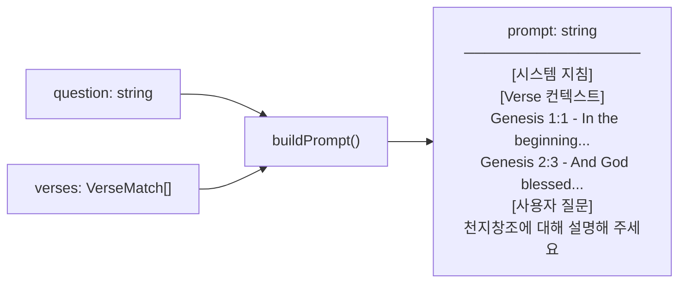

# spec-02-01: 프롬프트 템플릿 모듈

## 📋 메타

| 항목 | 값 |
|---|---|
| **Spec ID** | `spec-02-01` |
| **Phase** | `phase-02` |
| **Branch** | `spec-02-01-prompt-template` |
| **상태** | Planning |
| **타입** | Feature |
| **Integration Test Required** | no |
| **작성일** | 2026-05-19 |
| **소유자** | @pgaey |

## 📋 배경 및 문제 정의

### 현재 상황
`src/lib/search/cosine.ts` 의 `searchVerses(query, k)` 가 `VerseMatch[]` 를 반환한다. 배열의 각 요소는 `{ id, book, chapter, verse, text, similarity }` 구조다. 현재는 이 결과를 평가 리포트(마크다운)로 출력하는 스크립트만 존재하며, LLM 에 투입할 프롬프트로 조립하는 로직이 없다.

### 문제점
verse 배열을 Gemini Flash 등 LLM 에 투입하려면 단순 배열이 아니라 ① 시스템 지침 + ② verse 컨텍스트 블록 + ③ 사용자 질문이 일정한 형식으로 조합된 문자열이 필요하다. 이 조립 로직 없이는 phase-03 LLM 통합을 시작할 수 없다.

### 해결 방안 (요약)
`src/lib/prompt/template.ts` 에 `buildPrompt(question: string, verses: VerseMatch[]): string` 순수 함수를 작성한다. LLM API 호출 없이 문자열 조립만 담당하므로 독립 unit test 가 가능하다. 아울러 이 spec 에서 프로젝트에 Vitest 를 최초 도입하여 `pnpm test` 로 실행할 수 있게 한다.

## 📊 개념도

## 🎯 요구사항

### Functional Requirements
1. `buildPrompt(question, verses)` 가 세 섹션을 포함한 단일 문자열을 반환한다:
   - **시스템 지침**: 한국어로 답변하고, 제공된 성경 구절을 근거로 인용할 것을 요청하는 영문 지시문
   - **Verse 컨텍스트**: 각 verse 를 `[Book Ch:V] text` 형식으로 번호를 붙여 나열
   - **사용자 질문**: 원문 그대로 삽입
2. `verses` 가 빈 배열(`[]`)일 때도 오류 없이 동작하며, 컨텍스트 섹션에 "No relevant verses found." 를 표시한다
3. 함수는 외부 API 호출, 파일 I/O, 환경변수에 의존하지 않는 순수 함수다

### Non-Functional Requirements
1. Vitest 로 단위 테스트 작성, `pnpm test` 로 실행 가능
2. TypeScript strict 모드 호환 (`tsconfig.json` 의 strict 설정 그대로 사용)

## 🚫 Out of Scope

- LLM API 호출 (phase-03)
- 검색 로직 변경 (`searchVerses` 는 그대로)
- 프롬프트 캐싱, 토큰 수 계산, 프롬프트 길이 제한 처리
- 다국어 시스템 지침 (한국어 요청 단일 고정)
- Vitest 의 복잡한 설정 (최소 설정으로 pure function 테스트만)

## 📑 ADR 후보

- [x] 없음

## 🔍 Critique 결과 (선택)

생략 (단순 문자열 조립 함수)

## ✅ Definition of Done

- [ ] `src/lib/prompt/template.ts` 구현 완료
- [ ] `src/lib/prompt/__tests__/template.test.ts` unit test PASS (`pnpm test`)
- [ ] `walkthrough.md` 와 `pr_description.md` 작성 및 ship commit
- [ ] `spec-02-01-prompt-template` 브랜치 push 완료
- [ ] 사용자 검토 요청 알림 완료
