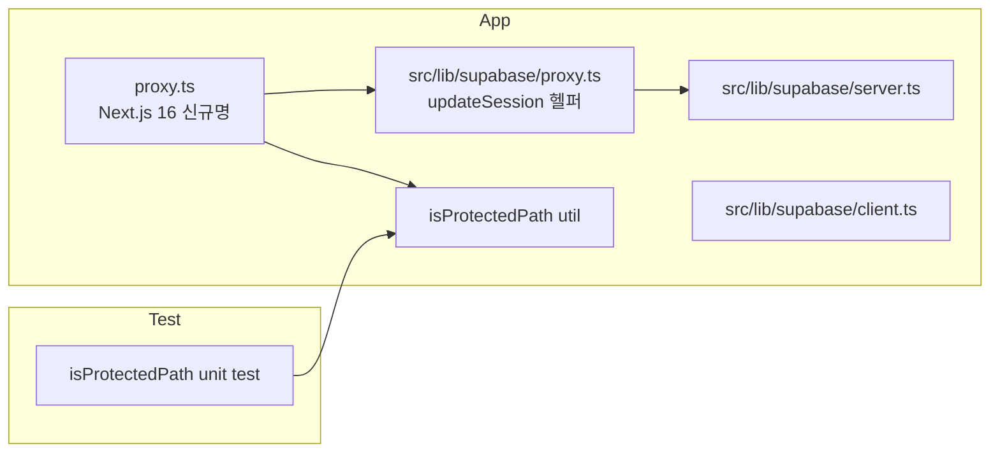

# Implementation Plan: spec-03-01

## 📋 Branch Strategy

- 신규 브랜치: `spec-03-01-supabase-auth-setup` (브랜치 이름 = spec 디렉토리 이름, `feature/` prefix 없음)
- 시작 지점: `develop` (phase-03 base branch `phase-03-auth-ui-llm` 가 아직 생성되지 않음 → 첫 hk-ship 시 sdd 가 자동 생성. 본 spec 의 PR 은 그 branch 로 향함)
- 첫 task 가 브랜치 생성을 수행함

## 🛑 사용자 검토 필요 (User Review Required)

> 본 Plan 을 Accept 하기 전에 사용자가 명시적으로 확인해야 할 항목들.

> [!IMPORTANT]
> - [ ] Supabase 콘솔에서 본 프로젝트의 Auth 가 활성화돼 있고, Email provider 가 ON 인 것 (개발자가 사전 확인 가능)
> - [ ] Google OAuth provider 활성화는 본 spec 머지 후/병행 진행 OK — 코드 변경 없음
> - [ ] `.env.local` 에 `NEXT_PUBLIC_SUPABASE_URL`, `NEXT_PUBLIC_SUPABASE_ANON_KEY` 값을 사용자가 채워야 dev 서버에서 검증 가능 (현재 anon key 만 없으면 추가)

> [!WARNING]
> - [ ] **Next.js 16 가 `middleware.ts` → `proxy.ts` 로 리네임함**. 본 spec 은 `proxy.ts` 명명을 사용. (`middleware.ts` 는 deprecated.)
> - [ ] 새 `proxy.ts` 가 프로젝트 루트에 생기면 Next.js 가 *모든* 요청을 통과시킴 — matcher 잘못 설정 시 정적 자원·`/api/search` 까지 영향. 권장 matcher 패턴 (Next.js 16 docs `proxy.md` §Matcher) 그대로 사용.
> - [ ] @supabase/ssr 도입 시 기존 `@supabase/supabase-js` 직접 사용처 (예: `src/lib/supabase/client.ts` 의 read-only 쿼리) 와 충돌 가능 — 본 task 에서 동거 확인.

## 🎯 핵심 전략 (Core Strategy)

### 아키텍처 컨텍스트



### 주요 결정

| 컴포넌트 | 전략 | 이유 |
|:---:|:---|:---|
| **Supabase 클라이언트** | `@supabase/ssr` 의 `createServerClient` / `createBrowserClient` | Next.js App Router 의 공식 SSR 지원 패키지. 쿠키 IO 를 캡슐화. |
| **쿠키 어댑터 API** | `getAll` / `setAll` (신규 권장 API) | 구 `get/set/remove` adapter 는 `CookieMethodsServerDeprecated` 로 명명되어 deprecated 경고 로그. context7 공식 예시 모두 신규 API 사용. |
| **세션 저장** | Cookie (HttpOnly, Secure in prod, SameSite=Lax — Supabase 기본값) | Server Component / proxy 가 인증 상태를 알 수 있어야 하고 refresh 자동화 필요. JWT 내용은 stateless. |
| **Proxy (구 middleware) 동작** | 모든 요청에서 `updateSession` 호출 (세션 리프레시), protected path 일 때만 redirect | Supabase 공식 가이드 권장. 비보호 경로의 세션도 만료 갱신해야 UI 가 일관됨. Next.js 16 에서 파일/함수명만 `proxy` 로 바뀜. |
| **보호 경로 매처** | matcher 는 정적/이미지 제외 후 모든 경로, `isProtectedPath` 가 helper 내부에서 분기 | matcher 정규식 단독으로 보호 판단 X (세션 리프레시는 모든 경로에서 필요). |
| **테스트 가능 단위** | `isProtectedPath(pathname): boolean` 만 분리 | Supabase SDK 와 무관한 순수 로직. proxy 자체는 framework wiring 이라 단위 테스트 ROI 낮음. |

### 📑 ADR 후보

- [x] ADR 가치 있는 결정 있음 → 후보 한 줄 요약: `auth-cookie-session` (type: decision)
- [ ] 없음

## 📂 Proposed Changes

> 본 섹션은 Task 1 의 context7 조회 결과 (Supabase `@supabase/ssr` + Next.js 16 `proxy.md`) 를 반영한 최신본입니다.

### Supabase 클라이언트 헬퍼

#### [NEW] `src/lib/supabase/server.ts`
서버 환경 (RSC, Route Handler, Server Action) 에서 호출. `next/headers` 의 `cookies()` 결과를 받아 `createServerClient` 에 신규 cookie adapter (`getAll`/`setAll`) 를 주입.

```ts
// context7 공식 예시 기준
import { createServerClient } from '@supabase/ssr'
import { cookies } from 'next/headers'

export async function createClient() {
  const cookieStore = await cookies()
  return createServerClient(
    process.env.NEXT_PUBLIC_SUPABASE_URL!,
    process.env.NEXT_PUBLIC_SUPABASE_ANON_KEY!,
    {
      cookies: {
        getAll: () => cookieStore.getAll(),
        setAll: (cookiesToSet) => {
          cookiesToSet.forEach(({ name, value, options }) =>
            cookieStore.set(name, value, options),
          )
        },
      },
    },
  )
}
```

#### [NEW] `src/lib/supabase/client.ts`
브라우저 (Client Component) 에서 호출. `createBrowserClient` 한 줄 wrapper. 본 spec 에서는 env 변수만 위임하는 최소 형태로 시작 (커스텀 cookie 핸들러는 SSR 패키지 기본값 사용).

```ts
import { createBrowserClient } from '@supabase/ssr'

export function createClient() {
  return createBrowserClient(
    process.env.NEXT_PUBLIC_SUPABASE_URL!,
    process.env.NEXT_PUBLIC_SUPABASE_ANON_KEY!,
  )
}
```

#### [NEW] `src/lib/supabase/proxy.ts`
Next.js 16 의 `proxy.ts` (구 middleware) 내부에서 호출되는 `updateSession(request)` 헬퍼. context7 의 Supabase 공식 middleware 예시를 그대로 이식.

```ts
// 핵심 로직 — Supabase 공식 가이드 (context7) 직역
import { createServerClient } from '@supabase/ssr'
import { NextResponse, type NextRequest } from 'next/server'
import { isProtectedPath } from './protected-paths'

export async function updateSession(request: NextRequest) {
  let response = NextResponse.next({ request })

  const supabase = createServerClient(
    process.env.NEXT_PUBLIC_SUPABASE_URL!,
    process.env.NEXT_PUBLIC_SUPABASE_ANON_KEY!,
    {
      cookies: {
        getAll: () =>
          request.cookies.getAll().map((c) => ({ name: c.name, value: c.value })),
        setAll: (cookiesToSet) => {
          cookiesToSet.forEach(({ name, value, options }) => {
            request.cookies.set(name, value)
            response.cookies.set(name, value, options)
          })
        },
      },
    },
  )

  // 세션 리프레시 — Server Component 동기화에 필요
  const { data: { user } } = await supabase.auth.getUser()

  if (!user && isProtectedPath(request.nextUrl.pathname)) {
    const url = request.nextUrl.clone()
    url.pathname = '/login'
    return NextResponse.redirect(url)
  }

  return response
}
```

#### [NEW] `src/lib/supabase/protected-paths.ts`
```ts
const PROTECTED_PREFIXES = ['/qa', '/api/qa'] as const

export function isProtectedPath(pathname: string): boolean {
  return PROTECTED_PREFIXES.some(p => pathname === p || pathname.startsWith(p + '/'))
}
```

#### [NEW] `proxy.ts` (프로젝트 루트, Next.js 16)
```ts
import { type NextRequest } from 'next/server'
import { updateSession } from '@/lib/supabase/proxy'

export async function proxy(request: NextRequest) {
  return updateSession(request)
}

export const config = {
  matcher: [
    // Next.js 16 proxy.md §Matcher 권장 패턴 — 정적 자원/이미지 제외
    '/((?!_next/static|_next/image|favicon.ico|.*\\.(?:svg|png|jpg|jpeg|gif|webp)$).*)',
  ],
}
```

### 테스트

#### [NEW] `src/lib/supabase/__tests__/protected-paths.test.ts`
```ts
import { describe, it, expect } from 'vitest'
import { isProtectedPath } from '../protected-paths'

describe('isProtectedPath', () => {
  it('returns true for exact /qa', () => expect(isProtectedPath('/qa')).toBe(true))
  it('returns true for /api/qa/something', () => expect(isProtectedPath('/api/qa/some')).toBe(true))
  it('returns false for /login', () => expect(isProtectedPath('/login')).toBe(false))
  it('returns false for /api/search', () => expect(isProtectedPath('/api/search')).toBe(false))
})
```

### 환경 변수

#### [MODIFY] `.env.local.example`
```text
# Supabase (phase-03 추가)
NEXT_PUBLIC_SUPABASE_URL=https://<project>.supabase.co
NEXT_PUBLIC_SUPABASE_ANON_KEY=<anon-public-key>
```

### 의존성

#### [MODIFY] `package.json`
- 추가: `@supabase/ssr` (latest at install time)

## 🧪 검증 계획 (Verification Plan)

### 단위 테스트 (필수)
```bash
pnpm test
# → vitest 가 src/lib/supabase/__tests__/protected-paths.test.ts 실행, PASS
```

### 통합 테스트
없음 (Integration Test Required = no). 실제 로그인 흐름은 spec-03-02 에서 검증.

### 수동 검증 시나리오
1. `pnpm build` — Next.js 16.2.6 빌드 PASS (middleware.ts 컴파일 OK)
2. `pnpm dev` — 서버가 에러 없이 기동
3. 브라우저로 `http://localhost:3000/` 접근 — 미들웨어 통과, 페이지 (또는 default 응답) 정상
4. `http://localhost:3000/qa` 접근 — 현재 페이지가 아직 없으므로 404 가 정상. **단**, 미들웨어가 401/redirect 동작 시 추후 검증 — spec-03-02 에서 본격 확인. 본 spec 의 manual check 은 "middleware 가 throw 하지 않음" 까지로 한정.
5. `pnpm exec tsc --noEmit` — 타입 에러 없음

## 🔁 Rollback Plan

- 문제 발생 시: `git revert` 또는 spec branch 폐기. middleware.ts 가 새로 추가된 파일이므로 삭제만 해도 영향 0.
- 의존성 롤백: `pnpm remove @supabase/ssr` + `pnpm install`. 기존 `@supabase/supabase-js` 사용처에는 영향 없음.
- 환경 변수 추가는 dev 환경에서만 영향 — `.env.local` 에 새 키가 있어도 사용처가 없으면 무해.

## 📦 Deliverables 체크

- [x] task.md 작성 (다음 단계)
- [ ] 사용자 Plan Accept 받음
- [ ] (실행 후) 모든 task 완료
- [ ] (실행 후) walkthrough.md / pr_description.md ship
