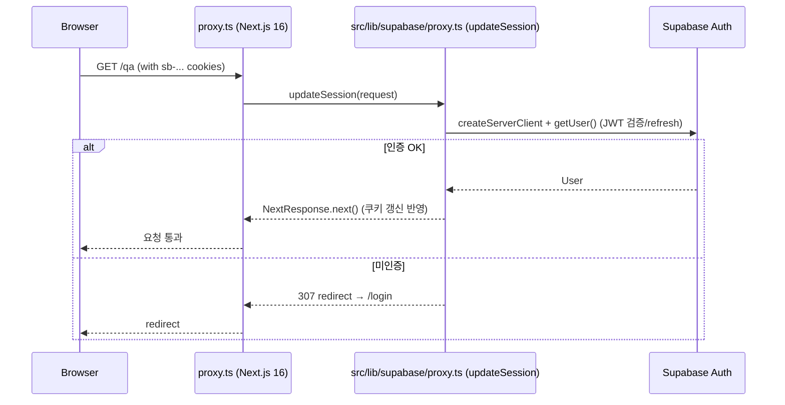

# spec-03-01: Supabase Auth 설정 (supabase-auth-setup)

## 📋 메타

| 항목 | 값 |
|---|---|
| **Spec ID** | `spec-03-01` |
| **Phase** | `phase-03` |
| **Branch** | `spec-03-01-supabase-auth-setup` |
| **상태** | Planning |
| **타입** | Feature |
| **Integration Test Required** | no (실제 로그인 흐름 검증은 spec-03-02 에 위임) |
| **작성일** | 2026-05-20 |
| **소유자** | @pgaey |

## 📋 배경 및 문제 정의

### 현재 상황
- Next.js 16.2.6 App Router 프로젝트에 `@supabase/supabase-js` 만 설치되어 있고 pgvector 검색 용도로만 사용 중 (서비스 키 또는 anon key 로 read-only 쿼리).
- 사용자 인증, 세션 관리, 보호 경로 개념이 전혀 없음.
- `app/` 디렉토리에 UI 페이지가 아직 없고 `app/api/search` 만 존재 — phase-02 산출물.

### 문제점
- phase-03 후속 spec (`auth-ui-pages`, `qa-page-ui`, `qa-api-route`) 이 동작하려면 먼저:
  1. Supabase Auth 가 프로젝트에서 활성화돼 있어야 함 (Dashboard 설정 + provider 등록).
  2. 서버 컴포넌트·Route Handler 가 인증된 user 를 얻을 수 있는 `createClient(...)` 헬퍼가 있어야 함.
  3. `middleware.ts` 가 보호 경로 접근 시 세션 검증 + 리프레시 + redirect 를 수행해야 함.
- 본 spec 이 이 *기반* 을 깔지 않으면 후속 spec 이 모두 막힘.

### 해결 방안 (요약)
공식 `@supabase/ssr` 패키지를 도입하고, Supabase 공식 Next.js App Router 가이드 (context7 로 직접 조회) 의 권장 구조를 그대로 따라 `src/lib/supabase/server.ts`, `src/lib/supabase/client.ts`, `src/lib/supabase/proxy.ts`, `proxy.ts` (프로젝트 루트) 를 작성한다. 실제 로그인 UI 와 흐름 검증은 spec-03-02 의 책임.

> **Next.js 16 변경 사항**: Next.js 16 부터 `middleware.ts` 가 **`proxy.ts`** 로 리네임됨 (함수도 `proxy(request)`). 본 spec 은 새 명명을 따른다. Supabase 공식 가이드는 아직 `middleware.ts` 표현을 쓰지만 동일한 위치/역할이므로 그 패턴을 그대로 이식한다.

## 📊 개념도 (선택)

## 🎯 요구사항

### Functional Requirements
1. `pnpm add @supabase/ssr` 로 패키지 도입 + `package.json` 반영.
2. `.env.local.example` (또는 `.env.local`) 에 `NEXT_PUBLIC_SUPABASE_URL`, `NEXT_PUBLIC_SUPABASE_ANON_KEY` 변수 추가 + 한 줄 설명.
3. `src/lib/supabase/server.ts` — 서버(RSC / Route Handler) 용 `createClient()` 헬퍼. `next/headers` 의 `cookies()` 사용.
4. `src/lib/supabase/client.ts` — 브라우저용 `createClient()` 헬퍼.
5. `src/lib/supabase/proxy.ts` — `updateSession(request)` 헬퍼. `createServerClient` 의 cookie adapter 는 신규 `getAll/setAll` API 사용 (구 `get/set/remove` 는 deprecated). 세션 리프레시 + protected path 시 redirect 반환.
6. `proxy.ts` (프로젝트 루트, Next.js 16 신규명) — `updateSession` 호출 + matcher 설정. 보호 경로: `/qa`, `/api/qa`. (`middleware.ts` 가 아님)
7. `isProtectedPath(pathname: string): boolean` 같은 *순수 함수* 한 개를 분리하여 단위 테스트 작성.

### Non-Functional Requirements
1. **공식 문서 우선**: Task 1 에서 context7 로 `@supabase/ssr` + Next.js App Router 통합 최신 가이드를 조회하고, 그 권장 구조에서 벗어나지 않도록 plan 의 파일 경로/시그니처를 갱신.
2. **stateless**: middleware 와 server helper 는 어떤 in-process 상태도 두지 않음. 모든 인증 상태는 cookie + Supabase 검증에 위임 (Vercel 멀티 인스턴스 / serverless 안전).
3. **타입 안전**: `Database` 제네릭은 추후 도입 가능하도록 선택 인자로 두되, 본 spec 에선 미지정 OK.
4. **기존 search 흐름 회귀 금지**: `app/api/search` 와 phase-02 의 평가 스크립트가 본 spec 의 변경에 의해 동작이 바뀌면 안 됨.

## 🚫 Out of Scope

- 로그인 / 회원가입 / 콜백 UI 페이지 작성 — **spec-03-02** 책임.
- 실제 회원가입·로그인 수동 시나리오 검증 — spec-03-02 통합 시나리오.
- `/api/qa` Route Handler 구현 — **spec-03-04** 책임. 본 spec 은 보호 매처에 경로명만 등록.
- RLS 정책, 사용자별 quota 테이블 — phase-04 범위.
- Database 제네릭 타입 자동 생성 — 후속 spec 또는 별도 작업.
- Google OAuth Dashboard 설정 자체 — Supabase 콘솔 작업이라 코드 범위 밖. 단, 활성화 가이드를 docs 한 단락으로 남김.

## 📑 ADR 후보 (Architecture Decision Records)

- [x] ADR 가치 있는 결정 있음 → 후보 한 줄 요약: `auth-cookie-session` (type: decision)
  - 내용: "Auth 세션을 Bearer JWT (header) 가 아닌 cookie 기반으로 저장" 결정 + Vercel/serverless 환경에서 stateless 임을 명시. v1.5 SSO 앱 분리 시 재검토 트리거.
- [ ] 없음

> ADR 작성은 spec ship 시점에 판단. Plan accept 단계에서는 후보로만 유지.

## 🔍 Critique 결과 (선택)

<!-- /hk-spec-critique 미실행. 필요 시 plan accept 전에 실행 가능. -->

## ✅ Definition of Done

- [ ] `@supabase/ssr` 설치 + `package.json`·`pnpm-lock.yaml` 반영
- [ ] `.env.local.example` 에 Supabase 변수 추가
- [ ] `src/lib/supabase/server.ts`, `src/lib/supabase/client.ts`, `src/lib/supabase/proxy.ts`, `proxy.ts` (프로젝트 루트) 작성
- [ ] `isProtectedPath` 단위 테스트 PASS (`pnpm test`)
- [ ] `pnpm lint` PASS, `pnpm exec tsc --noEmit` PASS (또는 `pnpm build` PASS)
- [ ] `walkthrough.md` / `pr_description.md` 작성 후 ship commit
- [ ] `spec-03-01-supabase-auth-setup` 브랜치 push 완료 + PR 생성
- [ ] 사용자 검토 요청 알림 완료
