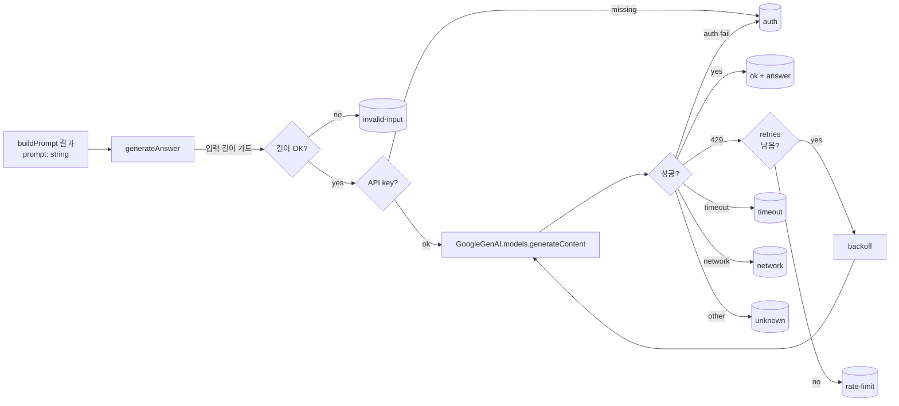

# Implementation Plan: spec-03-03

## 📋 Branch Strategy

- 신규 브랜치: `spec-03-03-llm-gemini-client`
- 시작 지점: `phase-03-auth-ui-llm` (phase base branch — 본 phase 는 base branch 모드)
- 첫 task 가 브랜치 생성을 수행
- 머지 대상: phase base branch (`phase-03-auth-ui-llm`) — develop 직접 머지 금지 (spec-03-02 의 PR #15 실수 재발 방지)

## 🛑 사용자 검토 필요 (User Review Required)

> [!IMPORTANT]
> - [ ] 환경변수 기본값 확정: `GEMINI_MODEL='gemini-2.5-flash'`, `GEMINI_TIMEOUT_MS=30000`, `GEMINI_MAX_RETRIES=2`, `GEMINI_MAX_INPUT_CHARS=30000`
> - [ ] 결과 표현: typed result (`{ ok: true | false, ... }`) — throw 안 함. spec-03-04 에서도 동일 패턴 유지.
> - [ ] `buildPrompt` 결과를 통째로 `contents` 로 전달 (SDK `systemInstruction` config 미사용). 즉 system 분리 책임은 phase-02 prompt template 에 위임.

> [!WARNING]
> - [ ] 신규 의존성 없음 — `@google/genai` 는 phase-01 부터 사용 중
> - [ ] `.env.example` 변경 — 다른 개발자 / CI 환경의 `.env.local` 갱신 필요 (변경 사항: 4 개 신규 변수)
> - [ ] 라이브 호출은 본 spec 에서 검증 안 함 — Gemini quota 영향 없음 (mock only)

## 🎯 핵심 전략 (Core Strategy)

### 아키텍처 컨텍스트



### 주요 결정

| 컴포넌트 | 전략 | 이유 |
|:---:|:---|:---|
| **결과 표현** | typed discriminated union (`{ ok }`) | 호출자 (Server Action) 가 분기 강제. throw 보다 테스트·로깅 일관성 좋음. |
| **systemInstruction** | 미사용 (prompt 통째로 contents) | `buildPrompt` 가 이미 `[System]` 블록을 prompt 안에 포함. SDK config 와 prompt template 책임이 겹치면 prompt 튜닝이 두 곳으로 분산됨. |
| **재시도** | 429 에만, 지수 backoff (`base * 2^attempt`), 최대 N 회 | 429 외 에러는 재시도해도 회복 가능성 낮음. timeout 재시도는 quota 낭비. |
| **timeout** | `AbortController` + `setTimeout` | SDK 가 신호 받아 즉시 중단. fetch 표준 패턴. |
| **에러 분류** | message 패턴 매칭 + status 코드 (있을 때) | SDK 가 typed error 를 제공하지 않을 가능성 — 방어적으로 문자열 패턴 fallback 포함. |
| **테스트 격리** | `vi.mock('@google/genai', ...)` 모듈 전체 mock | 라이브 호출 회피 + 결정적 결과. quota 와 무관하게 CI 가능. |
| **로깅** | 본 spec 은 console.* 없음 (silent) | 호출자가 책임. wrapper 가 로깅하면 보안 누설 위험 + 테스트 노이즈. |

### 📑 ADR 후보

- [ ] ADR 가치 있는 결정 있음
- [x] 없음 (spec.md ADR 후보 섹션과 일치)

## 📂 Proposed Changes

### LLM 모듈

#### [NEW] `src/lib/llm/gemini.ts`

```ts
// 의사 코드
export type GenerateAnswerResult =
  | { ok: true; answer: string }
  | { ok: false; reason: ErrorReason; detail?: string }

type ErrorReason =
  | 'rate-limit' | 'auth' | 'timeout' | 'network' | 'invalid-input' | 'unknown'

const DEFAULTS = {
  model: 'gemini-2.5-flash',
  timeoutMs: 30_000,
  maxRetries: 2,
  maxInputChars: 30_000,
  backoffBaseMs: 500,
}

export async function generateAnswer(prompt: string): Promise<GenerateAnswerResult> {
  // 1. 입력 가드 — 빈 문자열 / 한도 초과 → invalid-input
  // 2. apiKey 확인 → 없으면 auth
  // 3. SDK 초기화: new GoogleGenAI({ apiKey })
  // 4. 재시도 루프 (0..maxRetries):
  //    - AbortController + setTimeout(timeoutMs) 셋업
  //    - ai.models.generateContent({ model, contents: prompt }) await
  //    - 성공: response.text → { ok: true, answer }
  //    - 실패:
  //        429/quota → 마지막 시도 아니면 backoff 후 continue, 마지막이면 rate-limit
  //        timeout → timeout (재시도 안 함)
  //        auth → auth (재시도 안 함)
  //        network → network (재시도 안 함)
  //        그 외 → unknown (재시도 안 함)
  // 5. clearTimeout
}
```

#### [NEW] `src/lib/llm/__tests__/gemini.test.ts`

Vitest + `vi.mock('@google/genai', ...)`. 시나리오:

| # | 케이스 | mock 동작 | 기대 결과 |
|---|---|---|---|
| 1 | happy | `generateContent` resolves `{ text: '한국어 답변' }` | `{ ok: true, answer: '한국어 답변' }` |
| 2 | 빈 입력 | mock 호출 없음 | `{ ok: false, reason: 'invalid-input' }` |
| 3 | 입력 한도 초과 | mock 호출 없음 | `{ ok: false, reason: 'invalid-input' }` |
| 4 | API key 누락 | mock 호출 없음 (env 제거) | `{ ok: false, reason: 'auth' }` |
| 5 | 429 1회 → 성공 | 첫 호출 429 throw, 둘째 성공 | `{ ok: true, ... }` (재시도 동작 확인) |
| 6 | 429 N+1회 | 모든 호출 429 throw | `{ ok: false, reason: 'rate-limit' }` |
| 7 | timeout | mock 이 timeoutMs 보다 오래 걸림 | `{ ok: false, reason: 'timeout' }` |
| 8 | auth 실패 | mock 이 401 메시지 throw | `{ ok: false, reason: 'auth' }` |
| 9 | network 실패 | mock 이 `fetch failed` throw | `{ ok: false, reason: 'network' }` |
| 10 | 일반 Error | mock 이 임의 Error throw | `{ ok: false, reason: 'unknown' }` |

#### [MODIFY] `.env.example`

```diff
+ # Gemini Flash (spec-03-03)
+ GEMINI_MODEL=gemini-2.5-flash
+ GEMINI_TIMEOUT_MS=30000
+ GEMINI_MAX_RETRIES=2
+ GEMINI_MAX_INPUT_CHARS=30000
```

> `GEMINI_API_KEY` 는 phase-01 부터 이미 있음 (임베딩용). 재사용.

### 신규 의존성

없음. `@google/genai` 는 `package.json` 에 이미 등록 (phase-01 embedding 스크립트 기준).

## 🧪 검증 계획 (Verification Plan)

### 단위 테스트 (필수)

```bash
pnpm test src/lib/llm
# 또는 전체:
pnpm test
```

테스트 러너: vitest (기 채택, `src/lib/prompt/__tests__/` 패턴 동일).

### 통합 테스트 (Integration Test Required = no)

해당 없음. 라이브 호출은 spec-03-04 통합 또는 phase 통합 시나리오 2 에서.

### 수동 검증 시나리오

해당 없음. 본 spec 은 사용자 화면 변경 없음 (lib 모듈만). UI 통합 검증은 spec-03-05 이후.

## 🔁 Rollback Plan

- 단순 모듈 추가만이라 영향 격리. 롤백은 `src/lib/llm/` 디렉토리 삭제 + `.env.example` 4 줄 제거 + revert.
- 다른 코드에서 import 안 함 (spec-03-04 가 첫 사용처 — 아직 미작성).
- 환경변수 4 개 추가가 후방 호환성에 미치는 영향: 기본값이 모두 있으므로 누락된 환경에서도 동작 (단, `GEMINI_API_KEY` 누락은 `'auth'` 로 안전 실패).

## 📦 Deliverables 체크

- [ ] task.md 작성 (다음 단계)
- [ ] 사용자 Plan Accept 받음
- [ ] (실행 후) 모든 task 완료
- [ ] (실행 후) walkthrough.md / pr_description.md ship
