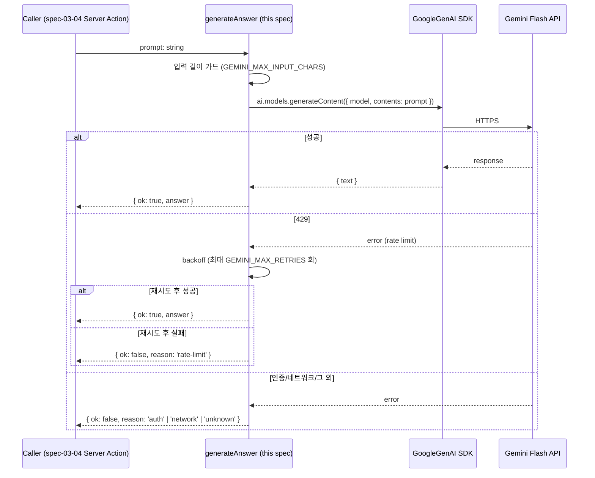

# spec-03-03: LLM Gemini Flash 호출 래퍼

## 📋 메타

| 항목                          | 값                             |
| ----------------------------- | ------------------------------ |
| **Spec ID**                   | `spec-03-03`                   |
| **Phase**                     | `phase-03`                     |
| **Branch**                    | `spec-03-03-llm-gemini-client` |
| **상태**                      | Planning                       |
| **타입**                      | Feature                        |
| **Integration Test Required** | no                             |
| **작성일**                    | 2026-05-30                     |
| **소유자**                    | @pgaey                         |

## 📋 배경 및 문제 정의

### 현재 상황

phase-02 까지 `searchVerses` → `buildPrompt` 흐름이 완성되어 사용자 질문에서 최종 프롬프트 문자열까지 만들 수 있다. `POST /api/search` 가 이 단계까지 검증 가능하다. phase-03 의 spec-03-01·02 는 Supabase Auth 와 로그인/회원가입 UI 를 추가했다. 그러나 만들어진 프롬프트를 실제 LLM 에 보내고 한국어 답변을 받는 단계가 통째로 비어 있다.

### 문제점

- spec-03-04 (`qa-server-action`) 와 spec-03-05 (`qa-page-ui`) 는 "프롬프트 → 답변" 변환 함수를 호출만 하는 구조로 설계되어 있다. 그 변환 함수가 없으면 후속 spec 이 막힌다.
- 외부 API 의존성을 흩어놓으면 (예: 03-04 Server Action 안에서 직접 SDK 호출) 단위 테스트가 어려워지고, LLM 교체·모델 변경 시 수정 지점이 늘어난다.
- Gemini Flash 무료 tier 의 한도와 응답 지연 (5~15초), 에러 종류 (429, auth, network) 를 호출자가 매번 다루기보다 한 곳에서 분류해야 한다.

### 해결 방안 (요약)

`src/lib/llm/gemini.ts` 에 외부 의존성을 격리한 `generateAnswer(prompt: string)` 함수를 둔다. SDK (`@google/genai`) 호출, 환경변수 기반 설정, 타임아웃, 429 백오프, 에러 분류를 함수 안에서 처리하고, 결과는 호출자가 분기할 수 있는 typed result (`GenerateAnswerResult`) 로 돌려준다. 단위 테스트는 SDK 전체를 mock 으로 대체해 라이브 호출 없이 행위를 검증한다.

## 📊 개념도



## 🎯 요구사항

### Functional Requirements

1. **`generateAnswer(prompt: string): Promise<GenerateAnswerResult>` export**
   - 입력: phase-02 `buildPrompt` 결과 문자열 (system + verses + question 통합). 별도 systemInstruction config 미사용.
   - 결과 타입:
     ```ts
     export type GenerateAnswerResult =
       | { ok: true; answer: string }
       | {
           ok: false;
           reason:
             | "rate-limit"
             | "auth"
             | "timeout"
             | "network"
             | "invalid-input"
             | "unknown";
           detail?: string;
         };
     ```
   - 예외 throw 는 SDK 가 정의되지 않은 비정상 상태에 한정 (예: import 실패). 그 외 모든 운영성 실패는 `{ ok: false }` 로 반환.

2. **환경변수 기반 설정** (`process.env`)
   - `GEMINI_API_KEY` (필수) — 누락 시 `{ ok: false, reason: 'auth' }`.
   - `GEMINI_MODEL` (기본 `'gemini-2.5-flash'`).
   - `GEMINI_TIMEOUT_MS` (기본 `30000`).
   - `GEMINI_MAX_RETRIES` (기본 `2`) — 429 응답에 한해 적용.
   - `GEMINI_MAX_INPUT_CHARS` (기본 `30000`) — 호출 전 입력 길이 가드.

3. **에러 분류 매핑**
   - 429 / quota 메시지 → `'rate-limit'` (재시도 소진 시).
   - 401 / API key invalid → `'auth'`.
   - timeout (AbortController fired) → `'timeout'`.
   - network 계열 (fetch fail, DNS, ECONNRESET) → `'network'`.
   - 빈 입력·과도 길이 → `'invalid-input'`.
   - 그 외 → `'unknown'`, `detail` 에 메시지 prefix 만 (시크릿/프롬프트 본문 미포함).

4. **단위 테스트** (`src/lib/llm/__tests__/gemini.test.ts`)
   - SDK 전체를 `vi.mock('@google/genai', ...)` 로 대체.
   - 다음 시나리오 PASS:
     - happy path: mock 이 `{ text: '...' }` 반환 시 `{ ok: true, answer: '...' }`.
     - 빈 입력 / 한도 초과 입력 → `'invalid-input'`.
     - API key 누락 → `'auth'`.
     - 429 1회 후 재시도 성공 → `{ ok: true }`.
     - 429 N+1회 → `'rate-limit'`.
     - timeout → `'timeout'`.
     - 일반 Error → `'unknown'`.

### Non-Functional Requirements

1. **라이브 호출 없음 (이번 spec 한정)** — 모든 테스트는 mock 기반. 실제 Gemini API 호출은 spec-03-04 통합 또는 phase 통합 시나리오 2 에서.
2. **타입 안정성** — `GenerateAnswerResult` 의 discriminated union 이 호출자에게 분기를 강제. `result.answer` 직접 접근은 컴파일 에러.
3. **시크릿/프롬프트 누설 금지** — `detail` 필드와 로그에 `GEMINI_API_KEY` 값, 사용자 질문/프롬프트 본문이 포함되지 않을 것.
4. **재진입 안전** — `generateAnswer` 는 순수 호출. 모듈 전역 상태 보관 금지 (재시도 카운터·타이머는 호출 스코프 내).

## 🚫 Out of Scope

- 실제 Gemini API 라이브 호출 검증 — spec-03-04 또는 phase 통합 시나리오에서 다룬다.
- Streaming response — 본 spec 은 단발 응답만. 스트리밍은 v1.5 이후.
- Tool use / function calling — 단순 텍스트 생성만.
- Prompt 검증·sanitization — `buildPrompt` (spec-02-01) 의 책임. 본 wrapper 는 pass-through.
- 모델 가격·토큰 사용량 측정 — 본 spec 은 호출만. usage 로깅은 v1.5.
- LLM 응답 검증 (citation 포맷, 한국어 비율 등) — 후속 spec 또는 manual QA.

## 📑 ADR 후보

- [ ] ADR 가치 있는 결정 있음
- [x] 없음

> 근거: 결정 규모가 작고 (typed result vs throw, 환경변수 기본값) 본 spec walkthrough 결정 기록으로 충분. LLM 공급자 교체나 wrapper 추상화 패턴 변경이 발생하면 그때 ADR 승격 검토.

## 🔍 Critique 결과 (선택)

<!-- 미실행. Plan Accept 전 사용자가 /hk-spec-critique 호출 시 채움. -->

## ✅ Definition of Done

- [ ] 모든 단위 테스트 PASS (`pnpm test src/lib/llm`)
- [ ] `walkthrough.md` 와 `pr_description.md` 작성 및 ship commit
- [ ] `spec-03-03-llm-gemini-client` 브랜치 push 완료
- [ ] 사용자 검토 요청 알림 완료
