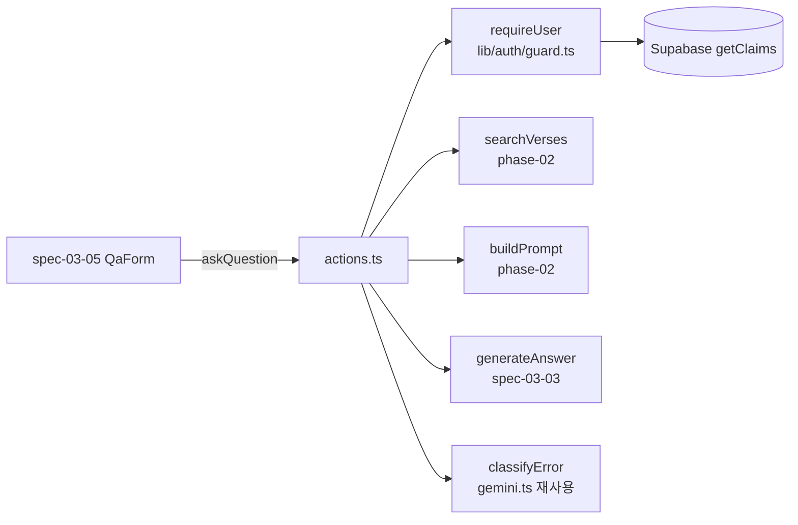

# Implementation Plan: spec-03-04

## 📋 Branch Strategy

- 신규 브랜치: `spec-03-04-qa-server-action`
- 시작 지점: `phase-03-auth-ui-llm` (phase base branch)
- 첫 task 가 브랜치 생성을 수행
- 머지 대상: phase base branch (`phase-03-auth-ui-llm`) — develop/main 직접 머지 금지

## 🛑 사용자 검토 필요 (User Review Required)

> [!IMPORTANT]
> - [x] 인증 방침: **proxy 주 게이트 + `requireUser()` 보조 가드** (getClaims 기반). 사용자 결정 완료.
> - [x] 인자 형태: **typed object + zod** (FormData 아님). 사용자 결정 완료.
> - [x] 에러 매핑: `timeout` 별도 reason 유지. generateAnswer auth/invalid-input → unknown(로그만). 사용자 결정 완료.
> - [ ] question 길이 상한 **1000자** 확정 여부 (검색 쿼리로 충분, generateAnswer가 30k 최종 가드)

> [!WARNING]
> - [ ] 신규 의존성 없음 — `zod ^4.4.3` 이미 존재
> - [ ] `gemini.ts`에서 `classifyError` **export 추가** (현재 내부 함수) — spec-03-03 모듈 1줄 수정. 동작 변화 없음(순수 함수 노출).
> - [ ] `'use server'` 타입 export 제약 — 첫 task로 `node_modules/next/dist/docs/` 확인. 기존 `login/actions.ts`가 `type AuthState` export 중이라 가능성 높으나, 막히면 `types.ts` 분리.

## 🎯 핵심 전략 (Core Strategy)

### 아키텍처 컨텍스트



### 주요 결정

| 컴포넌트 | 전략 | 이유 |
|:---:|:---|:---|
| **인증** | proxy 주 게이트 + `requireUser()` 보조 | proxy가 모든 HTTP 차단(주). requireUser는 직접 import 호출 대비 보조 + DRY. getClaims 통일(코드베이스 일관 + 공식 권장). |
| **결과 표현** | typed discriminated union `AskResult` | 화면이 분기 강제. spec-03-03 `GenerateAnswerResult`와 동일 패턴. |
| **인자** | typed object + zod | 타입 안정성·테스트 용이. FormData보다 재사용 쉬움. zod 이미 의존성. |
| **에러 분류** | `searchVerses` throw도 `classifyError` 재사용 | gemini.ts의 검증된 분류기(quota/429/resource_exhausted/status). 자작 매칭은 누락 위험. |
| **이중 가드 금지** | 프롬프트 길이는 generateAnswer에 위임 | question만 가볍게(1000자), 최종 30k는 generateAnswer. 한도 이중화 방지. |
| **테스트 격리** | requireUser/searchVerses/generateAnswer 모듈 mock | 라이브·Supabase 호출 회피. 결정적 분기 검증. |

### 📑 ADR 후보

- [ ] ADR 가치 있는 결정 있음
- [x] 없음 (spec.md ADR 후보 섹션과 일치)

## 📂 Proposed Changes

### 인증 가드

#### [NEW] `src/lib/auth/guard.ts`

```ts
import { createClient } from '@/lib/supabase/server'

export async function requireUser() {
  const supabase = await createClient()
  const { data } = await supabase.auth.getClaims()
  return data?.claims ?? null
}
```

### LLM 모듈 (1줄 노출)

#### [MODIFY] `src/lib/llm/gemini.ts`

- `classifyError` 함수에 `export` 추가 (현재 모듈 내부 함수). 동작 불변, 재사용 목적. 기존 10 테스트 회귀 없음.

### QA Server Action

#### [NEW] `src/app/qa/actions.ts`

```ts
'use server'
import { z } from 'zod'
import { requireUser } from '@/lib/auth/guard'
import { searchVerses, type VerseMatch } from '@/lib/search/cosine'
import { buildPrompt } from '@/lib/prompt/template'
import { generateAnswer, classifyError } from '@/lib/llm/gemini'

// AskResult 타입은 docs 확인 후 동일 파일 또는 src/app/qa/types.ts

const InputSchema = z.object({
  question: z.string().trim().min(1).max(1000),
  k: z.number().int().min(1).max(10).optional().default(5),
})

export async function askQuestion(input: { question: string; k?: number }): Promise<AskResult> {
  // 1. requireUser → null이면 unauthorized
  // 2. InputSchema.safeParse → 실패면 invalid-input
  // 3. try { searchVerses(question, k) } catch (e) → classifyError(e): rate-limit | unknown
  // 4. buildPrompt(question, verses)
  // 5. generateAnswer(prompt) →
  //    ok → { ok:true, answer, verses }
  //    rate-limit → rate-limit / timeout → timeout
  //    그 외 → unknown (reason+detail은 console.error로 서버 로그, 본문 제외)
}
```

#### [NEW] `src/app/qa/__tests__/actions.test.ts`

Vitest. `vi.mock`으로 `@/lib/auth/guard`, `@/lib/search/cosine`, `@/lib/llm/gemini` 대체.

| # | 케이스 | mock | 기대 |
|---|---|---|---|
| 1 | 정상 | requireUser→claims, search→verses(3), generate→{ok,answer} | `{ ok:true, answer, verses(3) }` |
| 2 | 미인증 | requireUser→null | `{ ok:false, reason:'unauthorized' }`, search 미호출 |
| 3 | 빈 질문 | requireUser→claims | `{ ok:false, reason:'invalid-input' }`, search 미호출 |
| 4 | 질문 과길이(>1000) | requireUser→claims | `invalid-input` |
| 5 | k 클램프 | k=99 입력 | searchVerses가 k=10으로 호출됨(인자 assertion) |
| 6 | search throw(429) | search→throw 'quota' | `rate-limit` |
| 7 | search throw(기타) | search→throw 'boom' | `unknown` |
| 8 | generate rate-limit | generate→{ok:false,'rate-limit'} | `rate-limit` |
| 9 | generate timeout | generate→{ok:false,'timeout'} | `timeout` |
| 10 | generate auth/unknown | generate→{ok:false,'auth'} | `unknown` |
| 11 | verses 0건 | search→[] | `{ ok:true, ... }` (buildPrompt가 처리) |

> classifyError 는 mock 하지 않고 실제 함수 사용(순수 함수). search throw 케이스는 실제 분류 경로 검증.

### 신규 의존성

없음. `zod` 이미 존재.

## 🧪 검증 계획 (Verification Plan)

### 단위 테스트 (필수)

```bash
pnpm test src/app/qa src/lib/auth
# 또는 전체:
pnpm test
```

러너: vitest (node env). Supabase server client는 guard mock으로 우회.

### 통합 테스트 (Integration Test Required = no)

해당 없음. 라이브 검증은 phase 통합 시나리오 3(smoke-qa.ts, spec 범위 밖).

### 수동 검증 시나리오

해당 없음(UI 없음). 화면 통합은 spec-03-05.

## 🔁 Rollback Plan

- 신규 파일 추가 위주. 롤백은 `src/app/qa/` + `src/lib/auth/guard.ts` 삭제 + `gemini.ts`의 `export` 1줄 revert.
- `generateAnswer`/`searchVerses`/`buildPrompt`는 호출만 — 기존 동작 영향 없음.
- `classifyError` export는 순수 함수 노출이라 후방 호환.

## 📦 Deliverables 체크

- [ ] task.md 작성 (다음 단계)
- [ ] 사용자 Plan Accept 받음
- [ ] (실행 후) 모든 task 완료
- [ ] (실행 후) walkthrough.md / pr_description.md ship
