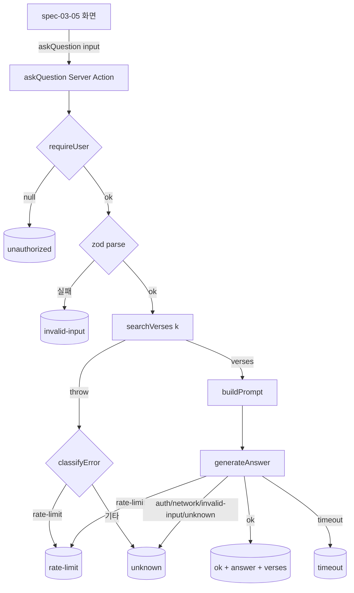

# spec-03-04: QA 통합 Server Action (askQuestion)

## 📋 메타

| 항목 | 값 |
|---|---|
| **Spec ID** | `spec-03-04` |
| **Phase** | `phase-03` |
| **Branch** | `spec-03-04-qa-server-action` |
| **상태** | Planning |
| **타입** | Feature |
| **Integration Test Required** | no |
| **작성일** | 2026-05-31 |
| **소유자** | @pgaey |

## 📋 배경 및 문제 정의

### 현재 상황

phase-03 까지 인증(spec-03-01·02)과 LLM 답변 래퍼 `generateAnswer`(spec-03-03)가 완성되어, 다음 부품이 모두 준비되었다:

- `searchVerses(query, k=5): Promise<VerseMatch[]>` — 한국어 질문 벡터 검색 (phase-02)
- `buildPrompt(question, verses): string` — 프롬프트 조립 (phase-02)
- `generateAnswer(prompt): Promise<GenerateAnswerResult>` — Gemini Flash 답변 (spec-03-03)
- Supabase 인증 헬퍼 `createClient()` + `getClaims()` 패턴 (spec-03-01)

그러나 이 부품들을 **하나로 묶어 "질문 → 답변"을 수행하는 진입점이 없다.** 화면(spec-03-05)은 함수 하나만 호출하면 되는 구조로 설계되어 있는데, 그 함수가 비어 있다.

### 문제점

- 화면(03-05)이 검색·프롬프트·LLM을 각각 호출하면 UI에 비즈니스 로직이 흩어진다. 한 곳(Server Action)에 묶어야 한다.
- `generateAnswer`는 6종 `reason`을, `searchVerses`는 throw를 던진다. 호출자(화면)가 이 이질적인 실패를 매번 다루면 UI가 복잡해진다. 한 곳에서 **화면이 분기할 typed result**로 정규화해야 한다.
- 인증을 화면/검색/LLM 어디서도 확인하지 않으면, proxy를 우회한 직접 호출 경로(미래에 다른 서버 코드가 `askQuestion`을 import)에서 무방비가 된다.

### 해결 방안 (요약)

`src/app/qa/actions.ts`에 `'use server'` 함수 `askQuestion(input)`을 두어 **인증 게이트 → 입력 검증 → 검색 → 프롬프트 조립 → LLM 호출 → typed result 매핑**을 한 번에 처리한다. 인증은 신규 공통 헬퍼 `src/lib/auth/guard.ts`의 `requireUser()`로 통일한다(proxy가 주 게이트, 이것은 재사용 가능한 보조 가드). 결과는 `AskResult` discriminated union으로 반환해 화면이 분기를 강제당하게 한다. 단위 테스트는 `requireUser` / `searchVerses` / `generateAnswer`를 mock해 라이브 호출 없이 모든 분기를 검증한다.

## 📊 개념도



## 🎯 요구사항

### Functional Requirements

1. **`askQuestion(input): Promise<AskResult>` export** (`src/app/qa/actions.ts`, `'use server'`)
   - 입력: `{ question: string; k?: number }` (typed object — FormData 아님). 화면은 typed payload로 직접 호출.
   - 결과 타입:
     ```ts
     export type AskResult =
       | { ok: true; answer: string; verses: VerseMatch[] }
       | {
           ok: false;
           reason: "unauthorized" | "invalid-input" | "rate-limit" | "timeout" | "unknown";
         };
     ```
   - `AskResult` 타입 위치: 기존 `login/actions.ts`가 `type AuthState`를 `'use server'` 파일에서 export 중이므로 동일 파일 export 가능성이 높으나, 첫 task로 `node_modules/next/dist/docs/`에서 제약을 확인하고 막히면 `src/app/qa/types.ts`로 분리.

2. **인증 게이트 — `requireUser()` 공통 헬퍼** (`src/lib/auth/guard.ts` 신규)
   - `requireUser()` — `createClient()` → `supabase.auth.getClaims()` → `data?.claims ?? null` 반환.
   - `askQuestion`은 진입부에서 `requireUser()` 호출, `null`이면 `{ ok: false, reason: 'unauthorized' }`.
   - **proxy가 인증의 주 게이트**(모든 HTTP를 matcher로 차단). `requireUser`는 직접 import 호출 대비 보조 가드 + 인증 로직 DRY 집약. "다층 방어" 과장 없이 "로그인 게이트"로만 정당화.
   - 인증 방식은 코드베이스 전체(proxy.ts:43, layout)와 동일하게 `getClaims()`. Supabase 공식이 `getUser()`의 더 빠른 대안으로 권장(Web Crypto 비대칭키 로컬 검증, 2025-07-14 JWT signing keys). proxy.ts 주석도 getClaims 정상 패턴 명시.

3. **입력 검증 — zod** (`zod ^4.4.3` 이미 의존성에 존재, `login/actions.ts`도 zod 사용)
   - `question`: 비어있지 않은 문자열, 길이 상한(기본 1000자) → 위반 시 `invalid-input`.
   - `k`: 선택, 정수, `/api/search`와 동일하게 **1~10 클램프**(기본 5).
   - 최종 프롬프트 길이 한도(30k)는 `generateAnswer`(`GEMINI_MAX_INPUT_CHARS`)에 위임 — 이중 가드 만들지 않음.

4. **흐름**: `requireUser` → zod parse → `searchVerses(question, k)` (try/catch) → `buildPrompt(question, verses)` → `generateAnswer(prompt)` → 매핑.

5. **에러 매핑** (외부 6종/throw → AskResult 5종, 검색 단계도 일관 분류)
   - `requireUser` null → `unauthorized`
   - zod 실패 → `invalid-input`
   - `searchVerses` throw → `gemini.ts`의 `classifyError`를 **재사용**하여 분류: rate-limit → `rate-limit`, 그 외(auth/network/unknown 등) → `unknown`. (자작 문자열 2-패턴 매칭 금지 — 검증된 분류기 재사용으로 임베딩 단계 429·resource_exhausted 누락 방지. `classifyError`를 `gemini.ts`에서 export.)
   - `generateAnswer` 결과: `rate-limit` → `rate-limit`, `timeout` → `timeout`, 그 외(`auth`/`network`/`invalid-input`/`unknown`) → `unknown`.
     - `generateAnswer`의 `auth`/`invalid-input`은 서버 설정·프롬프트 길이 문제(사용자 질문 탓 아님)라 화면엔 `unknown`으로 접되, **reason+detail을 서버 로그(console.error)로 남김** (시크릿/프롬프트 본문 제외).

6. **기존 `/api/search` Route Handler 유지** — phase-02 검색 단독 회귀 보호. 본 spec은 미수정.

### Non-Functional Requirements

1. **라이브 호출 없음** — 모든 테스트는 `requireUser`/`searchVerses`/`generateAnswer` mock. 라이브 검증은 phase 통합 시나리오 3(smoke-qa).
2. **타입 안정성** — `AskResult` discriminated union이 화면에 분기 강제. `result.answer` 직접 접근은 컴파일 에러.
3. **시크릿/프롬프트 누설 금지** — 결과·로그에 API 키, 사용자 질문/프롬프트 본문 미포함.
4. **검색 결과 0건 허용** — `searchVerses`가 빈 배열이어도 정상. `buildPrompt`가 'No relevant verses found.' 처리. `verses.length ≤ k`.

## 🚫 Out of Scope

- 화면/UI (`/qa` page, QaForm) — spec-03-05.
- 라이브 LLM·검색 통합 검증 — phase 통합 시나리오 3(smoke-qa.ts).
- 채팅 히스토리, 폴링, 스트리밍 — v1.5 이후.
- rate limit 자체 구현(요청 제한) — 본 spec은 외부 429 분류만.
- `searchVerses` 내부 에러 분류 개선 — 본 spec은 호출부에서 `classifyError`로 정규화만(검색 함수 자체 수정 안 함).
- RLS·사용자별 데이터 격리 — 검색은 service-role 전역. 본 spec 인증은 "로그인 게이트"이지 데이터 격리가 아님(명시적 비목표).

## 📑 ADR 후보

- [ ] ADR 가치 있는 결정 있음
- [x] 없음

> 근거: 인증 방식(getClaims)·결과 패턴(typed result)은 이미 코드베이스/spec-03-03에서 확립된 컨벤션을 따름. "proxy 단일 게이트 + 보조 가드" 방침은 phase-03.md 결정 기록 및 메모리(project_auth_architecture)에 이미 반영됨. wrapper 추상화나 인증 전략 변경 시 ADR 승격 검토.

## 🔍 Critique 결과 (선택)

<!-- deep-interview 검수 2회 반영됨(인증 실효성·에러 분류 비대칭·nullable 가정·zod 정당화). Plan Accept 전 /hk-spec-critique 추가 호출 가능. -->

## ✅ Definition of Done

- [ ] `requireUser`/`searchVerses`/`generateAnswer` mock 단위 테스트 PASS (`pnpm test src/app/qa src/lib/auth`)
- [ ] 미인증 → `{ ok: false, reason: 'unauthorized' }`, 정상 → `{ ok: true, answer, verses(≤k) }`, 각 에러 분기 검증
- [ ] `tsc --noEmit` + `eslint` clean
- [ ] `walkthrough.md` / `pr_description.md` 작성 및 ship commit
- [ ] `spec-03-04-qa-server-action` 브랜치 push + PR(대상: `phase-03-auth-ui-llm`)
- [ ] 사용자 검토 요청 알림 완료
