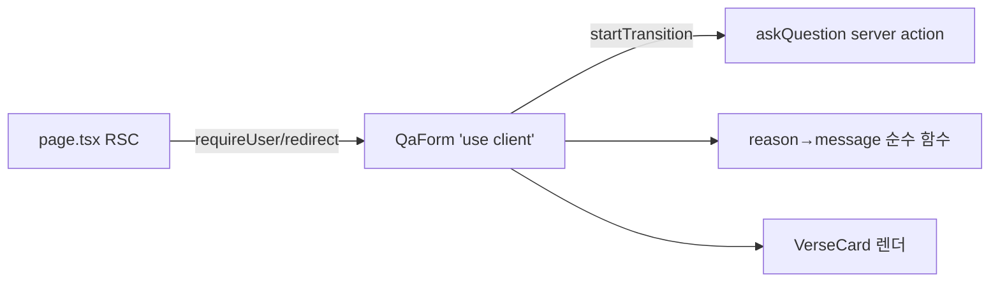

# Implementation Plan: spec-03-05

## 📋 Branch Strategy

- 신규 브랜치: `spec-03-05-qa-page-ui`
- 시작 지점: `phase-03-auth-ui-llm` (phase base branch)
- 첫 task 가 브랜치 생성을 수행
- 머지 대상: phase base branch (`phase-03-auth-ui-llm`) — develop/main 직접 머지 금지

## 🛑 사용자 검토 필요 (User Review Required)

> [!IMPORTANT]
> - [ ] **호출 방식**: `askQuestion`은 typed object 인자라 `useActionState`(prevState, formData)와 안 맞음. **`useState` + `useTransition`으로 직접 호출** 채택(권장). login은 FormData라 useActionState였지만, 여기선 typed object라 직접 호출이 자연스럽고 어댑터 불필요.
> - [ ] **테스트 범위**: UI 통합 렌더 테스트는 jsdom 미설정이라 안 함. reason→메시지 매핑을 순수 함수로 분리해 그것만 vitest. 화면 동작은 수동 검증(phase 통합 시나리오 2).

> [!WARNING]
> - [ ] 신규 의존성 없음 (React 19 useTransition, 기존 Tailwind)
> - [ ] 라이브 검증은 phase 통합에서 — 임베딩 적재 범위(Genesis·Exodus) 질문으로 확인. UI/플로우 자체는 임베딩과 무관하게 동작.

## 🎯 핵심 전략 (Core Strategy)

### 아키텍처 컨텍스트



### 주요 결정

| 컴포넌트 | 전략 | 이유 |
|:---:|:---|:---|
| **호출 방식** | `useState` + `useTransition` 직접 호출 | askQuestion이 typed object 인자. useActionState는 FormData/(prev,fd)용이라 어댑터 필요해짐. |
| **인증** | page RSC에서 `requireUser()` → redirect | proxy 주 게이트 + 보조. spec-03-04 guard 재사용(DRY). |
| **결과 분기** | `AskResult` discriminated union 직접 분기 | 타입이 분기 강제. ok:true에서만 answer/verses 접근. |
| **메시지 매핑** | reason→메시지 순수 함수로 분리 | UI에서 떼어내 vitest로 테스트 가능. jsdom 불필요. |
| **테스트** | 순수 함수만 단위 테스트, 렌더는 수동 | 테스트 env가 node. 컴포넌트 렌더 테스트는 ROI 낮음(jsdom 셋업 비용). |
| **스타일** | login 페이지 Tailwind 패턴 답습 | 일관성. 신규 디자인 시스템 도입 안 함. |

### 📑 ADR 후보

- [ ] ADR 가치 있는 결정 있음
- [x] 없음 (spec.md와 일치)

## 📂 Proposed Changes

### QA 페이지

#### [NEW] `src/app/qa/page.tsx` (RSC)

```tsx
import { redirect } from 'next/navigation'
import { requireUser } from '@/lib/auth/guard'
import { QaForm } from './QaForm'

export default async function QaPage() {
  const user = await requireUser()
  if (!user) redirect('/login')
  return ( /* 헤더 + <QaForm /> */ )
}
```

#### [NEW] `src/app/qa/QaForm.tsx` (`'use client'`)

```tsx
'use client'
import { useState, useTransition } from 'react'
import { askQuestion, type AskResult } from './actions'
import { messageForReason } from './messages'

export function QaForm() {
  const [question, setQuestion] = useState('')
  const [result, setResult] = useState<AskResult | null>(null)
  const [isPending, startTransition] = useTransition()

  function onSubmit(e) {
    e.preventDefault()
    startTransition(async () => {
      setResult(await askQuestion({ question }))
    })
  }
  // textarea + 버튼(disabled: isPending||!question.trim())
  // result.ok → 답변 + verse 카드 / !ok → messageForReason(result.reason)
}
```

#### [NEW] `src/app/qa/messages.ts`

```ts
// reason → 사용자 메시지. 순수 함수라 단위 테스트 가능.
export function messageForReason(reason: Exclude<AskResult, {ok:true}>['reason']): string
```

#### [NEW] `src/app/qa/__tests__/messages.test.ts`

각 reason(5종)이 비어있지 않은 한국어 메시지를 반환하는지 + 알 수 없는 값 fallback.

### 신규 의존성

없음.

## 🧪 검증 계획 (Verification Plan)

### 단위 테스트 (필수)

```bash
pnpm test src/app/qa
```

`messages.test.ts` — reason 매핑 순수 함수. (기존 actions.test.ts 회귀도 함께 통과해야 함)

### 통합 테스트 (Integration Test Required = no)

해당 없음.

### 수동 검증 시나리오 (phase 통합 시나리오 2와 연계)

1. 로그아웃 상태로 `/qa` 접근 → `/login` redirect 확인
2. 로그인 후 `/qa` → "천지창조에 대해 알려줘" 입력 → 제출
3. 로딩 표시 확인 → 5~15초 내 답변(한국어) + 근거 verse 카드(영문) 표시
4. 빈 입력 시 버튼 disabled 확인

## 🔁 Rollback Plan

- 신규 파일만 추가. 롤백은 `src/app/qa/page.tsx`, `QaForm.tsx`, `messages.ts`(+test) 삭제.
- 기존 `actions.ts`(spec-03-04)는 미수정 — 영향 없음.

## 📦 Deliverables 체크

- [ ] task.md 작성 (다음 단계)
- [ ] 사용자 Plan Accept 받음
- [ ] (실행 후) 모든 task 완료
- [ ] (실행 후) walkthrough.md / pr_description.md ship
