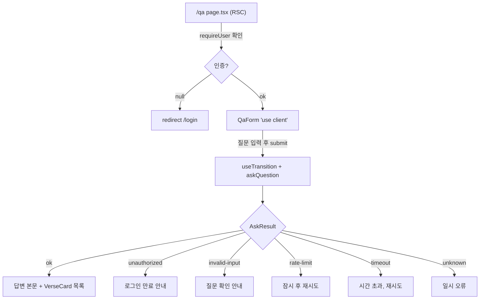

# spec-03-05: QA 페이지 UI (질문 입력 + 답변·근거 렌더링)

## 📋 메타

| 항목 | 값 |
|---|---|
| **Spec ID** | `spec-03-05` |
| **Phase** | `phase-03` |
| **Branch** | `spec-03-05-qa-page-ui` |
| **상태** | Planning |
| **타입** | Feature |
| **Integration Test Required** | no |
| **작성일** | 2026-05-31 |
| **소유자** | @pgaey |

## 📋 배경 및 문제 정의

### 현재 상황

spec-03-04에서 `askQuestion(input): Promise<AskResult>` Server Action이 완성됐다. 인증·검색·프롬프트·LLM을 묶어 `{ ok: true, answer, verses } | { ok: false, reason }`를 반환한다. 그러나 이를 호출할 **화면이 없다.** 사용자는 로그인은 되지만 정작 질문할 곳이 없다 — phase-03의 최종 목표(엔드투엔드 QA)가 이 마지막 화면으로 완성된다.

### 문제점

- `askQuestion`을 호출하고 결과를 렌더링할 `/qa` 페이지가 없다.
- `askQuestion`은 `(input: { question, k? })` typed object 인자라, 기존 login이 쓰는 `useActionState(action, initial)`의 `(prevState, formData)` 시그니처와 맞지 않는다. 호출 방식을 정해야 한다.
- 결과가 5종 분기(`ok` / `unauthorized` / `invalid-input` / `rate-limit` / `timeout` / `unknown`)라, 각각 사용자에게 다른 메시지를 보여줘야 한다.

### 해결 방안 (요약)

`/qa` 경로에 RSC 페이지(`page.tsx`)와 client 폼 컴포넌트(`QaForm.tsx`)를 추가한다. `QaForm`은 `useState` + `useTransition`으로 `askQuestion`을 직접 호출하고(typed object 인자라 useActionState보다 자연스러움), 5종 결과를 분기 렌더링한다 — 답변 본문 + 근거 verse 카드(`book ch:v` + 영문) 또는 reason별 인라인 메시지. 로딩은 `isPending`으로 표시. 인증 보호는 proxy(주) + page RSC의 `requireUser()`(보조).

## 📊 개념도

## 🎯 요구사항

### Functional Requirements

1. **`/qa` 페이지** (`src/app/qa/page.tsx`, RSC)
   - proxy가 1차 보호하지만, 페이지에서도 `requireUser()`로 확인 → null이면 `redirect('/login')` (defence in depth, spec-03-04 가드 재사용).
   - `QaForm` client 컴포넌트 1개를 렌더링.

2. **`QaForm` 컴포넌트** (`src/app/qa/QaForm.tsx`, `'use client'`)
   - 질문 입력 `<textarea>` + 제출 버튼.
   - 제출 시 `useTransition`의 `startTransition` 안에서 `askQuestion({ question })` 직접 호출(typed object). 결과는 `useState`로 보관.
   - `isPending` 동안 버튼 비활성 + "답변 생성 중…" 표시(5~15초 걸림 안내).
   - 빈 입력 가드: 클라이언트에서 버튼 disabled + action 측 `invalid-input` 이중 방어.

3. **결과 렌더링 (5종 분기)**
   - `ok: true` → 답변 본문(한국어, 줄바꿈 보존) + 근거 verse 카드 목록.
   - `ok: false`의 reason별 인라인 메시지:
     - `unauthorized` → "로그인이 만료되었습니다. 다시 로그인해 주세요."
     - `invalid-input` → "질문을 다시 확인해 주세요."
     - `rate-limit` → "요청이 많습니다. 잠시 후 다시 시도해 주세요."
     - `timeout` → "응답이 지연되고 있습니다. 다시 시도해 주세요."
     - `unknown` → "일시적인 오류가 발생했습니다."

4. **VerseCard 렌더링** (`QaForm` 내부 또는 작은 컴포넌트)
   - `[book chapter:verse]` 라벨 + 영문 verse 텍스트.
   - verses가 0건이면 답변만 표시(카드 영역 생략 또는 "관련 구절 없음").

### Non-Functional Requirements

1. **단위 테스트 가능 범위만 테스트** — UI 렌더링 자체보다, reason→메시지 매핑 같은 순수 함수가 있으면 그것을 테스트. RSC/client 통합 렌더링은 수동 검증(테스트 환경이 node, jsdom 미설정).
2. **기존 디자인 일관성** — Tailwind zinc 팔레트 + dark mode 클래스, login 페이지 스타일 따름.
3. **타입 안정성** — `AskResult` discriminated union으로 분기. `state.answer`는 `ok:true` 좁힘 후에만 접근.

## 🚫 Out of Scope

- 채팅 히스토리 / 멀티턴 — 단발 질문-답변만. v1.5.
- 스트리밍 답변 — `generateAnswer`가 단발이라 해당 없음.
- verse 카드 펼침/접힘, 원문 링크 등 인터랙션 — v1 이후.
- `k` 조절 UI — 기본 5 고정. 노출 안 함.
- jsdom 기반 컴포넌트 렌더 테스트 — 테스트 환경 미설정. 수동 검증으로 대체.
- Google OAuth 버튼 실제 연결 — spec 범위 밖(별도).

## 📑 ADR 후보

- [ ] ADR 가치 있는 결정 있음
- [x] 없음

> 근거: UI 컴포넌트 추가 + 기존 패턴(client component, useTransition) 답습. "useActionState vs useState+useTransition" 결정은 walkthrough 기록으로 충분.

## 🔍 Critique 결과 (선택)

<!-- 미실행. Plan Accept 전 /hk-spec-critique 호출 가능. -->

## ✅ Definition of Done

- [ ] reason→메시지 매핑 등 순수 로직 단위 테스트 PASS (있는 경우)
- [ ] `tsc --noEmit` + `eslint` clean
- [ ] 수동 검증: 로그인 후 `/qa`에서 질문 → 답변+근거 표시 (phase 통합 시나리오 2와 연계)
- [ ] `walkthrough.md` / `pr_description.md` 작성 및 ship commit
- [ ] `spec-03-05-qa-page-ui` 브랜치 push + PR(대상: `phase-03-auth-ui-llm`)
- [ ] 사용자 검토 요청 알림 완료
