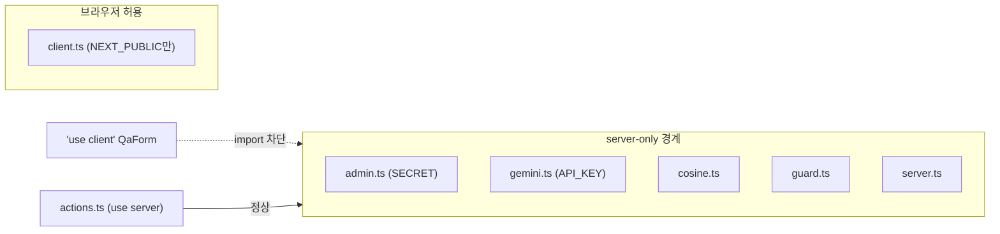

# Implementation Plan: spec-03-06

## 📋 Branch Strategy

- 신규 브랜치: `spec-03-06-server-only-boundary`
- 시작 지점: `phase-03-auth-ui-llm` (phase base branch)
- 첫 task 가 브랜치 생성을 수행
- 머지 대상: phase base branch — develop/main 직접 머지 금지

## 🛑 사용자 검토 필요 (User Review Required)

> [!IMPORTANT]
> - [x] 인증 책임 모델: **Server Action이 권위 게이트(Next.js 공식), proxy는 UX**. 사용자 + context7 공식 문서로 확정.
> - [x] `requireUser` 로직은 유지, 주석만 교정. 사용자 결정 완료.

> [!WARNING]
> - [ ] **신규 의존성 `server-only` 추가** (`pnpm add server-only`). 런타임 무해(빌드 가드 전용).
> - [ ] **`client.ts` 에는 절대 넣지 않음** — 브라우저 클라이언트라 넣으면 빌드 깨짐.
> - [ ] CLI 스크립트(`scripts/embed-bible.ts`)가 `admin.ts` import — tsx(node)에선 server-only 무해하나 실행 확인 필요.
> - [ ] 검증에 `next build` 포함 — server-only 위반은 tsc 가 아니라 번들 단계에서 잡힘.

## 🎯 핵심 전략 (Core Strategy)

### 아키텍처 컨텍스트



### 주요 결정

| 컴포넌트 | 전략 | 이유 |
|:---:|:---|:---|
| **경계 도구** | `import 'server-only'` | Next 공식 권장. 브라우저 유입 시 빌드 에러. 런타임 무해. |
| **대상 선정** | 시크릿/서버전용 5개만 | admin·gemini·cosine·guard·server. 최소 범위. |
| **client.ts** | **제외** | createBrowserClient + NEXT_PUBLIC = 브라우저용. 넣으면 깨짐. |
| **template/types** | 제외 | 시크릿 없음. 범위 최소화. |
| **인증 주석** | 책임 모델 교정 | "보조" → "권위 게이트". Next 공식 문구 인용. |
| **검증** | tsc + vitest + next build | server-only 위반은 번들 단계라 build 필수. |

### 📑 ADR 후보

- [ ] ADR 가치 있는 결정 있음 → `server-only-data-access-boundary` (convention)
- [x] 없음 (spec.md와 일치, 향후 승격 검토)

## 📂 Proposed Changes

### 의존성

#### [MODIFY] `package.json`
- `pnpm add server-only` → dependencies 에 추가.

### server-only 선언 (각 파일 1번째 줄)

#### [MODIFY] `src/lib/supabase/admin.ts`
```ts
import 'server-only'  // ← 추가 (SUPABASE_SECRET_KEY 보호, 최우선)
import { createClient, type SupabaseClient } from "@supabase/supabase-js";
```

#### [MODIFY] `src/lib/llm/gemini.ts` — `import 'server-only'` 최상단 추가 (GEMINI_API_KEY)
#### [MODIFY] `src/lib/search/cosine.ts` — 동일 (admin 경유)
#### [MODIFY] `src/lib/auth/guard.ts` — 동일 (next/headers 의존)
#### [MODIFY] `src/lib/supabase/server.ts` — 동일 (next/headers, 의도 명시)

### 인증 주석 교정

#### [MODIFY] `src/app/qa/actions.ts`
```ts
// 1. 인증 — Server Action 은 독립 진입점이라 자체 인증이 권위 있는 게이트다
//    (Next.js 공식: "each Server Action is a separate entry point and must
//    re-verify authentication independently"). proxy/페이지 redirect 는 UX 일 뿐.
//    requireUser 는 인증을 모은 DAL(lib/auth) 레이어 — 각 action 이 위임.
const user = await requireUser()
if (!user) return { ok: false, reason: 'unauthorized' }
```

## 🧪 검증 계획 (Verification Plan)

### 단위 테스트 (필수)
```bash
pnpm test                  # 기존 27 회귀 없음
pnpm exec tsc --noEmit     # 타입 통과
```

### 빌드 검증 (server-only 핵심)
```bash
pnpm build                 # server-only 위반은 여기서 잡힘 — 통과해야 정상 경로 무결
```

### CLI 영향 확인
```bash
# admin.ts 를 import 하는 스크립트가 깨지지 않는지 (실제 적재 말고 import 단계만)
pnpm exec tsx -e "import('./src/lib/supabase/admin.ts').then(()=>console.log('ok'))"
# 또는 기존 eval 스크립트 dry 실행
```

### 수동 검증 시나리오
- (선택) `app/qa/QaForm.tsx`(client)에 `import '@/lib/llm/gemini'`를 임시로 넣어 `pnpm build`가 **에러를 내는지** 확인 → 가드 작동 증명 후 되돌림.

## 🔁 Rollback Plan

- `import 'server-only'` 라인 5개 제거 + `package.json` 의존성 제거 + 주석 원복.
- 런타임 동작 변화 0이라 롤백 위험 낮음.

## 📦 Deliverables 체크

- [ ] task.md 작성 (다음 단계)
- [ ] 사용자 Plan Accept 받음
- [ ] (실행 후) 모든 task 완료
- [ ] (실행 후) walkthrough.md / pr_description.md ship
