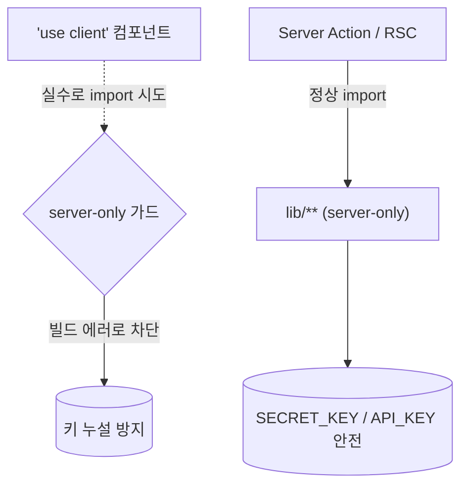

# spec-03-06: 서버 경계 강화 (server-only) + 인증 주석 교정

## 📋 메타

| 항목 | 값 |
|---|---|
| **Spec ID** | `spec-03-06` |
| **Phase** | `phase-03` |
| **Branch** | `spec-03-06-server-only-boundary` |
| **상태** | Planning |
| **타입** | Refactor |
| **Integration Test Required** | no |
| **작성일** | 2026-06-01 |
| **소유자** | @pgaey |

## 📋 배경 및 문제 정의

### 현재 상황

spec-03-04 코드 리뷰 중, `askQuestion`의 인증 주석("보조/다층 방어")이 부정확하다는 점과, 인증·검색·LLM 로직(`lib/**`)이 "관습적으로 서버 전용"일 뿐 *강제*되지 않는다는 점이 드러났다. Next.js 공식 문서(context7 확인)는:

- **"each Server Action is a separate entry point and must re-verify the caller's authentication independently"** — Server Action 자체 인증이 필수.
- **Data Access Layer(DAL)** 패턴 — 인증·DB 로직을 `import 'server-only'` 모듈에 모으고 얇은 진입점이 위임.

우리 구조는 이미 DAL의 80%(`lib/auth`, `lib/search`, `lib/llm` 분리 + 얇은 `actions.ts`)지만, **`server-only` 선언이 없어 컴파일러 차원의 서버 경계 보장이 없다.**

### 문제점

- `lib/supabase/admin.ts`(SUPABASE_SECRET_KEY, RLS bypass)·`lib/llm/gemini.ts`(GEMINI_API_KEY) 등 **시크릿을 다루는 모듈이 실수로 client component에 import 되면 키가 브라우저 번들로 새어나간다.** 현재 이를 막는 컴파일 가드가 없다.
- `actions.ts`의 인증 주석이 "proxy 주 게이트, 보조 확인"이라 적혀 있어 *인증 책임 소재를 오도*한다(실제로는 Server Action이 권위 게이트).

### 해결 방안 (요약)

`server-only` 패키지를 추가하고, **시크릿/서버 전용 lib 모듈 상단에 `import 'server-only'`** 를 선언해 브라우저 번들 유입을 컴파일 타임에 차단한다. 동시에 `askQuestion`의 인증 주석을 "Server Action은 독립 진입점이라 자체 인증이 권위(Next.js 공식), proxy/페이지 redirect는 UX"로 교정한다. **브라우저 클라이언트(`client.ts`)에는 절대 넣지 않는다.**

## 📊 개념도

## 🎯 요구사항

### Functional Requirements

1. **`server-only` 의존성 추가** (`pnpm add server-only`).

2. **`import 'server-only'` 선언 추가** — 다음 파일 상단(시크릿/서버 전용):
   - `src/lib/supabase/admin.ts` (SUPABASE_SECRET_KEY — 최우선)
   - `src/lib/llm/gemini.ts` (GEMINI_API_KEY)
   - `src/lib/search/cosine.ts` (admin 경유 + GEMINI 키)
   - `src/lib/auth/guard.ts` (next/headers 의존)
   - `src/lib/supabase/server.ts` (next/headers — 이미 서버 강제지만 의도 명시)

3. **`client.ts` 는 제외** — `src/lib/supabase/client.ts`는 `createBrowserClient` + NEXT_PUBLIC 키만 쓰는 **브라우저 클라이언트**. `server-only` 넣으면 빌드 깨짐. 명시적 비대상.

4. **`prompt/template.ts`·`db/types.ts` 는 제외** — 시크릿 없는 순수 로직/타입. 불필요(넣어도 무해하나 범위 최소화).

5. **인증 주석 교정** (`src/app/qa/actions.ts`):
   - 기존: `// 1. 인증 게이트 (보조). proxy 가 주 게이트지만, 직접 import 호출 대비 한 번 더 확인.`
   - 교정: Server Action은 독립 진입점이라 자체 인증이 권위 있는 게이트(Next.js 공식), proxy/페이지 redirect는 UX임을 명시.

### Non-Functional Requirements

1. **빌드 무결성** — `next build`(또는 `tsc --noEmit` + 기존 vitest)가 통과해야 한다. `server-only` 추가가 정상 서버 경로를 깨지 않음을 확인.
2. **CLI 스크립트 영향 없음** — `scripts/embed-bible.ts` 등이 `lib/supabase/admin.ts`를 tsx로 import한다. `server-only`는 Next 번들러에서만 에러를 내고 tsx(node)에선 무해하지만, 스크립트 실행이 깨지지 않는지 확인.
3. **동작 불변** — 런타임 동작 변화 0. 순수하게 컴파일 가드 + 주석.

## 🚫 Out of Scope

- `requireUser` 로직 변경 — 이미 올바름. 주석만 교정.
- DAL 추가 추상화(별도 `data/` 디렉토리 신설 등) — 현 `lib/**` 구조 유지. 과도한 재배치 안 함.
- spec-03-05(화면) 작업 — park 상태. 본 spec 후 재개.
- `next build` CI 통합 — 로컬 확인만.

## 📑 ADR 후보

- [ ] ADR 가치 있는 결정 있음 → 후보: `server-only-data-access-boundary` (type: convention)
- [x] 없음

> 근거: "lib/** 는 server-only DAL" 이 cross-spec 규약이 될 수 있으나, 현재는 phase-03 결정 기록 + 메모리(project_auth_architecture)로 충분. 향후 lib 구조가 커지면 ADR(convention) 승격 검토.

## 🔍 Critique 결과 (선택)

<!-- 미실행. client.ts 제외/CLI 영향은 spec 작성 중 코드 조사로 선반영. -->

## ✅ Definition of Done

- [ ] `server-only` 의존성 추가 + 5개 파일에 선언, `client.ts` 제외 확인
- [ ] `actions.ts` 인증 주석 교정
- [ ] `tsc --noEmit` + `pnpm test`(27) + `next build` 통과
- [ ] CLI 스크립트(`embed:bible` 등) import 깨짐 없음 확인
- [ ] `walkthrough.md` / `pr_description.md` 작성 및 ship commit
- [ ] `spec-03-06-server-only-boundary` 브랜치 push + PR(대상: `phase-03-auth-ui-llm`)
- [ ] 사용자 검토 요청 알림 완료
