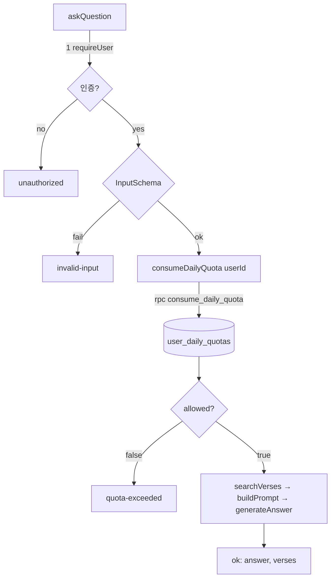

# Implementation Plan: spec-04-01

## 📋 Branch Strategy

- 신규 브랜치: `spec-04-01-quota-rls` (브랜치 이름 = spec 디렉토리 이름, `feature/` prefix 없음)
- 시작 지점: 현재 `develop` (phase-04 base branch `phase-04-quota-deploy` 는 본 spec ship 시 just-in-time 생성됨 — constitution §3.1)
- 첫 task 가 브랜치 생성을 수행함

## 🛑 사용자 검토 필요 (User Review Required)

> 본 Plan 을 Accept 하기 전에 사용자가 명시적으로 확인해야 할 항목들.

> [!IMPORTANT]
> - [ ] **RLS 정책 = 정책 0개(secret-key-only)**: quota 는 서버 admin client 로만 읽고/쓴다. 클라이언트가 잔여 횟수를 직접 조회하는 기능은 범위에서 제외. (→ UI "N회 남음" 표시 없음)
> - [ ] **원자성은 DB 함수에 위임**: check+increment 를 PL/pgSQL 함수 한 트랜잭션에서 처리. 이 함수의 원자성 자체는 vitest 로 검증 불가 → 수동 검증(시나리오 1). 자동 단위 테스트는 JS wrapper 와 `askQuestion` 분기만 커버.
> - [ ] **일일 한도 기본값 = 20**, 환경변수 `DAILY_QUOTA_LIMIT`. 리셋 기준은 **UTC `current_date`** (사용자 타임존 무관, KST 자정과 다를 수 있음 — 학습용 MVP 수용).
> - [ ] **rpc 실패 시 fail-closed**: DB 조회 실패 시 비싼 작업(검색·LLM)을 막는다(비용 청구 방지 우선). `consumeDailyQuota` 가 throw → `askQuestion` 이 `unknown`("일시적 오류")으로 정직하게 차단(거짓 `quota-exceeded` 아님). 정상 사용자도 DB 장애 중엔 막힐 수 있음을 감수 — **사용자 결정(2026-06-03)**.

> [!WARNING]
> - [ ] **마이그레이션 적용 = 외부 시스템(실 Supabase) 영향**: 이 프로젝트는 **Supabase CLI**(`supabase/config.toml` 존재)로 마이그레이션을 관리한다. 새 `.sql` 파일 작성 후 `supabase db push` 로 원격 DB 에 적용. CLI 의 versioned migration = "코드(마이그레이션 파일)가 곧 DB 상태의 source of truth"(IaC 정신). 적용은 실 DB 변경이므로 실행 단계에서 수행.
> - [ ] **`auth.users` FK 참조**: `user_id` 가 Supabase Auth 사용자 삭제 시 `ON DELETE CASCADE`.

## 🎯 핵심 전략 (Core Strategy)

### 아키텍처 컨텍스트



### 주요 결정

| 컴포넌트 | 전략 | 이유 |
|:---:|:---|:---|
| **저장소** | `user_daily_quotas` 테이블 (`user_id` PK 단일 행/사용자 + `period_date` lazy reset) | 사용자당 1행이라 cron 전체 리셋 불필요. 호출 시 날짜 비교로 리셋. |
| **원자성** | DB 함수 `consume_daily_quota` (PL/pgSQL, `INSERT … ON CONFLICT … DO UPDATE` + 조건) | 조회·비교·증가를 한 트랜잭션에 묶어 동시요청 race 차단. `match_verses` RPC 패턴 연장. |
| **권한** | RLS 활성화 + 정책 0개, admin client(`createServerSupabase`) 접근 | `verses` 컨벤션과 일관. quota 변경은 신뢰 서버만. |
| **통합 위치** | `requireUser` → `InputSchema` → **quota** → 검색 | 유효 질문만 차감, 비싼 작업 직전 차단. |
| **타입 동기화** | `AskResult.reason` 에 `'quota-exceeded'` 추가 → `messages.ts` 키 추가 강제(컴파일) | 기존 discriminated-union/Record 패턴이 누락을 컴파일 에러로 잡음. |

### 📑 ADR 후보

- [x] ADR 가치 있는 결정 있음 → 후보 한 줄 요약: `quota-server-only-rls` (type: convention) — 비강제, phase 결정 기록으로 충분하면 생략.

## 📂 Proposed Changes

### DB 마이그레이션

#### [NEW] `supabase/migrations/{ts}_create_user_daily_quotas.sql`
- `user_daily_quotas` 테이블: `user_id uuid PRIMARY KEY REFERENCES auth.users(id) ON DELETE CASCADE`, `period_date date NOT NULL DEFAULT current_date`, `request_count int NOT NULL DEFAULT 0`, `updated_at timestamptz NOT NULL DEFAULT now()`.
- `ALTER TABLE user_daily_quotas ENABLE ROW LEVEL SECURITY;` (정책 0개 — `verses` 패턴).
- 함수 `consume_daily_quota(p_user_id uuid, p_limit int) RETURNS TABLE(allowed boolean, remaining int)`:

```text
INSERT INTO user_daily_quotas (user_id, period_date, request_count)
  VALUES (p_user_id, current_date, 0)
  ON CONFLICT (user_id) DO UPDATE
    SET request_count = CASE WHEN user_daily_quotas.period_date < current_date
                            THEN 0 ELSE user_daily_quotas.request_count END,
        period_date   = current_date;
-- 위로 행이 "오늘 0(또는 기존)" 상태가 됨. 이어서 한도 비교 후 조건부 증가:
UPDATE user_daily_quotas
  SET request_count = request_count + 1, updated_at = now()
  WHERE user_id = p_user_id AND request_count < p_limit
  RETURNING true AS allowed, p_limit - request_count AS remaining;
-- 증가가 일어났으면 그 행 반환(allowed=true). 없으면 allowed=false, remaining=0.
```
  실제 구현은 PL/pgSQL `plpgsql` 블록으로 위 의도를 원자적으로(단일 함수 호출) 표현. `SECURITY DEFINER` 불필요(admin 호출).

### Quota 로직

#### [NEW] `src/lib/quota/check.ts`
- `import 'server-only'`.
- `consumeDailyQuota(userId: string): Promise<{ allowed: boolean; remaining: number; limit: number }>`.
- `createServerSupabase().rpc('consume_daily_quota', { p_user_id: userId, p_limit: limit })`.
- `limit = Number(process.env.DAILY_QUOTA_LIMIT) || 20`.
- rpc 에러 시: **fail-closed** — `error` 가 있거나 데이터가 비정상이면 `throw`(서버 로그 남김). 비용 청구 방지가 최우선이므로 조회 불가 = 비싼 작업 차단. 호출부(`askQuestion`)가 throw 를 잡아 `unknown`("일시적 오류")으로 접는다. **거짓 `quota-exceeded`("내일 다시")로 오인 안내하지 않음** — DB 장애를 한도 초과로 표기하면 사용자가 헷갈리므로. (사용자 결정 2026-06-03, walkthrough 에 근거 기록)

#### [NEW] `src/lib/quota/__tests__/check.test.ts`
- `createServerSupabase` mock → `rpc` 가 `{ data: [{ allowed, remaining }], error }` 반환하도록 통제.
- 케이스: allowed=true 정규화 / allowed=false / **rpc error 시 throw(fail-closed)** / `DAILY_QUOTA_LIMIT` env 반영.

### Server Action 통합

#### [MODIFY] `src/app/qa/actions.ts`
- `AskResult` 의 `ok:false` reason union 에 `'quota-exceeded'` 추가.
- `import { consumeDailyQuota } from '@/lib/quota/check'`.
- `requireUser` 로 얻은 `user.sub` 를 userId 로 사용. 입력검증(`parsed.success`) 통과 직후·`searchVerses` 직전에 (fail-closed — throw 는 unknown 으로):
  ```text
  let quota
  try {
    quota = await consumeDailyQuota(user.sub as string)
  } catch (err) {
    console.error('[askQuestion] quota check failed:', err)
    return { ok: false, reason: 'unknown' }   // fail-closed: 조회 불가 → 비싼 작업 차단
  }
  if (!quota.allowed) return { ok: false, reason: 'quota-exceeded' }
  ```

#### [MODIFY] `src/app/qa/__tests__/actions.test.ts`
- `@/lib/quota/check` mock 추가(`consumeDailyQuota` → 기본 `{ allowed:true }`).
- 신규 케이스:
  - quota allowed=false → `quota-exceeded` + `searchVerses` 미호출.
  - **quota rpc throw → `unknown` + `searchVerses` 미호출 (fail-closed)**.
  - 기존 정상 케이스가 quota 통과 후에도 그대로 PASS(회귀).

### UI 메시지

#### [MODIFY] `src/app/qa/messages.ts`
- `MESSAGES` 에 `'quota-exceeded': '오늘 질문 한도를 모두 사용했어요. 내일 다시 시도해 주세요.'` 추가(`FailureReason` 에 자동 포함 → 누락 시 컴파일 에러).

#### [MODIFY] `src/app/qa/__tests__/messages.test.ts`
- `quota-exceeded` 매핑 케이스 추가.

#### [MODIFY] `.env.example`
- `DAILY_QUOTA_LIMIT=20` 추가(주석: 사용자별 일일 질문 한도).

> 참고: `QaForm.tsx` 는 수정 불필요 — 기존 `!result.ok` → `messageForReason(reason)` 분기가 신규 reason 을 자동 렌더.

## 🧪 검증 계획 (Verification Plan)

### 단위 테스트 (필수)
```bash
pnpm test    # vitest run — quota/check, qa/actions, qa/messages 포함 전체
```

### 통합 테스트 (Integration Test Required = no)
- 자동 통합 테스트 없음. DB 함수 원자성/리셋은 수동 시나리오로 검증.

### 수동 검증 시나리오 (시나리오 1: 일일 한도 차단)
1. 마이그레이션 적용 후 `DAILY_QUOTA_LIMIT=2` (테스트용 작은 값)로 `pnpm dev` — 기대: 앱 정상 기동.
2. 로그인 후 질문 2회 → 정상 답변. 3회째 → "오늘 질문 한도를 모두 사용했어요" 메시지, 검색·LLM 미호출(네트워크 탭/로그 확인).
3. DB 에서 해당 사용자 `period_date` 를 어제로 수정 후 재질문 → 카운트 리셋되어 정상 답변(lazy reset 확인).

## 🔁 Rollback Plan

- 코드: 브랜치 미머지 상태면 브랜치 폐기. 머지 후면 revert PR.
- DB: `consume_daily_quota` 함수 + `user_daily_quotas` 테이블 DROP 마이그레이션(역마이그레이션). 데이터는 사용량 카운트뿐이라 손실 영향 없음.
- 통합 코드만 되돌리려면 `askQuestion` 의 quota 블록 제거 시 기존 phase-03 동작으로 복귀(테이블 존재는 무해).

## 📦 Deliverables 체크

- [ ] task.md 작성 (다음 단계)
- [ ] 사용자 Plan Accept 받음
- [ ] (실행 후) 모든 task 완료
- [ ] (실행 후) walkthrough.md / pr_description.md ship
