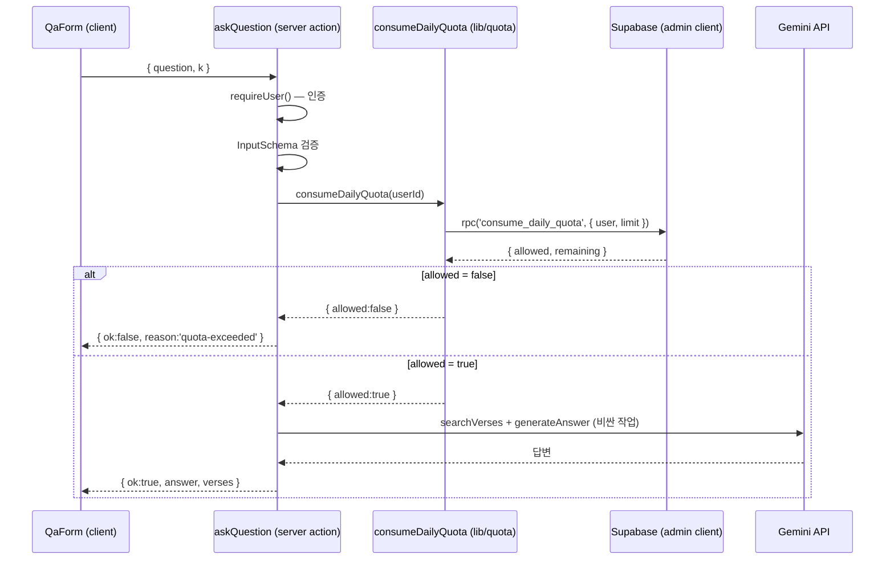

# spec-04-01: 사용자별 일일 사용량 제한 (quota-rls)

## 📋 메타

| 항목 | 값 |
|---|---|
| **Spec ID** | `spec-04-01` |
| **Phase** | `phase-04` |
| **Branch** | `spec-04-01-quota-rls` |
| **상태** | Planning |
| **타입** | Feature |
| **Integration Test Required** | no (DB 함수 동작은 수동 검증 — 시나리오 1) |
| **작성일** | 2026-06-03 |
| **소유자** | @pgaey |

## 📋 배경 및 문제 정의

### 현재 상황
phase-03 에서 `askQuestion` Server Action(`src/app/qa/actions.ts`)이 완성됐다. 흐름은 `requireUser()`(인증) → `InputSchema`(입력검증) → `searchVerses()`(검색, Gemini 임베딩 호출) → `buildPrompt()` → `generateAnswer()`(Gemini Flash 호출) 이다. 검색·생성 모두 **Gemini API 호출당 비용/무료 tier 한도**를 소비한다. 현재는 로그인만 하면 **횟수 제한 없이** 무한 호출이 가능하다.

### 문제점
공개 URL 에 올리는 순간:
- 한 사용자가(악의든 자동화든 실수든) 질문을 대량으로 던지면 **Gemini 비용 폭주 + 무료 tier 일일 한도 소진** → 그 한도를 공유하는 **다른 모든 사용자가 먹통**이 된다.
- 비용 상한을 코드 레벨에서 강제할 장치가 전혀 없다.

### 해결 방안 (요약)
사용자별 "오늘 사용한 질문 횟수"를 DB 에 집계하고, `askQuestion` 이 **검색·LLM(비싼 작업) 직전**에 일일 한도(`DAILY_QUOTA_LIMIT`)를 확인·차감한다. 초과 시 `{ ok: false, reason: 'quota-exceeded' }` 로 즉시 차단해 비싼 작업을 호출하지 않는다. 카운트 조회·비교·증가는 동시요청 경합을 막기 위해 **DB 함수 한 번의 트랜잭션**에서 원자적으로 처리한다.

## 📊 개념도

## 🎯 요구사항

### Functional Requirements
1. `user_daily_quotas` 테이블이 사용자별 "오늘 사용 횟수"를 보관한다 (`user_id` PK, `period_date`, `request_count`).
2. DB 함수 `consume_daily_quota(p_user_id uuid, p_limit int)` 가 단일 트랜잭션에서:
   - 행이 없으면 생성, `period_date` 가 오늘(`current_date`)보다 과거면 `request_count` 를 0 으로 리셋(lazy reset).
   - `request_count < p_limit` 이면 `+1` 후 `allowed = true`, 남은 횟수와 함께 반환.
   - 한도 도달이면 증가 없이 `allowed = false` 반환.
3. `src/lib/quota/check.ts` 의 `consumeDailyQuota(userId)` 가 admin client 로 위 함수를 호출하고 `{ allowed, remaining, limit }` 로 정규화한다. 한도는 `DAILY_QUOTA_LIMIT` 환경변수(기본 20).
4. `askQuestion` 이 **입력검증 통과 직후·검색 직전**에 `consumeDailyQuota` 를 호출하고, `allowed = false` 면 `{ ok: false, reason: 'quota-exceeded' }` 를 반환(검색·LLM 미호출).
5. `AskResult.reason` union 에 `'quota-exceeded'` 추가, `messages.ts` 에 사용자 안내 문구 추가(기존 `QaForm` 의 `!result.ok` 분기가 자동 렌더).

### Non-Functional Requirements
1. **동시요청 안전성**: 같은 사용자의 동시 요청에서도 한도 초과 허용/이중 카운트가 없도록 DB 함수 한 트랜잭션에서 check+increment.
2. **권한 격리(RLS)**: `user_daily_quotas` 는 RLS 활성화 + 정책 0개 = anon/publishable 키 직접 접근 차단(`verses` 컨벤션 연장). quota 는 서버 admin client(`createServerSupabase`)로만 접근.
3. **빈/과길이 질문 비차감**: 입력검증 실패(`invalid-input`)는 quota 를 소비하지 않는다.
4. **회귀 없음**: quota 미달 사용자의 기존 정상 흐름·기존 reason 분기는 그대로 동작.

## 🚫 Out of Scope
- UI 에 "오늘 N회 남음" 잔여 횟수 **표시**(클라이언트 직접 quota 조회) — 빠지므로 RLS 본인-행 정책 불필요. 필요 시 후속 spec.
- 관리자/요금제별 차등 한도, 결제 연동.
- 자동 통합 테스트(실 DB 대상) — 시나리오 1 수동 검증으로 대체.
- 프롬프트 인젝션 가드 / 면책 표기 (spec-04-02), 배포 / 예산 알림 (spec-04-03).

## 📑 ADR 후보 (Architecture Decision Records)

- [x] ADR 가치 있는 결정 있음 → 후보 한 줄 요약: `quota-server-only-rls` — "사용량 제한 상태는 서버만 변경(secret key + DB 함수), 클라이언트 직접 접근 차단" (type: convention) — phase-04 결정 기록에 누적되므로 ADR 승격은 선택.

## 🔍 Critique 결과 (선택)

<!-- 미실행 -->

## ✅ Definition of Done

- [ ] 모든 단위 테스트 PASS (`consumeDailyQuota` wrapper + `askQuestion` quota 분기 + `messages` 매핑)
- [ ] 마이그레이션이 실 Supabase 에 적용되고 시나리오 1(한도 차단) 수동 PASS
- [ ] `walkthrough.md` 와 `pr_description.md` 작성 및 ship commit
- [ ] `spec-04-01-quota-rls` 브랜치 push 완료
- [ ] 사용자 검토 요청 알림 완료
