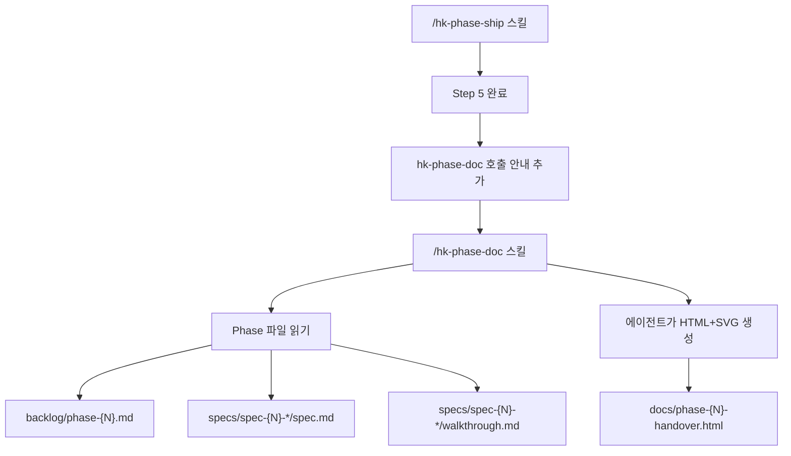

# Implementation Plan: spec-x-phase-doc-html

## 📋 Branch Strategy

- 신규 브랜치: `spec-x-phase-doc-html`
- 시작 지점: `develop`
- 첫 task가 브랜치 생성을 수행함

## 🛑 사용자 검토 필요 (User Review Required)

> [!IMPORTANT]
> - [x] 스킬 파일(`.claude/commands/`)은 harness-kit 업데이트 시 덮어쓰일 수 있음 — `hk-phase-doc.md`는 사용자 정의 파일이므로 `--update` 흐름에서 보존되어야 함 (현재 `get.sh`는 명령어 파일을 유지하므로 안전)
> - [x] `hk-phase-ship.md` 수정은 기존 Phase ship 흐름에 추가되는 것 (파괴적 변경 없음)

> [!WARNING]
> - [x] `hk-phase-ship.md`는 harness-kit 제공 파일 — 업데이트 시 덮어쓰일 수 있음. 수정 내용이 유지되지 않을 위험 존재. 단, 0.13.0 기준 현재 안정적.

## 🎯 핵심 전략 (Core Strategy)

### 아키텍처 컨텍스트



### 주요 결정

| 컴포넌트 | 전략 | 이유 |
|:---:|:---|:---|
| **HTML 생성 방식** | 에이전트 스킬 (bash 스크립트 X) | 아키텍처 다이어그램은 파일 파싱만으로 자동 도출 불가, 에이전트 추론 필수 |
| **SVG 생성** | 에이전트가 인라인 SVG 직접 작성 | 외부 도구 의존 없이 자기완결 HTML 생성 가능 |
| **hk-phase-ship 통합** | 스킬 파일 수정으로 Step 5 이후 안내 추가 | 기존 흐름 보존, 새 안내 문구만 삽입 |
| **출력 위치** | `docs/phase-{N}-handover.html` | 기존 수동 작성 파일과 동일 경로 패턴 유지 |

### 📑 ADR 후보

- [x] ADR 가치 있는 결정 있음 → `hk-phase-doc-as-agent-skill` (type: decision) — bash 스크립트 대신 에이전트 스킬로 HTML 생성

## 📂 Proposed Changes

### [신규 스킬]

#### [NEW] `.claude/commands/hk-phase-doc.md`

Phase 완료 후 호출하는 슬래시 커맨드. 에이전트에게 다음을 지시:
1. Phase 번호 결정 (`$ARGUMENTS` 또는 sdd status에서 읽기)
2. 관련 파일 전부 읽기 (phase.md, 각 spec.md, walkthrough.md)
3. HTML 문서 구조 정의 (7개 섹션)
4. SVG 다이어그램 3종 생성 지침 (타임라인, 컴포넌트, 데이터플로우)
5. `docs/phase-{N}-handover.html`에 저장
6. 완료 보고

스킬 파일은 에이전트가 HTML 생성 시 참고할 **섹션 구조 템플릿**과 **SVG 생성 가이드라인**을 포함한다.

### [기존 스킬 수정]

#### [MODIFY] `.claude/commands/hk-phase-ship.md`

Step 5 (Phase 마무리) 말미에 다음 안내 문구를 추가:

```
## 6. 핸드오버 문서 생성 (권장)

Phase 완료 후 신입 개발자를 위한 SVG 다이어그램 HTML 핸드오버 문서를 생성합니다:

> `/hk-phase-doc` 를 호출하면 `docs/phase-{N}-handover.html` 이 자동 생성됩니다.

(선택 사항이지만 팀 온보딩 효율을 위해 강력 권장)
```

## 🧪 검증 계획 (Verification Plan)

### 단위 테스트 (필수)

이 spec은 슬래시 커맨드(마크다운) 파일 작성이 핵심이며 코드 로직이 없음. 단위 테스트 대신 다음 수동 검증으로 대체:

```bash
# 스킬 파일 존재 확인
ls -la .claude/commands/hk-phase-doc.md
# hk-phase-ship 수정 확인
grep -n "hk-phase-doc" .claude/commands/hk-phase-ship.md
```

### 수동 검증 시나리오

1. `/hk-phase-doc 01` 호출 → phase-01 데이터를 읽고 `docs/phase-01-handover.html` 생성 확인
   - 기대 결과: HTML 파일이 생성되고 브라우저에서 열렸을 때 3종 SVG 다이어그램 표시
2. 생성된 HTML을 브라우저에서 열기
   - 기대 결과: 외부 리소스 없이 완전히 렌더링, SVG 다이어그램 3개 표시
3. `hk-phase-ship` 스킬 파일에서 Step 6 섹션 확인
   - 기대 결과: `hk-phase-doc` 호출 안내 문구 포함

## 🔁 Rollback Plan

- `.claude/commands/hk-phase-doc.md` 삭제 — 슬래시 커맨드 비활성화
- `.claude/commands/hk-phase-ship.md` Step 6 섹션 제거 — 기존 흐름 복원
- 생성된 `docs/phase-{N}-handover.html`은 그대로 유지 (부작용 없음)

## 📦 Deliverables 체크

- [x] task.md 작성 (다음 단계)
- [ ] 사용자 Plan Accept 받음
- [ ] (실행 후) 모든 task 완료
- [ ] (실행 후) walkthrough.md / pr_description.md ship
