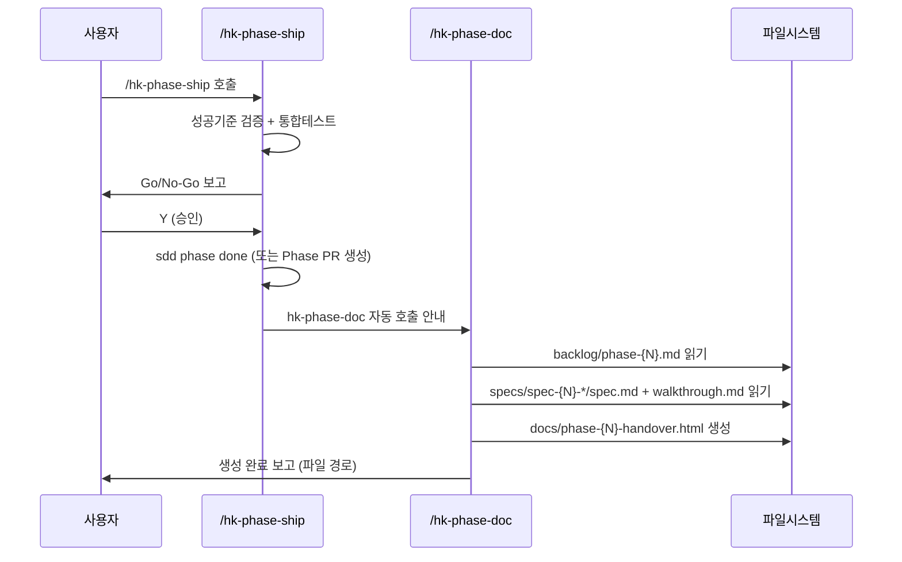

# spec-x-phase-doc-html: Phase SVG 다이어그램 HTML 문서 자동화 (생성 시점 + 완료 시점)

## 📋 메타

| 항목 | 값 |
|---|---|
| **Spec ID** | `spec-x-phase-doc-html` |
| **Phase** | `spec-x` (Phase 비소속) |
| **Branch** | `spec-x-phase-doc-html` |
| **상태** | Planning |
| **타입** | Feature |
| **Integration Test Required** | no |
| **작성일** | 2026-05-19 |
| **소유자** | evan |

## 📋 배경 및 문제 정의

### 현재 상황

harness-kit의 Phase 완료 흐름(`/hk-phase-ship`)은 성공 기준 검증 → 통합 테스트 → go/no-go → PR 생성으로 마무리된다. Phase 완료 후 신입 개발자 또는 팀원이 "이 Phase에서 무엇을 했는가"를 파악하려면 `backlog/phase-{N}.md`, `specs/*/walkthrough.md` 등 여러 파일을 직접 뒤져야 한다. 또한 Phase를 시작할 때도 "이 Phase가 시스템에 어떤 아키텍처를 만들어낼 것인가"를 한눈에 보여주는 청사진이 없어, 설계 검증 없이 구현에 돌입하는 경우가 발생한다.

### 문제점

- **시작 시점**: Phase 생성 직후 아키텍처 청사진이 없어 설계 오류를 조기 발견하지 못함
- **완료 시점**: Phase 완료 후 핸드오버 HTML을 수동으로 작성하는 반복 비용 발생
- 문서화 품질이 작성자의 숙련도와 시간에 따라 들쭉날쭉함
- SVG 다이어그램 없이 텍스트만으로는 아키텍처·흐름 이해에 한계가 있음
- spec-x는 단발·독립 단위이므로 누적 아키텍처 컨텍스트가 없어 이 문제와 무관

### 해결 방안 (요약)

두 가지 슬래시 커맨드로 Phase 라이프사이클 전반을 커버한다. `/hk-phase-arch`: Phase 생성 직후 아키텍처 청사진 HTML(`docs/phase-{N}-arch.html`)을 생성하여 설계 기준선을 확보. `/hk-phase-doc`: Phase 완료 시 핸드오버 HTML(`docs/phase-{N}-handover.html`)을 생성하여 구현 결과를 기록. 두 문서 모두 인라인 SVG를 포함하며 외부 의존 없이 브라우저에서 동작한다.

## 📊 개념도

## 🎯 요구사항

### Functional Requirements

1. `/hk-phase-arch` 슬래시 커맨드(`.claude/commands/hk-phase-arch.md`)를 신설한다. **Phase 생성 시점**에 호출하며 아키텍처 청사진을 생성한다.
   - Phase 번호 결정 (`$ARGUMENTS` 또는 sdd status)
   - `backlog/phase-{N}.md` 읽기 (Phase 목표, 예정 Spec 목록)
   - 청사진 HTML 섹션: Phase 개요, Spec 타임라인 SVG(모두 "계획됨" 상태), 아키텍처 컴포넌트 SVG(점선 테두리 = 미구현), 데이터 플로우 SVG, 예정 Spec 카드
   - 출력: `docs/phase-{N}-arch.html` (DRAFT BLUEPRINT 표기)
   - spec-x에는 적용하지 않음 (Phase 소속 Spec에만 의미 있음)
2. `hk-align.md`에 Phase 생성 직후 `/hk-phase-arch` 호출 안내를 추가한다.
3. `/hk-phase-doc` 슬래시 커맨드(`.claude/commands/hk-phase-doc.md`)를 신설한다. **Phase 완료 시점**에 호출하며 핸드오버 문서를 생성한다.
2. 스킬은 현재 active phase 또는 인자로 전달된 phase 번호(`$ARGUMENTS`)를 기준으로 동작한다.
3. 스킬 실행 시 에이전트는 다음 파일들을 읽고 내용을 분석한다:
   - `backlog/phase-{N}.md` (Phase 메타, spec 목록, 성공 기준, ADR)
   - `specs/spec-{N}-{seq}-*/spec.md` (각 Spec 요구사항 및 배경)
   - `specs/spec-{N}-{seq}-*/walkthrough.md` (각 Spec 결정 로그)
4. 에이전트는 다음 SVG 다이어그램을 HTML 안에 인라인으로 생성한다:
   - **스펙 타임라인 SVG**: 수평 타임라인 위에 각 Spec을 카드로 배치, 완료 순서와 제목 표시
   - **아키텍처 컴포넌트 SVG**: Phase에서 도입·수정된 시스템 컴포넌트와 의존 관계 표시
   - **데이터 플로우 SVG**: 핵심 데이터가 어떻게 입력→처리→저장→출력되는지 흐름 표시
5. HTML 문서는 다음 섹션을 포함한다:
   - Phase 개요 (제목, 목표, 기간, 완료 날짜)
   - 스펙 타임라인 SVG
   - 아키텍처 컴포넌트 SVG
   - 데이터 플로우 SVG
   - 스펙별 요약 카드 (제목, 한 줄 설명, 주요 결정사항)
   - 핵심 결정 모음 (walkthrough.md에서 추출)
   - 신입 개발자를 위한 "여기서부터 시작하세요" 섹션 (핵심 파일 목록, 실행 방법)
6. 생성 위치: `docs/phase-{N}-handover.html` (단일 자기완결 파일, 외부 CDN/CSS 없음)
7. HTML은 한국어로 작성되며, 코드·경로·기술 용어는 영어 허용
8. `hk-phase-ship` 스킬의 Step 5 완료 직후 `hk-phase-doc` 호출 안내 문구를 추가한다

### Non-Functional Requirements

1. 생성된 HTML은 외부 네트워크 없이 브라우저에서 열리면 완전히 동작해야 한다 (인라인 SVG, 인라인 CSS)
2. SVG 다이어그램은 실제 Phase 내용을 기반으로 에이전트가 직접 작성 — 템플릿 placeholder 금지
3. 신입 개발자 기준 10분 이내에 Phase 전체 흐름을 파악할 수 있는 수준의 설명 품질

## 🚫 Out of Scope

- 기존 수동 작성 HTML(`docs/phase-01-handover.html`)의 소급 재생성
- `hk-phase-arch` 문서의 Spec 완료 시 점진적 자동 갱신 (Phase 완료 후 `hk-phase-doc`으로 최종 결과 확인)
- spec-x 단위의 아키텍처 문서 (단발 독립 작업은 Phase 컨텍스트 없음)
- CI/CD 파이프라인 자동 실행 (Claude Code 세션 밖의 자동화)
- 다이어그램 편집 UI / 인터랙티브 기능 (정적 SVG로 충분)
- 다크모드, 반응형 레이아웃 (기본 브라우저 렌더링으로 충분)

## 📑 ADR 후보 (Architecture Decision Records)

- [x] ADR 가치 있는 결정 있음 → `hk-phase-doc-as-agent-skill` (type: decision) — "HTML 생성을 bash 스크립트가 아닌 에이전트 스킬로 구현"하는 이유: 아키텍처 다이어그램은 파일 파싱만으로 자동 도출 불가, 에이전트의 추론이 필수

## ✅ Definition of Done

- [ ] `.claude/commands/hk-phase-doc.md` 스킬 파일 생성 및 내용 검증
- [ ] `.claude/commands/hk-phase-ship.md` Step 5에 `hk-phase-doc` 호출 안내 추가
- [ ] `walkthrough.md`와 `pr_description.md` 작성 및 ship commit 완료
- [ ] `spec-x-phase-doc-html` 브랜치 push 완료
- [ ] 사용자 검토 요청 알림 완료
